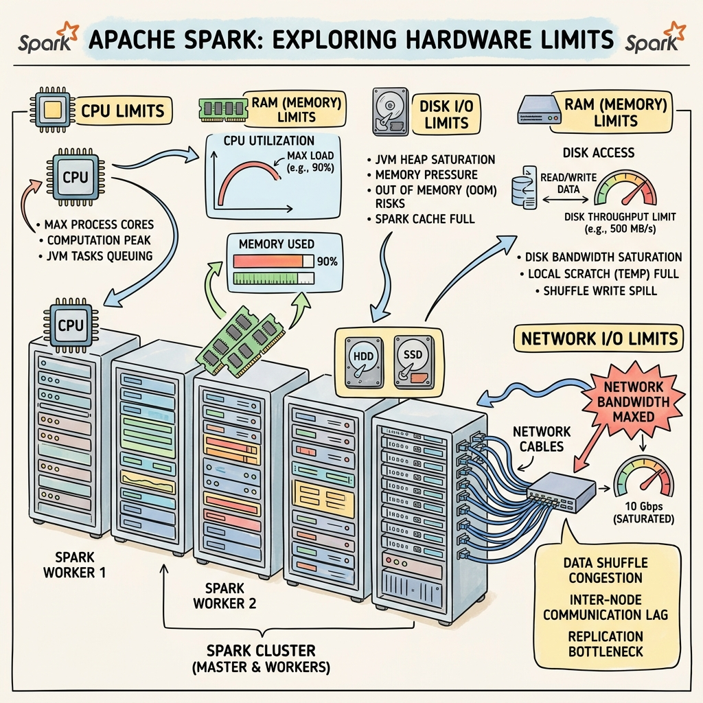
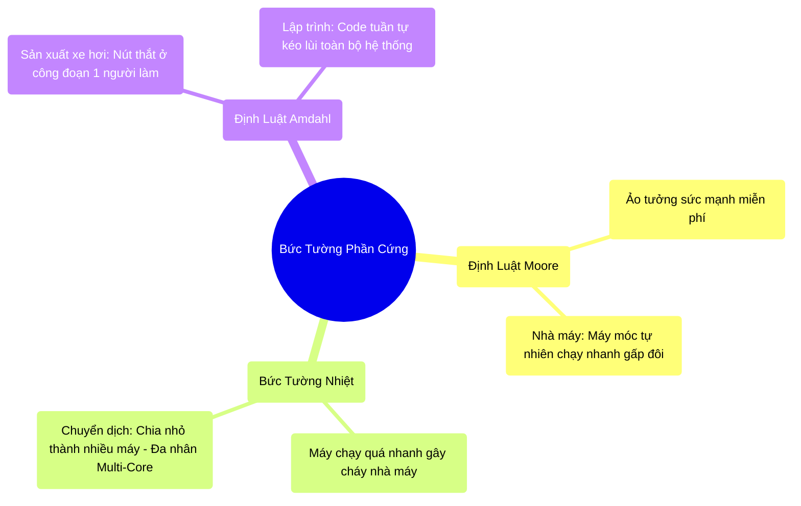

# 1.1 Bức Tường Phần Cứng: Định Luật Moore và Rào Cản Vật Lý




## 1. Objectives
- [ ] Phân tích sự suy giảm của Định luật Moore và giới hạn của bức tường nhiệt (Power Wall) thông qua **Phép ẩn dụ Nhà máy**.
- [ ] Giải phẫu định luật Amdahl qua **Bài toán Lắp ráp Ô tô** để chứng minh giới hạn toán học của xử lý song song (Parallel Computing).
- [ ] Phân tích từng dòng lệnh để nhận diện hệ quả của việc sử dụng các luồng xử lý tuần tự (Single-threaded Execution) trong môi trường hệ thống phân tán.

## 2. Mindmap


## 3. Content

### 3.1. Định Luật Moore và Ảo Tưởng Bữa Trưa Miễn Phí
**Định luật Moore (Moore's Law)**, do Gordon E. Moore phát biểu vào năm 1965, dự báo rằng số lượng bóng bán dẫn trên một vi mạch sẽ tăng gấp đôi sau mỗi 18 đến 24 tháng. Điều này mang lại sự gia tăng hàm mũ về năng lực tính toán. 

> **[Ví Dụ Trực Quan: Nhà Máy Sản Xuất]**
> Hãy tưởng tượng vi xử lý (CPU) của máy tính như một nhà máy sản xuất. Trong suốt nhiều thập kỷ, Định luật Moore giống như một phép màu: Cứ 2 năm một lần, nhà máy tự động được trang bị các cỗ máy chạy nhanh gấp đôi (tần số xung nhịp - clock speed tăng lên). Người quản đốc (Lập trình viên) không cần phải thay đổi cách quản lý hay tổ chức lại luồng công việc. Các phần mềm được viết theo kiểu tuần tự (chỉ có 1 luồng công việc chạy từ đầu đến cuối) tự nhiên chạy nhanh hơn gấp đôi mà không tốn công sức tối ưu.

Khái quát nguyên nhân cốt lõi dẫn đến sự ra đời của các hệ thống phân tán (Distributed Systems) không bắt nguồn từ lý thuyết phần mềm, mà từ việc định luật Moore đã va phải các giới hạn vật lý khắc nghiệt. 

### 3.2. Giới Hạn Vật Lý: Bức Tường Nhiệt (Power Wall)
Vào khoảng năm 2005, việc liên tục vặn núm tăng tốc cỗ máy đã gặp phải một rào cản mang tên **Bức Tường Nhiệt (Power Wall)**. Mối quan hệ giữa công suất tiêu thụ điện ($P$), điện áp hoạt động ($V$) và tần số xung nhịp ($f$) được biểu diễn bằng phương trình:
$$P = C \times V^2 \times f$$

> **[Tiếp Tục Ẩn Dụ Nhà Máy]**
> Khi bạn ép cỗ máy duy nhất trong nhà máy chạy với tốc độ cực cao (đạt ngưỡng 4.0 GHz), sự cọ xát và ma sát vật lý sinh ra lượng nhiệt khổng lồ. Nếu tiếp tục tăng tốc, nhiệt lượng tỏa ra (TDP) sẽ làm nung chảy toàn bộ nhà máy. Do đó, các kỹ sư phần cứng không thể tăng tốc cỗ máy đó thêm được nữa.
>
> **Giải pháp chuyển dịch (Multi-Core):** Thay vì dùng 1 cỗ máy khổng lồ nóng rực, họ quyết định nhét 4 cỗ máy nhỏ hơn, chạy chậm hơn và mát hơn vào nhà máy (Kiến trúc Đa nhân - Multi-Core). Tuy nhiên, lúc này phép màu chấm dứt! Người quản đốc (Lập trình viên) buộc phải học cách chia đều khối lượng công việc ra cho 4 cỗ máy này hoạt động cùng lúc (Tính toán song song - Parallel Computing). Nếu người quản đốc vẫn giữ thói quen cũ, dồn hết việc cho 1 cỗ máy và để 3 cỗ máy kia nằm chơi, nhà máy sẽ hoạt động cực kỳ chậm chạp.

### 3.3. Phân Tích Đánh Đổi (Trade-off): Định Luật Amdahl
Sự hiện diện của nhiều nhân xử lý (nhiều cỗ máy) không đồng nghĩa với hiệu năng tăng tỷ lệ thuận. **Định luật Amdahl** chứng minh toán học về giới hạn gia tốc biên (Speedup) của một chương trình khi được chạy song song:
$$S(n) = \frac{1}{(1 - p) + \frac{p}{n}}$$
- $p$: Tỷ lệ công việc có thể chia nhỏ để làm cùng lúc (Parallel).
- $(1 - p)$: Tỷ lệ công việc **bắt buộc phải làm tuần tự** (Sequential) - tức là chỉ 1 máy làm được.
- $n$: Số lượng cỗ máy tham gia làm việc.

> **[Ví Dụ Trực Quan: Lắp Ráp Ô Tô]**
> Quá trình sản xuất một chiếc ô tô mất 100 giờ. 
> - **Giai đoạn 1 (Lắp ráp linh kiện - chiếm 95 giờ):** Công việc này có thể chia cho 100 công nhân làm cùng lúc (Lắp cửa, bánh xe, ghế ngồi). Đoạn này $p = 0.95$.
> - **Giai đoạn 2 (Lái xe ra khỏi xưởng - chiếm 5 giờ):** Công việc này **bắt buộc** chỉ 1 người lái xe thực hiện được, 99 người còn lại phải đứng nhìn chờ đợi. Đoạn này $(1 - p) = 0.05$.
> 
> **Hệ quả:** Cho dù bạn có thuê 1 tỷ công nhân ($n \to \infty$), thời gian sản xuất chiếc xe đó **không bao giờ** nhanh hơn 5 giờ. Thời gian 5 giờ chờ người lái xe chính là **Nút thắt cổ chai (Bottleneck)** kìm hãm toàn bộ hệ thống.

Trong lập trình phân tán (Big Data), mọi hành động ép dữ liệu dồn về một điểm (Collect, Reduce to Single Node) chính là 5 giờ lái xe đó. Nó sẽ vô hiệu hóa mọi nỗ lực gia tăng sức mạnh phần cứng của bạn.

### 3.4. Mô Hình Thực Tiễn: Khắc Phục Bottleneck Bằng Mã Code
Trong môi trường Big Data, việc áp dụng các thư viện xử lý dữ liệu máy đơn (như Pandas) vào luồng dữ liệu khổng lồ là một vi phạm nghiêm trọng về mặt kiến trúc phân tán. Hãy xem xét đoạn code sau:

```python
import pandas as pd
from pyspark.sql import SparkSession

# =========================================================================
# [ANTI-PATTERN] NÚT THẮT CỔ CHAI TUẦN TỰ (Vi phạm Định luật Amdahl)
# =========================================================================

# BƯỚC 1: Gọi hàm toPandas()
# 100 Server (Workers) đang xử lý dữ liệu độc lập. Khi gặp hàm toPandas(), 
# chúng nhận lệnh: "Dừng lại, hãy gửi toàn bộ dữ liệu của bạn về máy chủ quản lý (Driver)!"
pdf = df.toPandas() 

# HẬU QUẢ VẬT LÝ:
# - Điểm (1 - p) quá lớn: 100 Server đứng chơi, trong khi 1 máy chủ Driver 
#   phải gồng gánh gom hàng Terabyte dữ liệu.
# - Nút thắt mạng (Network): 100 luồng dữ liệu ồ ạt đổ về 1 điểm gây nghẽn mạng cục bộ.
# - Tràn bộ nhớ (OOM): Máy chủ Driver không đủ RAM chứa toàn bộ dữ liệu, hệ thống sập (Crash).

# BƯỚC 2: Xử lý lọc trên máy đơn
# Lệnh này chỉ chạy bằng 1 nhân (1 Core) trên máy Driver. Cực kỳ chậm.
pdf_filtered = pdf[pdf['age'] > 30] 

# =========================================================================
# [BEST-PRACTICE] TỐI ƯU HÓA TÍNH TOÁN SONG SONG (Parallel Execution)
# =========================================================================

# BƯỚC 1: Khai báo lệnh lọc trên PySpark
# Máy chủ quản lý (Driver) chỉ đóng vai trò phân phát bản vẽ thiết kế. 
# Nó gửi câu lệnh "Lọc tuổi > 30" tới cả 100 Server (Workers).
df_filtered = df.filter(df.age > 30)

# BƯỚC 2: Lưu trữ song song (Parallel Write)
# 100 Server đồng loạt tự thực hiện việc lọc trên phần dữ liệu mà chúng đang giữ.
# Sau khi lọc xong, chúng tự lưu thẳng kết quả xuống ổ cứng (S3, HDFS).
# KHÔNG CÓ BẤT KỲ DỮ LIỆU NÀO bị chuyển về máy chủ quản lý. 
# Hệ số song song (p = 1), hệ thống đạt sức mạnh tối đa.
df_filtered.write.parquet("s3://bucket/output/")
```

## 4. Key takeaways
- **Giới hạn vật lý định hình phần mềm:** Bức tường Nhiệt (Power Wall) chấm dứt kỷ nguyên tăng tốc CPU, ép phần mềm phải chuyển sang kiến trúc tính toán song song và đa nhân.
- **Hệ quả Amdahl (Tác động của kẻ đi bộ):** Trong một đoàn tàu, tốc độ của toàn đoàn bằng tốc độ của toa chậm nhất. Lập trình Big Data đòi hỏi phải loại bỏ mọi điểm nghẽn tuần tự. Nếu hệ thống có đoạn code ép dữ liệu hội tụ về 1 máy, toàn bộ tài nguyên cụm (Cluster) phân bổ thêm sẽ trở nên lãng phí.
- **Tư duy thiết kế phân tán:** Giữ cho dữ liệu hoạt động độc lập trên từng Server càng lâu càng tốt (ví dụ: dùng `df.filter` thay vì `toPandas()`), loại bỏ hoàn toàn ý định kéo dữ liệu khổng lồ về một máy chủ trung tâm.
