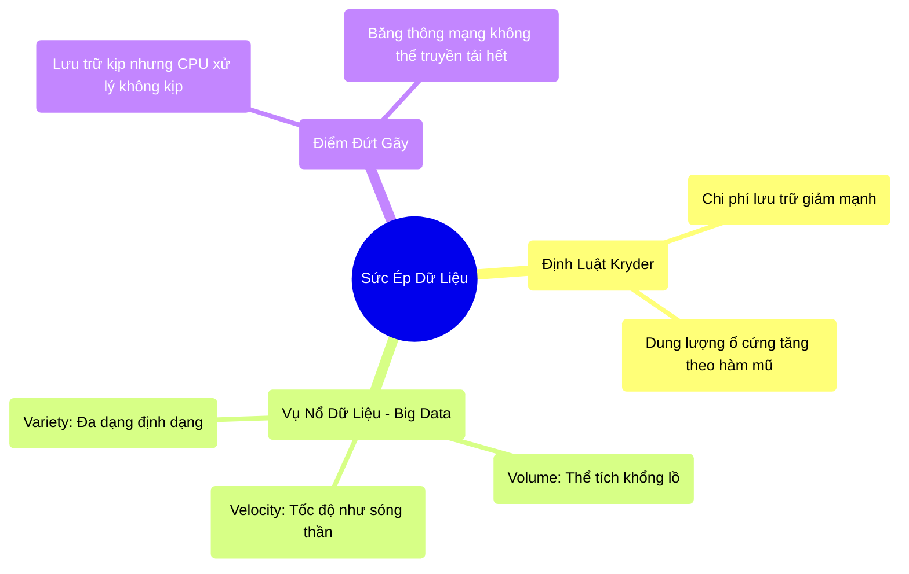

# 1.2 Vụ Nổ Dữ Liệu & Định Luật Kryder

## 1. Objectives
- [ ] Giải thích Định luật Kryder và giới hạn của lưu trữ thông qua **Phép ẩn dụ Kho Hàng**.
- [ ] Phân tích đặc trưng của Big Data (The V's) và lý do các hệ thống truyền thống sụp đổ.
- [ ] Giải thích từng bước (step-by-step) sự cố tràn bộ nhớ khi lưu trữ không theo kịp xử lý.

## 2. Mindmap


## 3. Content

### 3.1. Định Luật Kryder: Kỳ Tích Của Lưu Trữ
Bên cạnh Định luật Moore chi phối năng lực xử lý (CPU), ngành máy tính còn được dẫn dắt bởi **Định luật Kryder (Kryder's Law)**. Mark Kryder vào năm 2005 đã chỉ ra rằng: Mật độ lưu trữ của ổ đĩa từ tính (Hard Disk Drive) tăng gấp đôi sau mỗi 13-18 tháng, nhanh hơn cả định luật Moore.

> **[Ví Dụ Trực Quan: Xây Dựng Kho Hàng]**
> Định luật Kryder giống như việc công nghệ xây dựng phát triển vượt bậc. Cứ mỗi năm, bạn lại có thể xây được một nhà kho rộng gấp đôi năm trước, nhưng chi phí xây dựng lại rẻ đi một nửa. Nhờ đó, các công ty có thể lưu trữ mọi thứ mà họ muốn mà không phải đắn đo về giá cả.

Nhờ định luật này, chi phí lưu trữ trên mỗi Gigabyte giảm theo chiều thẳng đứng. Các doanh nghiệp bắt đầu áp dụng triết lý Lưu trữ mọi thứ, phân tích sau (Store everything, analyze later). Đây chính là tiền đề khai sinh ra kỷ nguyên Big Data.

### 3.2. Vụ Nổ Dữ Liệu và Các Chữ V (The V's of Big Data)
Dù nhà kho (Ổ cứng) có lớn đến đâu, nó cũng không lường trước được một thảm họa mang tên Sóng thần dữ liệu (Data Tsunami). Dữ liệu không chỉ nhiều lên, mà đặc tính vật lý của nó cũng thay đổi.

> **[Ví Dụ Trực Quan: Sóng Thần Hàng Hóa]**
> Hãy tưởng tượng thay vì nhập kho bằng xe tải nhỏ, hàng hóa bây giờ đổ về nhà kho của bạn bằng hàng trăm chiếc tàu thủy khổng lồ mỗi giây (**Velocity - Tốc độ**). 
> Tệ hơn, hàng hóa không chỉ là các thùng carton quy chuẩn, mà là đủ mọi hình dạng: từ chất lỏng, khí gas, đến các cỗ máy khổng lồ chưa được phân loại (**Variety - Đa dạng**). 
> Cuối cùng, tổng lượng hàng hóa lên tới hàng tỷ tấn (**Volume - Khối lượng**).

Trong kỹ thuật phần mềm, 3 chữ V này đại diện cho:
- **Volume:** Dữ liệu vượt quá dung lượng của một máy chủ (Terabytes đến Petabytes).
- **Velocity:** Dữ liệu Streaming liên tục (Sensors, Clickstreams) yêu cầu xử lý thời gian thực.
- **Variety:** Dữ liệu phi cấu trúc (Unstructured data như Video, Text, Logs) thay vì chỉ có bảng tính (Relational Database).

### 3.3. Điểm Đứt Gãy Của Hệ Thống Cũ (The Breaking Point)
Sự kết hợp giữa Bức Tường Nhiệt (CPU không thể nhanh hơn) và Vụ Nổ Dữ Liệu (Hàng hóa đổ về quá nhiều) đã làm sụp đổ các Cơ sở dữ liệu quan hệ truyền thống (RDBMS) như MySQL, Oracle.

**Tại sao MySQL lại thất bại trước Big Data?**
Các hệ thống cũ được thiết kế theo tư duy **Máy Đơn (Single-Node)**. Dù bạn có nâng cấp ổ cứng to đến đâu (nhờ Kryder's Law), thì CPU và Băng thông mạng (Network Bandwidth) của một chiếc máy tính vẫn có giới hạn vật lý. 

Hãy xem xét kịch bản code sau nếu cố gắng dùng Python thuần (Máy đơn) để đọc một file Log 1 Terabyte:

```python
# =========================================================================
# [ANTI-PATTERN] ĐỌC DỮ LIỆU TẬP TRUNG (Nguyên nhân gây tràn RAM)
# =========================================================================

# BƯỚC 1: Lệnh mở file
# Hệ thống cố gắng tải toàn bộ 1 Terabyte dữ liệu từ Ổ Cứng (Disk) vào Bộ Nhớ (RAM).
with open("massive_web_logs_1TB.txt", "r") as file:
    # BƯỚC 2: CPU máy đơn bắt đầu đọc
    # Một nhân CPU duy nhất phải đọc từng dòng một. Tốc độ đọc Disk I/O tối đa 
    # của ổ cứng SATA chỉ khoảng 150 MB/s. 
    # Tính toán vật lý: 1,000,000 MB / 150 MB/s = ~6666 giây (Gần 2 tiếng chỉ để ĐỌC).
    data = file.read() 

# HẬU QUẢ VẬT LÝ:
# Máy tính làm việc (RAM) thường chỉ có 16GB hoặc 64GB. Khi file 1TB tràn vào,
# hệ điều hành sẽ cảnh báo "Hết bộ nhớ" và tiêu diệt chương trình ngay lập tức (OOM Kill).
```

Để sống sót, các kỹ sư nhận ra: Không thể tiếp tục xây một cái kho to hơn, và dùng một người thủ kho nhanh hơn được nữa. Chúng ta phải thay đổi hoàn toàn kiến trúc.

## 4. Key takeaways
- **Lưu trữ dẫn dắt xử lý:** Định luật Kryder khiến lưu trữ trở nên rẻ mạt, tạo ra Vụ nổ dữ liệu (Volume, Velocity, Variety).
- **Sự kiệt quệ của Máy Đơn:** Một máy chủ duy nhất có thể có đủ Ổ Cứng để chứa dữ liệu, nhưng sẽ không bao giờ có đủ RAM và sức mạnh CPU để đọc và xử lý nó trong khoảng thời gian cho phép.
- **Tiền đề của hệ phân tán:** Buộc ngành khoa học máy tính phải phát minh ra cách kết nối hàng ngàn máy tính nhỏ lại với nhau, để mỗi máy chỉ phải đọc một phần nhỏ dữ liệu.
