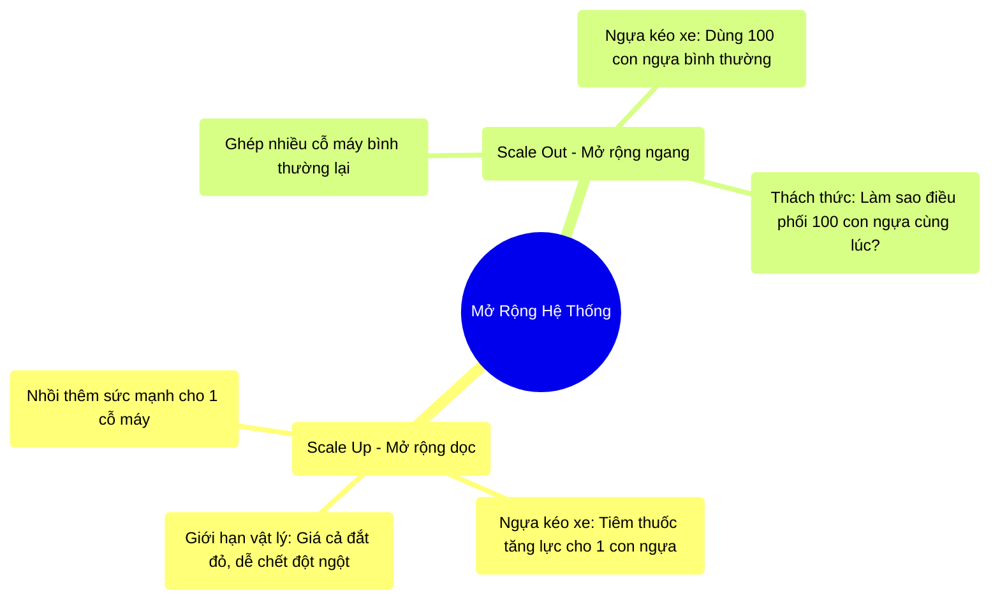

# 1.3 Chuyển Dịch Mô Hình: Scale Up vs Scale Out

## 1. Objectives
- [ ] So sánh hai tư duy mở rộng hệ thống (Scale Up và Scale Out) qua **Phép ẩn dụ Kéo Tàu Hỏa**.
- [ ] Phân tích rào cản vật lý và kinh tế khiến Scale Up rơi vào ngõ cụt.
- [ ] Hiểu được nguyên lý cơ bản của thiết kế Distributed System (Hệ thống phân tán).

## 2. Mindmap


## 3. Content

Để đối phó với Vụ nổ dữ liệu (Big Data) và Bức tường nhiệt (Power Wall), ngành khoa học máy tính đứng trước hai ngã rẽ kiến trúc: **Scale Up (Mở rộng dọc)** và **Scale Out (Mở rộng ngang)**. 

### 3.1. Scale Up (Mở rộng chiều dọc)
Scale Up là cách tiếp cận truyền thống: Mua một cỗ máy chủ (Server) to hơn, đắt tiền hơn, nhiều RAM và CPU hơn để thay thế cỗ máy cũ.

> **[Ví Dụ Trực Quan: Cỗ Xe Ngựa Khổng Lồ]**
> Hãy tưởng tượng bạn có một con ngựa kéo một cỗ xe chở 1 tấn hàng. Ngày hôm sau, lượng hàng tăng lên 10 tấn. Theo tư duy Scale Up, bạn cố gắng mua một con ngựa to hơn, tiêm thuốc tăng lực cho nó để nó mạnh gấp 10 lần. 
> - Ưu điểm: Bạn vẫn chỉ phải quản lý 1 con ngựa. Chả cần học kỹ năng điều khiển bầy ngựa. (Phần mềm không cần viết lại, cứ thế chạy).
> - Nhược điểm: Con ngựa đó có giá đắt gấp 100 lần con ngựa thường. Và đến một ngày, lượng hàng lên tới 1,000 tấn, không một con ngựa sinh học nào trên đời có thể kéo được (Giới hạn vật lý). Nếu con ngựa đó đột tử, toàn bộ hàng hóa đứng im (Single point of failure).

Trong thế giới thực, mua một máy chủ 1TB RAM có thể tốn vài chục ngàn đô la, nhưng mua máy chủ 10TB RAM có thể tiêu tốn hàng triệu đô la (chi phí tăng theo hàm mũ), và rào cản phần cứng sẽ không cho phép bạn có một cái máy tính vô hạn RAM.

### 3.2. Scale Out (Mở rộng chiều ngang)
Scale Out là triết lý kiến trúc cốt lõi của Big Data: Không mua cỗ máy xịn nhất, mà mua hàng ngàn cỗ máy bình dân rẻ tiền (Commodity Hardware) và ghép chúng lại với nhau qua mạng lưới (Network).

> **[Ví Dụ Trực Quan: Đội Quân Ngựa Kéo]**
> Thay vì cố tạo ra một siêu ngựa đột biến, bạn mua 100 con ngựa bình thường. Bạn buộc chúng lại với nhau để cùng kéo cỗ xe 1000 tấn.
> - Ưu điểm: Rẻ tiền, dễ mua. Nếu 1 con ngựa bị ốm rớt lại, 99 con còn lại vẫn tiếp tục kéo xe (Fault Tolerance - Khả năng chịu lỗi). Hàng tăng bao nhiêu, bạn mua thêm bấy nhiêu con ngựa.
> - Nhược điểm: **Bài toán điều phối**. Làm sao để 100 con ngựa chạy cùng một hướng? Nếu con chạy nhanh, con chạy chậm thì xe sẽ lật! 

Khi bạn sử dụng kiến trúc Scale Out, bạn chấp nhận đánh đổi: Tiết kiệm tiền mua phần cứng đắt đỏ, nhưng phải xây dựng một phần mềm quản lý cực kỳ phức tạp để điều phối bầy ngựa. Apache Spark chính là Người xà ích (Tài xế) vĩ đại nhất để điều khiển hàng ngàn cỗ máy tính này.

### 3.3. Giải Phẫu Code: Hệ Quả Của Scale Out
Khi bạn chuyển từ 1 máy (Pandas) sang 100 máy (Spark), cách code của bạn bắt buộc phải thay đổi để Người xà ích có thể chia việc.

```python
# =========================================================================
# TƯ DUY SCALE UP (Máy Đơn - Ví dụ Python thuần)
# =========================================================================

# BƯỚC 1: Xử lý tập trung
# Toàn bộ danh sách 1 triệu người dùng nằm gọn trong RAM của 1 máy tính.
# Vòng lặp `for` chạy lần lượt từ đầu đến cuối. 
# Giống như 1 người tự đếm 1 triệu phong bì. Rất dễ lập trình, nhưng rất lâu.
ages = [25, 30, 45, ...] # 1 triệu records
adults = []
for age in ages:
    if age > 18:
        adults.append(age)

# =========================================================================
# TƯ DUY SCALE OUT (Máy Phân Tán - Ví dụ Spark)
# =========================================================================

# BƯỚC 1: Spark chia nhỏ dữ liệu (Partitioning)
# Máy quản lý (Driver) chia 1 triệu records thành 100 gói nhỏ (Partitions).
# Mỗi gói được ném cho 1 con ngựa (Worker Node) giữ.
# Điều này có nghĩa: KHÔNG một máy nào nắm giữ toàn bộ dữ liệu.

# BƯỚC 2: Người xà ích hô khẩu lệnh
# Lập trình viên KHÔNG VIẾT VÒNG LẶP FOR NỮA. 
# Bạn chỉ khai báo (Declarative): "Tôi cần những người trên 18 tuổi".
df_adults = spark_df.filter(spark_df.age > 18)

# BƯỚC 3: Đồng loạt thực thi
# 100 con ngựa đồng loạt chạy hàm kiểm tra trên gói dữ liệu của riêng nó.
# Tốc độ nhanh gấp 100 lần. Nếu 1 máy tính bị cháy ổ cứng giữa chừng, 
# Spark tự động ném gói dữ liệu đó cho máy khác làm bù.
```

## 4. Key takeaways
- **Scale Up là ngõ cụt:** Mở rộng chiều dọc đụng phải giới hạn của Bức Tường Nhiệt, quá đắt đỏ và tiềm ẩn rủi ro chết hệ thống toàn diện.
- **Scale Out là chân lý Big Data:** Sử dụng sức mạnh số đông của máy tính giá rẻ. Tuy nhiên, nó đòi hỏi một phần mềm quản trị hệ thống phân tán vô cùng phức tạp (như Hadoop, Spark).
- **Tư duy Lập Trình Thay Đổi:** Bạn không thể dùng vòng lặp `for` hay các thư viện viết cho một máy (Pandas) để xử lý trên kiến trúc phân tán. Bạn phải chuyển sang tư duy Khai báo (Declarative) để Spark tự do phân phát công việc.
