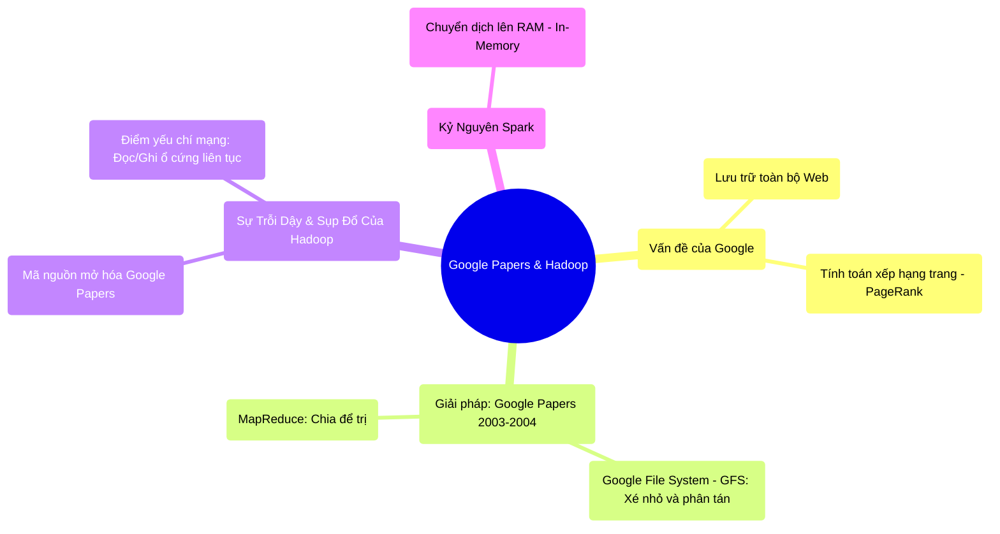

# 1.4 Khởi Nguyên Big Data: Google Papers và Sự Cáo Chung Của Hadoop

## 1. Objectives
- [ ] Tìm hiểu cách Google giải quyết bài toán Big Data qua **Phép ẩn dụ Thư Viện Khổng Lồ** (GFS & MapReduce).
- [ ] Phân tích điểm nghẽn của Hadoop (Disk I/O) và lý do Apache Spark ra đời để thay thế nó.
- [ ] Giải phẫu cơ chế vật lý của MapReduce thông qua Code.

## 2. Mindmap


## 3. Content

### 3.1. Bài Toán Của Google & Cứu Cánh GFS
Vào đầu những năm 2000, Google đứng trước một thách thức chưa từng có trong lịch sử nhân loại: Họ muốn tải về, lưu trữ và tìm kiếm **toàn bộ các trang web trên Internet**. 
Không một siêu máy tính nào trên thế giới lúc bấy giờ (Scale Up) có đủ dung lượng ổ cứng để chứa toàn bộ Internet. 

> **[Ví Dụ Trực Quan: Thư Viện Khổng Lồ GFS]**
> Google quyết định tạo ra GFS (Google File System). 
> Hãy tưởng tượng Internet là một cuốn bách khoa toàn thư khổng lồ nặng 10.000 tấn, không một cái kệ sách (Máy chủ) nào đỡ nổi. 
> Giải pháp GFS: Google xé cuốn bách khoa toàn thư đó ra thành hàng triệu trang giấy (gọi là các Block, mỗi block nặng 64MB). Sau đó, họ vứt các trang giấy này rải rác vào 10,000 cái kệ sách bằng gỗ rẻ tiền (Commodity Hardware). Để đề phòng kệ gỗ bị gãy mọt (Server chết), mỗi trang giấy được copy làm 3 bản (Replication) nhét vào 3 kệ khác nhau. 
> Vậy là Google giải quyết xong bài toán Lưu Trữ!

### 3.2. Chuyển Động Xử Lý: MapReduce (Chia Để Trị)
Lưu trữ xong, nhưng làm sao để đếm xem từ Apple xuất hiện bao nhiêu lần trên toàn bộ Internet? Nếu bắt 1 người đi qua 10,000 cái kệ sách để đọc từng trang một, có lẽ mất 100 năm.

> **[Ví Dụ Trực Quan: Đội Quân Đọc Sách MapReduce]**
> Google phát minh ra thuật toán MapReduce.
> - **Giai đoạn MAP (Phân phối):** Quản lý thuê 10,000 học sinh, bắt mỗi em đứng cạnh một kệ sách. Ai ở kệ nào thì cầm trang giấy ở kệ đó lên đếm từ Apple. Mọi người đếm cùng 1 lúc (Parallel). Đếm xong, mỗi em ghi số lượng ra một tờ giấy nhớ (Lưu nháp xuống ổ cứng).
> - **Giai đoạn REDUCE (Thu thập):** Quản lý cử 1 em tổ trưởng đi thu thập tất cả các tờ giấy nhớ của 10,000 em kia lại, cộng dồn tổng số (Ví dụ: 15 + 20 + 0 + ... = 100,000 từ Apple).
>
> **Đột phá:** Thay vì mang 10.000 tấn sách (Dữ liệu) về cho 1 ông giáo sư (CPU) đọc, Google đã mang phép toán (Đoạn code đếm chữ) gửi tới chỗ cất sách. **Di chuyển Code luôn luôn rẻ hơn Di chuyển Dữ liệu!**

Năm 2006, Doug Cutting dựa trên luận văn của Google đã tạo ra **Hadoop**. GFS biến thành HDFS (Hadoop Distributed File System). MapReduce vẫn là MapReduce. Hadoop giúp mọi công ty trên thế giới đều có thể xử lý Big Data như Google.

### 3.3. Cái Chết Của Hadoop MapReduce: Nút Thắt Ổ Cứng
Hadoop thống trị thế giới, nhưng nó có một nhược điểm vật lý chết người.

Hadoop cực kỳ ám ảnh với việc mất dữ liệu (vì chạy trên máy tính rẻ tiền hay bị hỏng). Do đó, sau mỗi một bước MAP hoặc REDUCE, Hadoop **bắt buộc phải ghi kết quả trung gian xuống ổ cứng (Disk)** để lỡ máy có sập thì bật lại vẫn còn dữ liệu chạy tiếp.

```python
# =========================================================================
# LUỒNG VẬT LÝ CỦA HADOOP MAPREDUCE (Chậm do Ổ cứng)
# =========================================================================

# BƯỚC 1: Đọc dữ liệu từ ổ cứng (Tốn 10 giây)
# Máy chủ quét qua HDFS để lấy dữ liệu.
data = read_from_disk()

# BƯỚC 2: MAP (Tốn 1 giây)
# CPU tính toán cực nhanh.
mapped_data = do_map_logic(data)

# BƯỚC 3: Lưu nháp xuống Ổ cứng (Tốn 10 giây) -> ĐÂY LÀ ĐIỂM NGHẼN
# Hadoop KHÔNG CHO PHÉP đẩy thẳng dữ liệu từ MAP sang REDUCE qua RAM.
# Nó bắt phải ghi xuống đĩa cứng để lưu trữ an toàn. Tốc độ Ghi đĩa cực kỳ chậm!
write_to_local_disk(mapped_data) 

# BƯỚC 4: REDUCE lại đọc từ Ổ cứng (Tốn 10 giây)
reduce_input = read_from_local_disk()
result = do_reduce_logic(reduce_input)

# BƯỚC 5: Ghi kết quả cuối cùng ra Ổ cứng (Tốn 10 giây)
write_to_hdfs(result)

# => TỔNG THỜI GIAN: 41 giây (Nhưng CPU tính toán chỉ tốn đúng 2 giây, 39 giây còn lại là chờ Ổ Cứng I/O).
```

### 3.4. Spark Xuất Hiện: Đưa Mọi Thứ Lên Bộ Nhớ (In-Memory)
Năm 2009, Matei Zaharia nhận ra sự thiếu tối ưu của việc ghi nháp ra đĩa liên tục. 
RAM (Bộ nhớ trong) có tốc độ đọc/ghi nhanh gấp hàng ngàn lần Ổ cứng (Disk). Cùng lúc đó, giá RAM trên thị trường giảm mạnh (Kryder's Law).

Matei tạo ra **Apache Spark** với triết lý: 
> **Hãy giữ mọi dữ liệu tính toán trung gian trên RAM. Chỉ ghi xuống đĩa khi nào công việc đã hoàn thành hoặc RAM đã đầy!**

Nhờ việc truyền tay dữ liệu trực tiếp qua RAM giữa các bước MAP và REDUCE, Spark có tốc độ chạy nhanh gấp 10 đến 100 lần so với Hadoop MapReduce, chính thức tiễn Hadoop MapReduce vào dĩ vãng và trở thành Tiêu chuẩn công nghiệp (Industry Standard) mới cho Big Data.

## 4. Key takeaways
- **Nguyên lý Google (Data Locality):** Mang đoạn Code đến nơi chứa Dữ liệu, tuyệt đối không mang Dữ liệu khổng lồ qua mạng về nơi chứa Code.
- **Điểm nghẽn I/O Ổ cứng:** Hadoop MapReduce thất bại vì tư duy phòng thủ quá mức: Ghi mọi thứ xuống ổ cứng sau mỗi bước tính toán, khiến CPU luôn trong trạng thái đói dữ liệu (chờ ổ cứng quay).
- **Cách mạng In-Memory:** Spark chiến thắng nhờ việc xâu chuỗi các tác vụ (Pipeline) và truyền dữ liệu trung gian qua bộ nhớ tốc độ siêu cao (RAM), giảm thiểu tối đa sự can thiệp của ổ cứng vật lý.
