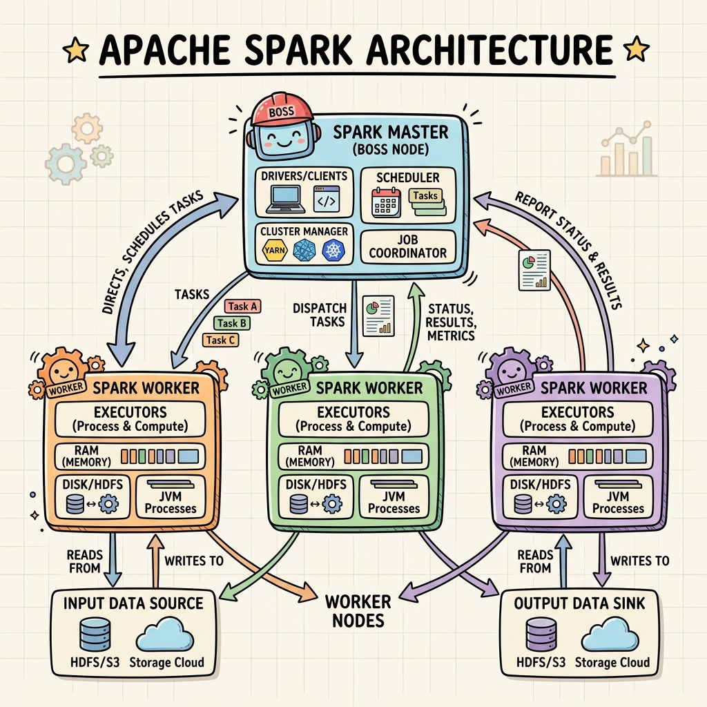
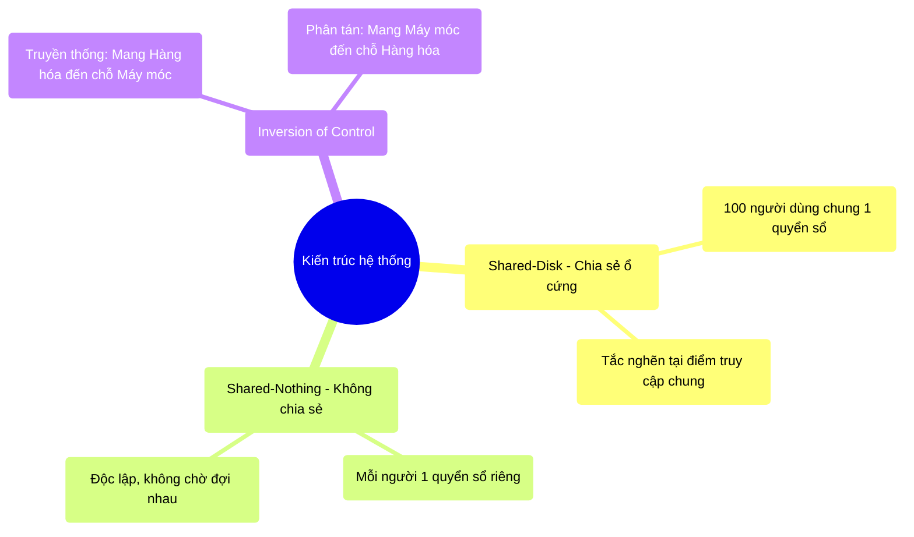

# 2.1 Kiến trúc Shared-Nothing & Sự Đảo Ngược Quyền Kiểm Soát




## 1. Objectives
- [ ] Phân tích sự khác biệt giữa Shared-Disk và Shared-Nothing thông qua **Phép ẩn dụ Phòng Kế Toán**.
- [ ] Giải thích nguyên lý Inversion of Control (Đảo ngược quyền kiểm soát) trong tính toán phân tán.
- [ ] Xem xét ảnh hưởng vật lý khi mang dữ liệu tới nơi chứa mã nguồn (Code) so với mang mã nguồn tới nơi chứa dữ liệu.

## 2. Mindmap


## 3. Content

### 3.1. Sự Sụp Đổ Của Shared-Disk (Chia Sẻ Ổ Cứng)
Trước kỷ nguyên Big Data, các hệ thống cơ sở dữ liệu (như Oracle RAC) sử dụng kiến trúc **Shared-Disk**. Trong mô hình này, nhiều máy tính xử lý (CPU) cùng kết nối chung vào một thiết bị lưu trữ khổng lồ (SAN/NAS).

> **[Ví Dụ Trực Quan: Phòng Kế Toán Dùng Chung Sổ]**
> Kiến trúc Shared-Disk giống như việc bạn thuê 100 nhân viên kế toán (100 CPUs) vào làm việc, nhưng chỉ phát cho họ đúng **MỘT quyển sổ cái duy nhất** (Shared-Disk) đặt giữa phòng.
> Bất cứ khi nào một kế toán muốn ghi chép, họ phải xếp hàng chờ người kia viết xong. 
> Dù bạn có thuê thêm 1.000 kế toán, công việc cũng không thể nhanh hơn, vì điểm nghẽn vật lý nằm ở Cuốn sổ (Ổ cứng). 

### 3.2. Giải Pháp Shared-Nothing (Không Chia Sẻ)
Để phá vỡ điểm nghẽn này, ngành khoa học máy tính chuyển sang kiến trúc **Shared-Nothing (Không chia sẻ gì cả)** - tiêu chuẩn của Hadoop và Apache Spark.

> **[Ví Dụ Trực Quan: Mỗi Người Một Sổ Riêng]**
> Lần này, bạn phát cho 100 nhân viên kế toán, mỗi người **MỘT quyển sổ nhỏ riêng biệt** (Local Disk/RAM) và một chồng hóa đơn riêng để xử lý. 
> Họ làm việc hoàn toàn độc lập, không ai phải chờ ai (Parallel Execution). Cuối ngày, họ chỉ nộp lại con số tổng kết (ví dụ: Doanh thu của chồng hóa đơn đó) cho người Quản lý. 

Trong kiến trúc Shared-Nothing, mỗi máy tính (Node) trong cụm (Cluster) tự sở hữu CPU, RAM và Ổ cứng riêng biệt. Chúng không hề tranh giành tài nguyên vật lý của nhau. Sự giới hạn duy nhất lúc này chỉ là mạng lưới kết nối (Network) để truyền kết quả về máy chủ trung tâm.

### 3.3. Sự Đảo Ngược Quyền Kiểm Soát (Inversion of Control)
Hệ quả lớn nhất của Shared-Nothing là sự thay đổi hoàn toàn về tư duy lập trình: **Inversion of Control (Đảo ngược kiểm soát)**.

- **Tư duy truyền thống:** Máy chủ trung tâm yêu cầu các ổ cứng gửi toàn bộ dữ liệu (Terabytes) qua mạng internet về máy chủ để nó tự tính toán. Nghĩa là: **Mang Dữ liệu đến chỗ chứa Mã Code**.
- **Tư duy phân tán (Big Data):** Truyền tải Terabytes dữ liệu qua dây cáp mạng là thảm họa vật lý (rất chậm và nghẽn mạng). Thay vào đó, máy chủ trung tâm gửi đoạn mã lệnh (vài Kilobytes) tới 100 máy tính đang chứa dữ liệu. Nghĩa là: **Mang Mã Code đến chỗ chứa Dữ liệu (Data Locality)**.

```python
# =========================================================================
# SỰ ĐẢO NGƯỢC KIỂM SOÁT BẰNG CODE (Tư duy Mang Code đi tìm Dữ Liệu)
# =========================================================================

# BƯỚC 1: Lập trình viên định nghĩa một hàm logic (Mã Code nhỏ bé)
# Hàm này cực nhẹ, chỉ chiếm vài Kilobytes trong bộ nhớ.
def process_data(row):
    return row.value * 2

# BƯỚC 2: RDD Map (Kích hoạt Data Locality)
# Lệnh rdd.map() KHÔNG HỀ kéo hàng tỷ dòng (row) về máy tính của bạn.
# Ngược lại, hệ thống Spark đóng gói hàm process_data() lại, 
# sau đó gửi hàm này (qua dây mạng) tới 100 máy tính (Workers) đang chứa dữ liệu.
mapped_rdd = rdd.map(process_data)

# BƯỚC 3: Thực thi tại chỗ (Local Execution)
# 100 máy tính (Workers) nhận được hàm. Chúng tự áp dụng hàm đó lên
# Dữ liệu đang nằm sẵn trong ổ cứng của chính chúng (Shared-Nothing).
# Nhờ vậy, hàng Terabytes dữ liệu đứng im, không làm nghẽn mạng!
```

## 4. Key takeaways
- **Shared-Nothing:** Là kiến trúc bắt buộc của Big Data. Mỗi máy tự lo tài nguyên của mình, triệt tiêu sự tranh chấp tài nguyên (Contention) ở cấp độ phần cứng.
- **Data Locality (Mang code đi tìm dữ liệu):** Nguyên lý cốt lõi của tính toán phân tán. Đoạn code (nhẹ) luôn phải được di chuyển qua mạng tới nơi Dữ liệu (nặng) đang nằm để tiết kiệm băng thông.
- **Tư duy lập trình:** Không được phép tư duy theo kiểu Hút dữ liệu về rồi xử lý, mà phải tư duy Phát tán chỉ thị ra cho các máy tự làm.
