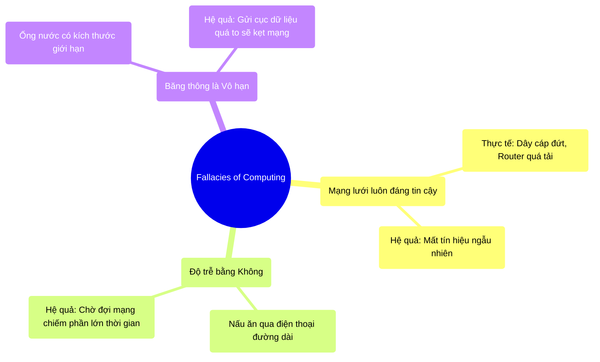

# 2.2 Sự Phản Ánh Sai Lệch Của Mạng Lưới (Fallacies of Distributed Computing)

## 1. Objectives
- [ ] Nhận diện 8 ảo tưởng kinh điển của lập trình viên khi làm việc với hệ thống phân tán.
- [ ] Giải thích nguyên lý Mạng lưới luôn nói dối thông qua **Phép ẩn dụ Nấu ăn qua điện thoại**.
- [ ] Chứng minh cách Spark và hệ thống phân tán phòng thủ trước mạng lưới.

## 2. Mindmap


## 3. Content

### 3.1. 8 Ảo Tưởng Của Lập Trình Viên (The 8 Fallacies)
Vào năm 1994, Peter Deutsch (Kỹ sư của Sun Microsystems) đã đúc kết 8 sai lầm kinh điển mà mọi lập trình viên đều mắc phải khi lần đầu chuyển từ việc viết code trên 1 máy (Single-node) sang hệ thống nhiều máy (Distributed Systems). Đó là những ảo tưởng (Fallacies) sau:
1. Mạng lưới luôn đáng tin cậy (The network is reliable).
2. Độ trễ của mạng bằng không (Latency is zero).
3. Băng thông mạng là vô hạn (Bandwidth is infinite).
4. Mạng lưới luôn an toàn (The network is secure).
5. Kiến trúc mạng không bao giờ thay đổi (Topology doesn't change).
6. Chỉ có duy nhất một người quản trị mạng (There is one administrator).
7. Chi phí vận chuyển qua mạng bằng không (Transport cost is zero).
8. Mạng lưới hoàn toàn đồng nhất (The network is homogeneous).

Trong Big Data, 3 ảo tưởng đầu tiên là những Tác nhân gây lỗi thầm lặng thường gặp nhất.

### 3.2. Mạng Lưới Luôn Nói Dối (The Network Lies)

> **[Ví Dụ Trực Quan: Nấu Ăn Qua Điện Thoại]**
> Hãy tưởng tượng bạn đang ở Việt Nam, và bạn phải hướng dẫn một người bạn ở Mỹ nấu món phở bằng cách gọi điện thoại di động cho nhau.
> 
> **Ảo tưởng 1: Mạng luôn đáng tin cậy (The network is reliable)**
> Bạn nghĩ rằng cứ gọi là bạn kia sẽ nghe máy 100%. Thực tế: Đang gọi thì mất sóng (Rớt mạng), hoặc máy chủ bị tắt ngang. Bạn nói Bỏ muối vào nhé nhưng đầu dây bên kia không nhận được.
> 
> **Ảo tưởng 2: Độ trễ bằng không (Latency is zero)**
> Bạn nghĩ bạn vừa nói Tắt bếp ngay! thì bạn kia nghe thấy liền. Thực tế: Sóng điện thoại truyền qua đại dương mất 1 giây. Trong 1 giây đó, nồi nước dùng đã bị trào ra ngoài (Độ trễ mạng - Network Latency).
> 
> **Ảo tưởng 3: Băng thông vô hạn (Bandwidth is infinite)**
> Bạn muốn gửi cho bạn kia cuốn sách dạy nấu ăn dày 1000 trang qua đường bưu điện (Gửi dữ liệu lớn). Bạn nghĩ ống bưu điện to vô tận. Thực tế: Thùng hàng quá to bị bưu điện kẹt lại, bạn phải xé cuốn sách ra thành ngàn phong thư nhỏ gửi đi (Tắc nghẽn băng thông - Network Bottleneck).

### 3.3. Hậu Quả Trong Code Lập Trình
Nếu bạn viết code cho hệ thống phân tán mà tin rằng Mạng lưới hoàn hảo, hệ thống của bạn sẽ sụp đổ.

```python
# =========================================================================
# [ANTI-PATTERN] TIN TƯỞNG MẠNG LƯỚI (Viết code như máy đơn)
# =========================================================================

# BƯỚC 1: Lấy dữ liệu từ máy chủ API
# Developer cho rằng hàm này sẽ CHẮC CHẮN trả về dữ liệu ngay lập tức.
data = fetch_data_from_worker_node("192.168.1.5")

# HẬU QUẢ VẬT LÝ:
# Nếu dây cáp mạng nối tới máy 192.168.1.5 bị chuột cắn, hoặc Router bị treo:
# Lệnh fetch_data_from_worker_node() sẽ đứng "treo" vĩnh viễn (Infinite Hang),
# hoặc ném ra lỗi làm sập toàn bộ hệ thống ngay lập tức vì không có cơ chế bắt lỗi.

# =========================================================================
# [BEST-PRACTICE] PHÒNG THỦ TRƯỚC MẠNG LƯỚI (Tư duy Phân tán)
# =========================================================================

# Spark và các Kỹ sư Big Data luôn giả định "Mạng sẽ đứt", "Mạng sẽ chậm".
# Mọi kết nối mạng luôn đi kèm thời gian chờ (Timeout) và thử lại (Retry).

max_retries = 3
for attempt in range(max_retries):
    try:
        # Quy tắc: Luôn ép thời gian chờ (Timeout = 5 giây)
        data = fetch_data_from_worker_node("192.168.1.5", timeout=5)
        break # Thành công thì thoát vòng lặp
    except NetworkTimeoutException:
        print(f"Mạng bị đứt ở lần thử {attempt}. Đang gọi lại...")
        if attempt == max_retries - 1:
            raise "Máy Worker này đã chết hẳn, báo cáo Driver phân công máy khác!"
```

Tuy nhiên, với Apache Spark, bạn may mắn không phải tự viết các đoạn code `try...catch` dài dòng để kiểm tra đứt mạng. Động cơ cốt lõi của Spark đã được lập trình sẵn để **Phòng thủ Mạng Lưới**. Khi Spark thấy một máy tính gửi dữ liệu quá lâu (Đứt mạng), nó tự động hiểu rằng máy đó đã chết và báo cáo phân công công việc cho máy khác.

## 4. Key takeaways
- **Từ bỏ ảo tưởng Máy đơn:** Khi viết phần mềm chạy trên nhiều máy, đừng bao giờ nghĩ rằng máy A gửi cho máy B thì 100% dữ liệu sẽ tới nơi lập tức.
- **Mạng lưới là Điểm nghẽn vật lý:** Gửi dữ liệu qua mạng LAN/WAN chậm hơn hàng ngàn lần so với việc đọc dữ liệu từ RAM. Do đó, phải tránh tối đa việc xáo trộn dữ liệu (Shuffle) chéo qua mạng lưới (Xem thêm ở Chương 6).
- **Thiết kế phòng thủ (Defensive Design):** Code trong hệ thống phân tán phải luôn bao gồm cơ chế Retry, Timeout, và dự phòng (Fallback) khi việc giao tiếp mạng thất bại.
