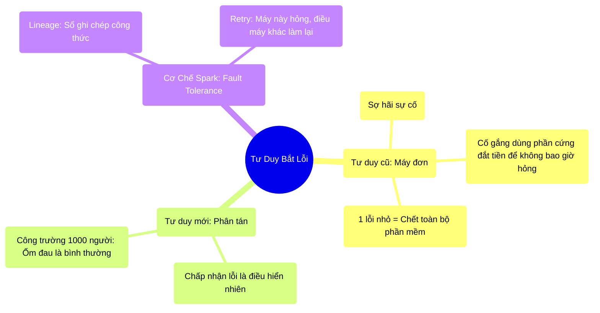

# 2.3 Sự Cố Là Yếu Tố Hiển Nhiên (Failure as a First-Class Citizen)

## 1. Objectives
- [ ] Thay đổi tư duy từ Tránh né lỗi sang Chấp nhận lỗi trong hệ thống phân tán qua **Phép ẩn dụ Công trường xây dựng**.
- [ ] Giải thích cơ chế dung lỗi (Fault Tolerance) của Apache Spark.
- [ ] Cụ thể hóa bằng mã nguồn cơ chế Retries (Thử lại) và Phân công lại công việc (Task Recomputation).

## 2. Mindmap


## 3. Content

### 3.1. Sự Trưởng Thành Trong Tư Duy: Sống Chung Với Sự Cố
Trong kiến trúc máy đơn (Single-Node) hoặc Scale Up, lập trình viên thường có một tư duy rất hoàn hảo: Cố gắng viết code không có lỗi, cầu nguyện cho điện không bị cúp, và tin rằng máy chủ tiền tỷ sẽ không bao giờ cháy ổ cứng. Nếu máy chủ chết, đó là ngày tận thế.

Nhưng trong Big Data (Scale Out), khi bạn kết nối 1.000 chiếc máy tính rẻ tiền với nhau, xác suất để 1 máy tính hỏng mỗi ngày không còn là 0.001% nữa, mà nó tiệm cận mức **100%**. 

> **[Ví Dụ Trực Quan: Quản Lý Công Trường 1.000 Công Nhân]**
> - **Mô hình cũ (Máy đơn):** Bạn có 1 anh thợ xây siêu nhân (Super Server). Nếu anh ta hắt hơi sổ mũi nghỉ làm 1 ngày, toàn bộ công trình đứng im.
> - **Mô hình phân tán (Big Data):** Bạn quản lý 1.000 công nhân bình thường. Theo xác suất thống kê sinh học, chắc chắn ngày nào cũng có ít nhất 10 người bị ốm đau, đi làm trễ, hoặc cãi nhau với vợ nên làm việc thiếu tập trung.
> 
> Là Quản lý (Spark Driver), bạn không thể gào thét khóc lóc mỗi khi có 1 người ốm. Bạn phải xây dựng một **Quy trình hoạt động chấp nhận sự cố (Failure as a First-Class Citizen)**: Người này ốm, lập tức điều người khác đứng vào thế chỗ.

Sự cố (Lỗi ổ cứng, nghẽn mạng, cháy RAM) không còn là một tai nạn, mà nó là một **thuộc tính vật lý hiển nhiên** của hệ thống phân tán. Hệ thống của bạn phải được thiết kế để liên tục tự chữa lành mà không cần con người can thiệp. 

### 3.2. Chữa Lành Bằng Lineage (Sổ Ghi Chép Lịch Sử)
Để người khác có thể làm thay công việc của người bị ốm, người Quản lý phải biết được người bị ốm đó *đang làm dở công đoạn nào*.
Apache Spark sở hữu một cơ chế gọi là **Lineage Graph (Biểu đồ gia phả / Dấu vết lịch sử)**.

> **[Tiếp Tục Ẩn Dụ Công Trường]**
> Spark (Quản lý) phát cho mỗi công nhân 1 viên gạch. Spark không lưu lại kết quả viên gạch đã được sơn màu gì, mà Spark **lưu lại TỜ GIẤY HƯỚNG DẪN**.
> Bước 1: Quét bụi -> Bước 2: Sơn đỏ -> Bước 3: Đóng mộc.
> 
> Nếu Công nhân A bị đột quỵ lúc đang làm tới Bước 2, Spark không hề hoảng sợ vì mất viên gạch đỏ. Spark lấy tờ giấy hướng dẫn đó, giao một viên gạch mới cho Công nhân B, và bảo: Mày làm lại Bước 1 và 2 cho tao!. Vậy là dữ liệu được khôi phục.

### 3.3. Cơ Chế Thử Lại (Retry) Trong Spark
Sự chữa lành của Spark được thực thi thông qua cơ chế ngầm định ở mức mã nguồn. Bạn không cần viết code `try...except`, Spark đã lo liệu phần vật lý này.

```python
# =========================================================================
# LẬP TRÌNH KHAI BÁO (Người dùng chỉ ra lệnh)
# =========================================================================
# Bạn chỉ việc ra lệnh biến đổi dữ liệu, không cần quan tâm máy nào sẽ chạy.
rdd = sc.textFile("hdfs://massive_data.csv")
rdd_upper = rdd.map(lambda text: text.upper())

# =========================================================================
# BÊN DƯỚI HẬU TRƯỜNG (Cách Spark xử lý LỖI VẬT LÝ)
# =========================================================================
"""
Giả sử Spark chia dữ liệu thành 100 Gói (Partitions), giao cho 100 Máy (Workers).

[Thời gian T=0]: 100 Máy bắt đầu chạy lệnh UPPER().
[Thời gian T=5]: Máy số 42 bị cháy RAM (Phần cứng hỏng). Dữ liệu Gói 42 bị mất.
[Thời gian T=6]: 
  - Người xà ích (Spark Driver) phát hiện Máy 42 không trả lời mạng (Timeout).
  - Nó mở "Sổ ghi chép" (Lineage) ra: "Gói 42 này được tạo ra từ file massive_data.csv, lệnh là text.upper()".
[Thời gian T=7]:
  - Spark tìm một Máy số 99 (đang rảnh rỗi).
  - Spark ném Sổ ghi chép cho Máy 99: "Mày tải lại gói số 42 từ HDFS, rồi chạy lệnh UPPER lại cho tao!".
[Thời gian T=10]: Máy 99 làm xong. Kết quả cuối cùng vẫn đầy đủ 100 Gói.

BẠN (Lập trình viên) ĐANG UỐNG CAFE VÀ KHÔNG HỀ BIẾT RẰNG CÓ MỘT CÁI MÁY ĐÃ CHÁY!
"""
```

### 3.4. Rào Cản Khi Sống Chung Với Sự Cố
Tuy Spark có thể làm lại công việc (Recompute), nhưng việc làm lại mất RẤT NHIỀU THỜI GIAN. 
Nếu bạn viết một đoạn code quá dài, tốn 2 tiếng đồng hồ để tính toán, và khi chạy đến phút 119 máy bị sập... Máy khác vào làm thay sẽ phải chạy lại từ phút số 0. Mất thêm 2 tiếng nữa!

Đó là lý do các kỹ sư phải học cách dùng **Cache (Lưu nháp vào RAM)** hoặc **Checkpoint (Lưu nháp vào Ổ cứng)** để nếu máy có sập, máy mới vào làm bù chỉ cần lấy điểm lưu nháp ra làm tiếp, không phải làm lại từ đầu. (Được trình bày ở các chương sau).

## 4. Key takeaways
- **Thừa nhận sự cố:** Thiết kế Big Data không đi tìm phần cứng bất tử, mà đi tìm kiến trúc phần mềm bất tử trên nền phần cứng rách nát.
- **Biểu đồ Lineage:** Mệnh lệnh (Logic) quan trọng hơn Dữ liệu trung gian (Data). Chỉ cần nhớ được Cách làm (Lineage), Spark có thể khôi phục lại bất kỳ dữ liệu nào bị mất.
- **Giới hạn của tự chữa lành:** Việc tính toán lại (Recompute) tốn chi phí CPU và thời gian. Thiết kế Data Pipeline chuyên nghiệp cần biết đặt các trạm kiểm soát (Checkpoint) để hệ thống phục hồi nhanh nhất sau sự cố.
