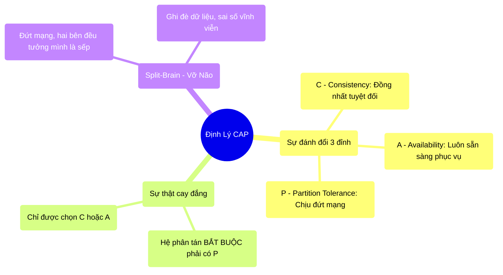

# 2.4 Định Lý CAP, PACELC & Hiện Tượng Split-Brain

## 1. Objectives
- [ ] Diễn giải Định lý CAP và sự đánh đổi bắt buộc trong hệ thống phân tán qua **Phép ẩn dụ Hai Quán Cafe**.
- [ ] Mở rộng với định lý PACELC (Trạng thái bình thường vs Trạng thái đứt mạng).
- [ ] Giải thích thảm họa Split-Brain (Chia cắt não bộ) qua code.

## 2. Mindmap


## 3. Content

### 3.1. Định Lý CAP (Lý Thuyết Cơ Sở)
Vào năm 2000, Eric Brewer đã phát biểu một định lý nghiêm ngặt đối với các kỹ sư phần mềm: Khi bạn có một hệ thống máy tính phân tán, bạn phải đối phó với 3 yếu tố (C, A, P). Nhưng định luật vật lý chỉ cho phép bạn **đạt được tối đa 2 trong 3 yếu tố cùng lúc**.

1. **C - Consistency (Tính nhất quán):** Dù bạn hỏi máy tính nào, kết quả trả về phải y hệt nhau. Dữ liệu là đồng nhất tuyệt đối.
2. **A - Availability (Tính sẵn sàng):** Cứ hỏi là máy tính phải trả lời ngay lập tức. Không bao giờ bị treo, không bao giờ từ chối phục vụ.
3. **P - Partition Tolerance (Tính chịu đựng chia cắt mạng):** Hai máy tính bị đứt dây mạng, không thể nói chuyện với nhau, hệ thống vẫn phải sống.

> **[Ví Dụ Trực Quan: Chuỗi Hai Quán Cafe]**
> Bạn mở 2 quán Cafe (Chi nhánh 1 và Chi nhánh 2). Hai chi nhánh dùng chung một tài khoản ngân hàng (Sổ nợ chung). Hàng ngày, hai chi nhánh gọi điện thoại cho nhau để đối chiếu sổ sách.
> 
> Một ngày, cơn bão làm đứt dây điện thoại (**P - Chia cắt mạng**). Bạn có 1 khách hàng vào Chi nhánh 1 hỏi: Tôi đang nợ anh bao nhiêu tiền?.
> Vì không gọi được cho Chi nhánh 2 để hỏi xem khách này có vừa vay thêm tiền bên đó không, bạn bắt buộc phải chọn 1 trong 2 hành động:
> 
> **Lựa chọn 1 (Chọn C, Bỏ A):** Bạn nói: Xin lỗi quý khách, mạng đang đứt, chúng tôi đóng cửa không giao dịch cho đến khi mạng có lại. 
> -> Quán bị ngưng trệ (**Mất tính Sẵn sàng - A**), nhưng bù lại không bao giờ thu sai tiền khách (**Đảm bảo Nhất quán - C**). Đây là hệ thống **CP** (Phù hợp cho Ngân hàng).
> 
> **Lựa chọn 2 (Chọn A, Bỏ C):** Bạn nói: Theo sổ hiện tại của tôi thì anh nợ 10 đồng, anh cứ trả đi. Nhưng rủi ro là bên Chi nhánh 2 khách vừa vay thêm 5 đồng mà bạn không biết.
> -> Quán vẫn hoạt động kiếm tiền (**Giữ tính Sẵn sàng - A**), nhưng dữ liệu đã bị sai số giữa hai bên (**Mất tính Nhất quán - C**). Đây là hệ thống **AP** (Phù hợp cho Mạng xã hội, đếm Like).

Trong Big Data (Nhiều máy tính), **đứt mạng (P) là điều hiển nhiên (xem Bài 2.2)**. Do đó, kỹ sư luôn phải đau đầu cân nhắc thiết kế hệ thống theo chuẩn **CP (Chậm nhưng chính xác)** hay **AP (Nhanh nhưng sai số tạm thời)**.

### 3.2. Mở rộng: Định lý PACELC (Đời Thực Hơn CAP)
CAP chỉ nói về lúc Đứt mạng. Nhưng PACELC bổ sung thêm: Lúc Mạng bình thường, bạn vẫn phải đánh đổi!

**P A C E L C**
- Khi bị đứt mạng (**P**), bạn phải chọn giữa Sẵn sàng (**A**) hoặc Nhất quán (**C**).
- Khác (**E**lse - Lúc bình thường không đứt mạng), bạn phải chọn giữa Độ trễ thấp (**L**atency) hoặc Nhất quán (**C**onsistency).

> **[Trở lại Hai Quán Cafe - Lúc Không Đứt Mạng]**
> Mạng bình thường! Khách mua 1 ly cafe ở Chi nhánh 1.
> Để đảm bảo sổ sách 2 bên y hệt nhau (**C**), nhân viên phải nhấc máy gọi Chi nhánh 2 báo cáo, đợi bên kia xác nhận xong mới giao cafe cho khách. 
> -> Khách phải chờ 3 phút (**Độ trễ cao - Mất L**).
>
> Nếu muốn khách nhận cafe nhanh nhất (**L**), nhân viên đưa cafe luôn rồi ghi vào sổ, tối về mới gọi báo cho Chi nhánh 2. 
> -> Sổ sách bị lệch nhau từ sáng đến tối (**Mất C tạm thời - Eventual Consistency**).

### 3.3. Ác Mộng Của Lập Trình Viên: Split-Brain (Não Bộ Chia Cắt)
Khi hệ thống chọn tính Sẵn sàng (AP) trong lúc đứt mạng, một hiện tượng cực kỳ nguy hiểm có thể xảy ra: **Split-Brain**.

Trong Spark hay HDFS, thường có 1 Máy Quản Lý (Active Master) và 1 Máy Dự Phòng (Standby Master). Nếu 2 máy này đứt dây mạng kết nối với nhau, cả 2 đều lầm tưởng đối phương đã chết!

```python
# =========================================================================
# HIỆN TƯỢNG VỠ NÃO (SPLIT-BRAIN) TRONG THỰC TẾ
# =========================================================================

# Kịch bản: Máy A và Máy B quản lý chung 1 file lưu trữ số dư tài khoản.
# Lúc đứt mạng:
# Máy A tưởng B chết. Máy A vẫn mở cửa nhận Yêu cầu của Khách Hàng 1.
# Máy B tưởng A chết. B tự thăng cấp lên làm Quản lý, nhận Yêu cầu Khách Hàng 2.

def process_transaction(master_node, user_id, action):
    # CẢ HAI MÁY ĐỀU ĐANG CHẠY HÀM NÀY ĐỘC LẬP
    current_balance = read_db(user_id) 
    new_balance = current_balance + action['amount']
    write_db(user_id, new_balance)

"""
HẬU QUẢ VẬT LÝ KINH HOÀNG:
Tài khoản đang có 100$.
- Máy A (Giao dịch 1: nạp 50$). Máy A tính: 100 + 50 = 150$. Máy A ghi 150$ xuống ổ cứng.
- Cùng lúc đó, Máy B (Giao dịch 2: nạp 20$). Máy B lúc đọc cũng thấy 100$. B tính: 100 + 20 = 120$. B ghi đè 120$ xuống ổ cứng.

Sau khi mạng có lại, dữ liệu thật là bao nhiêu? Đã bị ghi đè hoàn toàn. Tiền của Khách hàng 1 (50$) đã bốc hơi vĩnh viễn!
Đó là lý do các hệ thống hiện đại phải dùng cơ chế ĐỒNG THUẬN SỐ ĐÔNG (Zookeeper/Quorum - Đòi hỏi phải có trên 50% máy đồng ý mới được ghi) để chống Split-Brain.
"""
```

## 4. Key takeaways
- **CAP không phải là lựa chọn 3:** Trong hệ thống phân tán, (P - Đứt mạng) luôn tồn tại. Cuộc chiến thiết kế chỉ nằm ở việc chọn (C - Chính xác nhưng chậm/dừng phục vụ) hay (A - Nhanh nhưng chấp nhận sai số).
- **Tính trễ (Latency):** Muốn dữ liệu chính xác tuyệt đối trên nhiều máy thì phải tốn thời gian đồng bộ. Bắt buộc phải hy sinh tốc độ đáp ứng.
- **Split-Brain:** Là lỗi cấu trúc vật lý mạng, nơi 2 quản lý tự xưng quyền ghi đè dữ liệu. Để giải quyết, số lượng máy quản lý (Master/Zookeeper) luôn phải là số lẻ (3, 5, 7) để khi đứt mạng, bên nào phe đông hơn (Quorum > 50%) mới được phép sống sót.
