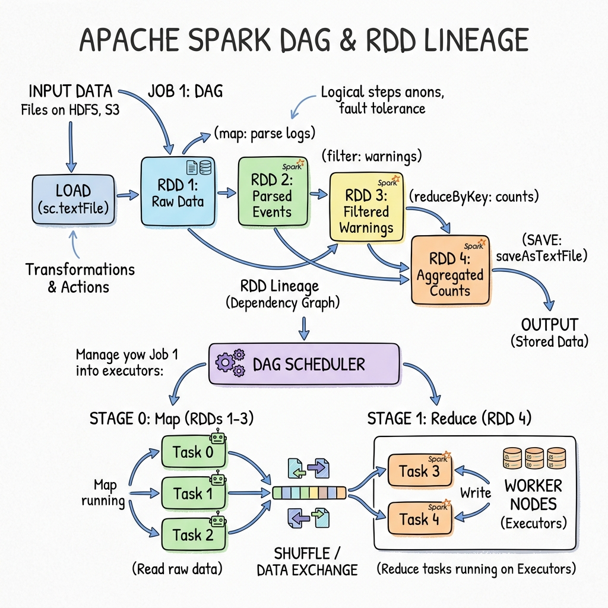
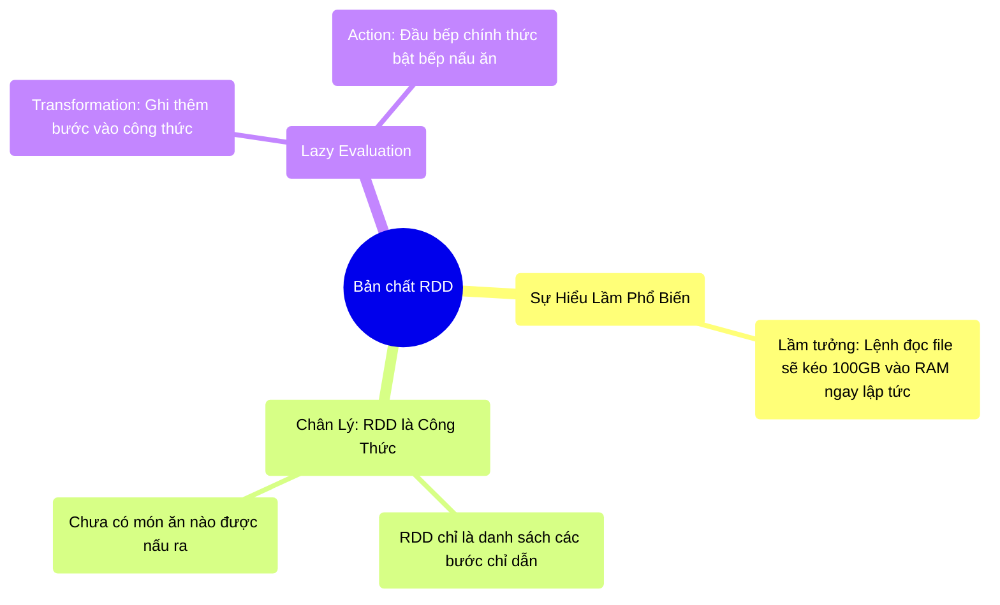

# 3.1 Bản Chất Của RDD: Ảo Giác Dữ Liệu




## 1. Objectives
- [ ] Xóa bỏ hiểu lầm nghiêm trọng nhất: RDD là dữ liệu nằm trong RAM.
- [ ] Diễn giải bản chất của RDD thông qua **Phép ẩn dụ Công thức nấu ăn**.
- [ ] Phân tích cơ chế Đánh giá lười biếng (Lazy Evaluation) qua ví dụ Code.

## 2. Mindmap


## 3. Content

### 3.1. Phá Vỡ Ảo Giác: RDD Không Phải Là Dữ Liệu
Resilient Distributed Dataset (RDD) - Tập dữ liệu phân tán có khả năng phục hồi. Cái tên của nó làm 99% lập trình viên mới học Spark lầm tưởng rằng: Khi khai báo RDD, dữ liệu đã được tải vào RAM. 

Điều này là sai hoàn toàn về mặt vật lý! Nếu một file log nặng 1 Terabyte, việc tải nó vào RAM sẽ đánh sập bất kỳ máy tính nào ngay tắp lự (như đã phân tích ở Bài 1.2).

> **[Ví Dụ Trực Quan: Cuốn Sổ Công Thức Nấu Ăn]**
> RDD **KHÔNG PHẢI** là một chiếc bánh kem đang nằm trên bàn (Dữ liệu thật).
> RDD thực chất chỉ là **MỘT TRANG GIẤY ghi lại công thức** làm bánh.
> Khi bạn gõ lệnh: `Đọc file HDFS` $\rightarrow$ Bạn viết vào sổ: Bước 1: Lấy bột từ kho.
> Bạn gõ lệnh: `Lọc khách hàng VIP` $\rightarrow$ Bạn viết tiếp: Bước 2: Lọc bỏ trứng hỏng.
> 
> Trong suốt quá trình đó, **KHÔNG CÓ QUẢ TRỨNG NÀO BỊ CHẠM TỚI, KHÔNG CÓ THÌA BỘT NÀO ĐƯỢC LẤY RA**. Mọi thứ chỉ là chữ viết trên giấy. Spark Driver đang ngồi vẽ ra một tờ giấy hướng dẫn (Lineage).

Đó chính là nguyên lý **Lazy Evaluation (Đánh giá lười biếng)** của Spark. Spark rất lười, nó không thèm động tay vào dữ liệu thật cho đến khi bị ép buộc.

### 3.2. Transformation và Action: Viết Công Thức vs Bật Bếp
Trong Spark, mọi câu lệnh được chia làm 2 loại: **Transformation (Biến đổi)** và **Action (Hành động)**.

- **Transformation (Ví dụ: `map`, `filter`):** Là hành động viết thêm một bước vào sổ công thức. Vì chỉ là viết ra giấy, CPU và RAM gần như không tiêu tốn năng lượng, thời gian thực thi là 0.001 giây.
- **Action (Ví dụ: `count`, `collect`, `save`):** Là lệnh Bật Bếp!. Lúc này, người quản đốc (Driver) sẽ photo công thức này ra làm 100 bản, phát cho 100 đầu bếp (Workers) để họ chạy vào kho (Ổ cứng), vác bột (Dữ liệu thật) ra nhào nặn. Lúc này máy móc mới thực sự hoạt động, RAM mới bắt đầu chứa dữ liệu.

```python
# =========================================================================
# LẬP TRÌNH LƯỜI BIẾNG (Lazy Evaluation)
# =========================================================================

# THỜI ĐIỂM T=0: Lệnh này tạo ra một RDD (Transformation).
# THỰC TẾ VẬT LÝ: Không có byte dữ liệu nào từ file_100GB.csv được đọc vào RAM.
# Máy chủ chỉ ghi vào sổ: "Tọa độ file nằm ở hdfs://.../file_100GB.csv"
rdd_base = sc.textFile("hdfs://.../file_100GB.csv")

# THỜI ĐIỂM T=1: Lệnh map (Transformation).
# THỰC TẾ VẬT LÝ: Vẫn chưa có gì chạy.
# Máy chủ ghi thêm vào sổ: "Sau khi đọc xong, nhớ chuyển toàn bộ chữ thành IN HOA".
rdd_upper = rdd_base.map(lambda text: text.upper())

# THỜI ĐIỂM T=2: Lệnh filter (Transformation).
# THỰC TẾ VẬT LÝ: Vẫn CHƯA có gì chạy.
# Máy chủ ghi thêm: "Chỉ giữ lại những dòng có chữ ERROR".
rdd_error = rdd_upper.filter(lambda text: "ERROR" in text)

# ---- ĐẾN ĐÂY, CPU vẫn đang ngủ, RAM vẫn trống rỗng! ----

# THỜI ĐIỂM T=3: Lệnh Action! (BẬT BẾP)
# Spark Driver ngay lập tức dịch Cuốn sổ công thức trên thành mã máy,
# Gửi lệnh xuống 100 máy Worker.
# 100 máy Worker ĐỒNG LOẠT thò tay vào ổ cứng (Disk), kéo từng dòng dữ liệu lên RAM, 
# ép IN HOA, lọc chữ ERROR, đếm số lượng, và nộp kết quả về cho Driver.
# Quá trình này có thể tốn 5 phút.
total_errors = rdd_error.count()
```

### 3.3. Lợi Ích Của Sự Lười Biếng
Tại sao phải phức tạp hóa bằng sổ công thức mà không chạy luôn?
Vì nếu viết ra giấy trước, người quản lý có cơ hội Tối ưu hóa công thức.

Ví dụ: Bạn viết lệnh Chuyển IN HOA 10 triệu dòng (Tốn 10 phút), sau đó viết lệnh Lấy ra 1 dòng đầu tiên (limit 1).
Nhờ lười biếng, Spark nhìn toàn bộ công thức và nhận ra sự thiếu tối ưu: Tại sao tôi phải IN HOA 10 triệu dòng trong khi thằng chủ chỉ lấy 1 dòng cuối cùng?. 
Thế là Spark tự động sửa lại công thức: Chỉ kéo ĐÚNG 1 dòng đầu tiên lên, IN HOA dòng đó thôi, rồi nộp. Tốc độ từ 10 phút giảm xuống còn 0.01 giây!

## 4. Key takeaways
- **Bản chất RDD:** RDD không chứa dữ liệu. RDD chứa công thức (hướng dẫn) để tính ra dữ liệu. 
- **Lazy Evaluation:** Là kỹ thuật sinh tồn của hệ thống phân tán. Việc trì hoãn thực thi giúp Spark có cái nhìn toàn cảnh (Global View) để cắt gọt các công đoạn tính toán thừa thãi trước khi thực sự chạm vào ổ cứng.
- **Tư duy Debug (Tìm lỗi):** Nếu hệ thống của bạn bị báo lỗi Thiếu RAM, lỗi không nằm ở dòng code `rdd.map` hay `rdd.filter` (vì chúng chưa chạy), lỗi sẽ NỔ ĐÙNG ở ngay cái dòng chứa chữ `count()`, `collect()`, hoặc `write()`.
