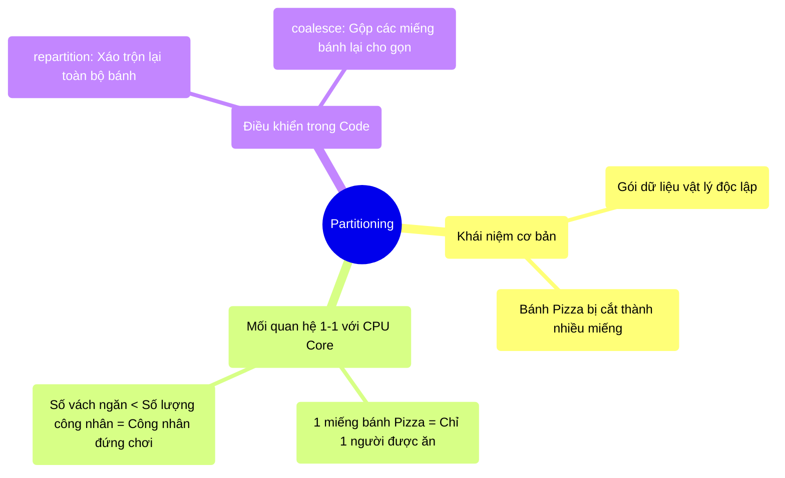

# 3.2 Phân Mảnh Dữ Liệu (Partitioning): Đơn Vị Nguyên Tử Của Song Song Hóa

## 1. Objectives
- [ ] Giải thích khái niệm Partitioning qua **Phép ẩn dụ Cắt Bánh Pizza**.
- [ ] Phân tích mối quan hệ vật lý trực tiếp giữa số lượng Partition và số lượng CPU Core được sử dụng.
- [ ] Hướng dẫn kỹ thuật kiểm soát và thay đổi số lượng Partition thông qua mã nguồn.

## 2. Mindmap


## 3. Content

### 3.1. Hạt Nhân Của Tính Toán Song Song
Chúng ta đã biết Spark là hệ thống phân tán chia việc cho nhiều máy làm cùng lúc. Nhưng Spark chia việc dựa trên cái gì? Câu trả lời là **Partition (Phân mảnh dữ liệu)**.

Partition không phải là một khái niệm trừu tượng, nó là một cục dữ liệu vật lý nằm gọn trong thanh RAM của một cái máy tính. Nếu bạn có một file CSV nặng 100GB, Spark không vứt cả 100GB đó vào 1 máy, nó sẽ chặt file đó ra thành ví dụ 1.000 miếng (Partitions), mỗi miếng nặng khoảng 100MB, và phân phát cho các máy tính (Workers) giữ lấy.

> **[Ví Dụ Trực Quan: Cắt Bánh Pizza]**
> Hãy tưởng tượng dữ liệu của bạn là một cái Bánh Pizza khổng lồ. 
> Sức mạnh điện toán của bạn (Số lượng CPU Core) là những Nhân viên ăn bánh. Giả sử công ty bạn thuê 10 Nhân viên rất khỏe mạnh (10 CPU Cores).
> 
> Lập trình viên nghiệp dư đem bánh Pizza ra nhưng lại lười, chỉ dùng dao cắt làm **2 miếng** (Tức là Dữ liệu chỉ có 2 Partitions).
> Điều gì xảy ra? 
> Sẽ chỉ có **ĐÚNG 2 Nhân viên** được bốc 2 miếng bánh đó lên ăn (Xử lý dữ liệu). 8 Nhân viên còn lại phải đứng chống cằm nhìn (Lãng phí tài nguyên CPU).
> 
> Đừng bao giờ đổ lỗi cho Spark chạy chậm quá, khi mà chính tay bạn không cắt bánh ra làm đủ 10 miếng cho 10 người cùng ăn!

Quy luật vật lý bất biến: **1 Partition tại 1 thời điểm chỉ có thể được xử lý bởi ĐÚNG 1 CPU Core**. Do đó, số lượng Partitions chính là giới hạn trần của sức mạnh song song (Parallelism).

### 3.2. Quá Ít vs Quá Nhiều (The Goldilocks Problem)
Cắt bánh bao nhiêu miếng là vừa? Nếu cắt quá ít, công nhân đứng chơi. Vậy cắt quá nhiều thì sao?

> **[Tiếp Tục Ẩn Dụ: Bánh Pizza Cắt Nát]**
> Công ty bạn có 10 Nhân viên (10 CPU Cores). Bánh Pizza lần này bạn siêng năng quá, bạn dùng dao băm nát nó thành **1.000.000 miếng nhỏ tí xíu** (Quá nhiều Partitions).
> Chuyện gì xảy ra?
> Nhân viên phải cúi xuống nhặt 1 vụn bánh lên nhai (Tốn 1 giây), rồi lại với tay nhặt vụn thứ hai (Tốn 1 giây). Việc thò tay ra nhặt bánh tốn nhiều thời gian hơn cả việc nhai. Hệ thống kiệt sức vì làm thao tác Giao Việc - Nhận Việc (Task Scheduling Overhead) thay vì xử lý công việc thật.

Trong môi trường Enterprise (Hệ thống Quy mô lớn), quy tắc vàng là: Cắt cái bánh (Số lượng Partitions) **gấp 2 đến 3 lần** số lượng công nhân (Total CPU Cores). 
Ví dụ: Bạn có 100 CPU Cores trong cụm. Bạn nên ép số lượng Partitions rơi vào khoảng 200 - 300. Khi đó, mỗi công nhân sẽ xử lý 2-3 cục dữ liệu liên tiếp, vừa tận dụng hết nhân lực, vừa không bị kiệt sức vì đi nhặt vụn bánh.

### 3.3. Can Thiệp Cấu Trúc Bằng Code
Bạn hoàn toàn có thể ra lệnh cho Spark chia lại bánh thông qua mã lệnh:

```python
# =========================================================================
# LẬP TRÌNH SONG SONG (Parallel Tuning)
# =========================================================================

# KIỂM TRA SỐ LƯỢNG MIẾNG BÁNH HIỆN TẠI
# Khi đọc 1 file nhỏ, Spark có thể tự động chia nó làm 1 hoặc 2 Partitions.
df = spark.read.csv("hdfs://tiny_file.csv")
print("Số miếng bánh hiện tại:", df.rdd.getNumPartitions()) # Kết quả: 2

# TÌNH HUỐNG 1: Dữ liệu bị dồn vào 1 góc (Data Skew / Ít bánh)
# Chữa bệnh bằng hàm repartition()
# Hàm này ép Spark phải dùng dao băm lại bánh Pizza thành đúng 200 miếng đều nhau.
# NHƯỢC ĐIỂM: Để chia đều lại, Spark phải trộn dữ liệu lên (Shuffle). 
# Giống như việc ném tất cả các miếng bánh vào 1 cái bát rồi chia lại. Rất tốn công và chậm!
df_evenly_distributed = df.repartition(200)

# TÌNH HUỐNG 2: Bánh bị nát quá nhiều sau khi xử lý (Ví dụ sau lệnh filter)
# Bạn vừa dùng lệnh filter bỏ đi 90% dữ liệu, còn lại 10.000 miếng bánh rỗng tuếch.
# Chữa bệnh bằng hàm coalesce()
# Coalesce an toàn hơn vì nó KHÔNG trộn lại toàn bộ bánh (Không Shuffle).
# Nó chỉ đơn giản là cầm 10 miếng bánh nhỏ ở cạnh nhau GỘP LẠI thành 1 miếng lớn.
df_compacted = df_evenly_distributed.filter(df.age > 80).coalesce(10)
```

## 4. Key takeaways
- **Partitioning là giới hạn trần:** Tốc độ cụm tính toán phụ thuộc trực tiếp vào số lượng Partition. Ít Partition $\rightarrow$ CPU rảnh rỗi. Quá nhiều Partition $\rightarrow$ Hệ thống sụp đổ vì thời gian giao việc lớn hơn thời gian làm việc.
- **Quy tắc 1-1:** Luôn nhớ trong đầu: 1 CPU Core chỉ có thể giải quyết 1 Partition tại 1 thời điểm nhất định.
- **Công cụ điều phối:** Dùng `repartition(n)` khi muốn tăng số lượng gói dữ liệu (chấp nhận xáo trộn mạng), và dùng `coalesce(n)` khi muốn gộp bớt các gói dữ liệu lại với nhau (không xáo trộn mạng).
