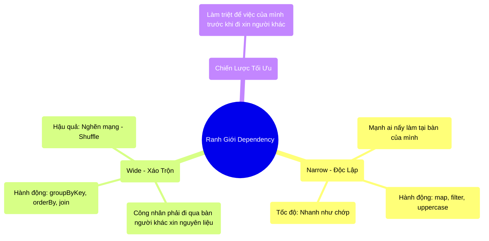

# 3.3 Ranh Giới Vật Lý: Narrow vs Wide Dependencies

## 1. Objectives
- [ ] Phân định sự khác biệt sống còn giữa Narrow và Wide Dependency qua **Phép ẩn dụ Công Xưởng Làm Bánh**.
- [ ] Nhận diện hiện tượng Shuffle (Xáo trộn dữ liệu) - kẻ thù số 1 của hệ thống phân tán.
- [ ] Hướng dẫn kỹ năng ép chết dữ liệu tại mốc Narrow bằng cách tư duy luồng Code.

## 2. Mindmap


## 3. Content

### 3.1. Phân Biệt Narrow và Wide (Điểm Giới Hạn Tốc Độ)
Trong Bài 3.1, chúng ta biết RDD là một Sổ công thức ghi lại các bước xử lý (Transformation). Spark chia các bước này làm hai loại: **Narrow (Hẹp/Cục bộ)** và **Wide (Rộng/Toàn cục)**. Sự phân biệt này quyết định hệ thống của bạn sẽ chạy xong trong 1 phút hay... 10 tiếng!

> **[Ví Dụ Trực Quan: Công Xưởng Làm Bánh Sandwich]**
> Công xưởng của bạn có 100 công nhân (100 Máy tính - Workers).
> 
> **Tình huống NARROW (Cục bộ): Lệnh Filter, Map**
> Người quản đốc ra lệnh: Mỗi người gọt vỏ ổ bánh mì trên bàn của mình đi!.
> Lúc này, công nhân A đứng gọt bánh của anh ta. Công nhân B gọt bánh của B. **Không ai cần nói chuyện hay đi qua bàn của ai**. Công việc xong ngay trong chớp mắt vì nó hoàn toàn độc lập (Narrow Dependency).
> Dữ liệu (Bánh mì) chỉ nằm yên trên 1 chiếc bàn (1 Partition).
> 
> **Tình huống WIDE (Toàn cục): Lệnh GroupBy, OrderBy**
> Quản đốc ra lệnh mới: Giờ thì gom tất cả bánh mì có thịt kẹp ở giữa mang sang bàn số 1, bánh kẹp phô mai mang sang bàn số 2.
> Chuyện gì xảy ra? Bạo loạn!
> 100 công nhân ôm bánh mì chạy nháo nhào khắp xưởng để đưa bánh cho nhau. Người này tông vào người kia (Tắc nghẽn mạng lưới - Network Congestion). Việc truyền dữ liệu xuyên qua các máy tính (Xuyên qua mạng LAN/Cáp quang) tốn thời gian gấp ngàn lần việc xử lý tại chỗ.
> Quá trình chạy nháo nhào này được Spark gọi là **SHUFFLE (Xáo trộn dữ liệu)**. Và nó là điểm nghẽn vật lý kinh hoàng nhất của Big Data.

### 3.2. Shuffle: Kẻ Thù Số 1 Của Hệ Phân Tán
Khi một lệnh **Wide Dependency** được gọi (Ví dụ: Nhóm theo tên, Sắp xếp thứ tự, Kết nối 2 bảng), hệ thống bắt buộc phải **Shuffle**.
Tại sao? Bởi vì muốn Sắp xếp thứ tự từ A-Z, bạn không thể để mỗi máy tính tự sắp xếp cục dữ liệu của riêng nó được. Bạn phải nhặt tất cả chữ A từ 100 máy dồn về 1 máy, nhặt chữ B dồn về máy số 2... 

Quá trình Shuffle bắt buộc hệ thống phải ghi nháp hàng Terabytes dữ liệu xuống Ổ cứng, sau đó đẩy qua Dây mạng, rồi bên kia nhận được lại ghi xuống Ổ cứng. Nó kích hoạt cả 3 nút thắt vật lý tồi tệ nhất: **Disk I/O, Network Bandwidth, và RAM OOM**.

### 3.3. Kỹ Năng Tối Ưu: Ép Chết Dữ Liệu Ở Mốc Narrow
Tại các hệ thống quy mô lớn (Enterprise), bài học đầu tiên của Data Engineer là: **Tuyệt đối không đẩy rác qua mạng**.
Bạn phải dùng các lệnh Narrow để bào mòn, lọc vứt đi toàn bộ dữ liệu không cần thiết, TRƯỚC KHI gọi các lệnh Wide.

```python
# =========================================================================
# [ANTI-PATTERN] NÉM RÁC QUA MẠNG LƯỚI (Shuffle trước, Lọc sau)
# =========================================================================

# BƯỚC 1: GroupBy (Lệnh WIDE - Kích hoạt Shuffle)
# File Log có 1 Tỷ dòng. Bạn gom nhóm theo ID ngay lập tức.
# 100 Máy tính hoảng loạn quăng 1 Tỷ dòng (Nặng 100GB) chéo qua mạng cho nhau.
# Mạng LAN báo động đỏ. Hệ thống lag 10 phút.
df_grouped = df.groupBy("user_id").count()

# BƯỚC 2: Filter (Lệnh NARROW)
# Ném qua mạng xong, mất 10 phút, giờ mới lọc để vứt đi dữ liệu cũ.
# Lọc bỏ 90% dữ liệu (user_id là khách vãng lai không cần thiết).
df_final = df_grouped.filter(col("user_id").isNotNull()) 

# =========================================================================
# [BEST-PRACTICE] ÉP CHẾT RÁC Ở CẤP ĐỘ CỤC BỘ (Lọc trước, Shuffle sau)
# =========================================================================

# BƯỚC 1: Filter (Lệnh NARROW)
# Ngay khi 1 Tỷ dòng vừa nằm ở 100 máy, bạn ra lệnh Lọc ngay lập tức.
# 100 máy tự âm thầm vứt đi 90% lượng rác ngay tại ổ cứng của nó. Chớp mắt xong.
# Dữ liệu từ 100GB sụt giảm mạnh chỉ còn 10GB mồi ngon.
df_clean = df.filter(col("user_id").isNotNull()) 

# BƯỚC 2: GroupBy (Lệnh WIDE - Shuffle)
# Lúc này bạn mới gọi Shuffle.
# 100 Máy tính chỉ phải ném 10GB dữ liệu sạch qua mạng. 
# Băng thông nhẹ tênh, kết quả ra trong 5 giây!
df_final = df_clean.groupBy("user_id").count()
```

Việc thay đổi thứ tự gọi lệnh (Code Order) chính là ranh giới giữa một đoạn mã nghiệp dư và một kiến trúc chuyên sâu. 

## 4. Key takeaways
- **Narrow Dependency (Cục bộ):** Các thao tác (Filter, Map) mà mỗi máy tính có thể tự làm độc lập, không cần giao tiếp với máy khác. Rất nhanh, an toàn.
- **Wide Dependency (Toàn cục):** Các thao tác (GroupBy, Join, OrderBy) bắt buộc các máy phải gửi dữ liệu cho nhau qua mạng. Đây là khởi nguồn của **Shuffle**.
- **Tư duy thiết kế Code:** Luôn luôn, bằng mọi giá, phải dồn các lệnh Narrow lên đầu để gọt đẽo, triệt tiêu kích thước dữ liệu xuống mức nhỏ nhất có thể trước khi cho phép hệ thống gọi lệnh Wide (Shuffle).
