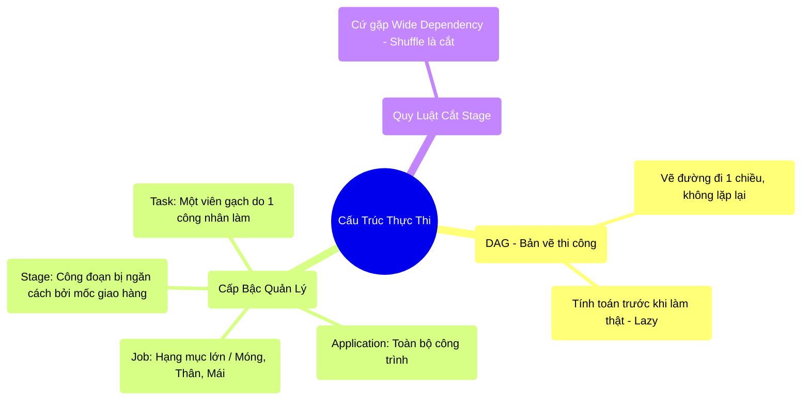

# 3.4 Phân Rã Biểu Đồ DAG & Cấu Trúc Thực Thi Spark

## 1. Objectives
- [ ] Giải phẫu Cấu trúc thực thi của Spark (Application -> Job -> Stage -> Task) qua **Phép ẩn dụ Xây Dựng Tòa Nhà**.
- [ ] Giải thích DAG (Directed Acyclic Graph) là gì và tại sao Shuffle lại cắt đứt các Stage.
- [ ] Phân tích Code thực tế xem 1 dòng code đẻ ra bao nhiêu Task.

## 2. Mindmap


## 3. Content

### 3.1. Bản Vẽ Của Kiến Trúc Sư: DAG
Trong Bài 3.1, chúng ta biết Spark rất lười (Lazy Evaluation), nó chỉ ghi lại danh sách các công thức biến đổi (Transformation) vào một cuốn sổ. Khi lệnh Bật Bếp (Action) được kích hoạt, cuốn sổ này được giao cho một bộ phận gọi là **DAG Scheduler** (Bộ định thời DAG).

**DAG (Directed Acyclic Graph - Đồ thị có hướng không tuần hoàn):** Nghe rất toán học, nhưng bản chất nó chỉ là một **Bản Vẽ Thi Công 1 Chiều**.
- Có hướng (Directed): Dữ liệu chảy từ Bước 1 sang Bước 2 sang Bước 3 (Nước chảy xuôi).
- Không tuần hoàn (Acyclic): Dữ liệu không bao giờ bị vòng lặp (vượt qua Bước 3 rồi không được nhảy ngược lại Bước 1). 

Nhờ có bản vẽ rõ ràng 1 chiều này, Spark (Người quản đốc) biết chính xác nếu máy số 2 bị hỏng ở Bước 3, nó chỉ cần lôi dữ liệu ở Bước 2 ra làm lại, không cần làm lại từ Bước 1.

### 3.2. Cấu Trúc Thực Thi (Hierarchy of Execution)
Để biến Bản vẽ thành Tòa nhà thật, Spark chia việc thành 4 cấp bậc quản lý từ to đến nhỏ: **Application $\rightarrow$ Job $\rightarrow$ Stage $\rightarrow$ Task**.

> **[Ví Dụ Trực Quan: Xây Dựng Tòa Nhà]**
> - **Application (Toàn bộ Dự án):** Giống như Dự án Xây Chung Cư. Bắt đầu khi bạn nộp Code cho cụm máy, và kết thúc khi bạn tắt Code.
> - **Job (Hạng Mục - Kích hoạt bởi lệnh Action):** Cứ mỗi khi bạn ra lệnh `count()`, `show()`, `write()`, bạn tạo ra 1 Job. 
>   *Ví dụ: Job 1: Đổ móng. Job 2: Xây thô. Job 3: Hoàn thiện.* Nếu code của bạn có 3 lệnh in ra màn hình, bạn sẽ tạo ra 3 Job.
> - **Stage (Công Đoạn - Bị cắt bởi Shuffle):** Trong 1 Hạng Mục (Job), sẽ có nhiều công đoạn. Điểm phân chia các công đoạn chính là **Sự xáo trộn (Shuffle)**. 
>   *Ví dụ: Thợ sơn đang đứng sơn (Narrow - độc lập). Tự nhiên quản đốc bắt gom tất cả thùng sơn thừa chuyển sang tòa nhà khác (Shuffle - Wide). Việc chuyển đồ bắt buộc Thợ sơn phải dừng tay. Bước sơn tường kết thúc, chuyển sang Bước (Stage) chuyển đồ.*
> - **Task (Đơn vị nhỏ nhất):** Chính là 1 cục dữ liệu (Partition) do ĐÚNG 1 Công Nhân (CPU Core) xử lý. 
>   *Ví dụ: 1 Task là việc anh thợ tên Tèo sơn đúng 1 mảng tường.* 

### 3.3. Quy Luật Chặt Chém Của Cưa Máy (Shuffle Boundary)
Tại sao phải chia Stage? Tại sao không cho công nhân làm tuốt luốt từ đầu đến cuối?

Quay lại Bài 3.3, khi gặp lệnh Shuffle (như `groupBy`, `join`), 100 công nhân phải quăng dữ liệu chéo qua mạng cho nhau. 
**Quy luật vật lý:** Công nhân B không thể tổng hợp dữ liệu, nếu công nhân A chưa gửi xong mảnh ghép cuối cùng. 
Vì vậy, khi gặp Shuffle, Spark bắt buộc phải **chặt đứt (Cắt Stage)** bản vẽ. Spark bắt TẤT CẢ công nhân phải làm xong Stage 1, lưu nháp xuống ổ cứng. Chờ 100% mọi người hoàn thành, Spark mới cho phép bắt đầu Stage 2.

```python
# =========================================================================
# ĐẾM SỐ LƯỢNG STAGE VÀ TASK (Giải phẫu luồng vật lý)
# =========================================================================

# Khởi tạo: Đọc file. Spark tự động chia file này làm 100 Partitions (Gói dữ liệu).
df = spark.read.csv("hdfs://data.csv") # 100 Partitions

# BƯỚC 1: Lệnh Narrow (Filter, Select) -> Gộp chung vào 1 STAGE (Stage 0)
# CPU làm việc: 100 con CPU cùng lúc lọc 100 gói.
# Do đây là Narrow, không ai phải chờ ai, Spark gộp chúng vào 1 mạch trơn tru.
# Số lượng Task = 100 (Bằng số lượng Partitions).
df_clean = df.filter(df.age > 18).select("name", "department")

# BƯỚC 2: Lệnh Wide (GroupBy) -> BỊ CẮT STAGE (Kết thúc Stage 0, Bắt đầu Stage 1)
# Khi gặp groupBy, Spark ra lệnh: "Dừng lại! Chờ tất cả lọc xong, rồi ném dữ liệu
# phòng ban qua mạng cho nhau (Shuffle)."
# THEO MẶC ĐỊNH của Spark, sau khi Shuffle, dữ liệu được băm ra thành 200 Partitions mới.
df_grouped = df_clean.groupBy("department").count()

# BƯỚC 3: Lệnh Action (Kích hoạt JOB)
# Lệnh show() châm ngòi cho toàn bộ quá trình chạy.
df_grouped.show()

# KẾT QUẢ VẬT LÝ TRÊN SPARK UI:
# Bạn tạo ra: 1 JOB
# Có 2 STAGE:
# - Stage 0 (Trang bị vũ khí & Lọc rác): Chạy 100 Tasks (song song).
# - Stage 1 (Gom nhóm & Đếm): Chạy 200 Tasks (song song).
```

## 4. Key takeaways
- **Bản vẽ DAG:** Việc không làm ngay (Lazy) giúp Spark vẽ ra được DAG 1 chiều hoàn chỉnh, từ đó phân bổ công việc tối ưu và biết cách khôi phục khi có 1 khâu hỏng hóc.
- **Ranh giới chết người:** Nơi nào có lệnh Wide (Shuffle), nơi đó bị cắt Stage. Cắt Stage đồng nghĩa với việc toàn bộ hệ thống phải đồng bộ (Synchronization point): Máy chạy nhanh phải đứng chờ máy chạy chậm (Stragglers) làm xong mới được đi tiếp.
- **Toán học của Task:** Số lượng Task song song trong 1 Stage CHÍNH BẰNG số lượng Partition ở bước đó. (1 Task = 1 CPU Core = 1 Partition).
