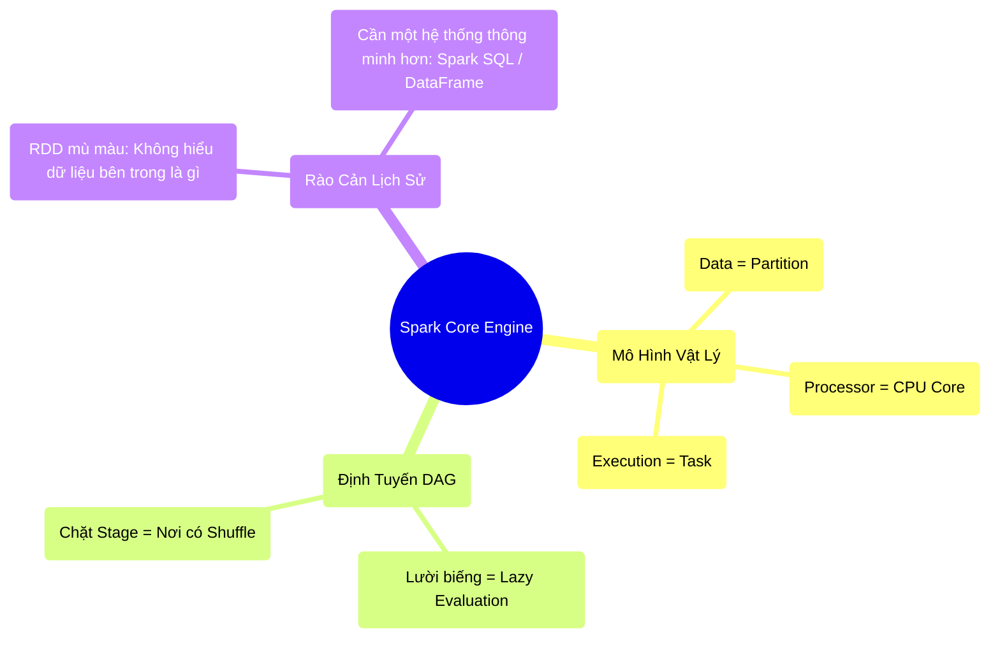

# 3.5 Tổng Kết Động Cơ Spark Core (Trái Tim Hệ Thống)

## 1. Objectives
- [ ] Tổng hợp lại toàn bộ các khái niệm vật lý cốt lõi của Giai đoạn 1 & 2.
- [ ] So sánh triết lý Spark Core (Quá khứ) và Spark SQL (Hiện tại).
- [ ] Cảnh báo lý do tại sao viết Code bằng RDD thuần túy lại đang giết chết hệ thống.

## 2. Mindmap

## 3. Content

### 3.1. Nhìn Lại Bức Tranh Tổng Thể (The Big Picture)
Đến đây, chúng ta đã đi qua toàn bộ nguyên lý gốc rễ của tính toán phân tán. Hãy ráp nối tất cả các phép ẩn dụ lại với nhau:

1. **Bức tường phần cứng:** Nhà máy của bạn không thể mua được cỗ máy chạy nhanh hơn nữa (Moores's Law sụp đổ). Bạn bắt buộc phải thuê 1.000 công nhân bình thường (Scale Out).
2. **Sự kiện bùng nổ:** Hàng hóa đổ về như sóng thần (Kryder's Law / Big Data). 1.000 công nhân của bạn không thể ném 1000 món hàng về cho 1 anh thủ kho ghi chép (OOM / Cổ chai Amdahl). Bắt buộc **Mỗi người tự có một cuốn sổ riêng (Shared-Nothing)**.
3. **Sự phản ánh sai lệch RDD:** Spark phát cho 1.000 công nhân các tờ giấy hướng dẫn cách sơ chế hàng (Lazy Evaluation), thay vì phát ngay hàng thật.
4. **Partition & Task:** Mỗi lô hàng được đóng gói (Partition). Cứ 1 cục Partition sẽ do đúng 1 công nhân (CPU Core) xử lý. Thời gian xử lý 1 cục đó gọi là 1 Task.
5. **Kẻ phá bĩnh Shuffle:** Chừng nào công nhân mạnh ai nấy gọt vỏ (Narrow), mọi thứ đều nhanh. Nhưng hễ có lệnh bắt phải gom rác đem vứt chung (Wide / GroupBy), công nhân phải chạy ngang dọc xưởng va vào nhau. Tắc nghẽn mạng lưới (Network Bottleneck) xảy ra. Spark buộc phải thổi còi dừng tất cả lại (Cắt Stage), đợi ai cũng gom rác xong mới cho làm bước tiếp theo.
6. **Bất tử (Fault Tolerance):** Nếu 1 công nhân ngất xỉu, Spark rút tờ giấy hướng dẫn (Lineage) đưa cho người khác làm lại gói hàng đó.

Đây chính là **Trái tim vật lý** của Apache Spark!

### 3.2. Điểm Mù Của RDD (Vấn đề của Quá khứ)
RDD (Resilient Distributed Dataset) là nền móng vĩ đại giúp Spark lật đổ Hadoop. Tuy nhiên, trong môi trường Enterprise hiện đại, viết Code trực tiếp bằng RDD (ví dụ: `rdd.map(lambda x: x.split(',')[1])`) bị coi là một hành động tự sát về mặt hiệu năng.

Tại sao?

> **[Ví Dụ Trực Quan: Chiếc Hộp Đen Kín Mít]**
> Đối với động cơ Spark Core, một RDD giống như **Một chiếc thùng carton dán kín bằng băng keo đen** (Opaque Box). 
> Spark biết thùng hàng đó nặng 100MB (Partition), biết phải giao cho công nhân nào (Task). 
> NHƯNG, Spark **HOÀN TOÀN KHÔNG BIẾT BÊN TRONG THÙNG CHỨA CÁI GÌ**! Nó không biết đó là cột `Age` mang kiểu số (Integer), hay cột `Name` mang kiểu chữ (String). 
> Nó cũng không hiểu hàm Lambda bằng Python của bạn làm gì bên trong. Bạn đưa hàm gì, nó nhắm mắt nhắm mũi thi hành hàm đó, dù cho hàm đó có lãng phí và cồng kềnh đến đâu.

Sự mù màu này khiến Spark mất đi một năng lực tối quan trọng: **Khả năng tự động tối ưu hóa (Automatic Optimization)**.

### 3.3. Dọn Đường Cho Kỷ Nguyên Tuyên Ngôn (Declarative)
Hãy nhớ lại định luật Amdahl: Con người viết ra các đoạn code tuần tự dở tệ, và những đoạn code dở tệ đó sẽ kéo lùi hệ thống hàng ngàn máy chủ đắt tiền.

Giới khoa học máy tính nhận ra: **Đừng để cho lập trình viên tự viết các vòng lặp (For) hay tự điều khiển cách chạy dữ liệu (How to do) nữa!**
Hãy bắt họ chỉ được nói ra **Mục đích cuối cùng (What to do)**. Phần còn lại (cách chạy sao cho tối ưu), hãy để cho Trình Biên Dịch (Compiler) tự quyết định.

Đó là lý do **DataFrame (Spark SQL)** ra đời, đánh dấu sự chuyển mình từ Lập trình Thủ tục (Procedural - RDD) sang Lập trình Khai báo (Declarative - SQL). DataFrame không phải là vài cái bảng Excel, nó thực chất là một lò phản ứng hạt nhân được điều khiển bởi Catalyst Optimizer và Tungsten Engine.

Chúng ta sẽ giải phẫu cỗ máy biến dịch siêu phàm này ở **Chương 4**.

## 4. Key takeaways
- **Giải phẫu Spark Core:** Dữ liệu phân mảnh (Partitions) chảy qua các Nút (Nodes) dưới sự chỉ đạo của Sơ đồ (DAG), bị chặn lại bởi các lệnh gom nhóm (Shuffle Boundaries), và được chữa lành nhờ Lịch sử (Lineage).
- **Nhược điểm RDD:** RDD là cấu trúc mù mờ (Opaque). Nó mang đến cho lập trình viên sự linh hoạt tuyệt đối (viết bất cứ hàm Python nào), nhưng tước đi quyền năng tối ưu hóa của động cơ Spark.
- **Tiến hóa kiến trúc:** Sự giới hạn của RDD mở đường cho sự ra đời của Catalyst Optimizer (Chương 4) - Nơi Spark sẽ tự động sửa những đoạn code thiếu tối ưu của con người thành các mã máy cực kỳ tinh gọn.
