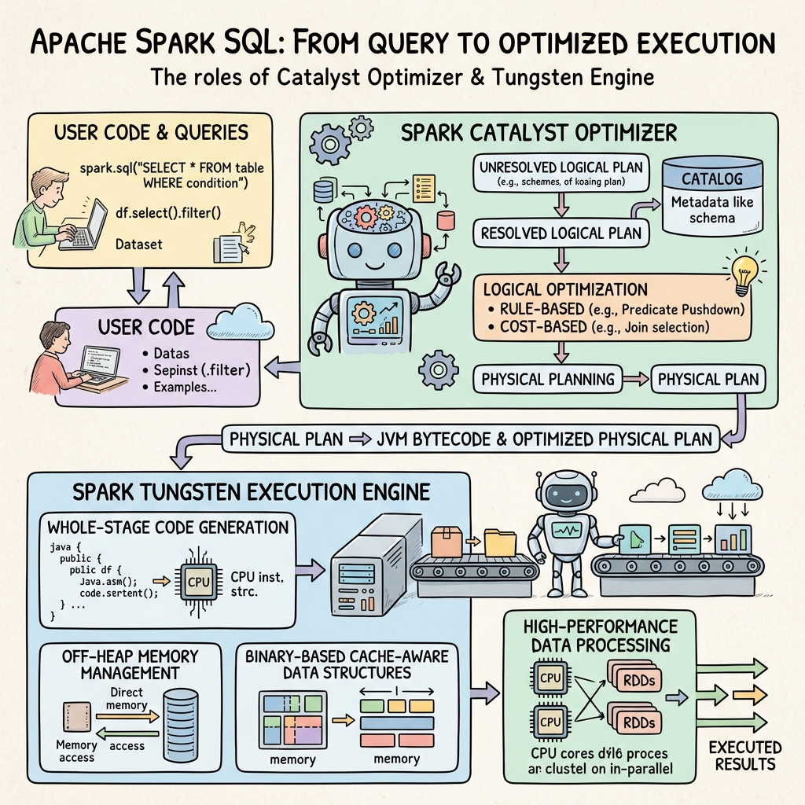
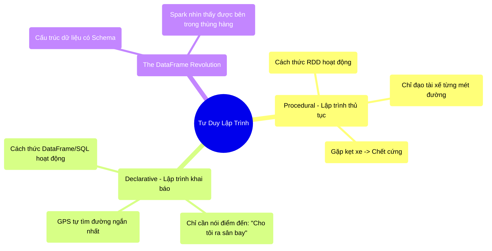

# 4.1 Lập Trình Khai Báo (Declarative) & Cuộc Cách Mạng DataFrame




## 1. Objectives
- [ ] Phân biệt Lập trình Thủ tục (Procedural) và Khai báo (Declarative) qua **Phép ẩn dụ Lái Xe Taxi**.
- [ ] Giải thích nguyên nhân cốt lõi khiến DataFrame ra đời thay thế cho RDD.
- [ ] Minh họa sự khác biệt về hiệu năng qua Code.

## 2. Mindmap


## 3. Content

### 3.1. Phép Ẩn Dụ: Lái Xe Taxi (Procedural vs Declarative)
Đến đây, bạn đã biết RDD (Resilient Distributed Dataset) là cốt lõi của Spark. Nhưng tại sao ngày nay không ai dùng RDD nữa? Sự lụi tàn của RDD đến từ việc nó bắt lập trình viên phải lập trình theo kiểu **Procedural (Lập trình thủ tục / Chỉ ra CÁCH làm)**.

> **[Ví Dụ Trực Quan: Đi Taxi Ra Sân Bay]**
> - **Procedural (Cách làm của RDD):** Bạn lên taxi và ra lệnh cho tài xế: Anh nổ máy đi. Rẽ trái ở ngã tư đầu tiên. Đi 500m. Rẽ phải. Chạy số 3. Đạp phanh ở đèn đỏ. 
>   *Vấn đề:* Nếu con đường rẽ trái hôm đó bị đào xới kẹt xe, tài xế vẫn sẽ đâm đầu vào chỗ kẹt xe, bởi vì anh ta bị buộc phải nghe theo chính xác 100% hướng dẫn thiếu tối ưu của bạn. Bạn tự tước đi khả năng đánh giá tình hình của người tài xế.
> 
> - **Declarative (Cách làm của DataFrame/SQL):** Bạn lên taxi và nói: Hãy đưa tôi ra Sân bay Tân Sơn Nhất, đến ga Quốc Tế!. (Bạn chỉ ra MỤC ĐÍCH - What to do).
>   *Giải pháp:* Tài xế (Động cơ tối ưu của Spark) lập tức bật Google Maps (Trình tối ưu hóa). Nó thấy đường rẽ trái đang kẹt xe, nó tự động tìm một con hẻm nhỏ để rẽ phải, đi đường vòng nhưng ra sân bay nhanh gấp đôi.

### 3.2. RDD Mù Màu & Chiếc Thùng Carton Dán Kín
Như đã phân tích ở cuối Chương 3, RDD là một Chiếc thùng carton dán kín. Spark biết có 1 thùng hàng, nhưng không biết bên trong chứa Cột (Column) gì, Kiểu dữ liệu (Data Type) gì.

Nếu bạn viết Code RDD: `rdd.filter(lambda x: x.age > 30)`, Spark không hề biết age là một con số, nó mù tịt. Nó đành ngậm ngùi lấy từng dòng dữ liệu lên, đưa cho hàm Python của bạn, kệ cho hàm Python đó chạy chậm như rùa. Nó không thể sửa hay tối ưu hàm Python đó được.

Đó là lý do các kỹ sư tạo ra **DataFrame** (hoặc Spark SQL).

### 3.3. Cuộc Cách Mạng DataFrame (The DataFrame Revolution)
DataFrame là một tập dữ liệu phân tán nhưng **BẮT BUỘC PHẢI CÓ SCHEMA (Cấu trúc cột & kiểu dữ liệu)**.

> **[Ví Dụ Trực Quan: Thùng Hàng Đóng Kính Trong Suốt]**
> DataFrame là những thùng hàng được làm bằng kính trong suốt. Spark (Người vận chuyển) nhìn xuyên qua thùng và thấy rõ: À, trong này có Cột Tên (Chữ) và Cột Tuổi (Số).

Nhờ nhìn thấy được cấu trúc dữ liệu, và nhờ lập trình viên chỉ nói MỤC ĐÍCH thay vì CÁCH LÀM, Spark có thể tự do can thiệp, xé nát đoạn code của lập trình viên ra và sắp xếp lại để nó chạy nhanh nhất.

```python
# =========================================================================
# SỰ KHÁC BIỆT KINH HOÀNG GIỮA RDD VÀ DATAFRAME
# =========================================================================

# TÌNH HUỐNG: Đọc file Log 1 Tỷ dòng. Xóa các dòng rỗng, lấy cột Tuổi, tính trung bình.

# CÁCH 1: LÀM BẰNG RDD (Rất Chậm)
rdd = sc.textFile("hdfs://logs.csv")
# Spark mù tịt, không biết x[1] là cột gì. Nó phải lôi toàn bộ 1 Tỷ dòng 
# ném qua cho hàm Python tính toán. Chạy mất 5 tiếng.
rdd_clean = rdd.filter(lambda x: x.split(',')[1] != '')
rdd_age = rdd_clean.map(lambda x: int(x.split(',')[2]))
average = rdd_age.sum() / rdd_age.count()


# CÁCH 2: LÀM BẰNG DATAFRAME (Siêu Nhanh)
df = spark.read.csv("hdfs://logs.csv", header=True, inferSchema=True)
# Lập trình viên chỉ "Khai báo" MỤC ĐÍCH.
# Spark nhìn vào Schema, phát hiện ra: "Trời ơi, nó chỉ cần đúng Cột Tuổi!".
# Spark TỰ ĐỘNG bỏ qua không đọc 99 cột còn lại từ Ổ Cứng (Kỹ thuật Column Pruning).
# Spark TỰ ĐỘNG viết lại hàm tính trung bình bằng ngôn ngữ C++ dưới đáy hệ thống.
# Chạy mất 1 phút!
average_df = df.filter(col("age").isNotNull()).select(avg("age"))
```

## 4. Key takeaways
- **Sự chuyển mình vĩ đại:** Từ bỏ tư duy chỉ huy từng bước (Procedural RDD), chuyển sang tư duy khai báo kết quả mong muốn (Declarative DataFrame/SQL).
- **Quyền năng của Schema:** Việc ép dữ liệu phải có Schema biến Spark từ một người khuân vác mù quáng thành một Kiến trúc sư nhìn thấu dữ liệu, là tiền đề cho mọi phép tối ưu hóa vật lý sau này.
- **Đừng viết UDF bừa bãi:** Trừ khi bị ép buộc, hãy luôn dùng các hàm có sẵn của Spark SQL (`col`, `avg`, `sum`). Nếu bạn tự viết một hàm Python (UDF - User Defined Function) rồi ném vào DataFrame, Spark sẽ lại bị mù màu y như thời kỳ RDD.
