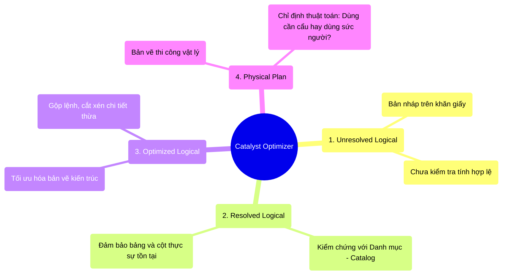

# 4.2 Catalyst Optimizer: Hành Trình Từ Ý Tưởng Đến Bản Vẽ Thi Công

## 1. Objectives
- [ ] Giải phẫu toàn bộ quy trình Catalyst Optimizer biến Code SQL/DataFrame thành Mã máy qua **Phép ẩn dụ Văn Phòng Kiến Trúc Sư**.
- [ ] Phân biệt rõ ràng 4 giai đoạn: Unresolved Logical Plan $\rightarrow$ Resolved Logical Plan $\rightarrow$ Optimized Logical Plan $\rightarrow$ Physical Plan.
- [ ] Giải thích tại sao Catalyst Optimizer là bộ não giúp Lập trình viên nghiệp dư cũng có thể viết code chạy ngang ngửa Chuyên gia.

## 2. Mindmap


## 3. Content

### 3.1. Phép Ẩn Dụ: Văn Phòng Kiến Trúc Sư
Trong Bài 4.1, chúng ta nói rằng DataFrame cho phép bạn ra lệnh Tôi muốn ra Sân bay, còn Spark sẽ tự tìm đường chạy. Bộ não đảm nhiệm việc tìm đường chạy tối ưu nhất đó tên là **Catalyst Optimizer**. 

Để hiểu cách Catalyst làm việc, hãy đóng vai một vị Khách hàng đi gặp Kiến trúc sư để xây nhà.

**Bước 1: Unresolved Logical Plan (Bản Nháp Trên Khăn Giấy)**
> Bạn ngồi ở quán Cafe và phác họa ra khăn giấy: *Tôi muốn xây một ngôi nhà có hồ bơi ở tầng 3, và một sân bay trực thăng ở tầng 2*. (Đây là Code SQL của bạn).
> 
> Lúc này, bản phác thảo chỉ là một ý tưởng **Unresolved (Chưa được thẩm định)**. Spark vừa nhận code của bạn, chưa biết tầng 3 hay hồ bơi có thực sự tồn tại trong danh mục dữ liệu hay không.

**Bước 2: Resolved Logical Plan (Thẩm Định Danh Mục - Catalog)**
> Kiến trúc sư mang tờ khăn giấy về văn phòng, mở Cuốn sổ Danh Mục (Catalog chứa thông tin Schema, Table). 
> Kỹ sư kiểm tra: *Ngôi nhà này đăng ký xây 2 tầng, nhưng khách lại đòi hồ bơi ở tầng 3 -> Báo lỗi ngay lập tức (AnalysisException)!*. 
> Nếu mọi thứ hợp lý, bản vẽ được chuyển sang trạng thái **Resolved (Đã thẩm định tính hợp lệ)**. Nhưng nó vẫn chỉ là vẽ cho có, chưa hề tối ưu.

**Bước 3: Optimized Logical Plan (Tối Ưu Hóa Bản Vẽ)**
> Đây là phép màu của Catalyst!
> Kiến trúc sư trưởng nhìn bản vẽ và nói: *Khách hàng yêu cầu kéo đường ống nước từ Tầng 1 lên Tầng 3, rồi lại kéo từ Tầng 3 xuống Tầng 1. Quá thiếu tối ưu! Hãy gộp 2 bước này lại thành 1 bước, đi đường ống đi ngang qua Tầng 2 để tiết kiệm chi phí.*
> 
> Spark sử dụng các Quy tắc Toán Học (Rule-based Optimization) để **tự động viết lại code của bạn** sao cho ngắn nhất, ít tốn tài nguyên nhất. (Kỹ thuật cụ thể sẽ học ở Bài 4.3).

**Bước 4: Physical Plan (Lập Bản Vẽ Thi Công Đa Phương Án)**
> Bản vẽ đã hoàn hảo, nhưng Đem thi công vật lý thế nào?
> Kiến trúc sư đẻ ra 3 phương án thi công:
> - Phương án A: Dùng 100 công nhân xách xô vữa (Chi phí: $5000, Thời gian: 10 ngày).
> - Phương án B: Thuê 1 chiếc cần cẩu khổng lồ (Chi phí: $10000, Thời gian: 1 ngày).
> - Phương án C: Dùng máy bơm vữa (Chi phí: $2000, Thời gian: 2 ngày).
> 
> Dựa vào số liệu thực tế (Cost-Based Model - CBM), Spark chọn **Phương án C** vì nó tối ưu nhất về cả Tiền (RAM/CPU) và Thời gian (Network). Phương án C chính thức trở thành **Physical Plan (Bản Vẽ Thi Công)** được gửi xuống cho công trường (Worker Nodes) để châm ngòi chạy!

### 3.2. Đọc Hiểu Hành Trình Bằng Lệnh `explain()`
Bạn có thể ra lệnh cho Spark công bố toàn bộ 4 bản vẽ này ra màn hình bằng cách dùng hàm `explain(True)`.

```python
# =========================================================================
# LẬP TRÌNH VIÊN NGHIỆP DƯ VIẾT CODE "NGỐC NGHẾCH"
# =========================================================================

# Khách hàng yêu cầu:
# 1. Đọc bảng Khách hàng (1 Tỷ người).
# 2. Lấy danh sách những người trên 18 tuổi.
# 3. Rồi lại lọc tiếp những người trên 30 tuổi (Thừa thãi).
df = spark.table("customers")
df_1 = df.filter(col("age") > 18)
df_2 = df_1.filter(col("age") > 30)

# Gọi lệnh xem Kế hoạch của Kiến Trúc Sư
df_2.explain(True)

# =========================================================================
# CÁCH CATALYST SỬA SAI CHO LẬP TRÌNH VIÊN (Nhìn từ dưới lên)
# =========================================================================

"""
== Parsed Logical Plan (Bản nháp trên khăn giấy) ==
Filter (age > 30)
+- Filter (age > 18)
   +- Relation[customers]

== Analyzed Logical Plan (Đã thẩm định Catalog) ==
Filter (age > 30)
+- Filter (age > 18)
   +- Relation[customers] (Schema: age: int, name: string)

== Optimized Logical Plan (Catalyst sửa sai) ==
# ĐỘT PHÁ Ở ĐÂY: Spark phát hiện ra > 30 thì chắc chắn > 18. 
# Nó TỰ ĐỘNG XÓA BỎ lệnh lọc > 18 của bạn đi, chỉ giữ lại > 30.
Filter (isnotnull(age) AND (age > 30))
+- Relation[customers]

== Physical Plan (Bản thi công vật lý) ==
# Chọn thuật toán đọc File tối ưu nhất dưới đáy hệ thống.
*(1) Filter (isnotnull(age) AND (age > 30))
+- *(1) FileScan parquet [age, name] 
"""
```

### 3.3. Quyền Năng Của Kẻ San Bằng (The Great Equalizer)
Một lập trình viên mới học việc viết một đoạn code gồm 10 bước lặp đi lặp lại rất tệ. Một lập trình viên Staff Engineer viết một đoạn code gộp 10 bước đó thành 1 bước tối ưu cực kỳ hoàn hảo.

Kết quả? **Cả 2 đoạn code chạy nhanh Y HỆT NHAU!**
Bởi vì dù bạn viết dở hay viết hay, tất cả đều phải chui qua Văn phòng Kiến trúc sư Catalyst Optimizer. Nó sẽ gọt dũa bản vẽ dở tệ của người mới học thành bản vẽ hoàn hảo của chuyên gia ở bước `Optimized Logical Plan`, trước khi đem đi thi công.

## 4. Key takeaways
- **4 Cột Mốc Quyền Lực:** Nháp (Unresolved) $\rightarrow$ Thẩm định (Analyzed) $\rightarrow$ Tối ưu (Optimized) $\rightarrow$ Thi công (Physical). Chân lý và hệ quả vật lý cuối cùng luôn nằm ở Physical Plan.
- **The Great Equalizer:** Bộ não Catalyst là lý do khiến DataFrame vượt trội hơn RDD. Nó xóa nhòa khoảng cách trình độ giữa lập trình viên nghiệp dư và chuyên gia bằng cách tự động viết lại (Rewrite) code thành phiên bản tối ưu nhất.
- **Tư duy Debug (Khám bệnh):** Đừng cố đoán xem code của bạn chạy chậm ở đâu. Hãy sử dụng lệnh `explain()` để nhìn vào Bản vẽ Physical Plan, bạn sẽ thấy chính xác Spark đang chọn phương án thi công nào (cần cẩu hay xách xô vữa).
