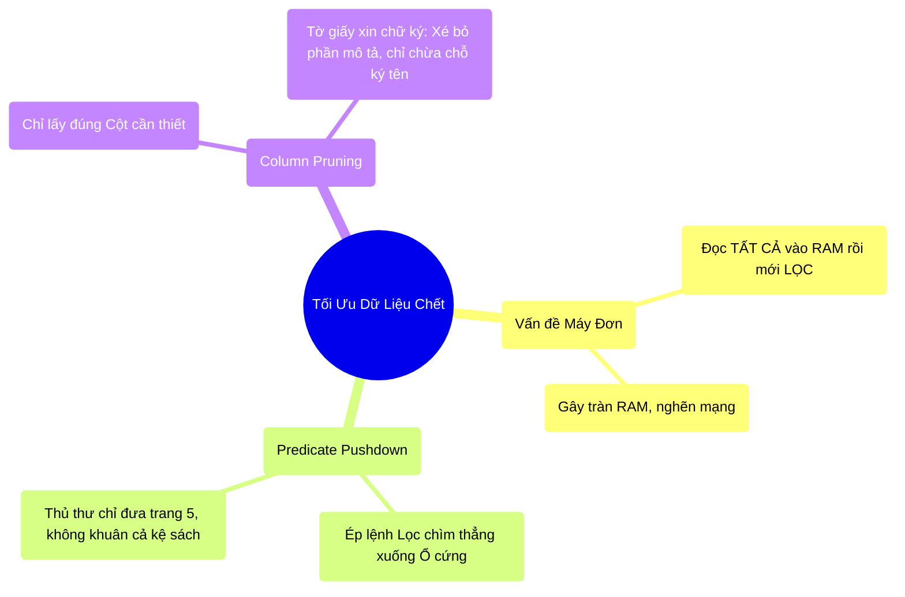

# 4.3 Phép Thuật Catalyst: Predicate Pushdown & Column Pruning

## 1. Objectives
- [ ] Giải phẫu cơ chế Predicate Pushdown thông qua **Phép ẩn dụ Thủ Thư Tìm Sách**.
- [ ] Giải phẫu cơ chế Column Pruning thông qua **Phép ẩn dụ Tờ Báo Cáo Chữ Ký**.
- [ ] So sánh bằng Code để thấy điểm nghẽn vật lý (RAM/Network) bị triệt tiêu như thế nào.

## 2. Mindmap


## 3. Content

### 3.1. Tư Duy Máy Đơn: Mua Cả Trái Đất Rồi Bỏ Đi
Hãy tưởng tượng bạn có một File lưu thông tin khách hàng toàn cầu nặng 10 Terabytes. Bạn chỉ muốn lấy danh sách khách hàng ở Việt Nam.

Với tư duy máy đơn (Pandas) hoặc tư duy RDD (Chương 3), máy chủ sẽ làm một hành động cực kỳ thiếu tối ưu: **Kéo toàn bộ 10 Terabytes từ Ổ cứng $\rightarrow$ Bơm qua Cáp mạng $\rightarrow$ Nhét vào thanh RAM nhỏ bé $\rightarrow$ Cuối cùng mới quét qua RAM để vứt đi những ai không ở Việt Nam.**

10 Terabytes chui qua cáp mạng sẽ đánh sập toàn bộ hệ thống. Băng thông (Bandwidth) và RAM bị quá tải.

### 3.2. Predicate Pushdown: Phép Ẩn Dụ Thủ Thư Tìm Sách

> **[Ví Dụ Trực Quan: Thư Viện Khổng Lồ]**
> Bạn là người dùng. Spark là Cô Thủ Thư. File 10TB là Kệ sách 10.000 cuốn.
> - **Cách làm cũ (Không có Pushdown):** Bạn yêu cầu Tôi muốn tìm trang số 5 của cuốn sách về Táo. Cô Thủ Thư ra lệnh cho 10 người khiêng **CẢ CÁI KỆ SÁCH** về đập ầm lên bàn của bạn (Tràn RAM). Bạn phải tự mò tay vào đó để rút tờ số 5 ra.
> - **Predicate Pushdown (Ép điều kiện xuống đáy):** Predicate nghĩa là Điều Kiện (ví dụ: `country = 'VN'`). Pushdown nghĩa là Đẩy xuống. Cô Thủ Thư (Catalyst Optimizer) lấy Điều Kiện của bạn, đi thẳng đến chỗ Kệ Sách (Ổ cứng), lục lọi tại đó, **CHỈ RÚT ĐÚNG TRANG SỐ 5** rồi nhẹ nhàng mang về đặt lên bàn bạn.

**Về mặt vật lý:** Lệnh `filter` được Catalyst tự động dịch chuyển từ tầng Tính toán (RAM) chìm sâu xuống tận tầng Lưu trữ (Ổ cứng HDFS / S3). Ổ cứng tự lọc và chỉ nhả lên dây mạng những dòng dữ liệu mỏng dính (`country = 'VN'`). Mạng lưới không hề bị quá tải.

### 3.3. Column Pruning: Phép Ẩn Dụ Tờ Báo Cáo Chữ Ký

Nếu Predicate Pushdown giúp bạn loại bỏ các DÒNG (Rows) thừa, thì **Column Pruning (Tỉa cột)** giúp bạn vứt bỏ các CỘT (Columns) vô dụng.

> **[Ví Dụ Trực Quan: Xin Chữ Ký Sếp]**
> Một bảng tính Khách Hàng có 200 cột (Tên, Tuổi, Ngày sinh, Địa chỉ, Thói quen, Màu tóc, v.v...). Nó giống như một tập hồ sơ dày 200 trang.
> Yêu cầu của bạn chỉ là: Đếm xem có bao nhiêu Tên Khách Hàng trong danh sách.
> - **Cách làm cũ:** Nhân viên bê tập hồ sơ dày cộp 200 trang chạy lạch bạch từ lầu 1 lên lầu 10 đưa cho Sếp.
> - **Column Pruning:** Catalyst thông minh phát hiện Sếp chỉ cần đếm Tên. Nó ra lệnh nhân viên xé vứt luôn 199 trang kia đi, chỉ cầm **đúng 1 trang mỏng dính** chứa danh sách Tên chạy lên lầu. 

**Về mặt vật lý:** Spark cắt đứt hoàn toàn việc đọc 199 cột kia từ Ổ cứng. Lượng dữ liệu đọc lên (I/O Disk) giảm 200 lần! Tốc độ tăng lên 200 lần!

### 3.4. Giải Phẫu Bằng Code Thực Tế

Đoạn Code sau chứng minh sức mạnh của Catalyst. Dù lập trình viên viết code rất tệ, Catalyst vẫn cứu giá.

```python
# =========================================================================
# LẬP TRÌNH VIÊN NGHIỆP DƯ VIẾT CODE CỒNG KỀNH
# =========================================================================

# Khách hàng có 100 cột. Nặng 1TB.
df = spark.read.parquet("hdfs://customers_100_cols.parquet")

# Viết tệ: Nhóm khách hàng theo Tuổi rồi đếm (GROUP BY & COUNT - Lệnh Wide Shuffle)
# Lúc này Spark sẽ nghĩ: "Chết rồi, phải Shuffle 1TB qua mạng ư?"
df_grouped = df.groupBy("age").count()

# Viết tệ: Xong xuôi hết rồi mới nhớ ra: "À mình chỉ cần khách hàng ở VN!"
# (Filter LỌC SAU KHI SHUFFLE)
df_final = df_grouped.filter(col("country") == "VN")

df_final.explain(True)

# =========================================================================
# CÁCH CATALYST SỬA CHỮA (PHYSICAL PLAN)
# =========================================================================
"""
== Physical Plan ==
# BƯỚC 1: PREDICATE PUSHDOWN
# Spark lấy lệnh Filter ("country" == "VN") ở dưới cùng, KÉO NGƯỢC NÓ LÊN TRÊN CÙNG.
# Nó nhét lệnh này thẳng vào hàm Đọc File Parquet. Bắt ổ cứng lọc ngay từ đầu!
*(1) Filter (isnotnull(country) AND (country = 'VN'))

# BƯỚC 2: COLUMN PRUNING
# Spark phân tích: Câu lệnh cuối cùng chỉ cần Tuổi (để đếm) và Quốc Gia (để lọc).
# Nó vứt đi 98 cột còn lại.
+- *(1) FileScan parquet [age, country] 

# BƯỚC 3: MỚI ĐEM ĐI SHUFFLE
# Bây giờ, 1TB ban đầu chỉ còn lại vài trăm Megabytes mỏng dính. 
# Việc Shuffle băng qua mạng trở nên nhẹ như lông hồng!
"""
```

## 4. Key takeaways
- **Triết lý dọn rác tại nguồn:** Cốt lõi của Big Data không phải là mua máy mạnh hơn để kéo rác về, mà là lọc bỏ rác ngay tại ổ cứng, tuyệt đối không để rác lọt vào cáp mạng và RAM.
- **Predicate Pushdown (Lọc Dòng):** Đẩy điều kiện (Filter) chìm sâu xuống sát phần cứng nhất có thể. (Hoạt động tốt nhất với định dạng Parquet/ORC).
- **Column Pruning (Tỉa Cột):** Vứt bỏ tất cả các cột không được gọi tên trong kết quả cuối cùng.
- **Sức mạnh của Catalyst:** Kể cả khi bạn gọi lệnh Filter ở cuối đoạn code, Catalyst Optimizer đủ thông minh để đảo ngược trật tự, tự động kéo lệnh Filter đó lội ngược dòng lên chạy đầu tiên. Bạn không cần phải đau đầu sắp xếp thứ tự dòng code như thời dùng RDD nữa!
