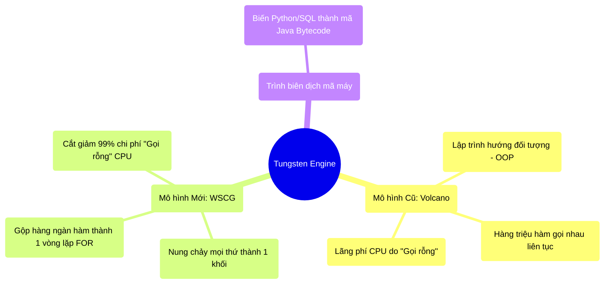

# 4.4 Tungsten Engine & Khối Nguyên Khối (Whole-Stage Code Generation)

## 1. Objectives
- [ ] So sánh mô hình Volcano truyền thống và Tungsten qua **Phép ẩn dụ Dây Chuyền Trăm Người Nhặt Nước**.
- [ ] Giải phẫu cơ chế Whole-Stage Code Generation (WSCG - Sinh mã nguyên khối).
- [ ] Chứng minh cách Spark biến hàng ngàn hàm Python lề mề thành một vòng lặp FOR khổng lồ bằng ngôn ngữ bậc thấp.

## 2. Mindmap


## 3. Content

### 3.1. Sự Lãng Phí Của Mô Hình Cũ (Volcano Model)
Trong hàng thập kỷ, các hệ cơ sở dữ liệu và Spark thế hệ cũ sử dụng một kiến trúc gọi là **Volcano Iterator Model**. 

> **[Ví Dụ Trực Quan: Dây Chuyền Trăm Người Nhặt Nước]**
> Hãy tưởng tượng bạn có 3 bước xử lý: Lọc khách Việt Nam (Bước 1) $\rightarrow$ Ép tên in hoa (Bước 2) $\rightarrow$ Đếm (Bước 3).
> 
> Trong mô hình Volcano, 3 bước này là 3 con người đứng nối tiếp nhau thành dây chuyền.
> Có 1 Tỷ khách hàng đi qua.
> - Người đếm hỏi Người in hoa: Ê, có khách nào mới không đưa đây?. (Tốn 1 giây gọi hàm).
> - Người in hoa quay lại hỏi Người lọc: Ê, có khách nào mới không?. (Tốn 1 giây gọi hàm).
> - Người lọc bốc 1 khách hàng lên, kiểm tra, đưa cho Người in hoa. Người in hoa làm xong đưa cho Người đếm.
> 
> Kết quả: Để xử lý **MỘT** người, hệ thống mất công gọi nhau 2 lần. Với 1 Tỷ người, CPU của máy tính bị ép phải thực hiện **2 TỶ LẦN GỌI HÀM (Virtual Function Calls)**. Quá trình gọi nhau này tốn nhiều năng lượng và thời gian hơn cả quá trình ép in hoa cái chữ đó! Đây là một sự lãng phí thảm họa về mặt chu kỳ CPU.

### 3.2. Cỗ Máy Tungsten & Phép Màu Whole-Stage Code Generation
Vào năm 2015 (Spark 1.5), đội ngũ Databricks tạo ra dự án **Tungsten** (được đặt theo tên kim loại Volfram - cứng nhất và chịu nhiệt tốt nhất).
Mục tiêu của Tungsten: **Chế tạo CPU chạy nhanh như kim loại.**

Tungsten phát minh ra **Whole-Stage Code Generation (WSCG - Sinh mã toàn giai đoạn / Sinh mã nguyên khối)**.

> **[Tiếp Tục Ẩn Dụ: Hợp Nhất 3 Người Thành 1 Siêu Nhân]**
> Thay vì dùng 3 người đứng gọi nhau 2 Tỷ lần, Tungsten đuổi việc 3 người đó. 
> Nó đúc ra 1 con Robot Siêu Nhân duy nhất. Con Robot này được lập trình để tự mình cầm cái bánh lên: Lọc $\rightarrow$ In Hoa $\rightarrow$ Đếm trong đúng một cú gạt tay. KHÔNG CẦN AI GỌI AI NỮA. Không có độ trễ giao tiếp!

**Về mặt vật lý (Khoa học máy tính):**
WSCG lấy toàn bộ Cây Kế Hoạch (Physical Plan) mà Catalyst vừa vẽ ra. Thay vì duyệt qua từng bước chậm chạp như mô hình hướng đối tượng, nó **Nung chảy (Fuse)** tất cả các bước Narrow Transformation (nằm trong cùng 1 Stage) lại với nhau. Nó sinh ra một ĐOẠN CODE BẰNG TAY (Hand-written code) khổng lồ chứa đúng 1 Vòng lặp `FOR` duy nhất!

### 3.3. Giải Phẫu Chuyên Sâu Qua Code

```python
# =========================================================================
# BÊN TRONG CỖ MÁY TUNGSTEN (Đun chảy hàm Python)
# =========================================================================

# Đoạn Code người dùng viết (SQL/DataFrame):
df_result = df.filter("age > 18").selectExpr("age * 2 as doubled_age")

"""
Nếu chạy kiểu CŨ (Volcano):
class FilterNode:
    def get_next():
        return next_row if next_row.age > 18 else null

class ProjectNode:
    def get_next():
        row = FilterNode.get_next()   <--- (GỌI HÀM CỰC CHẬM, GỌI 1 TỶ LẦN)
        return row.age * 2
"""

# NHƯNG ĐÂY LÀ ĐOẠN CODE MÁY MÀ TUNGSTEN THỰC SỰ SINH RA (WSCG):
# (Spark ngầm dịch nó thành mã Java Bytecode bậc thấp)
"""
// Mã giả minh họa vòng lặp FOR nguyên khối
int count = 0;
for (Row row : All_1_Billion_Rows) {
    // Ép mọi thứ vào 1 cục duy nhất! Không có bất kỳ lệnh GỌI HÀM nào ở đây!
    if (row.age > 18) {
        int doubled = row.age * 2;
        output_buffer.write(doubled);
    }
}
"""
```

Kết quả: Bằng cách loại bỏ 2 Tỷ lần gọi hàm vô ích, CPU của bạn dồn 100% điện năng vào việc tính toán thực sự. Tốc độ thực thi tăng từ 10 đến 100 lần! Spark chạy nhanh ngang ngửa với một đoạn mã C++ thuần túy do con người tự tay viết.

## 4. Key takeaways
- **Sự sụp đổ của OOP trong Big Data:** Lập trình Hướng đối tượng (Class, Object, gọi Hàm kế thừa) cực kỳ dễ đọc cho con người, nhưng lại là thảm họa làm trì trệ CPU khi phải duyệt qua hàng tỷ dòng dữ liệu.
- **Tungsten WSCG:** Là lò nung luyện kim. Nó lấy hàng chục hàm nhỏ lẻ của bạn, nung chảy chúng (Fuse) và đúc thành một vòng lặp nguyên khối (Một Stage duy nhất).
- **Dấu hiệu nhận biết:** Khi bạn gọi lệnh `explain()`, nếu bạn thấy dấu sao `*` trước tên bước (Ví dụ: `*(1) Filter`, `*(1) Project`), dấu `*` đó chính là minh chứng cho việc đoạn code đó đã được nung chảy và nội suy mã máy (WSCG) thành công bởi Tungsten.
