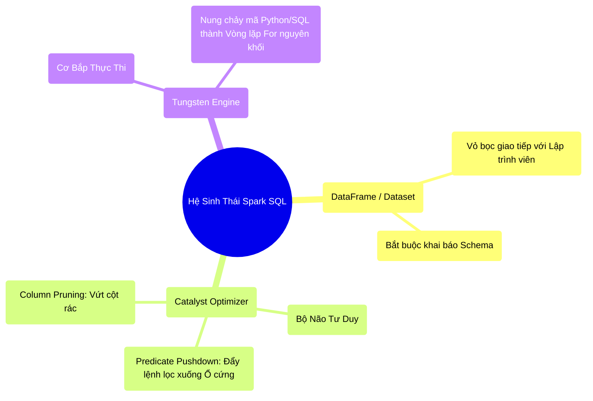

# 4.5 Tổng Kết: Sự Cáo Chung Của Nghề Xếp Code Dạo

## 1. Objectives
- [ ] Tổng hợp bức tranh toàn cảnh về cuộc cách mạng Spark SQL (Catalyst + Tungsten).
- [ ] Khẳng định sự lỗi thời của việc Căn chỉnh thứ tự API (API Order Tuning) bằng tay.
- [ ] Chốt lại nền tảng vững chắc kết thúc Giai đoạn 1 (Phase 1).

## 2. Mindmap

## 3. Content

### 3.1. Sự Kết Hợp Của Não Bộ và Cơ Bắp
Trong Giai đoạn 1 của lộ trình học tập này, chúng ta đã đi từ những tấm Silic (Hardware Wall) cho đến những cỗ máy khổng lồ (Spark Engine). 
Nếu Chương 3 (Spark Core) cho bạn thấy bức tranh phân mảnh vật lý của dữ liệu (Partitions, Tasks, Shuffle), thì Chương 4 này vẽ ra bức tranh của **Sự Tiến Hóa Trí Tuệ Nhân Tạo** bên trong phần mềm.

Động cơ Spark SQL không chỉ là ngôn ngữ truy vấn. Nó là một cỗ máy gồm 2 thành phần bọc thép:
1. **Catalyst Optimizer (BỘ NÃO):** Đóng vai trò Kiến trúc sư. Nhiệm vụ của nó là nhận bản phác thảo lộn xộn của bạn, xóa bỏ những bước thừa thãi, dời các lệnh Lọc xuống sát ổ cứng nhất (Pushdown) để ép khối lượng dữ liệu qua mạng đạt mức tối thiểu.
2. **Tungsten (CƠ BẮP):** Đóng vai trò Cỗ máy đúc thép. Nhận bản vẽ hoàn chỉnh từ Catalyst, nung chảy hàng tỷ lời gọi hàm lắt nhắt của mô hình OOP cũ kỹ, ép chúng thành một vòng lặp FOR mã máy chạy ở tốc độ ánh sáng (WSCG).

### 3.2. Cáo Chung Nghề Xếp Code Dạo
Trong kỷ nguyên của RDD và Hadoop, có một bộ môn nghệ thuật hay được các kỹ sư mang ra tự hào: **API Order Tuning (Tối ưu hóa thứ tự gọi API).**
Nghĩa là: Lập trình viên phải cực kỳ tinh ý, phải tự nhủ trong đầu Tôi phải gọi lệnh `filter` TRƯỚC lệnh `map`, và TRƯỚC lệnh `join`, nếu lỡ tay đổi chỗ hai dòng code này, hệ thống sẽ sập. Lập trình viên giỏi là người xếp thứ tự các dòng code xuất sắc.

**Hôm nay, bộ môn nghệ thuật đó ĐÃ CHẾT!**

Nhờ có Catalyst Optimizer, thứ tự bạn viết các dòng Code bằng DataFrame/SQL **KHÔNG CÒN QUAN TRỌNG NỮA**. 
Bạn có thể viết lệnh `filter` ở cuối cùng của file code, Catalyst vẫn tự động nhổ bật nó lên và cấy nó vào dòng đầu tiên (Predicate Pushdown). Dù bạn viết dở đến đâu, Catalyst cũng sẽ kéo code của bạn lên ngang tầm với mức tối ưu của một kỹ sư Staff Engineer.

> **Hệ Quả Sống Còn:**
> Kỹ năng cốt lõi của Data Engineer hiện đại không còn là Xếp dòng code sao cho đẹp nữa. Khả năng sống sót của bạn trong môi trường Enterprise giờ đây phụ thuộc vào 2 thứ:
> 1. **Data Modeling (Thiết kế Schema):** Cung cấp cho Catalyst một cấu trúc dữ liệu minh bạch nhất.
> 2. **Physical Configuration (Cấu hình Vật lý):** Quản lý được lượng Bộ nhớ, Băng thông, số lượng Cores và giới hạn Shuffle (Các chủ đề sẽ được học ở Phase 2 & 3).

### 3.3. Lời Kết Phase 1 (Nền Tảng Đã Vững)
Chúc mừng bạn đã vượt qua nhóm kiến thức Nền Tảng (Phase 1).
Đến giờ phút này, bạn đã không còn nhìn Spark như một Tool gõ lệnh nữa. Khi gõ `df.read()`, bạn thấy sự bùng nổ I/O. Khi gõ `df.groupBy()`, bạn thấy sự xáo trộn băng thông mạng LAN. Khi gõ `df.show()`, bạn thấy Cần cẩu Tungsten đúc thép sinh mã.

Từ nền tảng vật lý vững chãi này, chúng ta sẽ bước sang **Phase 2 (Nhóm Cốt Lõi Cơ Chế)** - Nơi chúng ta sẽ cầm cờ lê và mỏ lết mổ bụng trực tiếp cấu trúc RAM (Memory Management) và hệ thống Mạng (Shuffle Network) của Spark. Chuẩn bị tinh thần đối diện với những quái vật OOM khét tiếng!
