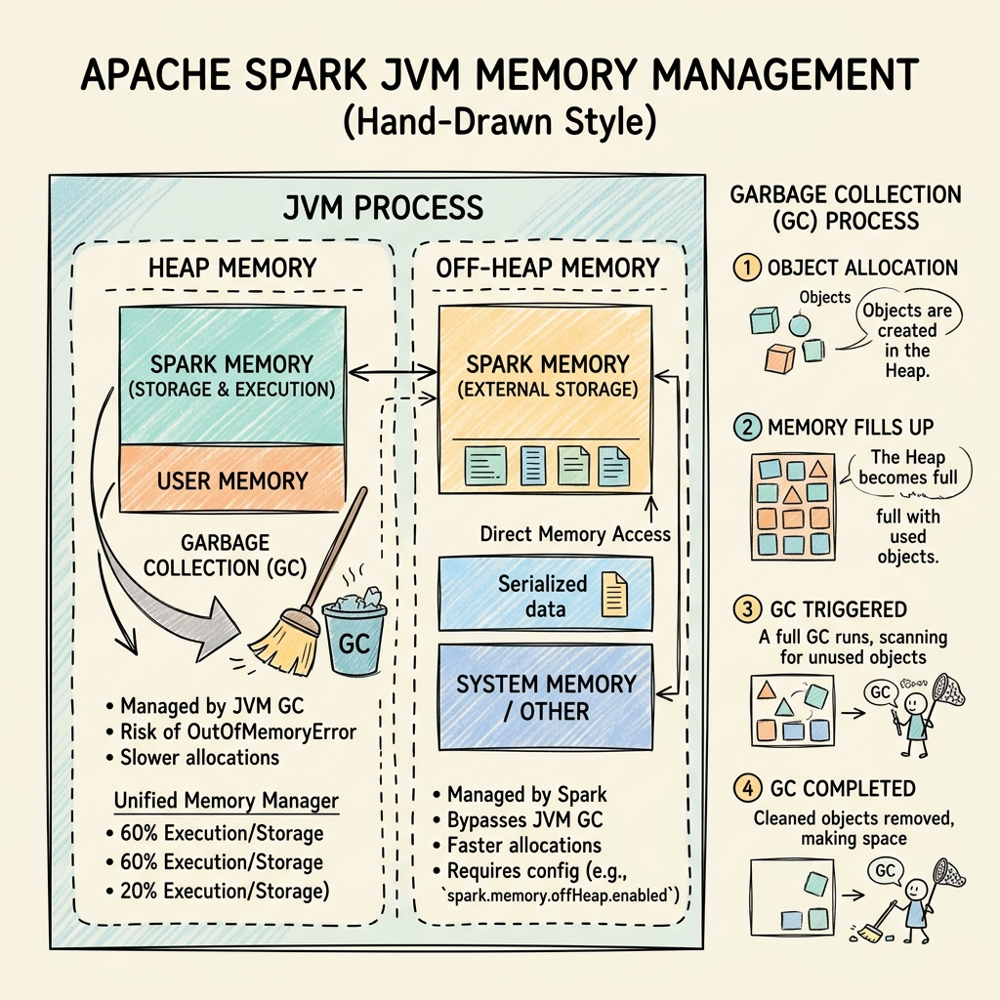
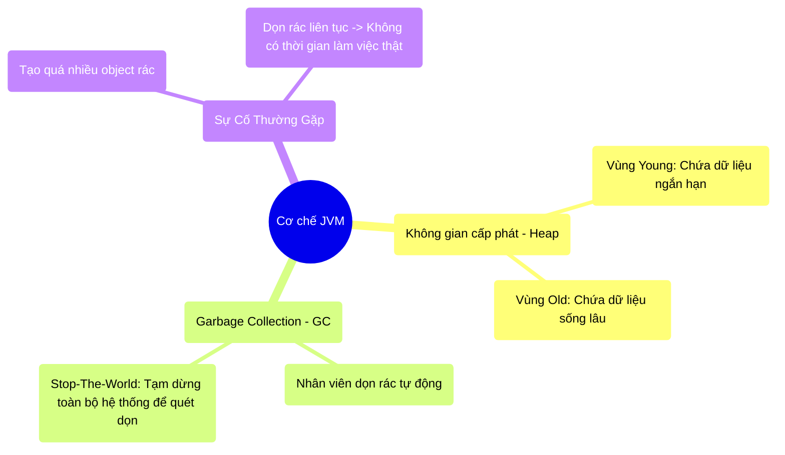

# 5.1 Kiến trúc JVM & Nỗi Đau Garbage Collection




## 1. Objectives
- [ ] Giải phẫu cơ chế quản lý bộ nhớ của Java Virtual Machine (JVM) qua **Phép ẩn dụ Nhà Hàng & Nhân Viên Dọn Dẹp**.
- [ ] Phân tích hiện tượng Stop-The-World và tại sao nó là kẻ thù của Big Data.
- [ ] Nhận diện lỗi GC Overhead Limit Exceeded - Cái chết do dọn rác.

## 2. Mindmap


## 3. Content

### 3.1. Phép Ẩn Dụ: Nhà Hàng & Nhân Viên Dọn Dẹp
Apache Spark được viết bằng ngôn ngữ Scala, có nghĩa là nó chạy trên nền tảng **Java Virtual Machine (JVM)**. JVM nổi tiếng với cơ chế quản lý bộ nhớ tự động tên là **Garbage Collection (Thu gom rác - GC)**. Lập trình viên không cần tự tay ra lệnh xóa dữ liệu khỏi RAM, JVM sẽ tự làm việc đó.

> **[Ví Dụ Trực Quan: Nhà Hàng Tự Động]**
> Hãy tưởng tượng RAM máy tính của bạn là một **Cái bàn ăn trong nhà hàng (Vùng Heap)**. CPU là **Đầu Bếp**. Dữ liệu truyền vào là các **Món ăn**.
> 
> Trong ngôn ngữ C/C++ (Không có GC), Đầu bếp nấu món ăn đặt lên bàn. Khách ăn xong, Đầu bếp phải TỰ TAY dọn đĩa đi. Rất mệt mỏi và dễ quên (Lỗi rò rỉ bộ nhớ - Memory Leak).
> 
> Trong JVM (Có GC), Đầu bếp chỉ việc nấu và đặt lên bàn. JVM thuê một **Nhân viên dọn dẹp (GC)**. Khi cái bàn (RAM) sắp đầy các đĩa thức ăn thừa, Nhân viên dọn dẹp sẽ xuất hiện để dọn.
> NHƯNG CÓ MỘT ĐIỀU LUẬT KHẮC NGHIỆT: Để dọn dẹp an toàn, Nhân viên này sẽ HÉT LÊN: **Tất cả mọi người đứng im! (Sự kiện Stop-The-World - STW)**. 
> Toàn bộ Đầu bếp phải ngừng nấu, Khách phải ngừng ăn, để Nhân viên quét dọn xong mới được cử động tiếp.

### 3.2. Cấu Trúc Vùng Nhớ Heap (Young vs Old)
Cái bàn ăn (Heap Memory) được chia làm 2 khu vực:
1. **Young Generation (Khu vực Ăn Nhanh):** Nơi để các món ăn vừa mang ra. Spark tạo ra hàng tỷ đối tượng (Objects) ngắn hạn ở đây (Ví dụ: Các dòng dữ liệu đang xử lý dở dang). Nhân viên quét khu vực này rất nhanh (Minor GC).
2. **Old Generation (Khu vực Khách VIP/Ăn Lâu):** Nếu một món ăn tồn tại qua nhiều lần dọn dẹp mà vẫn đang được dùng (Ví dụ: Dữ liệu được bạn Cache lại), nó được dời sang khu VIP. Lâu lâu, Nhân viên mới dọn khu này (Major GC). Lần dọn này tốn cực kỳ nhiều thời gian và làm nhà hàng đóng băng (Stop-The-World) rất lâu.

### 3.3. Ác Mộng Của Big Data: Chết Vì Dọn Rác (GC Overhead)
Tại sao mô hình dọn rác tự động này lại trở thành thảm họa trong Big Data?

Bởi vì Spark xử lý hàng Terabytes dữ liệu. Khi bạn dùng lệnh RDD hoặc các hàm Python viết tay (UDF), Spark tạo ra **hàng Tỷ cái đĩa thức ăn (Object)** nhỏ li ti mỗi giây. Cái bàn (RAM) đầy lên với tốc độ chóng mặt.

```python
# =========================================================================
# LUỒNG VẬT LÝ GÂY RA LỖI GC OVERHEAD
# =========================================================================

# Khai báo cấu trúc cho 1 tỷ dòng dữ liệu
# Spark (thế hệ cũ) phải tạo ra 1 TỶ đối tượng Java trong RAM
df = spark.read.json("hdfs://1_billion_records.json")

# HẬU QUẢ VẬT LÝ DIỄN RA TRONG JVM:
"""
Phút thứ 1: Bàn (RAM) đầy. Nhân viên GC hét "Stop The World!". Tốn 5 giây dọn dẹp.
Phút thứ 1:06: Đầu bếp vừa chạy được 1 giây. Bàn lại đầy! GC lại hét "Stop The World!". Tốn 5 giây.
Phút thứ 1:12: Lại đầy! GC dọn...

-> KẾT QUẢ: Trong 1 phút, Máy chủ của bạn dành ra 58 giây để DỌN RÁC, 
   và chỉ có 2 giây để THỰC SỰ CHẠY CODE!
"""
```

Khi tình trạng Dọn rác nhiều hơn Làm việc thật này kéo dài, JVM sẽ nhận ra sự vô vọng. Nó giương cờ trắng và ném ra một ngoại lệ chết chóc:
`java.lang.OutOfMemoryError: GC overhead limit exceeded`
(Lỗi hết bộ nhớ: Đạt tới giới hạn kiệt sức vì dọn rác). Hệ thống của bạn chính thức sập nguồn.

## 4. Key takeaways
- **Garbage Collection (GC):** Là một con dao hai lưỡi. Nó giúp lập trình viên nhàn hạ, nhưng lại là tác nhân gây ra sự chậm trễ khó lường (Stop-The-World) trong các hệ thống tính toán lớn.
- **Stop-The-World (Đóng băng hệ thống):** Khi Spark bỗng nhiên chạy rất chậm hoặc bị treo (hang) ở một số Task, 90% nguyên nhân là do máy Worker đó đang bị JVM đóng băng để dọn rác.
- **Sự kiệt quệ Object:** Việc tạo ra quá nhiều đối tượng (Object) nhỏ lẻ trong RAM chính là nguyên nhân dẫn đến GC Overhead. (Đó là lý do Tungsten Engine ở Chương 4 ra đời để ép các đối tượng này thành một khối nhị phân đặc ruột, lách luật của JVM).
