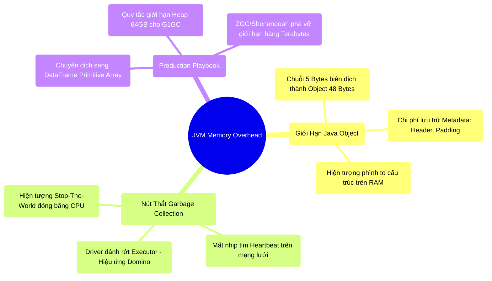

# 5.1 Kiến Trúc Bộ Nhớ JVM: Nút Thắt Java Object Overhead Và Garbage Collection

## 1. Objectives
- [ ] Phân tích bản chất vật lý của sự lãng phí dung lượng bộ nhớ (Java Object Overhead) sinh ra từ siêu dữ liệu (Header, Padding).
- [ ] Mổ xẻ cơ chế gây rớt Node dây chuyền (The Domino Effect) phát sinh do hiện tượng Stop-The-World của bộ thu gom rác (Garbage Collector).
- [ ] Hiệu chỉnh tư duy định cỡ bộ nhớ (Memory Sizing): Giải mã ảo tưởng RAM 16GB đủ nhét 10GB Data và đánh giá lại quy tắc 64GB dưới góc nhìn của các thuật toán GC hiện đại (ZGC, Shenandoah).

## 2. Mindmap


## 3. Content

Mặc dù Spark SQL đã tối ưu hóa I/O phần cứng qua Catalyst và Tungsten, mọi khối dữ liệu rốt cuộc vẫn phải đổ bộ vào **thanh RAM (Memory) của các Executor**. Tại không gian này, Spark phải đối mặt với một nền tảng vận hành nằm ngoài tầm kiểm soát của nó: **Java Virtual Machine (JVM)**. JVM vốn được thiết kế cho các ứng dụng dịch vụ (Microservices), không phải cho điện toán Big Data. Hệ quả là nó mang theo hai giới hạn vật lý cốt lõi gây ra 99% các sự cố tràn bộ nhớ (Out-Of-Memory - OOM).

### 3.1. Điểm Nghẽn Kiến Trúc: Java Object Overhead
Triết lý hướng đối tượng của Java (và Scala) quy định mọi thực thể đều phải là một Object. Để quản lý vòng đời và đa luồng, JVM tự động gài cắm siêu dữ liệu (Metadata) vào từng Object: *Object Header (16 bytes), Padding căn lề (8 bytes), và Pointer reference (8 bytes).*

**Toán học của sự lãng phí bộ nhớ:**
Lấy ví dụ một chuỗi ký tự `Hello` (5 ký tự).
- **Trên kiến trúc đĩa từ (Parquet/CSV):** Chuỗi chiếm dụng chính xác **5 Bytes** không gian.
- **Trên bộ nhớ Heap (JVM Object):** Chuỗi được bọc thành lớp `java.lang.String`. Sau khi gánh thêm Header và Padding, kích thước tối thiểu của nó phình to lên **48 Bytes** (Kích thước tăng xấp xỉ gấp 10 lần).

**[Code Snippet: Ảo Tưởng Về Memory Sizing]**
```python
# [ANTI-PATTERN] Kỹ sư định cỡ RAM dựa trên kích thước đĩa cứng.
# Một bảng Parquet có dung lượng lưu trữ nén trên đĩa S3 là 10GB.
# Executor được cấp 16GB RAM với giả định "RAM 16GB dư sức chứa 10GB data".
df = spark.read.parquet("s3a://data-lake/data_10GB")
df.cache() # BỤM! Hệ thống báo lỗi OOM (Out Of Memory).

# Giải thích vật lý: 10GB Parquet là dữ liệu đã nén cực chặt. 
# Khi bung nén lên RAM và bị JVM bọc thêm vỏ Object Overhead, 
# khối lượng dữ liệu phình to lên mức 50GB - 100GB.
```

### 3.2. Lưỡi Hái GC: Sự Cố Ngắt Kết Nối Mạng Ảo
Khi hàng tỷ Object trung gian lấp đầy không gian Heap, bộ thu gom rác **Garbage Collector (GC)** sẽ được kích hoạt. Thuật toán phân định rác của JVM yêu cầu phải tạm dừng các luồng ứng dụng để tránh mất tính nhất quán bộ nhớ. Đây gọi là hiện tượng **Stop-The-World (STW)**.

**Phản Ứng Dây Chuyền Sập Cụm (The Domino Effect):**
1. **Stop-The-World:** JVM đóng băng hoàn toàn các CPU Core của Executor để rà soát rác. Quá trình này có thể kéo dài từ vài giây đến hàng chục phút nếu dung lượng Heap quá lớn.
2. **Cáp mạng câm điếc:** Trong thời gian đóng băng, luồng Network của Executor bị ngắt tạm thời. Nó không thể phản hồi nhịp tim (Heartbeat) về máy chủ Driver.
3. **Sự phản ánh sai lệch sập nguồn (Network Fallacy):** Driver không nhận được Heartbeat sẽ ngụy biện rằng: *Node #4 đã bị ngắt điện hoặc sập mạng vật lý.*
4. **Án phạt Retry:** Driver gạch tên Executor #4 khỏi cụm, xóa bỏ hoàn toàn kết quả trung gian nó đang tính toán, và chỉ định một máy khác tính lại (Re-compute) từ đầu. Toàn bộ cụm Datacenter chìm vào vòng lặp Retry hỗn loạn, phá vỡ SLA (Service-Level Agreement) chỉ vì một đợt STW kéo dài.

### 3.3. Runbook Khắc Chế JVM Ở Cấp Độ Hệ Thống

**Nguyên Tắc 1: Triệt Tiêu Cấu Trúc Object Phức Tạp**
Thay vì sử dụng các cấu trúc lồng nhau khổng lồ của Python/Scala (`List`, `Map`, `Dict`), hãy nghiêm ngặt sử dụng DataFrame API. Catalyst có khả năng tự động ánh xạ dữ liệu thành các kiểu nguyên thủy (Primitive Array: `int[]`, `byte[]`) giấu dưới lớp vỏ DataFrame, triệt tiêu việc tạo ra hàng tỷ Object phân mảnh.

**Nguyên Tắc 2: Giới Hạn Bộ Nhớ Và Kỷ Nguyên Của ZGC/Shenandoah**
Lịch sử Spark ghi nhận một nguyên tắc bất di bất dịch: **Đừng bao giờ cấu hình `spark.executor.memory` vượt quá 64GB.**
- **Với G1GC hoặc Parallel GC (Thuật toán cũ):** Kích thước Heap càng lớn, thời gian STW càng dài. Một Heap 100GB chứa đầy Object có thể khiến G1GC đóng băng hệ thống 15 phút. Thay vì dùng 1 Executor 100GB RAM, thiết kế tối ưu là chia thành 4 Executors, mỗi cái 25GB RAM.
- **Kỷ nguyên hiện đại (Thuật toán mới):** Tuy nhiên, định luật 64GB đang dần bị phá vỡ. Với sự ra đời của các hệ thống GC hiện đại như **ZGC (Z Garbage Collector)** và **Shenandoah** (Từ Java 11/15 trở lên), quá trình dọn rác được thực thi đồng thời (Concurrent). Thời gian STW luôn được đảm bảo ở mức độ dưới 1 mili-giây (Sub-millisecond) bất chấp kích thước Heap lên tới hàng Terabytes. Nếu hạ tầng của bạn đang vận hành ZGC, bạn hoàn toàn có thể cấp phát Executor 128GB - 256GB RAM mà không còn ám ảnh về hiện tượng mất Heartbeat.

## 4. Key takeaways
- **Overhead Toán Học**: Tuyệt đối không đánh giá dung lượng bộ nhớ (Memory Sizing) dựa trên kích thước file vật lý trên Disk. Object Overhead luôn thổi phồng dữ liệu lên nhiều lần.
- **Sự phản ánh sai lệch Mạng do GC**: Kẻ thù làm rớt Executor thường không phải là đứt cáp mạng, mà là do đợt Stop-The-World của GC kéo dài quá thời gian Timeout của Heartbeat.
- **Bước Nhảy Kiến Trúc**: Dù ZGC đã giải quyết rủi ro STW, nhưng nó không giải quyết được sự lãng phí không gian lưu trữ (Overhead). Đó là lý do dự án Tungsten quyết định tiến hành một cuộc đại phẫu: Chuyển dịch toàn bộ cơ chế lưu trữ ra khỏi JVM (Off-Heap). Chi tiết sẽ được làm rõ ở Bài 5.2.
