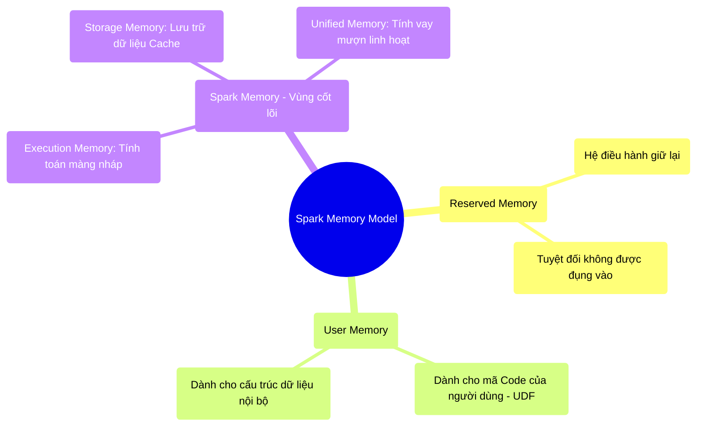

# 5.2 Mô Hình Bộ Nhớ Spark: Execution vs Storage

## 1. Objectives
- [ ] Phân tích cấu trúc phân bổ bộ nhớ của Spark thông qua **Phép ẩn dụ Bàn Học Của Sinh Viên**.
- [ ] Giải thích cuộc chiến tranh giành không gian giữa Execution Memory (Bộ nhớ thực thi) và Storage Memory (Bộ nhớ lưu trữ).
- [ ] Nhận diện hiện tượng Eviction (Đẩy dữ liệu) thông qua Code vật lý.

## 2. Mindmap


## 3. Content

### 3.1. Phân Lô Bán Nền Trên Thanh RAM
Giả sử bạn thuê một máy tính có thanh RAM 10GB cho Spark (Worker Node). Spark không dùng toàn bộ 10GB này để tính toán. Nó chia mảnh đất này ra làm các khu vực rất rạch ròi.

1. **Reserved Memory (Đất của Nhà Nước - Khoảng 300MB):** Spark dành khu vực này cho hệ thống lõi hoạt động. Bạn không được phép đụng vào. Nếu thanh RAM của bạn nhỏ hơn 1.5 lần mức này, Spark từ chối khởi động.
2. **User Memory (Đất Xây Nhà - Khoảng 25%):** Nơi chứa các đoạn code Python tự viết (UDF) của bạn và các cấu trúc dữ liệu phụ trợ mà bạn sinh ra.
3. **Spark Memory (Đất Sản Xuất - Khoảng 75%):** Đây là chiến trường chính, nơi mọi sức mạnh của Big Data được bộc lộ. Nó lại được chia làm hai nửa: **Execution (Thực thi)** và **Storage (Lưu trữ)**.

### 3.2. Execution vs Storage: Phép Ẩn Dụ Bàn Học Của Sinh Viên
Để hiểu vùng Spark Memory, hãy tưởng tượng nó là một **Chiếc Bàn Học**.

> **[Ví Dụ Trực Quan: Chiếc Bàn Học]**
> Chiếc bàn học (Spark Memory) được kẻ một đường ở giữa, chia làm 2 nửa:
> 
> **Nửa trái (Storage Memory - Khu Chứa Sách):** Bạn dùng để xếp các cuốn Sách giáo khoa (Dữ liệu bạn muốn Cache/Lưu trữ lại để đọc nhiều lần).
> **Nửa phải (Execution Memory - Giấy Nháp):** Bạn dùng để trải giấy nháp ra làm toán (Nơi xử lý các lệnh Shuffle, Join, Sort). Làm xong toán thì vứt giấy nháp đi.

**Trước Spark 1.6 (Mô hình cứng nhắc):** Đường kẻ ở giữa bàn được đóng đinh cố định (Mặc định mỗi bên 50%). Nếu bên Giấy nháp của bạn đã kín chỗ, bạn không thể làm phép toán lớn hơn được nữa, dù bên Khu chứa sách đang trống trơn. Hệ thống lập tức báo lỗi OOM (Hết bộ nhớ).

**Từ Spark 1.6 trở đi (Unified Memory - Đất Vay Mượn):** Đường kẻ ở giữa bàn có thể di chuyển được!
Nếu bạn đang làm một bài toán cực khó cần nhiều không gian nháp (Execution), bạn được quyền **lấn ranh**, đẩy đống Sách giáo khoa (Storage) rơi xuống đất để lấy chỗ trải giấy nháp. 

### 3.3. Hiện Tượng Eviction (Rớt Sách Xuống Đất)
Hành động đẩy sách rơi xuống đất để lấy chỗ nháp gọi là **Eviction (Đẩy dữ liệu / Trục xuất)**.

Quy luật lấn ranh của Spark rất nghiêm ngặt và thiên vị: **Execution luôn có quyền lực cốt lõi**.
- Nếu Storage (Sách) lấn sang đất của Execution (Nháp): Khi Execution cần chỗ, nó thẳng tay đá văng Sách của Storage xuống Đất (Ổ cứng vật lý) để lấy lại ranh giới.
- Nếu Execution (Nháp) lấn sang đất của Storage (Sách): Storage **KHÔNG CÓ QUYỀN** đẩy Giấy nháp đi. Sách bắt buộc phải rớt xuống ổ cứng hoặc chờ đợi. Bởi vì Giấy nháp đang chứa phép tính dở dang, nếu vứt đi thì hệ thống sập.

```python
# =========================================================================
# LUỒNG VẬT LÝ KHI EVICTION XẢY RA
# =========================================================================

# BƯỚC 1: Lệnh Cache (Dùng Storage Memory)
# Đọc file 4GB. Bạn gọi hàm .cache() để xếp 4GB sách lên Bàn (Vùng Storage).
# Thanh RAM Spark Memory của bạn chỉ có 6GB. (Storage chiếm 4GB, dư 2GB).
df = spark.read.csv("hdfs://data.csv").cache()
df.count() # Kích hoạt việc đưa 4GB lên RAM.

# BƯỚC 2: Lệnh Shuffle/Sort (Dùng Execution Memory)
# Lệnh sắp xếp dữ liệu (orderBy) đòi hỏi không gian Giấy nháp (Execution) khổng lồ.
# Giả sử Spark cần 5GB Giấy nháp để thực hiện thuật toán Sort.
# NHƯNG VÙNG TRỐNG CHỈ CÒN 2GB!
df_sorted = df.orderBy("age")

# HẬU QUẢ VẬT LÝ (Spark tự động hành động):
"""
1. Vùng Execution (Cần 5GB) bắt đầu mở rộng, lấn sang đất của Storage.
2. Nó gặp 4GB dữ liệu đã Cache của df.
3. EVICTION: Nó thẳng tay xóa (hoặc đẩy xuống Ổ cứng) 3GB dữ liệu Cache của bạn.
4. Lệnh Sort chạy thành công với 5GB RAM.
5. Sau đó, nếu bạn gọi df.count() một lần nữa, Spark sẽ LẠI PHẢI đọc từ Ổ cứng lên, 
   vì Dữ liệu Cache của bạn đã bị đá văng khỏi RAM! Lệnh cache() của bạn trở nên vô nghĩa.
"""
```

## 4. Key takeaways
- **Execution là Vua:** Trong Unified Memory Model, vùng tính toán (Shuffle, Join, Sort) luôn được ưu tiên cao nhất. Nó có quyền cướp không gian và trục xuất dữ liệu đang được lưu trữ (Cache) của bạn.
- **Cache không phải là liều thuốc tiên:** Nếu bạn Cache (Lưu RAM) quá nhiều dữ liệu, sau đó chạy các lệnh toán học nặng (Group, Join), dữ liệu Cache của bạn chắc chắn sẽ bị trục xuất (Evicted) ngược xuống đĩa cứng. 
- **Tư duy Debug:** Trên giao diện Spark UI, nếu bạn thấy tỷ lệ Spill (Memory/Disk) cao ngất ngưởng ở các công đoạn Shuffle, đó là tiếng thét của Vùng Execution vì nó không đủ không gian làm nháp, dẫn đến việc phải ghi nháp ngược xuống đĩa cứng với tốc độ rùa bò.
