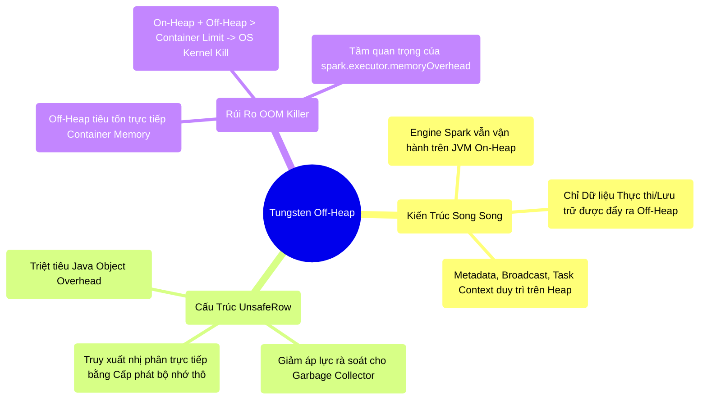

# 5.2 Project Tungsten Off-Heap: Kiến Trúc Bộ Nhớ Ngoài Máy Ảo

## 1. Objectives
- [ ] Bác bỏ lầm tưởng kỹ thuật về việc Spark thoát ly hoàn toàn khỏi JVM.
- [ ] Phân tích kiến trúc giảm tải Garbage Collection thông qua vùng nhớ Off-Heap và cấu trúc nhị phân `UnsafeRow`.
- [ ] Nhận diện rủi ro tràn bộ nhớ cấp phát hệ điều hành (Container OOM - Exit Code 137) khi kích hoạt Off-Heap sai quy tắc.

## 2. Mindmap


## 3. Content

Ở Bài 5.1, chúng ta đã xác định hai điểm nghẽn nghiêm trọng của hệ sinh thái JVM: Sự bùng nổ kích thước do Object Overhead và độ trễ ngắt quãng (Stop-The-World) của Garbage Collector. Để vượt qua rào cản này, kiến trúc sư Databricks đã thiết kế **Project Tungsten** với một trong những giải pháp cốt lõi: **Sử dụng bộ nhớ Off-Heap (Off-Heap Memory)**. 

Tuy nhiên, trong quá trình triển khai hạ tầng, có một ngộ nhận kiến trúc nguy hiểm thường xuyên xảy ra.

### 3.1. Đính Chính: Spark Không Thoát Ly Hoàn Toàn JVM
Nhiều tài liệu tối ưu hóa thường mô tả Off-Heap như một giải pháp giúp Spark chuyển đổi hoàn toàn sang C/C++ và xin cấp phát RAM trực tiếp từ OS. **Đây là một nhận định sai lệch về mặt cấu trúc.**

Thực tế kiến trúc: **Động cơ lõi (Core Engine) của Spark VẪN hoạt động bên trong JVM.**
Cơ chế Off-Heap của Tungsten chỉ được sử dụng làm một không gian lưu trữ đặc tả cho **Dữ liệu mảng (Data Arrays)** thuộc vùng Execution và Storage. Các thành phần nền tảng khác như: Metadata của Task, Cấu trúc Schema, Biến Broadcast, Vùng đệm mạng (Netty Buffers), và các đối tượng Java nội bộ do hệ thống sinh ra **vẫn bắt buộc phải lưu trú trên On-Heap**. 

Cỗ máy GC của JVM không hề bị vô hiệu hóa. Nó chỉ được **giảm áp lực (GC Pressure reduced)** do không còn phải rà soát hàng tỷ Object dữ liệu thô nữa.

### 3.2. Sức Mạnh Của UnsafeRow (Lưu Trữ Nhị Phân)
Thông qua API `sun.misc.Unsafe` (một API cấp thấp của Java), Tungsten có khả năng cấp phát và giải phóng bộ nhớ bên ngoài ranh giới quản lý của Java Heap. Dữ liệu trong DataFrame sẽ bị tước bỏ hoàn toàn lớp vỏ Object, nén chặt lại thành cấu trúc mảng nhị phân nguyên khối gọi là **UnsafeRow**.

**[Code Snippet: Mô Hình Cấp Phát Bộ Nhớ Thô]**
```java
// 1. ON-HEAP (Mô hình RDD cũ): Khởi tạo Object, GC chịu trách nhiệm quản lý vòng đời.
String str = new String("Hello");

// 2. OFF-HEAP (Kiến trúc Tungsten): Tương tác trực tiếp với hệ điều hành thông qua Unsafe.
// Spark yêu cầu OS cấp phát byte vật lý, dữ liệu thô.
long address = unsafe.allocateMemory(5); 
unsafe.putByte(address, (byte) 'H');
// GC hoàn toàn "mù" trước vùng địa chỉ address này, từ đó triệt tiêu rủi ro Stop-The-World
// khi quét qua khối dữ liệu lớn.
```

Nhờ cấu trúc UnsafeRow, thanh RAM lưu trữ được lượng dữ liệu gốc khổng lồ hơn (mật độ cao hơn). Kết hợp cùng Whole-Stage CodeGen, CPU có thể tính toán trực tiếp trên dãy bit nhị phân mà không phát sinh chi phí tuần tự hóa (Deserialize/Overhead) ngược lại thành Java Object.

### 3.3. Rủi Ro OOM Killer (Mã Lỗi Exit Code 137)

> [!CAUTION] Cảnh Báo Staff-Level: Off-Heap Không Phải Là Kháng Thể OOM
> Một sai lầm phổ biến là cho rằng kích hoạt Off-Heap sẽ miễn nhiễm với lỗi Out-Of-Memory. Thực tế, khi triển khai Off-Heap, hệ thống đang đối mặt trực tiếp với giới hạn vật lý của **Container Hệ điều hành** (ví dụ: YARN Container hoặc Kubernetes Pod Memory Limit).

Kiến trúc bộ nhớ của một Executor Node được giới hạn trong một Container. Công thức tổng quát:
`Container Memory Limit = On-Heap + Off-Heap + PySpark Memory + Overhead (Netty/OS Buffer)`

Nếu kỹ sư ép giảm On-Heap sai cách để mở rộng Off-Heap, hoặc quên cấp phát thông số vùng đệm hệ thống **`spark.executor.memoryOverhead`**, OS Kernel (thông qua OOM Killer) sẽ phát hiện tiến trình Container tiêu thụ vượt rào RAM vật lý được cấp phép. Lúc này, OS Kernel sẽ trực tiếp **bắn tín hiệu SIGKILL tiêu diệt tiến trình** (Mã lỗi Exit Code 137). Lỗi này cực kỳ khó Debug vì Giao diện Spark UI thường mất kết nối đột ngột và không ghi nhận bất kỳ Stacktrace Java nào.

**[Config Snippet: Cấu Hình Off-Heap An Toàn]**
Để khai thác Off-Heap, Kỹ sư dữ liệu phải tính toán chặt chẽ trần giới hạn RAM của Container:
```bash
# Kích hoạt không gian Off-Heap
--conf spark.memory.offHeap.enabled=true \
--conf spark.memory.offHeap.size=10g \
# BẮT BUỘC duy trì vùng đệm Overhead đủ lớn để tránh bị OS OOM Killer tiêu diệt
--conf spark.executor.memoryOverhead=4g 
```

## 4. Key takeaways
- **Spark vẫn là công dân JVM**: Không gian Off-Heap giải phóng Object Overhead và giấu dữ liệu thô khỏi tầm kiểm soát của GC, nhưng Task Metadata và Engine thực thi vẫn nằm trong On-Heap.
- **Off-Heap không miễn nhiễm OOM**: Khi đẩy dữ liệu ra Off-Heap, rủi ro OOM Java Heap giảm đi, nhưng rủi ro OOM Hệ điều hành (Exit Code 137) tăng lên. Cần kiểm soát chặt chẽ giới hạn Container vật lý.
- **Bước chuyển giao**: Mảng Off-Heap chỉ giải quyết vấn đề Giảm tải GC. Việc Spark cấp phát và chia chác từng khối Byte trên RAM giữa các tác vụ Tính toán (Execution) và Lưu trữ (Storage) sẽ được giải quyết bằng cấu trúc quản lý **Unified Memory Manager (UMM)** ở Bài 5.3.
