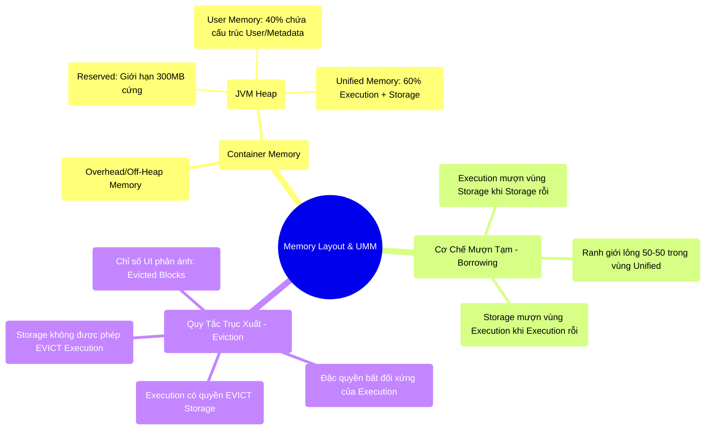

# 5.3 Unified Memory Manager: Công Thức Phân Bổ Kiến Trúc Ký Ức Động

## 1. Objectives
- [ ] Xóa bỏ những hạn chế của mô hình cấp phát tĩnh (Static Memory Manager) trước đây.
- [ ] Phân tích cấu trúc phân bổ bộ nhớ của Container (Memory Layout): Overhead, Heap, Reserved, User, và Unified (Execution/Storage).
- [ ] Giải mã cơ chế Ranh giới lỏng (Dynamic Boundary) của UMM và vai trò của cấu hình `spark.memory.fraction`.
- [ ] Phân định rạch ròi về mặt vật lý giữa hai khái niệm: Mượn tạm (Borrowing) và Trục xuất (Eviction).

## 2. Mindmap

## 3. Content

Tài nguyên bộ nhớ không bao giờ được cấp phát toàn bộ 100% cho các tác vụ Tính toán (Execution) hoặc Lưu trữ (Cache). Để làm chủ sự ổn định của hệ thống phân tán, Kỹ sư dữ liệu cần nắm vững **Công Thức Phân Lô Bộ Nhớ (Memory Layout)**. Cơ chế điều phối quá trình cấp phát này được gọi là **Unified Memory Manager (UMM)**.

### 3.1. Phẫu Thuật Cấu Trúc Container Memory Layout
Một Executor Container (Ví dụ: 104GB) được phân rã thành các phân vùng kiến trúc như sau:

1. **Không gian đệm (Memory Overhead & Off-Heap):**
   - Vùng đệm dành cho Netty, PySpark, và các luồng hệ điều hành OS Kernel.
   - Loại trừ đi vùng đệm này, chúng ta thu được không gian lõi **JVM Heap** (Ví dụ: 100GB thông qua `spark.executor.memory`).

2. **Cấu trúc Lõi JVM Heap (100GB) được phân rã thành 3 khu vực:**
   - **Reserved Memory (Hệ thống dự phòng):** Spark cố định giới hạn **300MB cứng** nhằm đảm bảo các luồng Engine lõi không rơi vào trạng thái thiếu hụt bộ nhớ. Không gian khả dụng còn lại: 99.7GB.
   - **User Memory (Mặc định 40%):** Vùng không gian dùng để chứa các cấu trúc dữ liệu do User tự định nghĩa (Hash map, UDF Objects), và Metadata của hệ thống Spark. Vùng này **KHÔNG** bị UMM kiểm soát chặt chẽ; việc cấp phát các đối tượng lớn tại đây là nguyên nhân trực tiếp dẫn tới OOM Java Heap.
   - **Unified Memory (Mặc định 60%):** Vùng nhớ trung tâm do UMM kiểm soát tuyệt đối. Đây là không gian phục vụ trực tiếp cho các phép toán Shuffle/Join và cơ chế Caching. Tỷ lệ này được điều chỉnh thông qua tham số `spark.memory.fraction`.

### 3.2. Đặc Tính Động Của UMM (Trong Phân Vùng 60% Unified)
Không gian Unified Memory tiếp tục được phân định bằng một tỷ lệ nội bộ (Khởi điểm mặc định là 50-50 thông qua tham số `spark.memory.storageFraction` = 0.5):
1. **Execution Memory (Vùng Tính toán):** Cấp phát không gian cho các cấu trúc Hash Table khi Join, và Buffer mạng khi Shuffle.
2. **Storage Memory (Vùng Lưu trữ):** Quản lý các Cached Blocks (Khi gọi `df.cache()`) và Broadcast Variables.

**[Cơ Chế Borrowing - Vay Mượn Tài Nguyên]**
Hai phân vùng này bám sát nguyên lý cấp phát lỏng lẻo (Dynamic Boundary):
- Nếu Storage dư thừa dung lượng, Execution có quyền trưng dụng (Borrow) để mở rộng vùng tính toán.
- Ngược lại, nếu Execution đang ở trạng thái rỗi, Storage có quyền trưng dụng để gia tăng bộ nhớ đệm Cache.

### 3.3. Đặc Quyền Bất Đối Xứng: Eviction vs Borrowing

> [!CAUTION] Cảnh Báo Thiết Kế: Nguyên Tắc Bất Đối Xứng
> Storage ĐƯỢC PHÉP mượn tài nguyên Execution lúc hệ thống nhàn rỗi, nhưng quyền lực Trục xuất dữ liệu (EVICTION) lại là đặc quyền ưu tiên của Execution.

**Nguyên Tắc Trục Xuất (Eviction):**
- Nếu Storage đang vay mượn không gian của Execution, và Execution yêu cầu hoàn trả tài nguyên $\rightarrow$ Execution có quyền **TRỤC XUẤT (EVICT)** dữ liệu của Storage ra khỏi không gian RAM để lấy lại bộ nhớ.
- **Ngược lại:** Nếu Execution đang vay mượn không gian của Storage, và Storage cần thêm bộ nhớ để lưu Cache $\rightarrow$ Storage **không có quyền** trục xuất dữ liệu của Execution. (Nguyên lý: Các luồng Tính toán không thể bị gián đoạn; việc loại bỏ dữ liệu Execution sẽ làm Job thất bại).

### 3.4. Production Runbook: Phân Định Rõ Eviction và Spill
Trong quá trình đọc Spark UI tại môi trường Production, kỹ sư thường nhầm lẫn giữa thuật ngữ Spill và Evict.

**1. Storage Eviction (Sự trục xuất Cache):** 
- Khi Execution giành lại bộ nhớ, các khối Cached Blocks của Storage bị loại bỏ khỏi RAM.
- Trạng thái của khối Cache sau khi bị Evict phụ thuộc vào `StorageLevel` (Ví dụ: `MEMORY_ONLY` sẽ bị xóa bỏ hoàn toàn, `MEMORY_AND_DISK` sẽ được đẩy xuống ổ đĩa cục bộ). Chỉ số trên UI: *Evicted Blocks*.

**2. Execution Spill (Sự giải phóng bộ nhớ tính toán):** 
- Khi phân vùng Execution đã chiếm dụng tối đa không gian Unified RAM nhưng vẫn đạt tới giới hạn OOM, nó bắt buộc phải tự kích hoạt cơ chế **SPILL (Xả đĩa)**. Các tập dữ liệu tính toán trung gian sẽ được xả xuống Local Disk để duy trì sự sống cho tiến trình.
- Chỉ số trên UI: *Spill (Memory)* và *Spill (Disk)*. Hiện tượng này trực tiếp làm bùng nổ I/O đĩa cứng (Disk I/O) và gia tăng độ trễ (Latency).

## 4. Key takeaways
- **Memory Layout Formula**: Hệ thống không bao giờ dành toàn bộ 100% dung lượng RAM cấu hình cho tính toán. Dung lượng khả dụng thực tế bị trừ đi Overhead, Reserved (300MB), và User Memory (40%).
- **Quyền lực của Execution**: Tính toán luôn được ưu tiên cao nhất. Vùng Storage (Lưu trữ Cache) hoạt động theo nguyên lý Best-Effort và luôn đối diện rủi ro bị Trục xuất (Evict).
- **Đính chính Spill**: Khái niệm Spill không phải là Evict Storage. Spill là quá trình vùng Execution tự đẩy lượng dữ liệu trung gian của chính nó xuống đĩa từ nhằm thoát khỏi tình trạng cạn kiệt bộ nhớ. (Sự cố tràn bộ nhớ sẽ được phân tích sâu ở Bài 5.4).
