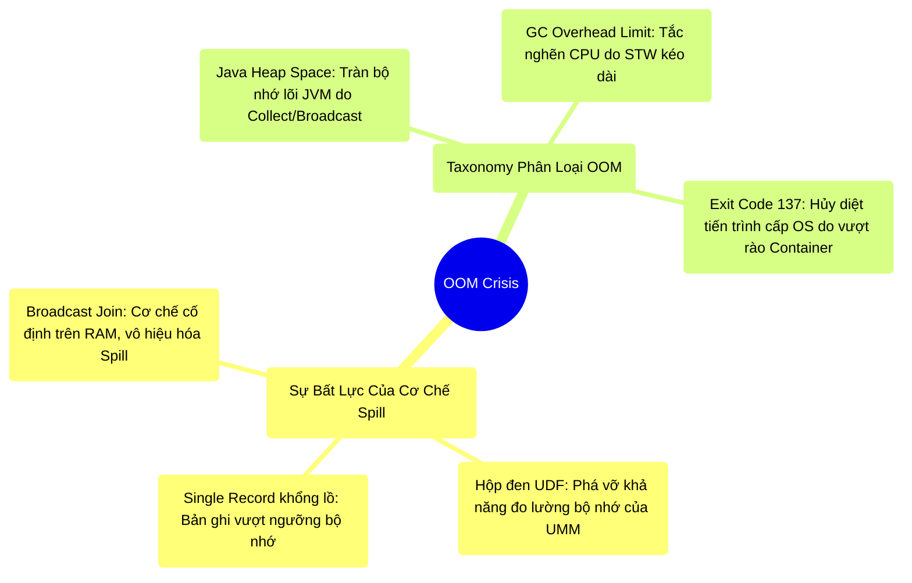

# 5.4 Căn Nguyên OOM: Khảo Sát Giới Hạn Của Cơ Chế Spill

## 1. Objectives
- [ ] Giải phẫu nguyên nhân gốc rễ của các sự cố Tràn bộ nhớ (OOM) trong khi hệ thống đã trang bị cơ chế Xả đĩa (Spill to Disk).
- [ ] Phân tích các rào cản vật lý vô hiệu hóa cơ chế Spill: Kích thước Single Record khổng lồ, đối tượng hộp đen UDF, và cơ chế Broadcast.
- [ ] Hệ thống hóa (Taxonomy) 3 phân loại OOM điển hình ở môi trường Production (Java Heap Space, GC Limit, OOMKiller 137).

## 2. Mindmap


## 3. Content

Ở Bài 5.3, chúng ta đã nắm được cơ chế Tự xả đĩa (**Spill to Disk**) của phân vùng Tính toán (Execution). Khi Execution cạn kiệt tài nguyên RAM, nó sẽ chủ động khóa bộ nhớ, tuần tự hóa dữ liệu trung gian xả xuống đĩa cứng cục bộ, giải phóng không gian để tiếp tục tính toán.
Một nghịch lý kỹ thuật thường được đặt ra: **Nếu hệ thống sở hữu cơ chế Spill tự động, tại sao Spark Driver và Executor vẫn gặp sự cố Out-Of-Memory (OOM)?**

### 3.1. Các Rào Cản Vật Lý Vô Hiệu Hóa Spill
Lỗi OOM thường bị kích hoạt khi cơ chế Spill **bị vô hiệu hóa** trước các trạng thái vật lý đặc thù sau:

**1. Kích Thước Bản Ghi Đơn Cực Đại (Massive Single Record)**
Cơ chế Spill hoạt động theo cơ sở phân lô (Batching), nhưng nó **không thể chia nhỏ một bản ghi đơn lẻ (Single Record)**. Giả sử tập dữ liệu chứa một trường JSON lồng ghép có kích thước lên tới 5GB/bản ghi. Khi bản ghi này được nạp vào không gian Heap, nó sẽ ngay lập tức vượt qua giới hạn khả dụng. Cỗ máy Spill chưa kịp đo lường và kích hoạt thì JVM đã báo lỗi OOM.

**2. Điểm Mù Đo Lường Của UDF (Opaque Object Instantiation)**
Thuật toán đo đếm bộ nhớ của UMM và Tungsten chỉ hoạt động chuẩn xác với các kiểu dữ liệu nguyên thủy (UnsafeRow) ở vùng Off-Heap. Khi sử dụng Python UDF hoặc các Scala Object phức tạp, chuỗi dữ liệu nhị phân bị giải nén ngược trở lại thành các Object cấp cao trên On-Heap. Sự phình to này hoàn toàn **tàng hình trước radar đo lường của Spark Engine**. UMM đinh ninh rằng RAM vẫn còn trống, nhưng trên thực tế, các Object rác này đã âm thầm chọc thủng giới hạn JVM Heap.

**3. Cơ Chế Ép Buộc Của Broadcast Join**
Toán tử Broadcast Hash Join có yêu cầu kiến trúc vô cùng ngặt nghèo: Bảng nhỏ (Build side) bắt buộc phải nằm trọn vẹn 100% trong RAM của TẤT CẢ Executors. Dữ liệu Broadcast **tuyệt đối không được phép xả đĩa (No Spill)**. Nếu cấu trúc dữ liệu Broadcast bị phình to (Ví dụ do ước lượng sai của CBO), toàn bộ cụm sẽ đồng loạt gặp sự cố OOM.

### 3.2. Hệ Thống Phân Loại (Taxonomy) OOM Ở Production
Trong thực tiễn vận hành hạ tầng Enterprise, giải pháp mù quáng tăng thêm RAM là một Anti-pattern. Kỹ sư cần chẩn đoán chính xác mã lỗi OOM để áp dụng giải pháp kiến trúc tương ứng:

🔴 **1. `java.lang.OutOfMemoryError: Java heap space`**
- **Cơ chế:** Vùng không gian lõi JVM Heap đã bị sử dụng cạn kiệt.
- **Nguyên nhân:** Cố ép Broadcast một bảng vượt ngưỡng; sử dụng `df.collect()` tải toàn bộ Terabytes dữ liệu về một máy Driver 4GB RAM; hoặc xảy ra hiện tượng Data Skew (Một Partition dồn hàng chục GB dữ liệu vào một Task duy nhất).
- **Giải pháp:** Điều chỉnh hạ thông số `spark.sql.autoBroadcastJoinThreshold`. Hạn chế tuyệt đối `collect()`, thay bằng `take()` hoặc xuất thẳng ra hệ thống lưu trữ phân tán. Kỹ thuật Salting Key để phân tán dữ liệu Skew.

🔴 **2. `java.lang.OutOfMemoryError: GC overhead limit exceeded`**
- **Cơ chế:** Thuật toán thu gom rác (Garbage Collector) bị quá tải (Thrashing).
- **Nguyên nhân:** JVM dành hơn 98% tài nguyên CPU chỉ để quét rác, nhưng lượng bộ nhớ giải phóng được chưa tới 2%. Hệ thống rơi vào trạng thái tê liệt lâm sàng do Stop-The-World kéo dài liên tục.
- **Giải pháp:** Triệt tiêu việc khởi tạo các cấu trúc đối tượng lồng nhau (`List`, `Map`, `Tuple`). Bám sát kiến trúc DataFrame/SQL API để duy trì vùng bảo vệ cấp phát bộ nhớ của CodeGen Tungsten.

🔴 **3. `Container killed by YARN / OOMKiller` (Exit code 137 / 143)**
- **Cơ chế:** Máy ảo JVM **chưa** ghi nhận sự cố thiếu hụt Heap. Tuy nhiên, rào cản tài nguyên cấp Hệ điều hành (Container Limit) đã bị phá vỡ. Kernel Linux (thông qua OOMKiller) đã gửi tín hiệu SIGKILL tiêu diệt trực tiếp tiến trình.
- **Nguyên nhân:** Việc phân bổ **Off-Heap Memory** (Xem Bài 5.2) hoặc **Memory Overhead** (Vùng đệm dùng cho C++, Python, Netty) đã vượt quá trần cấu hình Container.
- **Giải pháp:** Tuyệt đối không gia tăng Heap trong trường hợp này. Bắt buộc phải cấu hình mở rộng `spark.executor.memoryOverhead` lên mức 20-30% dung lượng, hoặc thu hẹp lại không gian Off-Heap để nhường vùng đệm cho HĐH.

**[Config Snippet: Cấu Hình Phòng Vệ Exit Code 137]**
```bash
# Phân bổ lại cấu trúc để duy trì ngưỡng an toàn cho Container OS
--conf spark.executor.memory=20g \
--conf spark.executor.memoryOverhead=4g \ # Mở rộng vùng đệm Overhead hệ điều hành
--conf spark.python.worker.memory=2g      # Hạn chế giới hạn cấp phát của PySpark Worker
```

## 4. Key takeaways
- **Giới hạn của Spill**: Không nên thiết kế luồng xử lý với tâm lý ỷ lại vào cơ chế Spill. Cơ chế này bất lực trước sự mất cân đối kích thước của bản ghi đơn lẻ, lỗ hổng định vị bộ nhớ của UDF, và đặc thù chống-Spill của cấu trúc Broadcast.
- **Chẩn đoán có cơ sở (Evidence-based Debugging)**: Từng thông điệp báo lỗi OOM đều là chỉ báo phân định ranh giới bộ nhớ bị phá vỡ. Tùy thuộc vào việc nổ bục Heap, tắc nghẽn GC, hay tràn giới hạn Container (137) mà áp dụng phương thức can thiệp kiến trúc hoàn toàn khác nhau.
- **Sự chuyển giao**: Đa số các thảm họa OOM nghiêm trọng nhất đều xảy ra vào thời điểm hệ thống bắt buộc phải tổ chức lại hàng vạn khối bộ nhớ để trao đổi chéo qua mạng. Sự kiện tiêu tốn bộ nhớ khổng lồ này chính là **Quá trình Shuffle**. Chi tiết sẽ được phân tích ở Chương 6.
