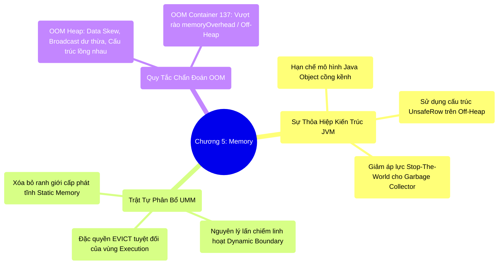

# 5.5 Tổng Kết Chương 5: Quản Trị Bộ Nhớ Hệ Thống Phân Tán

## 1. Objectives
- [ ] Tổng hợp bức tranh kiến trúc bộ nhớ: Giải pháp giảm tải Garbage Collection thông qua Off-Heap Memory và giới hạn của nó đối với hệ điều hành.
- [ ] Đúc kết nguyên lý vận hành của Unified Memory Manager (UMM): Ranh giới động, sự chia sẻ tài nguyên và đặc quyền Eviction của phân vùng Execution.
- [ ] Xây dựng bộ quy tắc chẩn đoán (Runbook) cho các sự cố OOM trên môi trường Production.

## 2. Mindmap

## 3. Content

Chương 5 cung cấp một cái nhìn hệ thống về quản trị bộ nhớ trong Spark: **Triệt tiêu giới hạn Overhead của cấu trúc hướng đối tượng, nhưng vẫn phải tuân thủ nghiêm ngặt các rào cản tài nguyên cấp Hệ Điều Hành (OS Container).**

Môi trường Java/Scala cung cấp bộ thu gom rác tự động (GC), nhưng ở quy mô hàng tỷ bản ghi (Big Data), cơ chế này bộc lộ điểm yếu chết người là các quãng ngưng trệ hệ thống (Stop-The-World). Kiến trúc Spark giải quyết nút thắt này thông qua bộ cấp phát **Tungsten Off-Heap Memory** (`sun.misc.Unsafe`). Dữ liệu được nén thành chuỗi Byte nhị phân thô (UnsafeRow), cho phép chúng tồn tại bên ngoài tầm quét của GC. Tuy nhiên, Engine lõi vẫn vận hành trên On-Heap. Bất kỳ sự mở rộng Off-Heap nào mà không cấp phát đủ vùng đệm hệ thống (`spark.executor.memoryOverhead`) đều dẫn đến sự cố Container bị OS bắn hạ (OOM Exit Code 137).

### 3.1. Thiết Lập Trật Tự Thông Qua UMM
Hệ thống sử dụng Unified Memory Manager (UMM) làm cơ quan điều phối phân bổ RAM nhằm tối đa hóa hiệu suất sử dụng:
- **Ranh giới động (Dynamic Boundary):** Hai phân vùng Tính toán (Execution) và Lưu trữ (Storage) được phép mượn không gian của nhau nếu hệ thống có đủ tài nguyên nhàn rỗi.
- **Đặc quyền ưu tiên:** Mọi luồng dữ liệu đang được tính toán (Execution) luôn giữ mức độ ưu tiên sinh tồn cao nhất. Dữ liệu Cache (Storage) chỉ được duy trì nếu Execution cho phép. Bất cứ khi nào Execution cạn kiệt tài nguyên, Storage sẽ lập tức bị **Trục xuất (Evicted)** khỏi RAM.

### 3.2. Cẩm Nang Chẩn Đoán Sự Cố Khẩn Cấp (OOM Runbook)
Khi hệ thống kích hoạt cảnh báo **Executor OOM**, quy trình xử lý chuẩn ở cấp độ Enterprise bao gồm:

1. **Phân loại lỗi hệ thống:** Xác định rõ lỗi thuộc về Java Heap Space hay là Container Killed (Linux OOMKiller / Exit Code 137). Nếu Container bị Kernel OS bắn hạ, giải pháp là gia tăng thông số `memoryOverhead` hoặc giới hạn vùng Off-Heap, tuyệt đối không tăng Java Heap.
2. **Loại trừ nguyên nhân đo lường (Opaque Objects):** Kiểm tra xem mã nguồn có lạm dụng User-Defined Function (UDF) hoặc cấu trúc dữ liệu lồng nhau phức tạp hay không. Các thành phần này phá vỡ khả năng định lượng của Tungsten, buộc hệ thống tái cấu trúc lại thành On-Heap Object và vượt ngưỡng GC.
3. **Kiểm soát kích thước Heap:** Việc cấp phát một thanh RAM quá lớn (Ví dụ: 120GB cho G1GC) thường phản tác dụng. Nó kéo dài thời gian rà soát của GC, làm gián đoạn Heartbeat mạng và dẫn đến rớt Node. Phân mảnh thành nhiều Executor nhỏ (25-30GB) hoặc cân nhắc sử dụng các thuật toán GC hiện đại (ZGC/Shenandoah).
4. **Chẩn đoán Data Skew:** Nếu 1 Task OOM nhưng 99 Task còn lại kết thúc thành công $\rightarrow$ Lỗi do phân phối dữ liệu lệch (Data Skew). Kỹ sư không thể giải quyết Skew bằng cách tăng cấu hình RAM toàn cục, mà phải can thiệp ở tầng kiến trúc bằng kỹ thuật Băm khóa (Salting Key).

## 4. Key takeaways
- **Thỏa hiệp Kiến trúc**: Bí quyết tối ưu I/O phần cứng của Spark nằm ở việc giảm thiểu Object Overhead thông qua không gian Off-Heap, nhưng hệ thống không bao giờ được phép vi phạm rào cản vật lý cấp Container của hệ điều hành.
- **Tính Kiệt Quệ Tài Nguyên**: Kiến trúc UMM đảm bảo không một Byte bộ nhớ nào bị lãng phí. 
- **Chương Tiếp Theo**: Khi các bài toán I/O nội tại (Disk, CPU, cục bộ RAM) đã được xử lý xong. Hệ thống phải đối mặt với thử thách khắc nghiệt nhất của kiến trúc phân tán: Sự kiệt quệ băng thông mạng (Network Bandwidth) khi hàng ngàn Node đồng loạt truyền tải khối lượng dữ liệu khổng lồ chéo qua nhau. Quá trình trao đổi mạng phức tạp đó được gọi là **Shuffle**. Chúng ta sẽ giải phẫu cơ chế này ở Chương 6.
