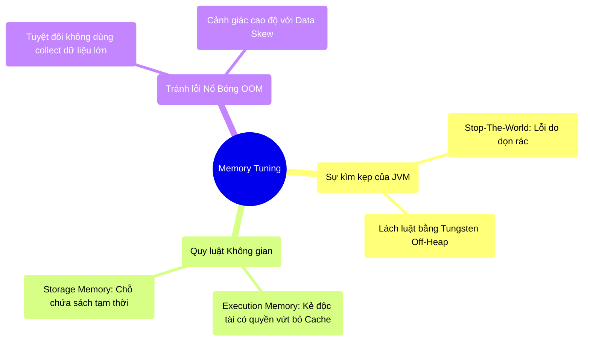

# 5.5 Tổng Kết: Cân Chỉnh Bộ Nhớ (Memory Tuning)

## 1. Objectives
- [ ] Đúc kết lại bức tranh toàn cảnh về Quản trị Bộ nhớ trong hệ thống phân tán.
- [ ] Chuyển hóa lý thuyết thành các nguyên tắc Sinh Tồn thực tế khi đối mặt với lỗi bộ nhớ.
- [ ] Chốt lại Chương 5 và tạo tiền đề để tìm hiểu nguyên lý Mạng (Shuffle) ở Chương 6.

## 2. Mindmap

## 3. Content

### 3.1. Cuộc Chiến Bất Tận Trong Không Gian Hẹp
Trong các hệ thống phần mềm thông thường, RAM là một thứ tài nguyên dồi dào và ít được quan tâm. Nhưng trong Big Data, Bộ Nhớ Trong (RAM) là chiến trường phức tạp nhất, nơi diễn ra cuộc giằng co then chốt giữa 3 thế lực:

1. **Thế lực Dọn Rác (JVM GC):** Luôn chực chờ đóng băng (Stop-The-World) hệ thống của bạn mỗi khi bạn tạo ra quá nhiều rác (Objects). Đòi hỏi bạn phải tối ưu code, dùng Tungsten nén nhị phân hoặc thậm chí chạy trốn ra sân sau (Off-Heap).
2. **Thế lực Giấy Nháp (Execution Memory):** Khi bạn dùng các hàm Shuffle/Sort, nó liên tục phình to. Nếu không đủ chỗ, nó sẽ thẳng tay đá văng (Evict) mọi thành quả lưu trữ (Cache) của bạn xuống ổ cứng.
3. **Thế lực Bơm Khí (Dữ Liệu Thật - Partitions):** Nếu bạn vô tình đưa một luồng khí quá lớn vào một quả bóng (Data Skew), hoặc hút tất cả không khí về một máy chủ (Driver Collect), quả bóng sẽ gặp sự cố nghiêm trọng (OOM).

### 3.2. Cẩm Nang Sinh Tồn (Best Practices)
Dựa trên những cơ chế vật lý đã mổ xẻ ở các Bài 5.1 đến 5.4, một Data Engineer chuyên nghiệp phải khắc cốt ghi tâm những quy tắc sau khi đụng đến RAM:

- **Hạn chế dùng hàm UDF Python tự chế:** Hãy dùng hàm SQL có sẵn (Built-in functions). Dùng hàm SQL, Tungsten sẽ ép nó thành Nhị phân gọn gàng. Dùng hàm UDF tự chế, Spark sẽ tạo ra hàng tỷ Object Java, làm gặp sự cố nghiêm trọng bộ thu gom rác (GC Overhead limit exceeded).
- **Cẩn thận với Cache:** Không phải cứ Cache là ứng dụng sẽ nhanh lên! Hãy nhớ Execution Memory có quyền đá Storage Memory. Bạn Cache một cục quá to, hệ thống không còn đất làm giấy nháp (Execution), nó bắt buộc phải vừa tính toán vừa ghi nháp xuống ổ cứng (Disk Spill), làm toàn bộ cụm máy tính chậm như rùa bò.
- **Không bao giờ gom rác về một điểm:** Các hàm `collect()`, `toPandas()`, `reduce()` (gom về Driver) chỉ được dùng khi bạn CHẮC CHẮN số lượng dòng dữ liệu đã được gọt đẽo xuống mức Megabytes hoặc Kilobytes (Nhờ Predicate Pushdown và Aggregation trước đó).

### 3.3. Từ Bộ Nhớ Đến Đường Truyền (Chuyển Giao Chương 6)
Ở chương này, chúng ta chỉ mới mổ xẻ Bên trong cái máy tính (RAM, JVM, OOM).
Tuy nhiên, lỗi OOM Executor (Chết máy con) do Lệch Dữ Liệu (Data Skew) không tự nhiên sinh ra. Dữ liệu không tự chui vào RAM của Máy 2. Dữ liệu đó bị **NÉM QUA DÂY MẠNG** từ các máy khác.

Hành động Ném qua dây mạng chính là hiện tượng **Shuffle (Xáo trộn)** - Trùm cuối của tính toán phân tán. Trong **Chương 6**, chúng ta sẽ rời khỏi thanh RAM, bước vào thế giới của Đường truyền cáp quang (Network Bandwidth) để chứng kiến cách một cụm máy tính 1.000 cái gửi hàng Petabyte dữ liệu cho nhau mà không làm sập toàn bộ Router của công ty!
