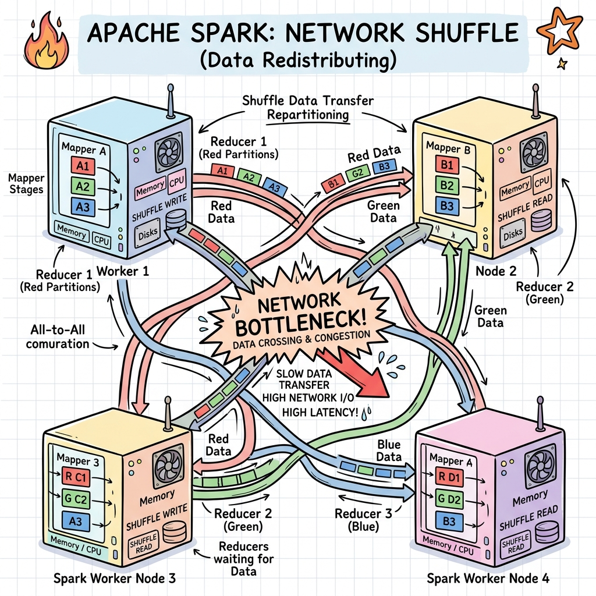
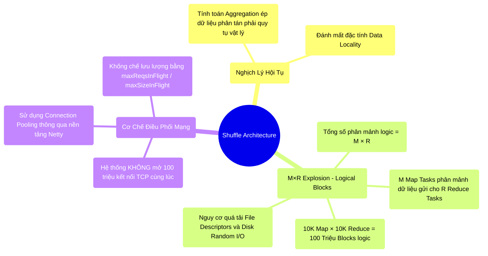

# 6.1 Giải Cấu Trúc Shuffle: Bức Tranh Tổng Quan Về Nút Thắt Mạng Lưới




## 1. Objectives
- [ ] Xác định ranh giới vật lý của giao thức Shuffle: Nơi luồng dữ liệu đánh mất lợi thế xử lý cục bộ.
- [ ] Phân tích nghịch lý hội tụ vật lý buộc hệ thống phân tán phải xáo trộn dữ liệu qua mạng cáp quang.
- [ ] Mổ xẻ hiện tượng bùng nổ hàm mũ $M \times R$: Nguyên nhân cốt lõi gây quá tải File Descriptors và Disk I/O.
- [ ] Phân định rõ sự khác biệt kiến trúc giữa Logical Blocks (Khối dữ liệu logic) và Active TCP Connections (Kết nối mạng thực tế).

## 2. Mindmap


## 3. Content

Trong các chương trước, Spark đã tối ưu hóa I/O phần cứng trên từng máy chủ đơn lẻ (Single Node) thông qua Catalyst và Tungsten. Tuy nhiên, sức mạnh thực sự của một hệ thống Big Data nằm ở khả năng phối hợp xử lý trên quy mô hàng ngàn máy chủ. Tại ranh giới giao tiếp này, hệ thống đụng độ với giao thức khắc nghiệt nhất của điện toán phân tán: **Shuffle**.

### 3.1. Nghịch Lý Hội Tụ Vật Lý (Bản Chất Của Shuffle)
Theo nguyên lý Định xứ dữ liệu (Data Locality), bộ lập lịch Spark luôn cố gắng phân phối luồng tính toán (Task) tới vị trí vật lý lưu trữ dữ liệu để triệt tiêu độ trễ mạng. Tuy nhiên, ranh giới này bị phá vỡ khi kỹ sư yêu cầu thực thi các phép toán gom nhóm hoặc nối bảng (Wide Dependency).

**[Code Snippet: Giao Thức Hội Tụ Vật Lý]**
```sql
-- Để tính tổng doanh thu cho từng thành phố, hệ thống bắt buộc phải di dời 
-- các bản ghi "Hà Nội" đang phân tán ngẫu nhiên trên 1.000 ổ cứng khác nhau, 
-- đóng gói vào luồng mạng, và hội tụ chúng về một bộ nhớ vật lý duy nhất.
SELECT city, SUM(salary) FROM users GROUP BY city
```
Hành vi chia tách dữ liệu từ các Node nguồn, xáo trộn và định tuyến chéo qua mạng mạng cáp quang để quy tụ về các Node đích được định nghĩa là **Shuffle**. Quá trình này đòi hỏi băng thông mạng (Network I/O) và I/O đĩa cứng (Disk I/O) khổng lồ.

### 3.2. Sự Bùng Nổ Hàm Mũ (M×R Blocks Explosion)
Trong quá trình Shuffle, một lỗi nhận thức phổ biến là đánh đồng phương trình $M \times R$ với số lượng kết nối mạng (Network Sockets) mở đồng thời, dẫn đến ảo tưởng hệ thống tự gây tấn công DDoS.

Kiến trúc Shuffle được chia làm 2 giai đoạn:
- **Map Phase:** Bao gồm $M$ Map Tasks làm nhiệm vụ trích xuất và phân mảnh dữ liệu tại Node nguồn.
- **Reduce Phase:** Bao gồm $R$ Reduce Tasks làm nhiệm vụ kéo (Fetch) dữ liệu hội tụ về Node đích.

> [!CAUTION] Cảnh Báo Kiến Trúc: Sự Phân Mảnh Logical Blocks
> Sự bùng nổ của $M \times R$ không sinh ra hàng triệu Socket mạng (Do Spark sử dụng **Connection Pooling** qua Netty). Nút thắt thực sự nằm ở sự bùng nổ **Logical Blocks** (Khối phân mảnh dữ liệu logic) và **File Descriptors**.

**Kiểm toán I/O trên Production:**
Giả sử một tiến trình cấu hình $M = 10.000$ và $R = 10.000$.
- Trong giai đoạn Map, tổng số phân mảnh dữ liệu (Shuffle Blocks) cần được sinh ra để định tuyến là: $10.000 \times 10.000 = 100.000.000$ (100 Triệu) Blocks.
- Nếu thuật toán Ghi đĩa không được thiết kế tốt, Kernel của Hệ điều hành phải quản lý **100 triệu tệp tin nhỏ lẻ**. Hệ thống sẽ nhanh chóng cạn kiệt tài nguyên File Descriptors, và ổ đĩa cứng (Đặc biệt là HDD) sẽ suy sụp do đọc/ghi ngẫu nhiên (Random I/O Seeks).
- Về phía Reduce, quá trình kéo dữ liệu (Fetch Phase) sẽ sinh ra 100 triệu yêu cầu mạng lắt nhắt (Remote Fetch Requests), dồn ép Memory Buffer của hệ thống mạng.

### 3.3. So Sánh Kiến Trúc Shuffle (Hadoop vs Spark)
Có một nhận định thường bị diễn giải sai lệch: *Spark chạy hoàn toàn trên RAM nên nhanh gấp 100 lần Hadoop, và Spark không ghi đĩa khi Shuffle*.
Về bản chất cơ học, khi đối mặt với Shuffle quy mô lớn, Spark **vẫn bắt buộc phải ghi dữ liệu trung gian xuống đĩa cứng (Spill-to-Disk)** để đảm bảo tính chịu lỗi (Fault Tolerance) và ngăn chặn tràn bộ nhớ (OOM) giống hệt như Hadoop MapReduce.

Tuy nhiên, cấu trúc Shuffle của Spark vẫn vượt trội hơn Hadoop về mặt tốc độ nhờ ba yếu tố kiến trúc cốt lõi:
1. **Kiến trúc nhị phân (Tungsten):** Sử dụng UnsafeRow và loại bỏ chi phí tuần tự hóa (Serialization Overhead) cồng kềnh của Java Object mà Hadoop mắc phải.
2. **Bộ đệm linh hoạt (In-memory Buffers):** Nếu khối lượng dữ liệu Shuffle đủ nhỏ, chúng có thể nằm trọn trên không gian Unified Memory và được chuyển giao mà không chạm mặt đĩa.
3. **Mạng Zero-Copy:** Spark sử dụng thư viện Netty với kỹ thuật Zero-Copy để chuyển giao trực tiếp dữ liệu từ đĩa từ vào Network Socket mà không qua CPU User-space, vượt xa cơ chế HTTP truyền thống của Hadoop.

## 4. Key takeaways
- **Giới hạn của Locality**: Các phép toán GROUP BY, JOIN đòi hỏi hội tụ dữ liệu vật lý. Băng thông mạng trở thành điểm nghẽn nghiêm trọng nhất.
- **Khủng hoảng M×R**: Đây là phương trình chỉ số lượng khối phân mảnh logic ($100M$ Blocks), gây ra áp lực tàn khốc lên I/O đĩa cứng (Random I/O) và File Descriptors hệ điều hành.
- **Tiến hóa kiến trúc**: Nhiệm vụ cốt lõi của Engine là phải tái cấu trúc thuật toán Ghi đĩa ở Map-side nhằm gộp 100 triệu Block này thành các tệp tin vật lý lớn hơn, giảm thiểu chi phí quản lý I/O. Quá trình tiến hóa từ Hash Shuffle sang Sort-Based Shuffle sẽ được trình bày ở Bài 6.2.
