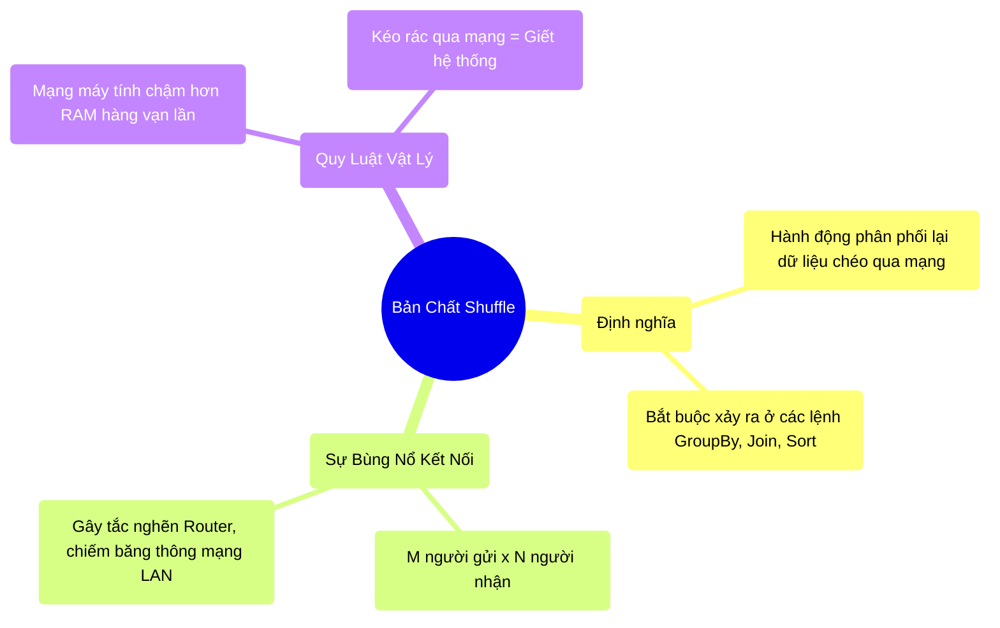

# 6.1 Shuffle Là Gì? Điểm Nghẽn Mạng Lưới (Network Bottleneck)

## 1. Objectives
- [ ] Giải phẫu định nghĩa và bản chất vật lý của Shuffle qua **Phép ẩn dụ Bưu Điện Phân Phối**.
- [ ] Tính toán số lượng đường kết nối mạng (Network Connections) được sinh ra trong một pha Shuffle.
- [ ] Phân tích code vật lý để thấy tại sao Shuffle là thao tác đắt đỏ nhất hệ thống.

## 2. Mindmap


## 3. Content

### 3.1. Phép Ẩn Dụ: Trung Tâm Phân Phối Bưu Điện
Ở Chương 3, chúng ta đã nhắc sơ qua về Wide Dependency (Các lệnh gây ra Shuffle). Bây giờ, chúng ta sẽ mổ xẻ chính xác **Shuffle (Xáo trộn)** đã làm gì bên dưới dây mạng.

> **[Ví Dụ Trực Quan: Bưu Điện Đêm Giao Thừa]**
> Hãy tưởng tượng cụm máy tính Spark (Cluster) của bạn là một Trung Tâm Bưu Điện khổng lồ. Có 100 Nhân viên (100 CPU Cores).
> Mỗi nhân viên đang ôm một rổ thư từ (Partition) trộn lẫn đủ mọi mã bưu điện (Zip code) của cả 63 tỉnh thành.
> 
> **Lệnh GroupBy (Gom nhóm theo Tỉnh thành) được phát ra:**
> Nhiệm vụ: Gom tất cả thư của TP.HCM về 1 chỗ, Hà Nội về 1 chỗ... 
> Chuyện gì xảy ra vật lý?
> - Nhân viên 1 phải đi nhặt lá thư Hà Nội, ném sang bàn của Nhân viên 2 (người chuyên gom Hà Nội).
> - Nhặt lá thư TP.HCM ném sang bàn Nhân viên 3.
> - CÙNG LÚC ĐÓ, 99 nhân viên còn lại CŨNG ĐANG NÉM THƯ chéo qua lại cho nhau!
> 
> Không khí trong bưu điện ngập tràn những phong thư bay lượn (Dữ liệu truyền qua Cáp mạng). Mọi người tông vào nhau, tắc nghẽn lối đi, không ai làm được việc gì khác ngoài việc ném và chụp thư! Đó chính là **SHUFFLE**.

### 3.2. Sự Bùng Nổ Kết Nối (The $M \times N$ Problem)
Điều đáng sợ nhất của Shuffle không nằm ở kích thước dữ liệu, mà nằm ở **Số lượng kết nối mạng (Network Connections)**.

Trong kiến trúc mạng máy tính (Network Topology), để máy A gửi dữ liệu cho máy B, chúng phải thiết lập một kết nối TCP/IP.
Giả sử bạn có $M$ cục dữ liệu ở bước Gửi (Map Phase), và $N$ cục dữ liệu ở bước Nhận (Reduce Phase). 
Spark mặc định $N = 200$ (Thuộc tính `spark.sql.shuffle.partitions = 200`).
Giả sử bạn đọc 1 file dữ liệu cắt làm 1.000 miếng ($M = 1.000$).

Tổng số đường kết nối TCP/IP mạng phải mở ra đồng thời là: 
**Kết Nối = M $\times$ N = 1.000 $\times$ 200 = 200.000 đường kết nối!**

Chỉ bằng ĐÚNG 1 dòng code `groupBy`, bạn vừa bắt hệ thống mạng LAN của công ty mở ra **200 NGÀN** luồng truyền tải dữ liệu chạy xuyên qua các Router và Switch cùng một tích tắc. Nếu Router của công ty bạn không đủ xịn (Băng thông hẹp), toàn bộ mạng của tòa nhà sẽ rớt! (Vấn đề Network Bottleneck).

### 3.3. Giải Phẫu Code Mạng (Network Anatomy)

```python
# =========================================================================
# LỆNH WIDE DEPENDENCY GÂY RA SỰ CỐ BĂNG THÔNG
# =========================================================================

# Khởi tạo: Đọc 1 Tỷ dòng dữ liệu (Khoảng 100GB). Nằm ở 1.000 Partitions.
df = spark.read.parquet("hdfs://100gb_data.parquet")

# HÀNH ĐỘNG GÂY SHUFFLE: Lệnh Distinct (Lọc trùng lặp)
# Để biết một tên có bị trùng hay không, hệ thống bắt buộc phải dồn 
# tất cả những người cùng TÊN về CÙNG MỘT MÁY (Shuffle) để đối chiếu!
df_unique = df.select("name").distinct()

# HẬU QUẢ VẬT LÝ KHI CHẠY (Bên dưới mạng lưới):
"""
1. Băng Thông (Bandwidth): 100GB dữ liệu bị xẻ thịt và nhồi nhét vào cáp quang (Network Cable).
   Cáp quang thông thường (10 Gbps) chỉ có thể chuyển được khoảng 1GB/giây. 
   Để chuyển 100GB, hệ thống mạng CHẾT CỨNG MẤT 100 GIÂY chỉ để DI CHUYỂN, chưa hề TÍNH TOÁN!
2. CPU Trống Rỗng: Trong 100 giây đó, 1.000 CPU Cores ngồi nhìn nhau uống nước chè 
   vì không có dữ liệu để làm. (CPU Utilization rớt thê thảm).
"""

# =========================================================================
# BÀI HỌC SINH TỒN SỐ 1
# =========================================================================
# LUÔN ÉP CHẾT DỮ LIỆU BẰNG LỆNH FILTER (NARROW) TRƯỚC KHI DÙNG DISTINCT HAY GROUPBY.
# Đẩy 100GB qua mạng là tự sát. Hãy lọc nó xuống còn 1GB trước rồi hẵng distinct.
df_optimized = df.filter(col("country") == "VN").select("name").distinct()
```

## 4. Key takeaways
- **Bản chất Shuffle:** Là hành động phân phối lại dữ liệu xuyên mạng (Cross-network data redistribution) để đảm bảo các bản ghi có chung Chìa khóa (Key) sẽ hội tụ về cùng một máy tính.
- **Ác mộng M x N:** Một lệnh Shuffle tạo ra số lượng kết nối khổng lồ, gây áp lực khủng khiếp lên băng thông thiết bị phần cứng mạng (Switch/Router).
- **Mạng luôn chậm hơn RAM:** Cho dù bạn có 1000 máy tính mạnh nhất, tốc độ của toàn cụm sẽ bị kéo tụt ngang bằng với tốc độ của sợi cáp mạng chạy giữa chúng (Định luật Amdahl). Việc tối ưu Big Data ở cấp độ Senior chính là **Nghệ thuật giảm thiểu Shuffle**.
