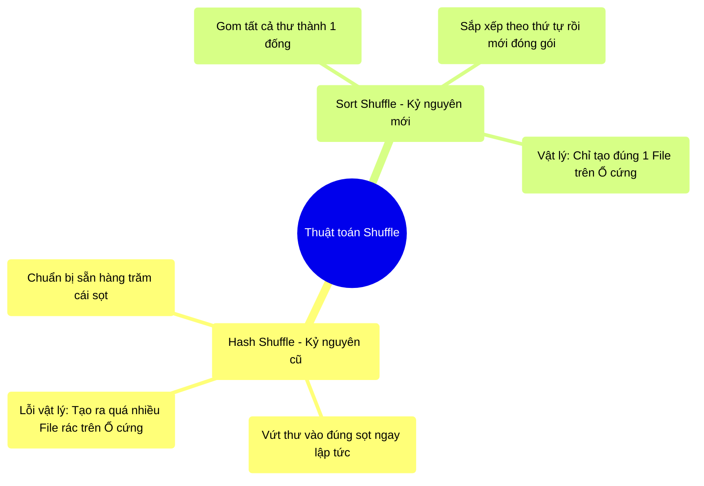

# 6.2 Lịch Sử Chuyển Giao: Hash Shuffle vs Sort Shuffle

## 1. Objectives
- [ ] So sánh hai thuật toán phân phối dữ liệu (Hash và Sort) qua **Phép ẩn dụ Phân loại bưu kiện**.
- [ ] Giải thích tại sao Hash Shuffle gây ra thảm họa RAM và rác Ổ cứng.
- [ ] Hiểu lý do Spark loại bỏ Hash Shuffle và dùng Sort Shuffle làm tiêu chuẩn.

## 2. Mindmap


## 3. Content

### 3.1. Phép Ẩn Dụ: Bưu Điện Lựa Chọn Thuật Toán
Lệnh `groupBy` hoặc `join` bắt buộc các nhân viên phải ném thư cho nhau (Shuffle). Nhưng **cách họ ném thư như thế nào** lại quyết định hệ thống sống hay chết. 
Xuyên suốt lịch sử, Spark đã trải qua 2 cuộc cách mạng về cách Ném thư: **Hash Shuffle** (Quá khứ) và **Sort Shuffle** (Hiện tại).

Giả sử chúng ta có 10 Nhân viên Gửi (Map) và 200 Nhân viên Nhận (Reduce).

> **[Ví Dụ Trực Quan: Hash Shuffle (Sắp xếp bằng Rổ)]**
> Mỗi anh Nhân viên Gửi được cấp **200 cái Rổ nhỏ (Buckets)**, đại diện cho 200 tỉnh thành.
> Anh ta bốc 1 lá thư lên, dòm mã Zip Code (Hàm băm - Hash function). Ah, thư này về Hà Nội. Anh ta ném ngay vào Rổ Hà Nội. Thư tiếp theo về Cà Mau, ném vào Rổ Cà Mau.
> 
> **Vấn đề Vật lý:** Có 10 Nhân viên Gửi, mỗi người tạo ra 200 cái rổ. Tổng cộng Bưu điện có $10 \times 200 = 2.000$ cái rổ chiếm diện tích sàn nhà (Tạo ra 2.000 file vật lý trên Ổ cứng). 
> Nếu Bưu điện có 1.000 Nhân viên gửi $\rightarrow$ Nó sinh ra $1.000 \times 200 = 200.000$ cái rổ. 
> Việc Ổ cứng (Disk) phải đồng thời duy trì và mở 200.000 file nhỏ xíu (Disk I/O) sẽ khiến ổ cứng bị kiệt sức (Disk Thrashing) và tốc độ rơi xuống bằng 0.

Hash Shuffle bị khai tử ở Spark 2.0 vì sự vô học trong cách tạo file rác khổng lồ trên ổ đĩa.

### 3.2. Sự Cứu Rỗi: Sort Shuffle (Sắp Xếp Trước, Gom Sau)
Để cứu vãn ổ cứng, các kỹ sư tạo ra **Sort Shuffle** (Vay mượn ý tưởng từ Hadoop MapReduce). 

> **[Ví Dụ Trực Quan: Sort Shuffle (Sắp xếp bằng Dây Chuyền)]**
> Lần này, anh Nhân viên Gửi KHÔNG CẦN RỔ nữa.
> Anh ta nhận một đống thư, và làm 1 việc duy nhất: **Sắp xếp đống thư đó theo Mã Tỉnh Thành (A $\rightarrow$ Z)** trên mặt bàn của mình.
> An Giang, Bình Dương, Cà Mau, Hà Nội... nằm liền tù tì thành một dải.
> Sau khi xếp xong, anh ta **Đóng gói tất cả vào ĐÚNG 1 THÙNG HÀNG LỚN (Chỉ tạo 1 File vật lý trên ổ cứng)**.
> Ngoài thùng hàng dán một tờ mục lục: Từ mm 1 đến mm 10 là thư An Giang. Từ mm 11 đến mm 15 là thư Bình Dương.
> 
> Khi anh Nhân viên Nhận (Bình Dương) tới lấy thư, anh ta chỉ việc nhìn mục lục, cắt ĐÚNG phần mm 11 đến 15 mang đi. 

**Hiệu quả vật lý:** 1.000 Nhân viên Gửi chỉ tạo ra đúng **1.000 File lớn** trên ổ cứng (Thay vì 200.000 file rác như Hash Shuffle). Tốc độ Ổ cứng (Disk I/O) được tối ưu ở mức hoàn hảo vì nó được Ghi/Đọc tuần tự (Sequential I/O).

### 3.3. Giải Phẫu Bằng Code: Xem Sort Shuffle Hoạt Động
Trong Spark 2.0+, Sort Shuffle là cơ chế mặc định. Bất cứ khi nào bạn kích hoạt Shuffle, Engine sẽ âm thầm gọi thuật toán Sort (Sắp xếp) mà bạn không hề hay biết!

```python
# =========================================================================
# LỆNH GROUP BY ẨN CHỨA HÀNH ĐỘNG SORT BÊN DƯỚI
# =========================================================================

# Bạn ra lệnh Gom Nhóm để Đếm (Hoàn toàn không có chữ Sort nào trong code)
df_grouped = df.groupBy("department").count()

df_grouped.explain(True)

"""
KẾT QUẢ PHYSICAL PLAN (BẢN VẼ THI CÔNG):
*(2) HashAggregate(keys=[department], functions=[count(1)])
+- Exchange hashpartitioning(department, 200), ENSURE_REQUIREMENTS, [id=#]
   +- *(1) HashAggregate(keys=[department], functions=[partial_count(1)])
      +- *(1) FileScan parquet [department]
"""

# NHÌN VÀO DÒNG: Exchange hashpartitioning
# Chữ "Exchange" chính là điểm CẮT STAGE (Bài 3.4), Bắt đầu SHUFFLE.
# Bên dưới hậu trường (Lớp vật lý):
# Để chuẩn bị cho việc Exchange, Spark đã ÉP 1.000 CPU Cores thực hiện
# thuật toán Sắp Xếp (Sort) nội bộ bên trong RAM (Vùng Execution Memory - Bài 5.2).
# Nếu RAM không đủ chỗ chứa để Sắp Xếp, dữ liệu sẽ Tràn ra Ổ cứng (Spill to Disk).
```

## 4. Key takeaways
- **Từ bỏ Hash Shuffle:** Spark thế hệ cũ chết yểu vì cố gắng tạo quá nhiều File (Buffer) trên ổ cứng, gây ra lỗi I/O.
- **Sort Shuffle là chân lý:** Mọi hành động Shuffle hiện tại đều dựa trên việc: Mọi máy chủ phải Tự Sắp Xếp cục dữ liệu của mình (Sort) trước, đóng thành 1 File lớn, để các máy khác đến lấy (Fetch) theo đoạn mục lục.
- **Tốn RAM cho việc Sắp xếp:** Mặc dù tốt cho Ổ cứng, Sort Shuffle đòi hỏi một vùng không gian Giấy Nháp (Execution Memory) cực lớn để làm thuật toán Sort. Nếu RAM hụt hơi, hiện tượng Tràn Đĩa (Disk Spill) sẽ lập tức xảy ra. (Khái niệm Disk Spill sẽ được mổ xẻ ở Bài 6.3).
