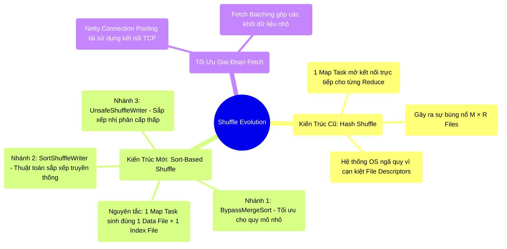

# 6.2 Lịch Sử Tiến Hóa: Từ Hash Shuffle Đến Kiến Trúc Sort-Based

## 1. Objectives
- [ ] Phân tích điểm nghẽn kiến trúc (Too many open files) của thuật toán Hash Shuffle thế hệ cũ.
- [ ] Mổ xẻ nguyên lý tối ưu của kiến trúc Sort-Based Shuffle: Gom nhóm I/O (Chỉ tạo 1 Data File + 1 Index File).
- [ ] Khám phá 3 nhánh thực thi (Writer Paths) mà Spark sử dụng để cân bằng giữa chi phí Disk I/O và CPU Overhead.

## 2. Mindmap

## 3. Content

Ở Bài 6.1, chúng ta đã chứng kiến rủi ro quá tải I/O của phương trình $M \times R$. Sự bùng nổ phân mảnh này yêu cầu một kiến trúc quản lý đĩa cứng (Disk Management) vô cùng tinh vi. Lịch sử tiến hóa của Spark Shuffle là quá trình cải tổ các thuật toán Ghi đĩa (Writer) để tránh gây sụp đổ hệ điều hành.

### 3.1. Hạn Chế Của Hash Shuffle Thế Hệ Đầu
Thuật toán Hash Shuffle nguyên thủy hoạt động dựa trên ánh xạ trực tiếp. Tại phía Map-side, khi xử lý một dòng dữ liệu, Spark đánh giá xem nó thuộc về phân vùng (Partition) của Reduce Task nào. Ngay lập tức, Spark **mở một Tệp tin vật lý (File descriptor)** riêng biệt để phục vụ luồng ghi cho Reduce Task đó.

> [!CAUTION] Cảnh Báo Thiết Kế: Giới Hạn File Descriptors
> Lỗi sập hệ thống trong giai đoạn Shuffle ban đầu thường bị nhầm lẫn là OOM. Tuy nhiên, nguyên nhân thực tế bắt nguồn từ giới hạn quản lý tệp tin của Hệ điều hành.
> - **Kịch bản:** Với 10.000 Reduce Tasks, một Map Task sẽ đồng thời mở tung 10.000 tệp tin vật lý. Toàn cụm với 10.000 Map Tasks sẽ ép Kernel hệ điều hành duy trì **100 Triệu tệp tin đang mở**.
> - **Hệ quả:** Hệ điều hành Linux áp đặt mốc trần File Descriptors (thông số `ulimit`). Việc vượt ngưỡng này kích hoạt lỗi **`Too many open files`** làm gián đoạn toàn bộ dịch vụ. Đồng thời, thao tác Ghi 10.000 tệp tin rời rạc tạo ra các truy cập đĩa ngẫu nhiên (Random Disk I/O), bóp nghẹt hoàn toàn thông lượng (Throughput) của phần cứng.

### 3.2. Cải Tổ Kiến Trúc: Sort-Based Shuffle
Để giải quyết nút thắt File Descriptors, Databricks đã tái thiết kế thành mô hình **Sort-Based Shuffle**. 
Nguyên tắc cốt lõi: **Triệt tiêu số lượng tệp tin phân mảnh. Bất kể số lượng Reduce Tasks là bao nhiêu, mỗi Map Task chỉ được phép xả ra chính xác 1 Data File và 1 Index File.**

Dựa trên khối lượng dữ liệu và tham số cấu hình, hệ thống sẽ phân nhánh thành 3 chiến lược Ghi (Writer Paths) để tối ưu hóa việc sử dụng CPU:

**Nhánh 1: Tối ưu CPU (`BypassMergeSortShuffleWriter`)**
- *Điều kiện kích hoạt:* Không yêu cầu gộp nhóm cục bộ (No Map-side Aggregation) VÀ số lượng Partitions $\le 200$ (Thông qua `spark.shuffle.sort.bypassMergeThreshold`).
- *Cơ chế:* Nhận thấy chi phí sắp xếp (Sort) toàn bộ khối dữ liệu là lãng phí điện năng CPU. Spark lách luật bằng cách phân loại dữ liệu vào các tệp đệm (Buffer). Sau khi hoàn tất, nó hợp nhất (Merge) các tệp đệm này thành một Data File liên tục duy nhất, mà không cần qua bước Sắp xếp truyền thống.

**Nhánh 2: Thuật Toán Truyền Thống (`SortShuffleWriter`)**
- *Điều kiện kích hoạt:* Yêu cầu gộp nhóm cục bộ hoặc số lượng Partitions vượt quá 200.
- *Cơ chế:* Dữ liệu được nạp vào một cấu trúc mảng bộ nhớ (ExternalSorter). Khi RAM bão hòa, CPU tiến hành **sắp xếp (Sort)** dữ liệu theo thứ tự Partition đích, xả đĩa (Spill), và cuối cùng gộp (Merge) lại. Quá trình này đảm bảo tính nhất quán nhưng tiêu hao đáng kể chu kỳ nhịp CPU và Disk I/O.

**Nhánh 3: Tối Ưu Cấp Thấp (`UnsafeShuffleWriter`)**
- *Điều kiện kích hoạt:* Khi dữ liệu đã được định dạng mảng nhị phân thô (Serialized) thông qua kiến trúc Tungsten Off-Heap.
- *Cơ chế:* Tránh thao tác trực tiếp trên Java Object. Hàm Writer sẽ trích xuất các con trỏ (Pointers) và mảng kích thước, tiến hành sắp xếp trực diện mảng con trỏ thay vì hoán đổi dữ liệu thật. Cơ chế này đạt thông lượng I/O cực đại và né tránh bộ thu gom rác (GC).

### 3.3. Tối Ưu Hóa Fetch Phase: Block Transfer Service
Sau khi phía Map hoàn tất Data File, phía Reduce cần tiến hành kéo dữ liệu (Fetch). Nếu hàng ngàn Reduce Tasks mở kết nối mạng đồng thời, hạ tầng Switch mạng sẽ bão hòa. Databricks giải quyết bằng module **Block Transfer Service** vận hành trên thư viện Netty:
1. **Connection Pooling:** Tái sử dụng các Socket TCP giữa hai máy chủ vật lý, đóng gói hàng loạt các luồng logic của Reduce Task vào trong một kết nối duy nhất.
2. **Fetch Batching:** Tối ưu hóa Header mạng bằng cách gom (batch) các yêu cầu Fetch Block kích thước nhỏ thành một Request lớn.
3. **Flow Control:** Hạn chế tình trạng tắc nghẽn băng thông thông qua tham số `spark.reducer.maxSizeInFlight` (Giới hạn MB dữ liệu tối đa truyền tải cùng lúc) và `spark.reducer.maxReqsInFlight` (Giới hạn số lượng yêu cầu luồng).

## 4. Key takeaways
- **Sự thoái trào của Hash Shuffle**: Kiến trúc nguyên thủy đã sụp đổ do vi phạm giới hạn quản trị File Descriptors của hệ điều hành và gây suy giảm nghiêm trọng thông lượng Random I/O.
- **Tính thống nhất của Sort-Based**: Yêu cầu bắt buộc mọi phân mảnh ở Map-side phải được quy tụ vào 1 Data File kèm 1 Index File để tối ưu việc đọc tuần tự (Sequential Read).
- **Tính linh hoạt của Writer**: Dù được định danh là Sort-Based, cơ chế `BypassMergeSort` vẫn cho phép Spark bỏ qua khâu Sort đắt đỏ đối với các tập dữ liệu nhỏ để tối ưu hóa chu kỳ CPU.
