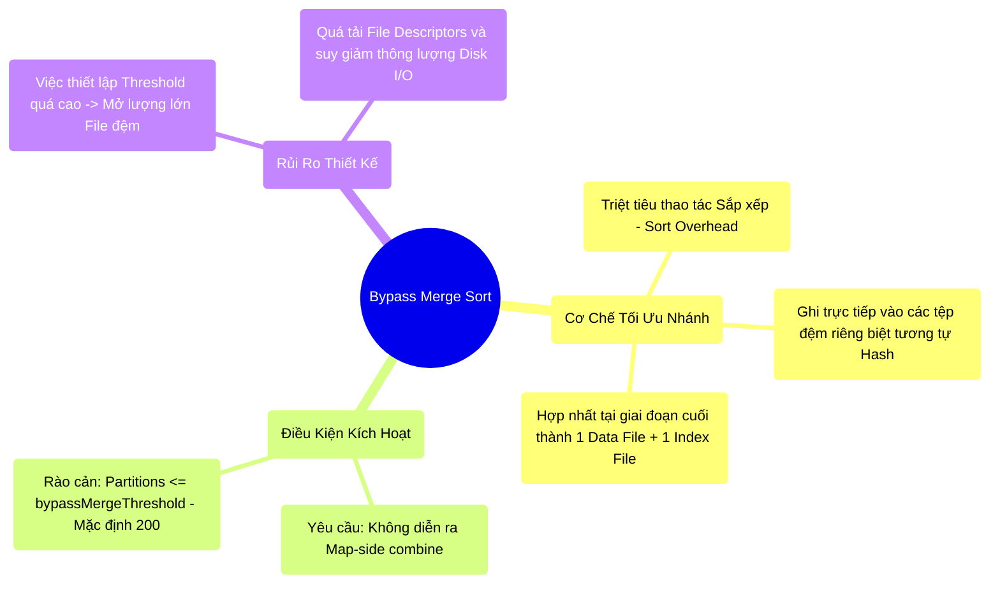

# 6.3 BypassMergeSortShuffle: Đánh Đổi Hiệu Suất CPU Và Rủi Ro File Descriptors

## 1. Objectives
- [ ] Phân tích điểm nghẽn tiêu hao CPU (CPU Overhead) sinh ra từ việc bắt buộc sắp xếp (Sort) trong các luồng không yêu cầu Map-side combine.
- [ ] Mổ xẻ cơ chế tối ưu nhánh (Bypass) của `BypassMergeSortShuffleWriter` nhằm giải phóng tài nguyên điện toán.
- [ ] Cảnh báo rủi ro bùng nổ File Descriptors (Tái diễn sự cố Hash Shuffle) khi lạm dụng việc cấu hình `bypassMergeThreshold` vượt quá giới hạn an toàn.

## 2. Mindmap


## 3. Content

Trong Bài 6.2, kiến trúc **Sort-Based Shuffle** được đánh giá là nền tảng cốt lõi giúp bảo vệ Hệ điều hành khỏi lỗi `Too many open files` bằng cách ép toàn bộ luồng dữ liệu phải trải qua quá trình Sắp xếp (Sort) trước khi hợp nhất. Tuy nhiên, dưới góc độ thiết kế hệ thống, đây là một sự **thỏa hiệp về mặt điện toán (Computational Trade-off)**.

### 3.1. Điểm Nghẽn Tiêu Hao CPU
Phân tích một luồng truy vấn đơn giản không yêu cầu gộp nhóm tại Node cục bộ (No Map-side combine) và không cần duy trì trật tự khóa (Sorting). Việc hệ thống ép CPU phải thực thi thuật toán Sắp xếp lên hàng Terabytes dữ liệu chỉ nhằm mục đích định tuyến phân mảnh là một sự lãng phí điện năng và xung nhịp CPU đáng kể. 

Trong bối cảnh này, Disk I/O và RAM được bảo vệ, nhưng CPU trở thành điểm nghẽn (CPU-bound bottleneck).

### 3.2. Cơ Chế Tối Ưu Nhánh (BypassMerge)
Nhằm giải phóng CPU cho các truy vấn hẹp, Spark tích hợp một nhánh thực thi tối ưu mang tên **BypassMergeSortShuffleWriter**:
1. **Phân mảnh trực tiếp (Bypass Sort):** Map Task chia tách dữ liệu và ghi thẳng vào các tệp đệm (Buffer Files) riêng biệt tương ứng với từng Reducer. Quá trình này bỏ qua hoàn toàn thuật toán Sắp xếp (Sort) của CPU.
2. **Giai đoạn hợp nhất (Merge Phase):** Trước khi Map Task kết thúc, hệ thống tiến hành hợp nhất (Merge) toàn bộ các tệp đệm này thành **duy nhất 1 Data File và 1 Index File** theo đúng chuẩn mực của Sort-Based Shuffle.

**Hệ quả kiến trúc:** Hệ điều hành vẫn được bảo vệ ở giai đoạn Fetch (Do chỉ tạo ra 1 tệp tin cuối cùng), đồng thời CPU được giải phóng khỏi chi phí Sorting đắt đỏ.

### 3.3. Production Runbook: Rủi Ro Của bypassMergeThreshold

> [!CAUTION] Cảnh Báo Thiết Kế: Giới Hạn Của Kiến Trúc Bypass
> Trong thực tiễn vận hành, có một sai lầm phổ biến là cấu hình `spark.shuffle.sort.bypassMergeThreshold` bằng với tổng số Shuffle Partitions (Ví dụ: 10.000) nhằm mục đích luôn vô hiệu hóa quá trình Sort. Đây là một Anti-pattern mang tính phá hoại hệ thống.

**Cơ sở vật lý của rủi ro:**
Spark thiết lập `bypassMergeThreshold` mặc định là 200 nhằm đảm bảo an toàn cho I/O hệ thống. 
- Khi nhánh Bypass được kích hoạt, trong giai đoạn ghi dữ liệu (trước khi Merge), Map Task BẮT BUỘC PHẢI MỞ ĐỒNG THỜI một số lượng tệp đệm (Open Files) bằng đúng với số lượng Reducer.
- Nếu cấu hình `bypassMergeThreshold = 10.000` kết hợp `partitions = 10.000`. Tại một thời điểm, một Map Task sẽ mở đồng thời 10.000 tệp đệm. Một cụm chạy 10.000 Map Tasks sẽ ép hệ thống phải mở **100 Triệu Tệp tin tạm thời**.
- **Hậu quả:** Hệ điều hành Linux sẽ lập tức báo lỗi **`Too many open files`**, đồng thời ổ đĩa cứng sẽ bão hòa do phải xử lý I/O ngẫu nhiên (Random I/O). Kiến trúc hệ thống vô tình quay ngược trở lại thời kỳ khủng hoảng của Hash Shuffle thế hệ đầu.

**[Config Snippet: Cấu Hình Bypass An Toàn]**
```bash
# Việc hiệu chỉnh threshold chỉ nên áp dụng cho các cấu trúc phân mảnh nhỏ.
# Chỉ khi hệ thống có Partitions thấp (VD: 300) và hoàn toàn không có Map-side combine,
# kỹ sư mới được phép mở rộng ngưỡng Threshold để tối ưu CPU.
--conf spark.sql.shuffle.partitions=300 \
--conf spark.shuffle.sort.bypassMergeThreshold=300 
```

## 4. Key takeaways
- **Bypass là tối ưu hẹp**: Cơ chế này bỏ qua thuật toán Sort nhằm giảm Overhead CPU, nhưng lại đánh đổi bằng việc duy trì lượng tệp tin đệm lớn trong giai đoạn Map.
- **Không có giải pháp toàn năng**: Tuyệt đối không gia tăng `bypassMergeThreshold` lên các ngưỡng cực đại. Thao tác này sẽ vô tình tái kích hoạt giới hạn quản trị File Descriptors của hệ điều hành, gây tê liệt I/O đĩa cứng.
- **Ranh giới bộ nhớ**: Dù hệ thống áp dụng nhánh Bypass hay Sort truyền thống, tất cả đều vấp phải một ranh giới vật lý: Khi vùng RAM phân bổ (Execution Memory) bão hòa, các Operator bắt buộc phải kích hoạt cơ chế Xả dữ liệu xuống đĩa (Disk Spill). Chủ đề này sẽ được mổ xẻ ở Bài 6.4.
