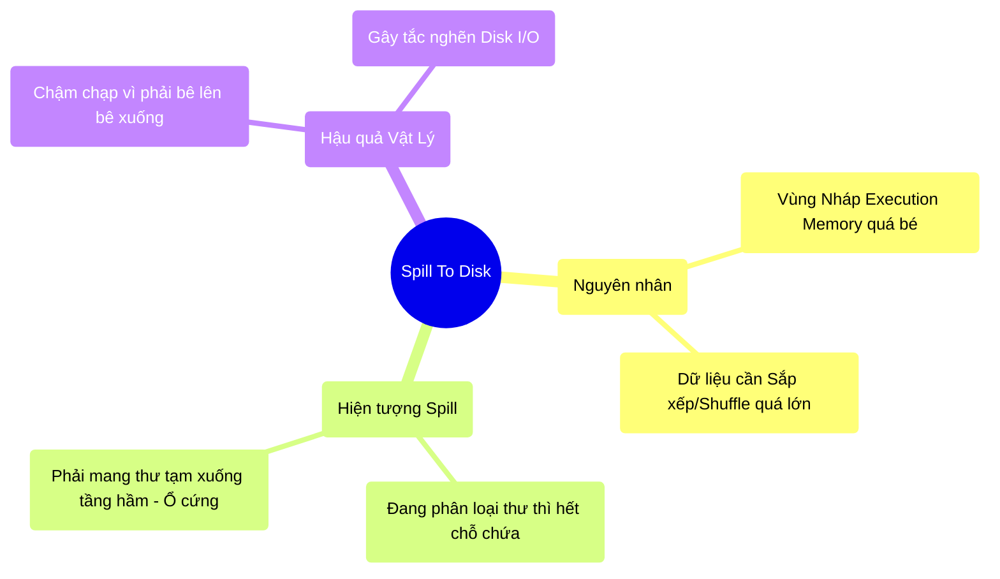

# 6.3 Vật Lý Của Shuffle: Cơn Ác Mộng Tràn Đĩa (Spill To Disk)

## 1. Objectives
- [ ] Định nghĩa hiện tượng Spill to Disk qua **Phép ẩn dụ Sàn Nhà Đầy Thư & Xuống Tầng Hầm**.
- [ ] Nhận diện mối nguy hiểm tiềm tàng khi Spill xảy ra (Disk I/O và GC Overhead hợp thể).
- [ ] Phân tích dấu hiệu trên Spark UI và viết Code mô phỏng.

## 2. Mindmap


## 3. Content

### 3.1. Phép Ẩn Dụ: Hết Chỗ Đứng Bưu Điện & Mang Xuống Tầng Hầm
Ở Bài 6.2, chúng ta biết Sort Shuffle yêu cầu nhân viên phải Sắp Xếp thư trước khi đóng gói.
Vấn đề nằm ở chỗ: Để sắp xếp được 1 triệu lá thư, anh nhân viên cần một cái Bàn (RAM / Execution Memory) đủ rộng để trải tất cả 1 triệu lá thư đó ra.

> **[Ví Dụ Trực Quan: Đem Thư Xuống Tầng Hầm]**
> Chuyện gì xảy ra nếu cái Bàn của anh nhân viên chỉ chứa được 100.000 lá thư?
> Anh ta phải trải 100.000 lá thư đầu tiên ra bàn $\rightarrow$ Sắp xếp chúng lại $\rightarrow$ Cột thành một cọc $\rightarrow$ **Mang cọc thư đó xuống Tầng Hầm (Ổ cứng)** cất tạm.
> 
> Sau đó, anh ta lên lầu, bốc tiếp 100.000 lá thư thứ hai trải ra bàn $\rightarrow$ Sắp xếp $\rightarrow$ Lại mang xuống hầm cất.
> Làm thế 10 lần. Cuối cùng, anh ta phải xuống hầm, mang cả 10 cọc thư đó lên bàn để hòa trộn (Merge) chúng lại thành 1 cọc khổng lồ đã sắp xếp. 
> 
> Việc cứ phải chạy lên chạy xuống cầu thang (Memory to Disk) tiêu tốn năng lượng và thời gian kinh khủng. Quá trình mang cất tạm xuống hầm này trong Big Data gọi là **Spill (Tràn/Đổ dữ liệu)**.

### 3.2. Spill: Cú Đấm Kép Vào Hệ Thống
Spill to Disk không làm chết hệ thống (Không gây lỗi OOM ngay lập tức). Nhưng nó làm hệ thống của bạn bị tê liệt vì một cú đấm kép:

1. **Đấm vào Tốc Độ (Disk I/O Bottleneck):** Tốc độ đọc/ghi của thanh RAM là hàng chục GB/s. Tốc độ đọc/ghi của Ổ cứng SSD chỉ vài trăm MB/s (HDD thì vài chục MB/s). Khi có Spill, máy tính phải vứt dữ liệu xuống ổ cứng, rồi lại moi nó lên, tốc độ rơi rụng hàng trăm lần.
2. **Đấm vào Cấu Trúc (Garbage Collection Overhead):** Việc nén và giải nén dữ liệu liên tục giữa RAM và Ổ cứng tạo ra hàng Tỷ rác thải (Java Objects). Như Bài 5.1 đã cảnh báo, Nhân viên dọn rác GC sẽ điên cuồng xuất hiện và đóng băng toàn bộ bưu điện (Stop-The-World).

Nhiều lập trình viên ngây thơ chạy Spark thấy Code chạy quá chậm (Tốn 10 tiếng), họ chửi Spark dở. Nhưng thực ra, Spark đang vã mồ hôi hột chống đỡ hiện tượng Spill do cái Bàn (RAM) họ cấp quá hẹp!

### 3.3. Dấu Hiệu Nhận Biết & Khắc Phục

Làm sao biết Code của bạn đang gây ra Spill?
Bạn không thể dùng lệnh `print` để in ra màn hình. Bạn bắt buộc phải bật màn hình **Spark UI (Giao diện Quản trị Spark)** và nhìn vào mục Task Details. 
Nếu bạn thấy 2 cột: `Spill (Memory)` và `Spill (Disk)` hiện ra những con số hàng Gigabytes, xin chúc mừng, hệ thống của bạn đang bơi trong bùn!

```python
# =========================================================================
# LỆNH VÔ TÌNH KÍCH HOẠT SPILL
# =========================================================================

# Đọc file 100GB
df = spark.read.parquet("hdfs://huge_data.parquet")

# Code NGHIỆP DƯ: Join 2 bảng siêu lớn với nhau
# Spark bắt buộc phải Shuffle CẢ 2 BẢNG (Mang thư đi xáo trộn).
# Khi thư bay đến máy nhận, máy nhận phải Mở Vùng Nháp (Execution) ra để Khớp (Join) dữ liệu.
# RAM 10GB không thể nháp nổi cục dữ liệu 50GB.
# -> Hàng loạt dữ liệu bị Spill xuống Ổ cứng. 
df_joined = df.join(df_other, "user_id")

# CÁCH CHỮA BỆNH SỐ 1: Bơm thêm RAM
# Tăng kích thước Bàn Học (Spark Memory).
# Cấu hình: spark.executor.memory = 32g

# CÁCH CHỮA BỆNH SỐ 2: Tăng số lượng Bàn Học (Partitions)
# Cắt nhỏ Dữ liệu ra. Nếu cắt 200 miếng không đủ (mỗi miếng vẫn quá bự), 
# thì cắt nó thành 2.000 miếng!
# Cấu hình: spark.sql.shuffle.partitions = 2000
# Lúc này, mỗi miếng dữ liệu trở nên cực nhỏ, lọt thỏm vào Bàn Học, 
# không cần xả xuống Tầng Hầm nữa.
```

## 4. Key takeaways
- **Spill là sự thỏa hiệp:** Nó giúp hệ thống không bị gặp sự cố nghiêm trọng (OOM), nhưng bắt bạn trả giá bằng Tốc độ. Một đoạn code tốt là đoạn code có chỉ số Spill = 0 Bytes.
- **Ranh giới vật lý:** Disk I/O (Chạy xuống hầm lấy đồ) là điểm nghẽn vật lý chậm nhất của Máy Tính. Mọi nỗ lực tinh chỉnh Big Data đều hướng đến việc ép dữ liệu nằm gọn trong RAM.
- **Vũ khí Partitioning:** Khi thấy Spill, vũ khí rẻ nhất và hiệu quả nhất KHÔNG PHẢI là xin Sếp tiền mua thêm RAM, mà là tăng biến `spark.sql.shuffle.partitions` lên gấp 3, gấp 4 lần để băm nhỏ dữ liệu ra, giúp Vùng Nháp (Execution) dễ thở hơn.
