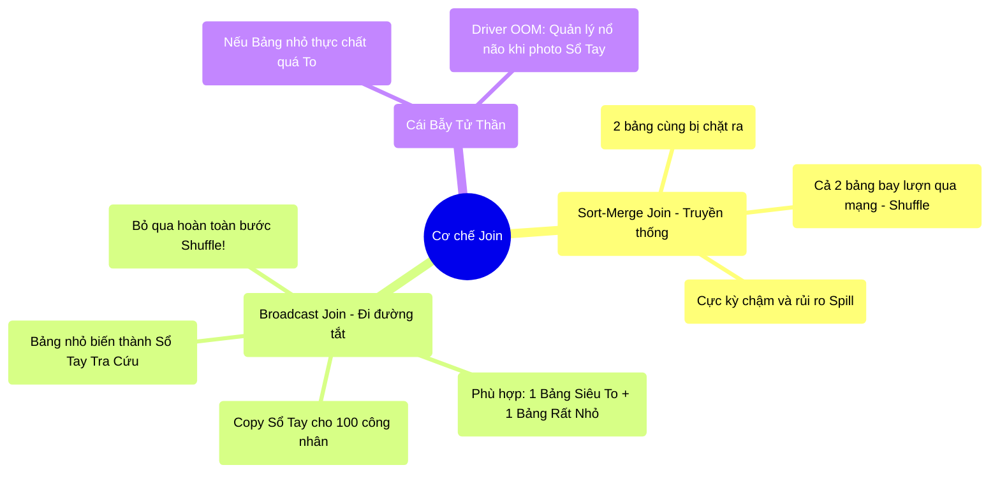

# 6.4 Broadcast Join: Lách Luật Bỏ Qua Shuffle

## 1. Objectives
- [ ] Phân tích điểm nghẽn vật lý của Lệnh Join (Kết nối bảng) thông thường (Sort-Merge Join).
- [ ] Giải phẫu cơ chế Broadcast Join qua **Phép ẩn dụ Tờ Phao Thi / Sổ Tay Tra Cứu**.
- [ ] Hiểu rõ nguy cơ nổ Driver (OOM) nếu lạm dụng Broadcast sai cách.

## 2. Mindmap


## 3. Content

### 3.1. Nỗi Đau Của Sort-Merge Join (Join Truyền Thống)
Thao tác Join (Kết nối dữ liệu từ 2 bảng) là thao tác thường xuyên nhất nhưng cũng tàn khốc nhất trong SQL và Big Data.

Giả sử bạn có **Bảng A (Giao dịch bán hàng - 1 Tỷ dòng, nặng 100GB)** và **Bảng B (Thông tin Quốc gia - 100 dòng, nặng 10 Kilobytes)**. Bạn muốn Join chúng lại theo Mã Quốc Gia để lấy Tên Quốc Gia.

Nếu bạn viết lệnh Join bình thường, Spark sẽ thực thi cơ chế **Sort-Merge Join**:
Spark bắt buộc phải dùng **Shuffle** để ném TẤT CẢ giao dịch của Bảng A (100GB) và TẤT CẢ thông tin của Bảng B chéo qua cáp mạng, sao cho mã quốc gia VN của cả 2 bảng phải hội tụ về cùng một máy tính.
Ném 100GB qua mạng chỉ để tra cứu thông tin của 100 dòng là một hành động giết chết mạng lưới!

### 3.2. Phép Ẩn Dụ: Tờ Phao Thi Tra Cứu (Broadcast Join)
Các Kỹ sư tạo ra một cơ chế lách luật tinh vi mang tên **Broadcast Join (Phát thanh/Truyền phát)**. Nó giúp bạn triệt tiêu hoàn toàn sự xáo trộn (Shuffle) băng thông mạng.

> **[Ví Dụ Trực Quan: 100 Công Nhân Và Tờ Sổ Tay]**
> Thay vì bắt 100 Công Nhân (Workers) cầm 1 Tỷ Hóa Đơn (Bảng A) chạy loăng quăng khắp bưu điện để tìm xem Hóa đơn này ứng với Quốc Gia nào (Bảng B).
> 
> Spark Driver (Người quản đốc) làm một hành động khôn ngoan hơn:
> Nó thấy Bảng B quá nhỏ (Chỉ có 100 quốc gia). Nó lập tức **Photo Bảng B ra thành 100 bản sao (Bản Sổ Tay Tra Cứu)**.
> Quản đốc phát cho mỗi anh Công nhân ĐÚNG 1 CUỐN SỔ TAY NÀY. Cuốn sổ rất nhỏ (10 Kilobytes) nên anh Công nhân nhét vừa vặn vào túi áo (RAM của Worker).
> 
> Từ lúc này, Công nhân đang cầm hóa đơn nào, chỉ việc **rút Sổ Tay trong túi áo ra mà tra cứu**. KHÔNG AI PHẢI ĐI RA KHỎI BÀN. KHÔNG CẦN CHẠY LOĂNG QUĂNG XUYÊN MẠNG (NO SHUFFLE). 
> Cục dữ liệu khổng lồ 1 Tỷ hóa đơn (Bảng A) hoàn toàn ĐỨNG IM không bị xê dịch một milimet nào. Tốc độ Join nhanh như sấm sét!

### 3.3. Giải Phẫu Chuyên Sâu Bằng Code
Trong thực tế, Catalyst Optimizer của Spark tự động kích hoạt Broadcast Join nếu nó thấy Bảng B có kích thước nhỏ hơn $10MB$ (Thuộc tính mặc định `spark.sql.autoBroadcastJoinThreshold = 10MB`).
Nhưng đôi khi, Catalyst không tính toán đúng kích thước, bạn phải TỰ TAY ÉP Spark dùng sổ tay.

```python
# =========================================================================
# LÁCH LUẬT BẰNG BROADCAST HINT
# =========================================================================
from pyspark.sql.functions import broadcast

df_sales = spark.read.parquet("hdfs://100gb_sales.parquet") # Bảng A siêu to
df_country = spark.read.csv("hdfs://10kb_country.csv")      # Bảng B siêu nhỏ

# CÁCH CHẠY NGU NGỐC (Kích hoạt 100GB bay lượn qua Shuffle)
df_bad = df_sales.join(df_country, "country_code")

# CÁCH CHẠY TỐI ƯU CỦA SENIOR (Ép Broadcast bằng tay)
# Gói Bảng nhỏ vào trong hàm broadcast()
# Spark sẽ TỰ ĐỘNG CẮT BỎ hoàn toàn giai đoạn Exchange (Shuffle) trong Physical Plan.
df_good = df_sales.join(broadcast(df_country), "country_code")

# =========================================================================
# SỰ SỤP ĐỔ: CÁI BẪY TỬ THẦN CỦA QUẢN ĐỐC (DRIVER OOM)
# =========================================================================
"""
Đừng quá lạm dụng Broadcast!
Giả sử Bảng B không phải 10KB, mà nó nặng 10 Gigabytes.
Bạn vẫn cố chấp dùng hàm broadcast(df_B).

CHUYỆN GÌ XẢY RA Ở CẤP ĐỘ VẬT LÝ?
- Để photo được cuốn Sổ Tay, Người quản đốc (Driver) phải LẤY Bảng B VỀ BÀN MÌNH.
- Tức là Driver đang dùng hàm collect() ngầm để hút 10GB về.
- Mà RAM của Driver chỉ có 4GB.
-> Quả bóng nổ tung! Toàn bộ máy chủ sập ngóm với lỗi Driver OOM (OutOfMemory).

Quy tắc sinh tồn: Chỉ broadcast khi Bảng bị broadcast NHỎ HƠN RẤT NHIỀU so với RAM của Driver.
"""
```

## 4. Key takeaways
- **Bản chất Broadcast:** Là phép màu giúp loại bỏ hoàn toàn kẻ phá hoại Shuffle khi nối 2 bảng dữ liệu. Dữ liệu lớn đứng im, dữ liệu nhỏ được nhân bản và gửi đến mọi ngóc ngách.
- **Tiết kiệm Mạng lưới:** Broadcast Join biến một tác vụ Wide Dependency (Cần giao tiếp mạng chéo) trở thành một tác vụ Narrow Dependency (Hoạt động hoàn toàn độc lập cục bộ tại 1 máy).
- **Con dao hai lưỡi OOM:** Kích thước bảng bị Broadcast càng lớn, Driver càng dễ bị chết do tràn RAM (Driver OOM). Thậm chí, khi sổ tay (Broadcast) gửi xuống máy Worker quá lớn, Worker nhét sổ tay vào túi áo làm túi áo bị rách luôn (Executor OOM).
