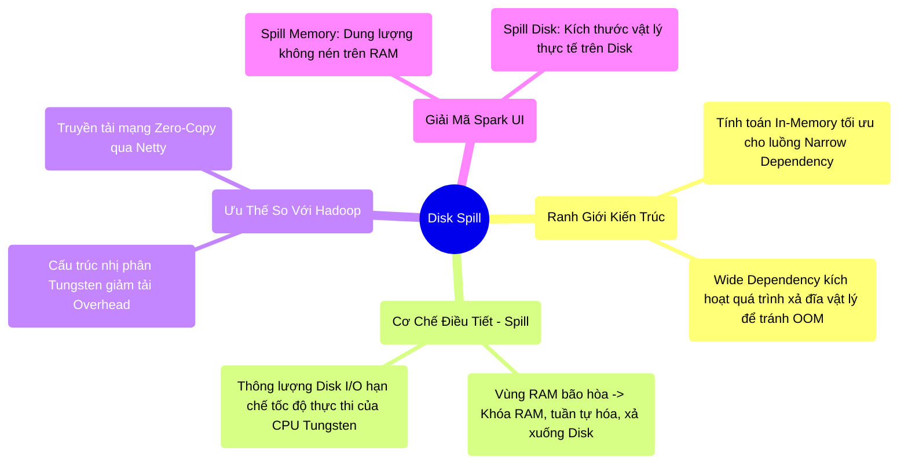

# 6.4 Disk Spill: Khảo Sát Ranh Giới Của Điện Toán Bộ Nhớ (In-Memory)

## 1. Objectives
- [ ] Xác định ranh giới kiến trúc thực tế của mô hình điện toán In-Memory trong Spark.
- [ ] Phân tích cơ chế Xả đĩa (Disk Spill): Cơ chế bảo vệ hệ thống khỏi OOM nhưng đánh đổi bằng hiệu năng CPU.
- [ ] Phân tích so sánh hiệu năng Shuffle giữa Spark và Hadoop MapReduce để làm rõ nguyên lý tốc độ.
- [ ] Giải mã các chỉ số giám sát `Spill (Memory)` và `Spill (Disk)` trên giao diện Spark UI.

## 2. Mindmap


## 3. Content

Một trong những luận điểm phổ biến trong hệ sinh thái Big Data là: *Hadoop chậm do phụ thuộc vào đĩa cứng, trong khi Spark đạt tốc độ vượt trội nhờ xử lý hoàn toàn In-Memory*. Dưới góc độ kiến trúc hệ thống, đây là một nhận định **chưa toàn diện**. Spark tận dụng tối đa In-Memory ở các chuỗi Narrow Dependency thông qua cơ chế Pipelining (Xem Bài 3.3). Tuy nhiên, khi hệ thống vấp phải ranh giới Shuffle (Wide Dependency), Spark bắt buộc phải tiến hành ghi dữ liệu xuống đĩa vật lý nhằm đảm bảo khả năng phục hồi lỗi (Fault Tolerance) và ngăn chặn tràn bộ nhớ. Sự kiện này được gọi là **Disk Spill (Xả Đĩa)**.

### 3.1. Cơ Chế Điều Tiết OOM: Disk Spill
Trong kiến trúc UMM (Bài 5.3), vùng Execution Memory chịu trách nhiệm cấp phát bộ nhớ cho thuật toán Tính toán. Phân tích kịch bản kỹ sư thực thi lệnh Join trên hai tập dữ liệu 1 Terabyte, nhưng giới hạn RAM của Executor chỉ đạt 10GB.

**Trình tự kích hoạt Spill:**
1. Không gian Execution 10GB nhanh chóng bị lấp đầy bởi các cấu trúc dữ liệu của thuật toán Hash/Sort.
2. Khi RAM chạm ngưỡng bão hòa, thay vì báo lỗi OOM, Operator sẽ kích hoạt cơ chế báo động **Spill**.
3. **Thao tác Xả đĩa:** Hệ thống tạm dừng nạp dữ liệu, tiến hành nén (Compress) và tuần tự hóa 10GB dữ liệu hiện hữu, sau đó ghi đè xuống đĩa cơ học cục bộ (Local HDD/SSD).
4. Sau khi giải phóng RAM, hệ thống tiếp tục nạp khối dữ liệu tiếp theo, và lặp lại quá trình xả. Kết thúc giai đoạn, hệ thống hợp nhất (Merge) toàn bộ dữ liệu trên đĩa và tiến hành định tuyến mạng.

### 3.2. Đánh Đổi Hiệu Năng (Trade-off) 
Cơ chế Spill là chốt chặn an toàn bảo vệ hệ thống khỏi OOM, nhưng nó tạo ra một **điểm nghẽn thông lượng (Throughput Bottleneck)**. Dữ liệu Spill phải chịu chi phí luân chuyển vòng lặp: Bị ép ghi xuống đĩa, sau đó đọc ngược trở lên.

**Sự chênh lệch thông lượng I/O:**
Trục từ tính của ổ cứng HDD tại Datacenter duy trì thông lượng đọc/ghi khoảng **100-200MB/s**. Trong khi đó, luồng thực thi mã máy Tungsten CodeGen có khả năng tiêu thụ dữ liệu trên RAM ở mức **hàng chục GB/s**. Khi Spill xảy ra, xung nhịp CPU siêu tốc của Tungsten bị buộc phải ngưng trệ (Stall) để chờ đợi luồng Disk I/O. Lợi thế điện toán In-Memory bị suy giảm đáng kể.

### 3.3. Spark Shuffle vs Hadoop MapReduce
Mặc dù sử dụng chung cơ chế Spill-to-Disk khi đối mặt với Shuffle, hệ thống Spark vẫn duy trì tốc độ vượt trội so với Hadoop MapReduce nhờ ba cải tiến kiến trúc cốt lõi:
1. **Tungsten Binary Format:** Hadoop luân chuyển dữ liệu thông qua cấu trúc Java Serialization nặng nề. Spark lưu trữ dữ liệu dưới định dạng nhị phân UnsafeRow nén chặt, giúp tối ưu băng thông đĩa cứng (Disk I/O) khi Spill.
2. **Zero-Copy Networking:** Phía Reduce của Hadoop sử dụng HTTP Fetch, tốn kém chi phí Context Switch qua CPU. Spark Fetch sử dụng thư viện Netty với kiến trúc Zero-Copy, truyền thẳng dữ liệu từ mặt đĩa vào Network Interface Card (NIC).
3. **Lược bỏ I/O trung gian:** Spark Pipeline gộp các toán tử Narrow Dependency thành một Stage duy nhất, loại bỏ hoàn toàn các bước ghi đĩa trung gian thừa thãi giữa các toán tử Map mà Hadoop thường mắc phải.

### 3.4. Runbook: Đọc Chỉ Số UI Spark

> [!CAUTION] Cảnh Báo Thiết Kế: Giải Mã Chỉ Số Spill
> Tab Stages trên Spark UI thường cung cấp hai chỉ số giám sát đặc thù: **Spill (Memory)** và **Spill (Disk)**. Cần phân định rõ ý nghĩa vật lý của hai chỉ số này.
> 1. **Spill (Memory):** Biểu thị kích thước dữ liệu LÚC CHƯA TUẦN TỰ HÓA VÀ NÉN, khi nó còn nằm trên RAM với đầy đủ cấu trúc Object Overhead. Con số này thường rất lớn và mang tính chất tham khảo.
> 2. **Spill (Disk):** Biểu thị kích thước lưu trữ VẬT LÝ THỰC TẾ sau khi đã nén và xả xuống đĩa từ. Nếu chỉ số này tăng đột biến, hệ thống đang đối mặt với nguy cơ thắt cổ chai Disk I/O nghiêm trọng.

**[Config Snippet: Can Thiệp Cấu Trúc Trị Spill]**
Tối ưu hóa các truy vấn SQL sẽ mất đi ý nghĩa nếu hệ thống duy trì mức độ Disk Spill quá cao.
```bash
# PHƯƠNG PHÁP 1: Mở rộng khả năng chịu tải (Tăng RAM)
# Mở rộng Execution Memory trì hoãn quá trình bão hòa, nhưng cần kiểm soát rủi ro GC Overhead.
--conf spark.executor.memory=32g 

# PHƯƠNG PHÁP 2: Tái định cỡ Phân mảnh (Tối ưu Partitions)
# Gia tăng số lượng Partitions. Phân mảnh nhỏ hơn sẽ dễ dàng khớp với 
# giới hạn cấp phát RAM của Executor, hạn chế kích hoạt Spill.
--conf spark.sql.shuffle.partitions=2000 
```

## 4. Key takeaways
- **Thực tế In-Memory**: Sự phụ thuộc vào quá trình ghi đĩa (Spill) là bắt buộc tại các ranh giới Shuffle để đảm bảo độ ổn định của luồng xử lý phân tán quy mô lớn.
- **Spark vs Hadoop**: Bất chấp việc xả đĩa, Spark vẫn vượt trội hơn Hadoop nhờ vào cấu trúc nén nhị phân Tungsten và kỹ thuật truyền mạng Zero-Copy.
- **Tái định cỡ**: Giải pháp xử lý Spill không chỉ nằm ở việc tăng bộ nhớ vật lý, mà còn thông qua việc băm nhỏ phân mảnh dữ liệu (`spark.sql.shuffle.partitions`) để đáp ứng giới hạn RAM khả dụng.
