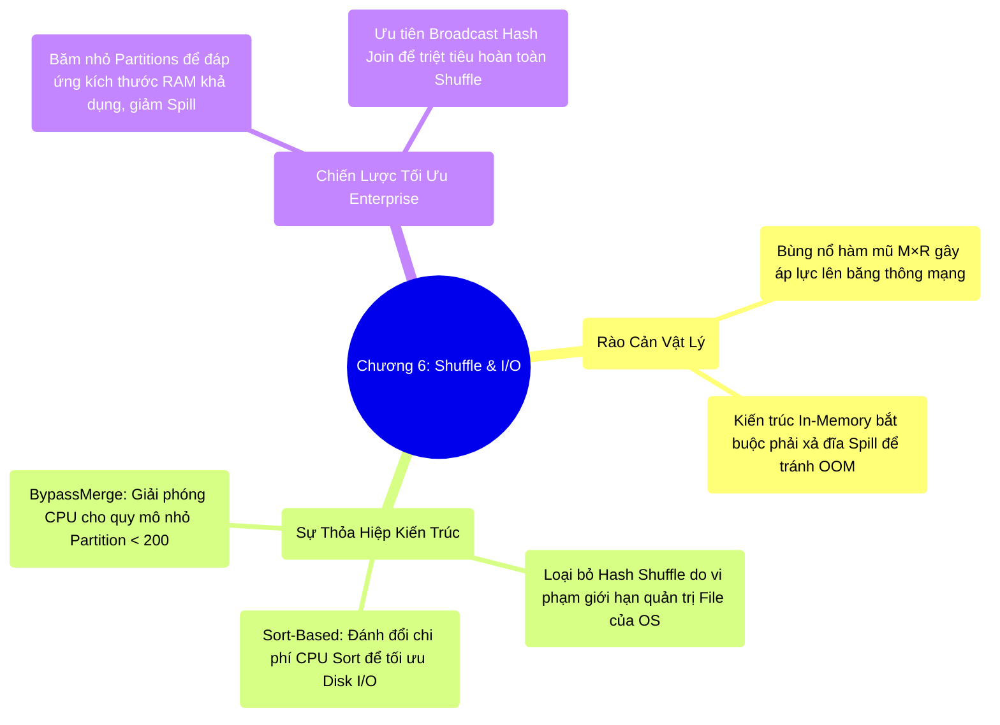

# 6.5 Tổng Kết Chương 6: Rào Cản Mạng Lưới Và Hệ Thống I/O

## 1. Objectives
- [ ] Tổng hợp bức tranh giới hạn vật lý của ranh giới Shuffle: Nơi kiến trúc In-Memory phải đối mặt với băng thông mạng và đĩa cứng.
- [ ] Đúc kết lịch sử tiến hóa từ Hash Shuffle sang 3 nhánh của Sort-Based Shuffle.
- [ ] Xây dựng triết lý tối ưu (Tuning Philosophy) ở cấp độ Enterprise: Tối ưu Shuffle không phải là tăng tốc độ của nó, mà là tái cấu trúc hệ thống để lẩn tránh nó.

## 2. Mindmap

## 3. Content

Nếu Chương 5 là minh chứng cho năng lực thiết kế phần mềm xuất sắc của Spark (Giải quyết giới hạn JVM thông qua Off-Heap), thì Chương 6 vẽ ra một lăng kính thực tế về **Sự thỏa hiệp của phần mềm trước giới hạn vật lý cốt lõi (Network và Disk I/O).**

Bản chất của kiến trúc phân tán là sự trao đổi thông tin. Toàn bộ lợi thế điện toán In-Memory bị suy giảm đáng kể ngay tại khoảnh khắc toán tử Shuffle được kích hoạt:
- Hệ thống mạng đối mặt với nguy cơ thắt cổ chai cục bộ do phải điều phối một lượng khổng lồ các khối dữ liệu logic ($M \times R$).
- Để giải quyết bài toán giới hạn File Descriptors của hệ điều hành Linux, hệ thống đành đánh đổi bằng việc ép CPU phải thi hành thuật toán Sắp xếp (Sort-Based Shuffle).
- Để giải cứu vùng nhớ RAM khỏi sự cố OOM, Spark bắt buộc sử dụng **Disk Spill**. Thay vì vận hành ở tốc độ ánh sáng của L1/L2 Cache, luồng dữ liệu bị ép nén và xả xuống đĩa từ cục bộ, kéo tụt thông lượng hệ thống về mức giới hạn của ổ cứng (100MB/s - 500MB/s).

**Đính Chính Về Hiệu Năng:** Dù vấp phải giới hạn Disk Spill tương tự như Hadoop MapReduce, cấu trúc Shuffle của Spark vẫn đảm bảo hiệu năng vượt trội nhờ ba yếu tố: (1) Nền tảng dữ liệu nhị phân nguyên thủy Tungsten, (2) Sự kết hợp các toán tử lân cận (Pipelining) nhằm triệt tiêu I/O trung gian, và (3) Hệ thống truyền tải Zero-Copy qua Netty.

### 3.1. Triết Lý Tối Ưu Hóa Kỷ Nguyên Mới (Tuning Philosophy)
Thấu hiểu bản chất cơ học của Chương 6 giúp Kỹ sư Dữ liệu nhận ra: Công việc Tuning Spark ở quy mô Petabyte không đơn thuần là hiệu chỉnh vài tham số RAM hệ thống.

**1. Chân Lý Tối Ưu (The Ultimate Truth):**
Nghệ thuật tối ưu hệ thống cốt lõi không nằm ở việc làm cho thuật toán Shuffle chạy nhanh hơn một cách cưỡng ép. Tối ưu đích thực là **Tái cấu trúc kiến trúc dữ liệu nhằm giảm thiểu tối đa, hoặc né tránh hoàn toàn quá trình Shuffle.**

**2. Chiến Lược Broadcast:**
Sử dụng năng lực phân tích của Catalyst (Chương 4) để thúc đẩy hệ thống sử dụng thuật toán `Broadcast Hash Join`. Việc gửi các bảng Dimension nhỏ (Lookup Tables) đến toàn bộ Node sẽ triệt tiêu hoàn toàn quá trình Shuffle khổng lồ của các Fact Tables.

**3. Cơ Chế Phân Mảnh (Partitions):**
Nếu quy trình Shuffle là không thể tránh khỏi, hãy kiểm soát tính tương thích của khối dữ liệu so với bộ nhớ. Việc gia tăng thông số `spark.sql.shuffle.partitions` (Từ 200 lên mức 2.000 hoặc 10.000) sẽ băm nhỏ kích thước các phân mảnh. Mỗi khối phân mảnh khi đủ nhỏ sẽ nằm gọn lấp đầy không gian Execution Memory mà không kích hoạt cơ chế tràn đĩa (Né Disk Spill).

## 4. Key takeaways
- **Giới hạn cốt lõi**: Disk I/O và Network Bandwidth là hai rào cản vật lý khắc nghiệt nhất của điện toán phân tán. Mọi nỗ lực tối ưu phần mềm đều phải chịu sự chi phối của tốc độ phần cứng gốc.
- **Né tránh thay vì đối đầu**: Các Kỹ sư Enterprise không tìm cách ép hệ thống Shuffle mượt mà trên lượng dữ liệu khổng lồ, họ tập trung thiết kế kiến trúc lưu trữ và quy trình ETL sao cho hệ thống ít phải Shuffle nhất có thể.
- **Lời tựa Chương 7**: Xuyên suốt 6 Chương đầu, chúng ta đã tối ưu hóa mọi luồng dữ liệu **bên trong** phạm vi cụm máy tính (CPU, RAM, Cache, Network). Tuy nhiên, dữ liệu thô gốc thực tế nằm ở hệ thống lưu trữ bên ngoài (S3, HDFS, GCS). Làm thế nào Spark có thể trích xuất hàng Petabytes dữ liệu từ S3 mà không làm sập luồng I/O ngay từ vạch xuất phát? Làm sao để Catalyst có thể thọc sâu vào định dạng tệp tin (Parquet) để sàng lọc dữ liệu? Chúng ta sẽ giải phẫu chủ đề này tại **Chương 7 — Storage & Formats**.
