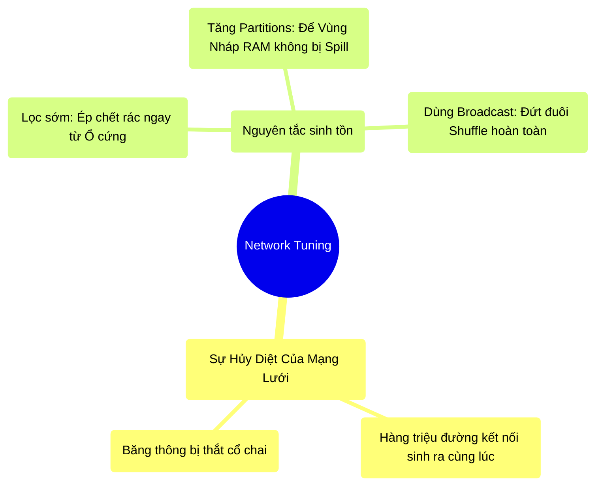

# 6.5 Tổng Kết: Cân Chỉnh Cáp Mạng (Network Tuning)

## 1. Objectives
- [ ] Chốt lại khái niệm và sự nguy hiểm của Network Bottleneck.
- [ ] Tổng hợp các nguyên tắc sinh tồn để trị bệnh Shuffle.
- [ ] Mở lối sang Giai đoạn tối ưu hóa tiếp theo (Cột mốc Storage).

## 2. Mindmap

## 3. Content

### 3.1. Dây Cáp Mạng - Yết Hầu Của Hệ Thống Phân Tán
Trong kỷ nguyên Scale Out (Mua hàng ngàn máy chủ rẻ tiền thay vì 1 siêu máy chủ), Điểm mù lớn nhất của mọi hệ thống phân tán là tốc độ giao tiếp giữa các cỗ máy đó. Không một cáp quang (Network Cable) nào trên đời có tốc độ sánh được với việc truyền tín hiệu bên trong nội bộ thanh RAM của một cái máy tính.

Chính vì vậy, **Shuffle (Sự xáo trộn dữ liệu qua mạng)** là Kẻ Thù Số 1. Mọi đoạn code, mọi giải pháp kiến trúc của Data Engineer đều phải nhằm mục đích: **Triệt tiêu, Bỏ qua, hoặc Làm nhỏ nhất** lưu lượng dữ liệu lọt vào sợi cáp mạng.

### 3.2. Cẩm Nang Sinh Tồn Khỏi Cơn Ác Mộng Mạng Lưới
Xuyên suốt Chương 6, chúng ta đã chứng kiến Spark vật lộn với Shuffle như thế nào. Dưới đây là những luật bất thành văn (Best Practices) của ngành Big Data để tối ưu Network:

1. **Lệnh Wide Luôn Nằm Ở Đáy (Bộ lọc tác nhân):** Giống như Bài 3.3 đã đề cập, phải bào mòn dữ liệu đến mức tận cùng bằng các lệnh Narrow (Filter, Select, Where) TRƯỚC KHI gọi các lệnh Wide gây Shuffle (GroupBy, Join, Distinct). 
2. **Kéo Căng Khung Cửi (Tăng Shuffle Partitions):** Cấu hình mặc định `spark.sql.shuffle.partitions = 200` của Spark là một con số rất nguy hiểm khi xử lý dữ liệu quy mô Terabytes. Tại sao? Vì 1000GB dữ liệu chia cho 200 mảnh, mỗi mảnh nặng tới 5GB. 5GB ập vào Vùng Giấy Nháp (Execution Memory) của 1 máy sẽ gây ra hiện tượng tràn đĩa (Disk Spill). Hãy mạnh dạn tăng thông số này lên 2000, 5000, hoặc thậm chí 10.000 để dữ liệu được băm thật nhuyễn trước khi Shuffle. (Ở Chương 8, tính năng AQE sẽ tự động lo việc này cho bạn).
3. **Tuyệt Chiêu Photo Sổ Tay (Broadcast Join):** Bất cứ khi nào bạn có 1 bảng danh mục (Lookup table) nhỏ (dưới vài chục Megabytes) cần nối (Join) với một bảng tỷ dòng khổng lồ, HÃY DÙNG `broadcast(bảng_nhỏ)`. Nó cắt đứt hoàn toàn pha xáo trộn mạng, giải quyết hàng giờ đồng hồ chạy hệ thống. Tránh lạm dụng để không bị nổ RAM Máy chủ (Driver OOM).

### 3.4. Điểm Đến Cuối Cùng Của Cổ Chai (Disk I/O)
Chúng ta đã đi qua Giới hạn của CPU/RAM (Chương 5), Giới hạn của Dây cáp mạng (Chương 6). 
Nhưng nếu bạn để ý, từ chương 1 đến giờ, luôn có một Căn hầm tăm tối luôn bị chê bai là chậm chạp nhất, đó chính là **Ổ Cứng (Disk / Storage)**. Khi RAM tràn, dữ liệu bị tống xuống Ổ cứng. Khi Shuffle bùng nổ, dữ liệu cũng phải ghi nháp xuống Ổ cứng.

Vậy làm sao để cái Ổ cứng tăm tối đó hoạt động nhanh hơn? Đâu là giới hạn vật lý của việc lưu trữ? Chúng ta sẽ bước sang **Chương 7 (Storage & Formats)** để bóc trần sự vi diệu của Tủ sách Parquet và cơ chế ghi nén dữ liệu.
