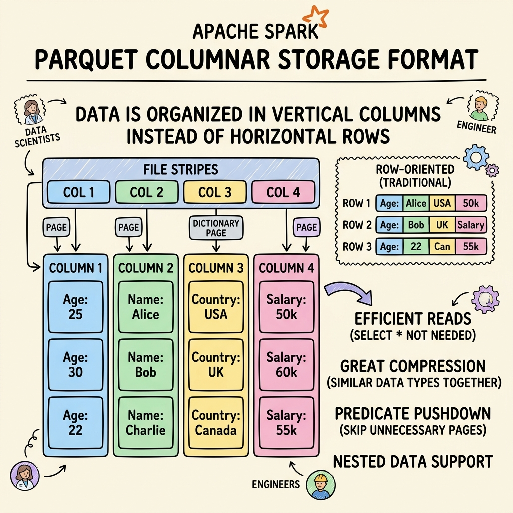
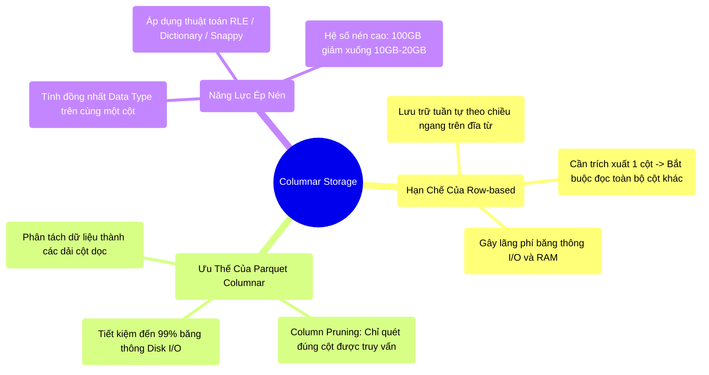

# 7.1 Columnar Storage: Lợi Thế Kiến Trúc Của Định Dạng Parquet




## 1. Objectives
- [ ] Phân tích điểm nghẽn của Disk I/O và RAM khi lưu trữ hệ phân tán bằng định dạng Row-based (CSV/JSON).
- [ ] Mổ xẻ nguyên lý Column Pruning của Parquet nhằm tối ưu hóa quá trình quét dữ liệu.
- [ ] Giải phẫu khả năng nén (Data Compression) vượt trội đạt được nhờ tính đồng nhất kiểu dữ liệu.

## 2. Mindmap


## 3. Content

Mặc dù kiến trúc Spark đã được tối ưu hóa toàn diện ở phân hệ Memory (Tungsten Off-Heap) và CPU (Whole-Stage CodeGen). Tuy nhiên, toàn bộ năng lực điện toán này sẽ bị vô hiệu hóa nếu hệ thống gặp thắt cổ chai ngay tại lớp Lưu trữ ngoại vi (Storage Layer).
Trong hệ thống Data Warehouse và Data Lake quy mô lớn, thông lượng I/O phụ thuộc trực tiếp vào việc dữ liệu trên ổ cứng được tổ chức theo chiều ngang (Row-based) hay chiều dọc (Columnar).

### 3.1. Hạn Chế Của Định Dạng Row-based (CSV/JSON)
Các định dạng như CSV hoặc JSON được thiết kế để tối ưu khả năng đọc hiểu của con người (Human-readable). Tuy nhiên, đối với hệ thống tính toán, việc bố trí dữ liệu theo chiều dòng (Row-based) tạo ra một điểm nghẽn vật lý nghiêm trọng.
- Trên rãnh đĩa từ tính, một bản ghi được lưu trữ liền kề theo dạng: `[ID:1, Tên:Hải, Tuổi:30] [ID:2, Tên:Minh, Tuổi:25]`...

> [!CAUTION] Cảnh Báo Thiết Kế: Điểm Nghẽn Quét Dữ Liệu
> Phân tích truy vấn trên một bảng Data Warehouse chứa **500 cột**.
> Câu lệnh truy vấn: `SELECT AVG(Tuổi) FROM Table`.
> - **Cơ chế hoạt động:** Do mâm đĩa từ quay theo khối ngang và dữ liệu được tuần tự hóa theo dòng, hệ điều hành bắt buộc phải đọc (I/O Scan) toàn bộ **499 cột không liên quan** (ID, Tên,...) lên không gian RAM để phân tách.
> - **Hệ quả:** Spark phải nạp một lượng khổng lồ rác dữ liệu vào bộ nhớ rồi ngay lập tức loại bỏ chúng. Băng thông Đĩa và Mạng bão hòa. Xung nhịp CPU Tungsten bị lãng phí để chờ luồng Disk I/O, gia tăng nguy cơ OOM.

### 3.2. Cấu Trúc Columnar-based (Apache Parquet)
Định dạng Columnar-based như Apache Parquet giải quyết triệt để nút thắt này thông qua nguyên lý: **Tái cấu trúc bảng dữ liệu thành các dải giá trị cột dọc trước khi ghi xuống mặt đĩa.**
- Khối rãnh đĩa 1: `[1, 2]` (Chỉ chứa ID)
- Khối rãnh đĩa 2: `[Hải, Minh]` (Chỉ chứa Tên)
- Khối rãnh đĩa 3: `[30, 25]` (Chỉ chứa Tuổi)

**Khái niệm Column Pruning (Lược bỏ cột):**
Khi hệ thống thực thi lệnh `SELECT AVG(Tuổi)`, mũi kim đọc (Read pointer) của HĐH chỉ truy xuất trực tiếp vào Khối rãnh đĩa số 3 để nạp cột Tuổi lên RAM. Toàn bộ 499 cột còn lại bị bỏ qua ở cấp độ I/O. Lượng dữ liệu trung chuyển từ Disk I/O được cắt giảm theo tỷ lệ thuận với số lượng cột bị loại trừ, giải phóng băng thông mạng nội bộ.

**[Code Snippet: Chuẩn Mực Storage Layer]**
```python
# Production Pattern: Triệt tiêu CSV/JSON trong luồng xử lý trung tâm. 
# Bắt buộc chuyển hóa Data Lake thành Parquet.
df.write.format("parquet") \
    .mode("overwrite") \
    .save("s3a://data-lake/core-tables/users/")
```

### 3.3. Tối Ưu Hóa Lưu Trữ Bằng Nén Dữ Liệu Đồng Nhất
Bên cạnh Column Pruning, siêu lợi thế của Parquet là năng lực nén dữ liệu (Data Compression).
Trong kiến trúc Row-based, một khối Byte chứa hỗn hợp các kiểu dữ liệu (String, Integer, Date), làm giảm hiệu năng của các thuật toán nén.
Ngược lại, trong Parquet, một cột (Ví dụ: `Quốc_gia`) chỉ chứa duy nhất một kiểu dữ liệu đồng nhất (Data Type Homogeneity). Trạng thái đồng nhất này tối ưu hóa tuyệt đối cho các thuật toán nén chuyên dụng:
- **Run-Length Encoding (RLE):** Nếu một cột có 1 tỷ chữ Vietnam lặp lại, thuật toán RLE sẽ nén chúng thành định dạng `[Vietnam, count=1.000.000.000]`, thu gọn dữ liệu từ mức Gigabytes xuống mức Bytes.
- **Dictionary Encoding:** Lập chỉ mục các giá trị duy nhất trong một cột (Ví dụ: Các mã Tỉnh thành) và lưu trữ tham chiếu dạng Integer.
- **Hệ quả:** Một tập dữ liệu thô CSV dung lượng 100GB khi được chuyển hóa qua Parquet kết hợp cùng chuẩn nén Snappy hoặc ZSTD có thể giảm kích thước vật lý xuống mức **10GB - 20GB**, tiết kiệm chi phí Cloud Storage đáng kể.

## 4. Key takeaways
- **Lãng phí I/O**: Việc duy trì định dạng CSV/JSON trong môi trường xử lý phân tán (Production) tạo ra các điểm nghẽn Disk I/O và RAM nghiêm trọng do hạn chế của cấu trúc Row-based.
- **Tối ưu theo chiều dọc**: Lưu trữ Columnar (Parquet) bảo vệ hệ thống thông qua Column Pruning, chặn đứng 99% dữ liệu dư thừa ngay tại tầng đọc của đĩa từ.
- **Sự chuyển giao**: Mặc dù Parquet loại bỏ được các cột không cần thiết, nhưng với những cột chứa hàng tỷ dòng giá trị, việc lọc các hàng (Ví dụ: `Tuổi > 30`) trước khi nạp vào RAM yêu cầu những kỹ thuật lập chỉ mục nâng cao. Khả năng lọc này được quản trị thông qua **Footer Metadata** ở cấp độ Row Group. Phân tích chi tiết sẽ được làm rõ ở Bài 7.2.
