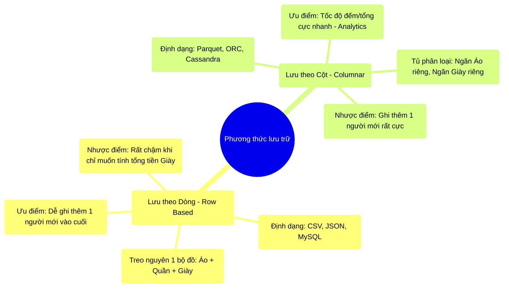

# 7.1 Lưu Trữ Theo Dòng vs Theo Cột (Row vs Columnar Storage)

## 1. Objectives
- [ ] Phân biệt hai phương pháp lưu trữ dữ liệu vật lý qua **Phép ẩn dụ Tủ Quần Áo**.
- [ ] Giải phẫu lý do tại sao CSV/JSON (Row-based) lại là thảm họa khi làm Analytics.
- [ ] Khẳng định sức mạnh của Columnar Storage (Lưu trữ theo cột) trong Big Data.

## 2. Mindmap


## 3. Content

### 3.1. Phép Ẩn Dụ: Sắp Xếp Tủ Quần Áo
Dữ liệu nằm trên Ổ cứng vật lý (Hard Drive) không phải là những con số lơ lửng, nó bắt buộc phải được ghi theo một trật tự cụ thể. Có 2 cách sắp xếp tủ quần áo (Lưu trữ dữ liệu).

Giả sử một dữ liệu khách hàng có 3 thuộc tính (Cột): `[Tên, Tuổi, Nghề nghiệp]`.

> **[Ví Dụ Trực Quan: Cách Treo Đồ (Row-Based)]**
> Đây là cách lưu trữ truyền thống (CSV, JSON, RDBMS). Bạn cất đồ theo dạng Bộ.
> Bạn lấy Tên, Tuổi, Nghề của Khách hàng 1 treo thành một móc. Sau đó treo tiếp Khách 2, Khách 3...
> - **Ưu điểm (Transactional - Bán hàng):** Nếu có thêm 1 Khách Hàng mới (Giao dịch mới), bạn chỉ việc lấy bộ đồ của người đó máng vào cuối tủ. Rất nhanh!
> - **Nhược điểm (Analytical - Phân tích):** Sếp yêu cầu bạn: Hãy đếm xem độ tuổi trung bình của khách hàng là bao nhiêu?. 
> Chuyện gì xảy ra? Bạn phải LÔI TỪNG BỘ QUẦN ÁO RA, vạch áo lên chỉ để xem cái quần (Cột Tuổi), rồi cất vào, lôi bộ tiếp theo ra. Tốc độ đọc (Disk I/O) trở nên cực kỳ chậm chạp và dư thừa, vì bạn bị ép phải đọc cả Tên và Nghề nghiệp dù Sếp không hề hỏi.

> **[Ví Dụ Trực Quan: Cách Bỏ Ngăn Kéo (Columnar)]**
> Đây là cách lưu trữ sinh ra dành cho Big Data (Parquet, ORC).
> Bạn thiết kế cái tủ có 3 ngăn kéo: Ngăn Tên, Ngăn Tuổi, Ngăn Nghề nghiệp.
> Bạn tống toàn bộ Tên của 1 triệu khách hàng vào Ngăn số 1. Toàn bộ Tuổi vào Ngăn 2.
> - **Nhược điểm:** Khi có 1 Khách mới tới, bạn không thể treo lên móc được. Bạn phải lấy áo bỏ vào Ngăn 1, đi sang Ngăn 2 cất quần, đi sang Ngăn 3 cất giày. (Ghi dữ liệu rất chậm).
> - **Ưu điểm (Phân tích bùng nổ):** Khi sếp hỏi: Độ tuổi trung bình là bao nhiêu?.
> Kéo RẸT một phát cái Ngăn số 2 ra (Cột Tuổi). 1 Triệu con số Tuổi nằm xếp lớp liên tiếp nhau. Bỏ qua hoàn toàn Cột Tên và Cột Nghề. Tốc độ đọc dữ liệu (Disk I/O) NHANH GẤP HÀNG TRĂM LẦN!

### 3.2. Column Pruning Của Catalyst Có Tác Dụng Khi Nào?
Ở Bài 4.3, chúng ta đã học về phép thuật **Column Pruning (Tỉa cột)** của Catalyst Optimizer. 
Sếp kêu đếm Tuổi, Catalyst sẽ ra lệnh chỉ cầm tờ giấy Tuổi lên.

**NHƯNG SỰ THẬT CAY ĐẮNG LÀ:** Column Pruning CỦA SPARK SẼ HOÀN TOÀN VÔ DỤNG NẾU BẠN LƯU BẰNG ĐỊNH DẠNG CSV/JSON.

```python
# =========================================================================
# LỖI KHI DÙNG SAI ĐỊNH DẠNG VẬT LÝ (ROW-BASED)
# =========================================================================

# Khởi tạo: File Log định dạng JSON (Nặng 1TB, 100 Cột).
df = spark.read.json("hdfs://logs.json")

# Bạn ra lệnh Catalyst Tỉa Cột (Chỉ lấy đúng 1 cột 'age')
df_age = df.select("age").count()

# HẬU QUẢ VẬT LÝ TRÊN Ổ CỨNG:
"""
Mặc dù Catalyst ra lệnh: "Chỉ lấy cột Age".
Nhưng JSON là định dạng Row-based. Nó ép các cột nằm dính chặt vào nhau trên ổ đĩa.
Ổ Cứng (Disk) không thể dùng nhíp gắp từng cột Age ra được! Nó bắt buộc phải đọc 
TOÀN BỘ 1TB DỮ LIỆU (Đọc cả 100 cột) kéo lên RAM, sau đó Catalyst mới có thể lọc vứt 
đi 99 cột kia.
-> 1TB dữ liệu quét qua Ổ cứng: Chạy mất 2 TIẾNG ĐỒNG HỒ!
"""
```

```python
# =========================================================================
# KHI CATALYST KẾT HỢP VỚI COLUMNAR STORAGE (PARQUET)
# =========================================================================

# Khởi tạo: File đó được lưu lại bằng Parquet (Columnar - Ngăn kéo).
df = spark.read.parquet("hdfs://logs.parquet")
df_age = df.select("age").count()

# HẬU QUẢ VẬT LÝ TRÊN Ổ CỨNG:
"""
Catalyst ra lệnh: "Chỉ lấy cột Age".
Ổ Cứng: Kéo RẸT cái ngăn kéo chứa cột Age ra. Các cột khác nằm ở sector khác 
trên ổ cứng KHÔNG HỀ BỊ CHẠM ĐẾN. 
Lượng dữ liệu bị đọc từ Ổ Cứng: Chỉ có 10GB (Thay vì 1TB).
-> Chạy xong trong 30 GIÂY!
"""
```

## 4. Key takeaways
- **Từ bỏ CSV/JSON:** Trong Big Data, dùng CSV hay JSON để làm phân tích là một tội ác. Nó là định dạng Row-based, phá hủy hoàn toàn sức mạnh đọc dữ liệu của cụm máy chủ.
- **Tiêu chuẩn Parquet:** Parquet (hoặc ORC) là định dạng Columnar (Lưu theo cột). Nó là chìa khóa duy nhất để kích hoạt khả năng Column Pruning (Tỉa cột) của Catalyst Optimizer.
- **Đánh đổi Read/Write:** Định dạng Cột (Columnar) chỉ dùng cho các hệ thống Data Warehouse / Data Lake nơi dữ liệu chủ yếu được Đọc để phân tích. Đối với các ứng dụng Web / App Mobile cần ghi chép dữ liệu giao dịch liên tục, định dạng Dòng (Row-based) vẫn là bắt buộc.
