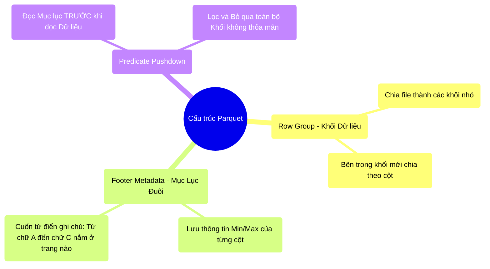

# 7.2 Lặn Sâu Vào Parquet & Quyền Năng Của Mục Lục (Predicate Pushdown)

## 1. Objectives
- [ ] Mổ xẻ cấu trúc vật lý của File Parquet qua **Phép ẩn dụ Cuốn Từ Điển**.
- [ ] Chứng minh cách Footer Metadata (Mục lục đuôi) triệt tiêu Disk I/O.
- [ ] Phân tích lý do Predicate Pushdown (Đẩy lệnh lọc xuống đĩa) chỉ hoạt động hoàn hảo trên Parquet.

## 2. Mindmap


## 3. Content

### 3.1. Phép Ẩn Dụ: Cuốn Từ Điển Của Parquet
Như Bài 7.1 đã chứng minh, Parquet cắt dữ liệu thành từng Ngăn kéo (Cột) để đọc siêu nhanh. Nhưng quyền năng đáng sợ nhất của Parquet không nằm ở việc chia cột, mà nằm ở **Cuốn Mục Lục (Metadata)** của nó.

> **[Ví Dụ Trực Quan: Cách Tra Từ Điển]**
> Hãy tưởng tượng một file Parquet là Cuốn Từ Điển Anh-Việt dày 10.000 trang. Dữ liệu bên trong đã được sắp xếp theo thứ tự A-Z.
> 
> Nếu bạn tìm chữ Spark trên file CSV (Không có mục lục), bạn phải lật TỪ TRANG 1 ĐẾN TRANG 10.000 (Đọc toàn bộ ổ cứng) để tìm.
>
> Nhưng Parquet có một cuốn Mục Lục. Ở Footer (Đáy file) của Parquet, nó ghi rất rõ:
> - Cục số 1 (Trang 1-1000): Bắt đầu bằng chữ **A**, Kết thúc bằng chữ **C** (Min='A', Max='C').
> - Cục số 2 (Trang 1001-2000): Bắt đầu bằng chữ **D**, Kết thúc bằng chữ **F** (Min='D', Max='F').
> - Cục số 9 (Trang 8001-9000): Min='S', Max='T'.
>
> **Lệnh Tìm Chữ Spark:** Spark (Cô thủ thư) không hề đụng vào cuốn từ điển. Nó đọc cái Mục Lục trước. Nó thấy chữ Spark nằm giữa chữ S và T. Nó lập tức VỨT BỎ Cục 1 đến Cục 8, VỨT BỎ Cục 10. Nó chỉ giở đúng Trang 8001 ra để đọc! 

Cơ chế Nhìn Mục lục vứt Dữ liệu này chính là **Predicate Pushdown** (Ép điều kiện lọc xuống tận ổ cứng) mà Catalyst Optimizer ở Bài 4.3 đã sử dụng.

### 3.2. Min/Max Filtering (Sàng Lọc Bằng Khoảng Giá Trị)
Trong Parquet, dữ liệu được chia thành các **Row Group (Khối dòng)** - thường nặng khoảng 128MB.
Ở Footer của mỗi File Parquet, nó lưu trữ số liệu thống kê (Statistics) của TỪNG CỘT trong TỪNG ROW GROUP. Cụ thể nhất là giá trị **Min (Nhỏ nhất)** và **Max (Lớn nhất)**.

Hãy xem điều kỳ diệu về mặt vật lý khi bạn viết lệnh lọc dữ liệu (Filter):

```python
# =========================================================================
# LUỒNG VẬT LÝ CỦA PREDICATE PUSHDOWN TRÊN PARQUET
# =========================================================================

# Khởi tạo: File log.parquet nặng 1TB (Chứa dữ liệu giao dịch 10 năm).
df = spark.read.parquet("hdfs://log.parquet")

# Bạn ra lệnh lọc: "Chỉ lấy giao dịch của năm 2024"
df_2024 = df.filter(col("year") == 2024).count()

# HẬU QUẢ VẬT LÝ KHI SPARK ĐỌC Ổ CỨNG:
"""
1. Spark ĐỌC FOOTER (Mục lục) của file Parquet trước. (Chỉ tốn vài Kilobytes).
2. Spark quét qua mục lục của Row Group 1 (Năm 2014): Thấy Min=2014, Max=2014. 
   -> 2024 không nằm trong khoảng này. Spark VỨT BỎ Row Group 1.
3. Spark quét tiếp Row Group 2 đến 9... Đều VỨT BỎ.
4. Spark quét đến Row Group 10: Thấy Min=2024, Max=2024. Trúng phóc!
   -> Spark ĐỌC DUY NHẤT Row Group 10 từ ổ cứng lên RAM.

KẾT QUẢ: File nặng 1TB, nhưng Spark chỉ tải 100GB (Dữ liệu 2024) lên RAM.
Tốc độ I/O tăng gấp 10 lần! RAM được cứu khỏi nguy cơ nổ bóng (OOM).
"""
```

### 3.3. Khi Nào Predicate Pushdown Trở Nên Vô Dụng?
Parquet rất thông minh, nhưng nó không phải phép màu. Cơ chế Min/Max Filtering sẽ hoàn toàn mất tác dụng nếu Dữ liệu bên trong **KHÔNG ĐƯỢC SẮP XẾP (Not Sorted)**.

> **[Cái Bẫy Của Sự Lộn Xộn]**
> Nếu dữ liệu của bạn không được sắp xếp theo Năm trước khi ghi ra file Parquet, thì ở Row Group 1, dữ liệu sẽ trộn lẫn giao dịch năm 2014, 2016, và 2024. 
> Lúc này, Mục lục của Row Group 1 sẽ ghi: **Min=2014, Max=2024**.
> Khi bạn lọc `year == 2024`, Spark nhìn vào Mục lục thấy 2024 CÓ NẰM TRONG khoảng [2014 - 2024].
> 
> Hệ quả: Spark BẮT BUỘC PHẢI ĐỌC Row Group 1 lên RAM để kiểm tra xem dòng nào thực sự là 2024. 
> Tương tự, Mục lục của toàn bộ 10 Row Group đều chứa khoảng [2014-2024]. Thế là Spark phải đọc SẠCH SÀNH SANH 1TB dữ liệu lên RAM, cơ chế Pushdown hoàn toàn bị vô hiệu hóa!

Đó là lý do các Data Engineer cấp cao luôn chèn một lệnh `sort()` hoặc `orderBy()` hoặc `repartitionByRange()` TRƯỚC KHI gọi lệnh `write.parquet()`. Việc này tốn thời gian lúc ghi, nhưng sẽ cứu sống hàng vạn người đọc file sau này.

## 4. Key takeaways
- **Footer Metadata:** Trái tim của Parquet không nằm ở đầu file, mà nằm ở đáy file (Footer). Nó chứa bản đồ Min/Max giúp Spark định vị dữ liệu mà không cần chạm vào ổ cứng.
- **Pushdown hoàn hảo:** Catalyst Optimizer của Spark sinh ra là để cặp bài trùng với định dạng Parquet. Lệnh Filter của bạn được Catalyst đẩy chìm xuống tận lớp Parquet Footer để chặn dữ liệu rác ngay từ đĩa từ tính.
- **Quy tắc Sắp xếp (Sorting):** Mục lục Min/Max vô dụng nếu dữ liệu bên trong là một mớ hỗn độn (Ví dụ Min=1, Max=1.000.000). Luôn phải sắp xếp dữ liệu theo các trường (Cột) thường xuyên bị truy vấn (ví dụ: Ngày tháng) trước khi ghi ra File Parquet.
