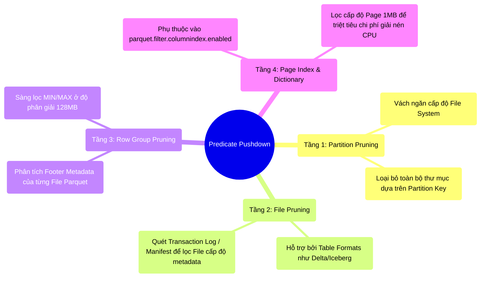

# 7.2 Predicate Pushdown: 4 Tầng Sàng Lọc Ở Cấp Độ Lưu Trữ

## 1. Objectives
- [ ] Phân rã màng lưới tối ưu hóa 4 tầng của cơ chế Predicate Pushdown.
- [ ] Đính chính nhận thức về File Level Skip: Làm rõ cơ chế lọc cấp độ Row Group của định dạng Parquet.
- [ ] Giải phẫu cơ chế lập chỉ mục nâng cao (Page Index) và cấu hình `parquet.filter.columnindex.enabled`.
- [ ] Nhận diện hiện tượng phân tán dữ liệu (Scattered Data) làm vô hiệu hóa Metadata Footer.

## 2. Mindmap


## 3. Content

Ở Chương 4, chúng ta đã tiếp cận khái niệm Predicate Pushdown: Chiến lược đẩy các mệnh đề lọc (Ví dụ: `WHERE age > 50`) từ tầng Engine xuống trực tiếp tầng Storage, nhằm ngăn chặn việc truyền tải dữ liệu dư thừa lên RAM.
Tuy nhiên, một vấn đề cơ học đặt ra: **Làm thế nào ổ cứng từ tính xác định được rãnh đĩa nào chứa tập dữ liệu thỏa mãn điều kiện `age > 50` mà không cần nạp toàn bộ File vào bộ nhớ?**

> [!CAUTION] Cảnh Báo Kiến Trúc: Đính chính khái niệm Skip File
> Nhiều Kỹ sư dữ liệu lầm tưởng tính năng Pushdown của Parquet tự động cho phép bỏ qua toàn bộ một Tệp tin (File Pruning). Trên thực tế, Engine Spark vận hành qua một hệ thống bảo vệ **4 tầng độc lập**. Cấp độ phân giải cốt lõi của định dạng Parquet nguyên bản chỉ dừng ở **Row Group Level**. Chức năng bỏ qua toàn bộ File (File Pruning) không thuộc thẩm quyền của lõi Parquet, mà do tầng DataSource V2 hoặc các Table Format (Delta Lake, Iceberg) phụ trách xử lý Metadata.

### 3.1. Hệ Thống 4 Tầng Sàng Lọc Độc Lập

**Tầng 1: Partition Pruning (Vách Ngăn File System)**
- *Cơ chế:* Hoạt động ở mức Hệ thống tệp tin. Dữ liệu được tổ chức theo cấu trúc thư mục dạng `year=2023/month=10/`.
- Khi Engine nhận lệnh `WHERE year = 2022`, Catalyst Optimizer sẽ chỉ định hệ thống I/O loại trừ hoàn toàn các thao tác đọc vào nhánh thư mục `2023`. Không một tệp tin nào trong nhánh này bị chạm tới.

**Tầng 2: File Pruning (Sàng lọc File cấp độ Metadata)**
- *Giới hạn của Spark gốc:* Nếu Spark sử dụng Parquet thuần túy, nó phải dùng DataSource V2 thu thập Metadata của các tệp tin để lọc. Với quy mô hàng triệu File Parquet, việc gọi lệnh liệt kê hệ thống tệp (ls) sẽ gây quá tải và làm sập OOM Driver.
- *Giải pháp (Delta Lake/Iceberg):* Catalyst đọc **Transaction Log / Manifest files** (Đã lưu sẵn thông số MIN/MAX của từng Tệp tin vật lý). Từ đó, Catalyst loại trừ hàng vạn Tệp tin không chứa người `Age > 50` ngay trong RAM của Driver, mà chưa cần sinh ra luồng I/O đọc Parquet.

**Tầng 3: Parquet Row Group Pruning (Phân Giải Mức Độ Bụng Parquet)**
- *Vị trí:* Tiến trình lọc diễn ra bên trong 1 File Parquet đã vượt qua màng lọc Tầng 2. **Đây là độ phân giải cốt lõi của bản thân định dạng Parquet.**
- *Cơ chế:* Một File Parquet kích thước 1GB không được lọc dưới dạng khối nguyên khối. Cấu trúc nội tại của nó được phân mảnh thành nhiều khoang **Row Group** (Kích thước chuẩn ~128MB). Phần đáy của Tệp tin chứa **Footer Metadata** lưu trữ số liệu MIN/MAX cho TỪNG KHOANG Row Group.
- Khi luồng I/O quét Footer: Nếu Row Group 1 có `MAX(Age) = 40` $\rightarrow$ Trình đọc sẽ nhảy cóc (Skip) toàn bộ 128MB của Row Group 1. Nếu Row Group 2 có `MAX(Age) = 60` $\rightarrow$ Luồng I/O chỉ giới hạn đọc 128MB của Row Group 2 vào RAM.

**Tầng 4: Parquet Page Index & Dictionary (Phân Giải Cấp Độ Trang)**
- *Vị trí:* Tiến trình lọc tiếp tục thâm nhập vào cấu trúc sâu nhất: Các khối **Page** (Kích thước ~1MB) bên trong 1 cột của 1 Row Group đã lọt lưới.
- *Cơ chế Page Index:* Tầng lọc này không mặc định tồn tại. Để kích hoạt khả năng đối chiếu MIN/MAX ở cấp độ 1MB này, cả Hệ thống Ghi (Writer) và Hệ thống Đọc (Reader) phải hỗ trợ tính năng Page Index. Bạn cần đảm bảo cấu hình **`spark.sql.parquet.filterPushdown`** được bật. Quan trọng nhất, bắt buộc cấu hình **`parquet.filter.columnindex.enabled = true`** phải được thiết lập để Spark cho phép kiểm tra bảng Index này.
- *Chi phí được cứu:* Nếu một Page bị loại (Ví dụ giá trị Max trong Page < 50), thuật toán Decompression (Giải nén - như Snappy) sẽ được **vô hiệu hóa hoàn toàn đối với Page đó**, tiết kiệm một lượng lớn chu kỳ CPU. Kỹ sư cần phân tích mục `PushedFilters` trong giao diện Spark SQL UI để xác thực quá trình đẩy màng lọc này.

### 3.2. Rủi Ro Tán Xạ (Scattered Data) Gây Mù Lòa Footer
Sức mạnh của Predicate Pushdown phụ thuộc hoàn toàn vào cấu trúc MIN/MAX tại Footer. Nếu giá trị MIN/MAX quá phân tán, hệ thống lọc sẽ bị vô hiệu hóa.

Giả sử một khối lượng dữ liệu phân tán ngẫu nhiên (Randomly scattered data):
Có 10.000 file Parquet, mỗi file đều chứa các bản ghi xen kẽ giữa người 1 tuổi và người 100 tuổi.
Khi đó, Footer Metadata của **bất kỳ file nào, bất kỳ Row Group nào** cũng đều ghi nhận chỉ số: `MIN = 1, MAX = 100`.
Khi truy vấn `WHERE age > 50` được thực thi, màng lọc Tầng 2 và Tầng 3 sẽ đánh giá toàn bộ 10.000 file đều thỏa mãn điều kiện. Spark bắt buộc phải kéo (I/O Fetch) toàn bộ dữ liệu lên RAM để lọc thủ công. Toàn bộ lợi thế kiến trúc bị sụp đổ.

**[Code Snippet: Xử Lý Tán Xạ]**
Nhiều Kỹ sư áp dụng thủ thuật `repartition(age).sortWithinPartitions(age)` để nhóm dữ liệu. Tuy nhiên, nếu cột `age` có độ phân tán thấp (Low-Cardinality) hoặc bị Skew, Hash Repartition sẽ dồn cục sinh ra các file Parquet mất cân đối (Khổng lồ gây OOM, hoặc phân mảnh hàng ngàn file rác).
Giải pháp ở tầng Spark là sử dụng cơ chế Range Partition kết hợp khống chế kích thước:
```python
# ENTERPRISE-STYLE: Sử dụng repartitionByRange để dàn đều dung lượng File
# Kết hợp maxRecordsPerFile để khống chế kích thước, tránh OOM khi Ghi.
df.repartitionByRange("age") \
  .write \
  .option("maxRecordsPerFile", 500000) \
  .parquet("s3a://data/users/")
```

## 4. Key takeaways
- **Độ phân giải thực tế**: Quá trình Pushdown của Parquet không nhảy cóc toàn bộ File. Đặc tính kỹ thuật của nó là chia trị xuống cấp độ **Row Group (128MB)** và **Page (1MB)** để định tuyến I/O.
- **Kích hoạt Page Index**: Tầng lọc sâu nhất (1MB) yêu cầu cấu hình `parquet.filter.columnindex.enabled = true` để tiết kiệm chu kỳ giải nén của CPU.
- **Bi kịch dữ liệu nhiễu**: Sự phân bổ ngẫu nhiên (Scattered) kéo giãn biên độ MIN-MAX, biến Parquet Footer thành một công cụ vô dụng. 
- **Chuyển giao**: Phương pháp `repartitionByRange` hoạt động hiệu quả cho 1 cột. Nhưng nếu truy vấn đa chiều `WHERE age > 50 AND salary > 1000`, làm sao tái cấu trúc tập tin để cả hai cột `age` và `salary` đều đạt chuẩn MIN/MAX hẹp? Nhu cầu tối ưu đa chiều (Multi-dimensional Clustering) này được giải quyết thông qua hai thuật toán: **Z-Ordering và Liquid Clustering** ở Bài 7.3.
