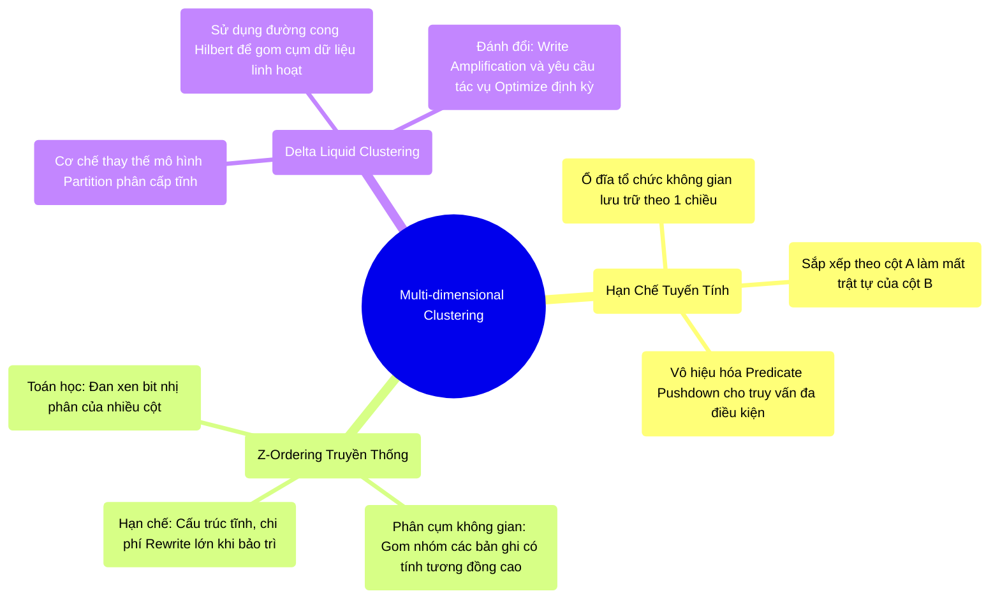

# 7.3 Tối Ưu Hóa Không Gian Đa Chiều: Z-Ordering & Liquid Clustering

## 1. Objectives
- [ ] Phân tích rào cản vật lý tuyến tính (1 chiều) của cấu trúc lưu trữ khi đối mặt với truy vấn đa điều kiện (Multi-dimensional query).
- [ ] Mổ xẻ nguyên lý toán học của đường cong Z-Order trong việc tái định hình không gian dữ liệu để khôi phục hiệu năng Predicate Pushdown.
- [ ] Đánh giá sự khác biệt kiến trúc giữa Z-Order truyền thống và cơ chế Liquid Clustering (Gom cụm động) trên Delta Lake.

## 2. Mindmap


## 3. Content

Trong Bài 7.2, chúng ta đã khẳng định: Predicate Pushdown chỉ phát huy tối đa sức mạnh khi **dữ liệu được phân bổ cục bộ (Sorted/Clustered)**. Độ chụm của khoảng MIN/MAX trên Footer quyết định khả năng loại trừ (Pruning) của I/O.
Nếu dữ liệu phân bổ phân tán ngẫu nhiên, Footer sẽ chứa khoảng giá trị rộng (ví dụ: `MIN=1, MAX=100`), vô hiệu hóa màng lọc. Kỹ sư Dữ liệu thường sử dụng cấu trúc sắp xếp (Sorting) để giải quyết. Tuy nhiên, họ vấp phải rào cản vật lý khắt khe: **Không gian lưu trữ của ổ đĩa từ (HDD/SSD) chỉ vận hành trên một trục tuyến tính 1 chiều.**

### 3.1. Điểm Mù Của Sắp Xếp Tuyến Tính (Linear Sorting)
Phân tích kịch bản truy vấn đa điều kiện: `WHERE Age > 50 AND Salary > 2000`.
- Nếu hệ thống thực thi `ORDER BY Age`, cột `Age` đạt được độ chụm hoàn hảo. Pushdown lọc cột `Age` đạt hiệu suất cao.
- **Bi kịch xáo trộn:** Khi cưỡng ép sắp xếp theo `Age`, trật tự tuyến tính của cột `Salary` bị phá vỡ hoàn toàn.
- **Hệ quả:** Parquet Footer sẽ báo cáo cột `Salary` ở trạng thái tán xạ (ví dụ: `MIN=0, MAX=10.000` trên mọi File). Khi truy vấn phụ thuộc vào `Salary`, Pushdown bị vô hiệu hóa. 
Ổ đĩa 1 chiều không cho phép bảo toàn cấu trúc sắp xếp hoàn hảo cho 2 hoặc nhiều cột đồng thời.

### 3.2. Ánh Xạ Không Gian Đa Chiều: Thuật Toán Z-Ordering
Để giải quyết bài toán đa chiều trên bề mặt 1 chiều, hệ sinh thái Databricks ứng dụng lý thuyết đường cong không gian lấp đầy: **Z-Curve (Z-Ordering)**.
Thuật toán này định tuyến lại vị trí các bản ghi nhằm tăng tính tương quan vật lý giữa nhiều cột đồng thời.
- *Cơ chế:* Chuyển đổi giá trị của `Age` và `Salary` sang biểu diễn nhị phân, sau đó **đan xen (Interleave) luân phiên các bit** để tạo ra một giá trị định tuyến Z-value duy nhất.
- *Hệ ứng không gian:* Thay vì được sắp xếp độc lập, các dòng có sự tương đồng ở cả hai cột `Age` và `Salary` sẽ được nhóm (Cluster) sát vào nhau trên bề mặt đĩa 1 chiều.
- *Khôi phục Pushdown:* Lúc này, một khối Row Group Parquet có thể duy trì dải MIN/MAX hẹp cho CẢ HAI CỘT: `Age [MIN=40, MAX=60]` và `Salary [MIN=1500, MAX=2500]`. Pushdown hoạt động hiệu quả cho truy vấn đa điều kiện.

> [!CAUTION] Cảnh Báo Kiến Trúc: Hạn Chế Của Z-Order Tĩnh
> Việc ứng dụng Z-Order nguyên thủy mang đặc tính **Tĩnh (Static)**. Khi dữ liệu mới liên tục được chèn vào (Streaming/Micro-batch), cấu trúc phân cụm bị phá vỡ. Để duy trì hiệu suất, hệ thống bắt buộc phải thực thi lệnh bảo trì `OPTIMIZE ... ZORDER BY`. Lệnh này tiêu hao khổng lồ chu kỳ CPU do bản chất của nó là tái tổ chức (Rewrite) toàn bộ cụm dữ liệu phân mảnh.

### 3.3. Cuộc Cách Mạng Liquid Clustering (Từ Delta 3.0)

🚨 **[PHÂN TÍCH THỰC TẾ KIẾN TRÚC]**
Tính năng Liquid Clustering (Delta 3.0+) được thiết kế nhằm thay thế cơ chế cấp phát tĩnh (Static Partitioning) truyền thống. Dựa trên các biến thể của đường cong không gian (Hilbert curve), hệ thống **linh hoạt gom cụm dữ liệu mở rộng** để tối đa hóa hiệu suất Data Skipping.

Dưới góc độ Kỹ thuật hệ thống, Liquid Clustering đi kèm với các thỏa hiệp (Trade-offs) sau:
1. **Mục tiêu tối ưu:** Liquid Clustering tối ưu Layout lưu trữ vật lý nhằm phục vụ luồng truy xuất (Read Operations). Nếu kiến trúc dữ liệu tồn tại khiếm khuyết thiết kế (Ví dụ: Data Skew khi JOIN), Liquid Clustering không thể thay thế các kỹ thuật cân bằng dữ liệu như Salting Key.
2. **Chi phí khuếch đại (Write Amplification):** Khả năng tự động gom cụm yêu cầu một lượng Overhead tính toán khi Ghi. Quá trình tiếp nhận dữ liệu mới đồng nghĩa với việc cấu trúc lại không gian vật lý, làm tăng áp lực I/O cục bộ.
3. **Yêu cầu bảo trì:** Mặc dù linh hoạt hơn Partition, Kỹ sư vẫn phải chủ động lập lịch thực thi `OPTIMIZE` định kỳ để giải quyết các File phân mảnh (Small Files). Không tồn tại cấu hình nào tự động triệt tiêu hoàn toàn sự phân mảnh mà không tiêu tốn tính toán.

**[Code Snippet: Thiết Lập Liquid Clustering]**
```sql
-- Chuyển đổi từ mô hình PARTITION tĩnh sang mô hình CLUSTER lỏng lẻo.
-- Tính năng yêu cầu kích hoạt trên nền tảng Delta Lake phiên bản hỗ trợ.
CREATE TABLE users (
  id INT, age INT, salary INT
) USING DELTA
CLUSTER BY (age, salary); -- Kích hoạt cấu trúc Multi-dimensional Clustering
```

## 4. Key takeaways
- **Thỏa hiệp lưu trữ 1 chiều**: Đặc tính tuyến tính của ổ cứng cản trở việc tối ưu nhiều cột đồng thời. Z-Ordering khắc phục thông qua việc ánh xạ không gian đa chiều về dạng chỉ số Z-value 1 chiều.
- **Giới hạn của mô hình tĩnh**: Cấu trúc Z-Order nguyên thủy yêu cầu tái xây dựng dữ liệu định kỳ (Rewrite), gây tắc nghẽn tài nguyên CPU.
- **Tiến hóa cấu trúc**: Liquid Clustering cung cấp giải pháp phân cụm động thay thế Partition truyền thống, gia tăng tỷ lệ bỏ qua dữ liệu (Data Skipping), nhưng vẫn yêu cầu chiến lược bảo trì định kỳ. Quá trình rà soát hiệu suất I/O sẽ được tổng kết ở Bài 7.4.
