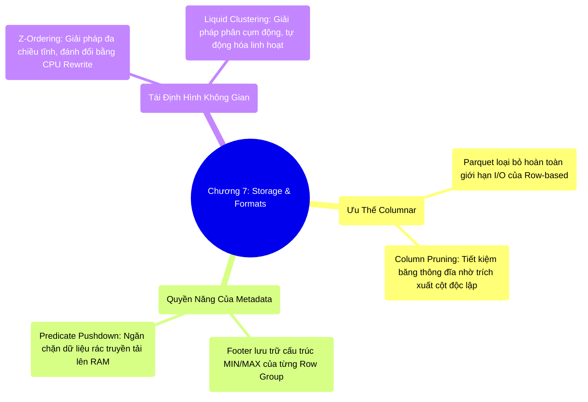

# 7.4 Tổng Kết Chương 7: Tối Ưu Hóa Tầng Lưu Trữ (Storage Layer)

## 1. Objectives
- [ ] Khẳng định chân lý kiến trúc: Hiệu năng tối đa đạt được thông qua việc triệt tiêu I/O rác ngay tại tầng lưu trữ vật lý.
- [ ] Tổng kết bức tranh 4 tầng Predicate Pushdown và khẳng định vị thế của định dạng Columnar.
- [ ] Đúc kết chiến lược tối ưu hóa Storage Layer (Playbook) theo tiêu chuẩn Enterprise.

## 2. Mindmap

## 3. Content

Xuyên suốt Chương 7, một định lý kiến trúc quan trọng được thiết lập: **Muốn hệ thống Spark đạt thông lượng (Throughput) tối đa, phương thức hiệu quả nhất là thiết kế luồng I/O sao cho hệ thống ĐỌC ÍT DỮ LIỆU NHẤT CÓ THỂ.**

Chúng ta đã đẩy nghệ thuật tối ưu hóa xuống mức độ thấp nhất tại tầng Storage Layer:
1. **Lược bỏ theo trục dọc (Column Pruning):** Khai thác kiến trúc Parquet để phớt lờ các cột dữ liệu không liên quan, bảo vệ băng thông Disk I/O.
2. **Sàng lọc theo trục ngang (Predicate Pushdown):** Phối hợp màng lọc 4 tầng (Partition, Table Metadata, Parquet Footer, Page Index) để loại trừ các khối phân mảnh dư thừa ở độ phân giải nhỏ nhất (128MB Row Group và 1MB Page Index).
3. **Tái định hình không gian (Space-Filling Curves):** Áp dụng Z-Ordering và Liquid Clustering để tái cấu trúc tập dữ liệu đa chiều, gom cụm các bản ghi có tính tương đồng. Thao tác này thu hẹp khoảng giá trị MIN/MAX trên Footer, tối đa hóa tỷ lệ loại trừ dữ liệu (Data Skipping) của Pushdown.

> [!IMPORTANT] Best Practice: Sự Dịch Chuyển Trọng Tâm
> Một Kỹ sư dữ liệu thiếu kinh nghiệm thường tập trung vào việc viết các câu truy vấn SQL phức tạp kết hợp hàng loạt hàm xử lý (UDF), vận hành trên định dạng lưu trữ thô như CSV/JSON.
> Kỹ sư cốt lõi (Staff) tiếp cận bài toán từ dưới lên (Bottom-up). Họ duy trì các câu lệnh SQL tối giản, nhưng tập trung thao túng kiến trúc vật lý nằm dưới mặt đĩa cứng. Sự am hiểu tường tận về Parquet Row Group, thuật toán nén Dictionary/Snappy, và cơ chế Liquid Clustering giúp họ **triệt tiêu các điểm nghẽn hệ thống (Bottleneck) ngay từ vạch xuất phát**.

### 3.1. Cẩm Nang Tối Ưu Tầng Lưu Trữ (Storage Tuning Playbook)

**1. Chuẩn hóa định dạng Data Lake:** 
Mọi dữ liệu thô (Raw data) khi được nạp vào Data Lake phải trải qua quy trình chuyển đổi thành các định dạng Columnar (Parquet) hoặc Table Formats (Delta Lake, Iceberg). Việc sử dụng CSV/JSON trong các luồng phân tích ở môi trường Production là một Anti-pattern nghiêm trọng.

**2. Kiểm soát phân mảnh (File Sizing):** 
Việc duy trì hàng triệu tệp tin Parquet quá nhỏ (Small Files Problem) sẽ làm quá tải hệ thống metadata và phá vỡ năng lực của Pushdown. Kích thước lý tưởng của một Tệp tin nên được duy trì từ **128MB đến 1GB**. Hệ thống cần được thiết lập các luồng tác vụ chạy lệnh `OPTIMIZE` định kỳ để hợp nhất (Compaction) dữ liệu.

**3. Hiện đại hóa cơ chế phân cụm (Clustering):** 
Đối với các hệ thống đã nâng cấp lên chuẩn Delta Lake 3.0+ hoặc Iceberg tương đương, cần cân nhắc chuyển đổi từ việc phân chia thư mục tĩnh `PARTITIONED BY (year, month)` sang cơ chế phân cụm động `CLUSTER BY` (Liquid Clustering). Kiến trúc này cung cấp khả năng tự động điều chỉnh Layout tương thích với các Workload linh hoạt mà không đòi hỏi chi phí tái cấu trúc toàn diện (Full Rewrite).

## 4. Key takeaways
- **Thắng ở vạch xuất phát**: Spark Engine dù được tối ưu bộ nhớ đến mức nào cũng sẽ sụp đổ OOM nếu nạp một lượng lớn dữ liệu không cần thiết. Storage Layer quyết định 90% hiệu năng của luồng ETL.
- **Sức mạnh Siêu dữ liệu (Metadata)**: Dữ liệu thô có thể đạt quy mô Petabyte, nhưng chính Metadata (Delta Log, Parquet Footer, Page Dictionary) mới là tác nhân điều hướng I/O, giúp kim từ tính nhảy cóc qua hàng ngàn ổ đĩa vật lý.
- **Lời tựa Chương 8**: Trong Chương 4, bộ tối ưu hóa CBO thiết lập kế hoạch thực thi dựa trên các suy luận logic tĩnh. **Nhưng chuyện gì xảy ra nếu ước lượng của CBO sai lệch trong thực tế?** Nếu CBO dự báo một bảng có dung lượng 10MB và kích hoạt Broadcast Join, nhưng trong quá trình thực thi thực tế (Runtime), bảng đó phình to thành 50GB do hiện tượng Data Skew, toàn cụm máy tính sẽ đối mặt với thảm họa OOM.
Để đối phó, Spark trang bị tính năng Tự nhận thức và Hiệu chỉnh tự động trong thời gian thực: **AQE (Adaptive Query Execution)**. Làm thế nào Spark có thể can thiệp vào một kế hoạch vật lý đang chạy dang dở để cứu vãn hệ thống? Chúng ta sẽ giải phẫu cơ chế này tại **Chương 8 — Advanced Query Execution & Joins**.
