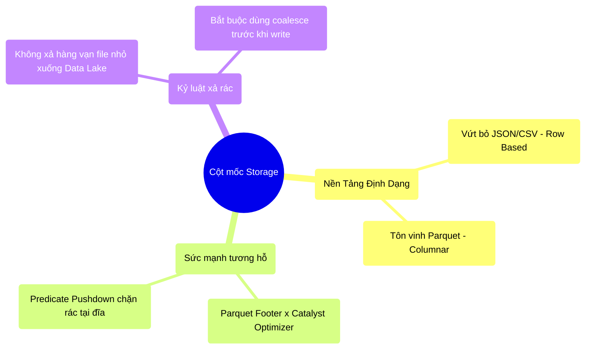

# 7.4 Tổng Kết Nhóm Cốt Lõi Cơ Chế (End of Phase 2)

## 1. Objectives
- [ ] Chốt lại khái niệm Storage Tuning (Cân chỉnh lưu trữ) của Chương 7.
- [ ] Kết nối toàn bộ 3 trụ cột vật lý: Memory (Chương 5), Network (Chương 6), và Storage (Chương 7).
- [ ] Mở đường cho Giai đoạn cuối cùng (Phase 3).

## 2. Mindmap

## 3. Content

### 3.1. Điểm Khởi Đầu Và Cũng Là Kết Thúc
Chúng ta đã đi đến cuối Giai đoạn 2 (Phase 2). Đây là lúc nhìn lại một quy trình xử lý dữ liệu hoàn chỉnh của Spark. Bạn sẽ nhận ra: **Ổ cứng (Storage) vừa là điểm bắt đầu, vừa là điểm kết thúc của mọi nỗi đau.**

1. **Điểm Khởi Đầu (Đọc Dữ Liệu):** Nếu dữ liệu của bạn nằm ở dạng CSV, ổ cứng của bạn (Storage) bị tra tấn vì phải đọc cả những cột không cần thiết. Khối dữ liệu khổng lồ lọt qua ổ cứng, đập vào Dây Mạng (Network), tràn vào RAM (Memory), gây ra lỗi JVM GC Overhead (Chương 5). Toàn bộ hệ thống sập!
   - *Giải pháp:* Đổi sang Parquet. Catalyst dùng Tờ Mục Lục kết hợp với Predicate Pushdown và Column Pruning (Chương 4). Lượng dữ liệu đọc lên RAM giảm 100 lần! Sập nguồn được ngăn chặn.
2. **Điểm Kết Thúc (Ghi Dữ Liệu):** Sau khi hệ thống băm nát dữ liệu bằng Shuffle (Chương 6) để tính toán, nó cho ra hàng vạn phân mảnh (Partitions) nhỏ li ti. Nếu bạn ghi thẳng xuống HDFS, bạn sinh ra 1 vạn File rác rỗng tuếch, bóp nghẹt bộ nhớ của NameNode máy chủ lưu trữ (The Small File Problem).
   - *Giải pháp:* Dùng `coalesce` bóp 1 vạn phân mảnh đó thành 10 khối gạch đẫy đà. Ổ cứng (Storage) mỉm cười đón nhận.

### 3.2. Tam Giác Quỷ Của Hệ Phân Tán
Memory, Network, và Storage là một Tam Giác Quỷ. Chúng có mối liên hệ nhân quả vật lý không thể tách rời:

> **[Quy Luật Bảo Toàn Nỗi Đau]**
> - Nếu bạn muốn tiết kiệm **RAM (Memory)**, bạn phải hạ số lượng Partition xuống thấp. Khi Partition quá bự, nó không nhét vừa vào RAM $\rightarrow$ Nỗi đau chuyển dồn sang **Storage** (Hiện tượng Disk Spill).
> - Nếu bạn muốn tiết kiệm **Storage** (Không cho Disk Spill), bạn phải tăng số lượng Partition lên rất lớn. Khi Partition quá nhiều, hệ thống lao vào chém giết nhau qua cáp quang $\rightarrow$ Nỗi đau chuyển dồn sang **Network** (Hàng triệu đường kết nối Shuffle).
> - Nếu bạn muốn né **Network** (Dùng Broadcast Join), bạn ép máy chủ phải ôm trọn bảng dữ liệu $\rightarrow$ Nỗi đau chuyển dồn ngược lại cho **RAM** (Máy chủ nổ bóng Driver OOM).

Người kỹ sư Big Data giỏi không phải là người mua phần cứng mạnh nhất, mà là người biết **luân chuyển Nỗi Đau** đến nơi có khả năng chịu đựng tốt nhất trong tùy từng trường hợp cụ thể.

### 3.3. Bước Tiến Vào Giai Đoạn Vận Hành Thực Chiến (Phase 3)
Chúc mừng bạn đã xuất sắc vượt qua bài kiểm tra hóc búa nhất về Cơ Chế Vật Lý Dưới Đáy Hệ Thống (Phase 2).
Giờ đây, khi bạn nhìn vào bất cứ đoạn code Spark nào, bạn không còn thấy chữ nghĩa nữa. Bạn thấy Dây cáp mạng chớp nháy, thanh RAM rung lên, và Trình thu gom rác (GC) đang dọn bàn.

Ở Giai đoạn cuối cùng (Phase 3), chúng ta sẽ mang toàn bộ kiến thức vật lý này vào **Chiến Trường Thực Tế**:
- Làm sao để trị dứt điểm Data Skew bằng AQE (Adaptive Query Execution)?
- Cách làm thám tử điều tra Tội Phạm (Troubleshooting) trên giao diện Spark UI.
- Và sự tiến hóa cuối cùng: Dòng chảy thời gian (Structured Streaming) & Kho Nhật Ký Giao Dịch (Delta Lake).

Hẹn gặp bạn ở Cột mốc Tối Ưu & Vận Hành!
