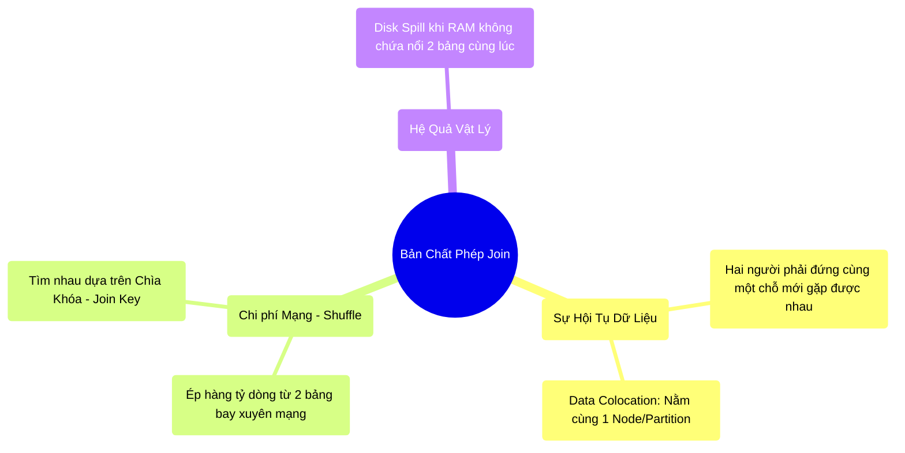

# 8.1 Giải Phẫu Join: Bài Toán Hội Tụ Dữ Liệu (Data Colocation)


## 1. Objectives
- [ ] Phân tích bản chất vật lý của phép Join qua **Phép ẩn dụ Cuộc Hẹn Hò Giữa Hai Thành Phố**.
- [ ] Hiểu được khái niệm Data Colocation (Đồng vị dữ liệu) là điều kiện bắt buộc để Join.
- [ ] Tính toán cái giá phải trả về mặt phần cứng khi thực hiện phép Join.

## 2. Mindmap


## 3. Content

### 3.1. Phép Ẩn Dụ: Cuộc Hẹn Hò Khác Thành Phố
Trong SQL truyền thống (Máy đơn), khi bạn viết lệnh `JOIN` Bảng A và Bảng B, máy tính chỉ đơn giản là lôi 2 bảng đó từ Ổ cứng lên RAM và dò tìm. 
Nhưng trong Big Data, Bảng A (Khách hàng) đang bị chặt ra làm 100 khúc vứt ở 100 máy chủ khác nhau. Bảng B (Giao dịch) cũng bị vứt ở 100 máy chủ khác nhau.

Làm sao để biết Khách hàng tên John ở Máy số 1 đã mua món hàng gì ở Máy số 99?

> **[Ví Dụ Trực Quan: Buổi Hẹn Hò Xem Mặt]**
> Hãy tưởng tượng Bảng A là tập hợp các Chàng trai, Bảng B là tập hợp các Cô gái.
> Lệnh Join (Điều kiện: Sở thích = Âm nhạc) giống như việc ghép đôi một Chàng trai và một Cô gái có cùng sở thích.
> 
> **Quy luật vật lý bất biến:** Để họ nắm tay nhau (Join thành công), họ **BẮT BUỘC PHẢI CÓ MẶT TẠI CÙNG MỘT CĂN PHÒNG, TẠI CÙNG MỘT THỜI ĐIỂM**. (Khái niệm này gọi là **Data Colocation** - Đồng vị dữ liệu).
> 
> Chàng trai đang ở Hà Nội (Máy số 1). Cô gái đang ở Cà Mau (Máy số 99). 
> Spark phải làm một hành động cực kỳ đắt đỏ: Mua vé máy bay cho chàng trai bay vào Đà Nẵng, và bắt cô gái cũng bay ra Đà Nẵng (Máy số 50). Khi cả hai vào chung phòng khách sạn số 50 (Partition 50), phép Join mới diễn ra được!

Hành động Mua vé máy bay cho hàng Tỷ người bay khắp đất nước đó, chính là quá trình **Shuffle (Xáo trộn chéo qua mạng)** mà chúng ta đã rùng mình ở Chương 6.

### 3.2. Yêu Cầu Của Data Colocation (Đồng Vị Dữ Liệu)
Spark sử dụng hàm băm (Hash Function) để đảm bảo hai người có cùng Sở thích sẽ bay về đúng một căn phòng.
Ví dụ: `Hash(Âm nhạc) % 200 = Phòng số 50`.

- Tất cả những ai (dù ở Bảng A hay Bảng B) có thuộc tính Âm nhạc đều sẽ được hệ thống mạng bơm thẳng vào **Máy tính số 50**.
- Tất cả những ai có thuộc tính Thể thao sẽ bị ném sang **Máy tính số 21**.

Quá trình ném người này làm dây cáp mạng quá tải. Nhưng đó chưa phải là phần tệ nhất.

### 3.3. Giải Phẫu Code: Áp Lực Lên Căn Phòng (RAM)
Khi chàng trai và cô gái đã bay đến Máy tính số 50, chuyện gì xảy ra bên trong máy đó?

```python
# =========================================================================
# LUỒNG VẬT LÝ DIỄN RA BÊN TRONG CĂN PHÒNG SỐ 50 (EXECUTION MEMORY)
# =========================================================================

# Lập trình viên viết 1 dòng nhẹ nhàng:
df_joined = df_boys.join(df_girls, "hobby")

# THỰC TẾ VẬT LÝ TẠI MÁY SỐ 50:
"""
1. Máy 50 nhận được 1.000 Chàng trai thích Âm nhạc (Từ Bảng A bay tới).
2. Nó nhận tiếp 5.000 Cô gái thích Âm nhạc (Từ Bảng B bay tới).
3. ĐỂ GHÉP ĐÔI: Máy 50 bắt buộc phải GIỮ TẤT CẢ 6.000 NGƯỜI NÀY TRONG PHÒNG KHÁCH 
   (Vùng Nháp Execution Memory) CÙNG MỘT LÚC!
   
4. Rủi ro Disk Spill: 
   Nếu phòng khách (RAM) chỉ chứa được 2.000 người, Máy 50 phải mở cửa hầm, 
   đuổi 4.000 người xuống Tầng hầm (Ổ cứng - Disk Spill) đứng chờ.
   Cứ ghép xong 1 đôi, lại chạy xuống hầm gọi 1 người lên. 
   Tốc độ hẹn hò chậm đi 1.000 lần!
"""
```

## 4. Key takeaways
- **Bản chất của Join:** Không phải là việc so sánh các con số, mà là bài toán Logictics (Vận tải). Phải vận chuyển các luồng dữ liệu (có chung Join Key) về tụ họp tại chung một mảnh RAM vật lý (Data Colocation).
- **Cái giá phải trả:** Một phép Join vô tội vạ sẽ kích hoạt đồng thời 3 tai họa: Shuffle (Nghẽn mạng), OOM (Tràn RAM), và Disk Spill (Chậm vì ổ cứng).
- **Tư duy tối ưu:** Đừng bao giờ Join 2 bảng nếu bạn chưa áp dụng lệnh `filter` để thu nhỏ kích thước của chúng (Column Pruning và Predicate Pushdown). Bạn phải giảm tối đa số người phải mua vé máy bay.
