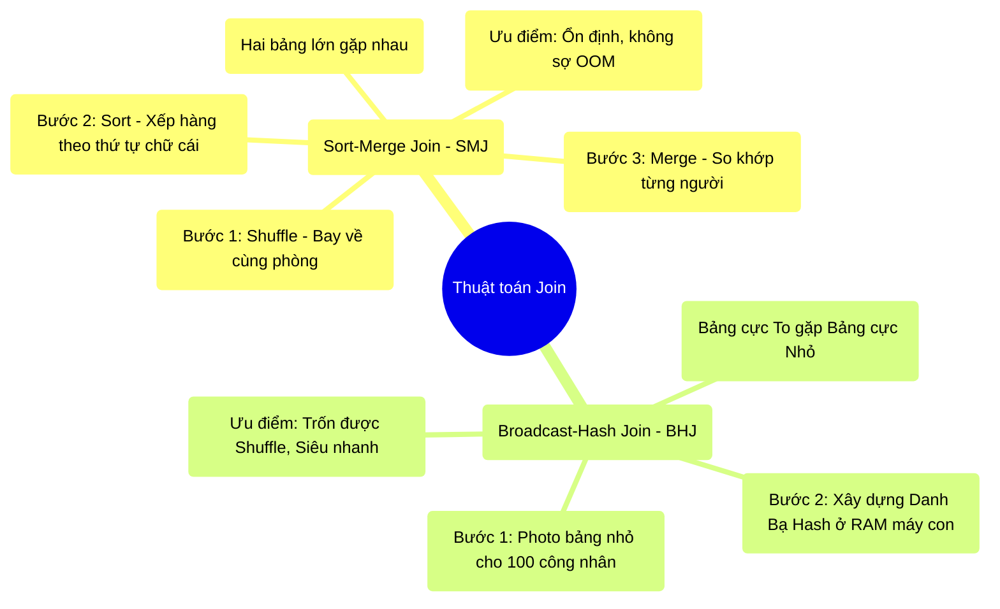

# 8.2 Thuật Toán Hội Tụ: Sort-Merge vs Broadcast-Hash

## 1. Objectives
- [ ] So sánh hai thuật toán Join cơ bản của Spark qua **Phép ẩn dụ Điểm danh xếp hàng và Tra danh bạ**.
- [ ] Giải phẫu cơ chế vật lý (Sort + Merge) của thuật toán Sort-Merge Join (SMJ).
- [ ] Phân tích ưu nhược điểm và thời điểm nên dùng từng loại Join.

## 2. Mindmap


## 3. Content

### 3.1. Cuộc Đối Đầu Giữa Hai Thuật Toán
Khi hai bảng dữ liệu hội tụ về cùng một căn phòng (Data Colocation), Spark sẽ dùng cách nào để ghép đôi chúng? 
Giới Kỹ sư dữ liệu tập trung vào 2 phương pháp mạnh nhất: **Sort-Merge Join (SMJ)** (Tiêu chuẩn mặc định) và **Broadcast-Hash Join (BHJ)** (Phép thuật đi tắt).

### 3.2. Sort-Merge Join: Kỷ Luật Quân Đội
Khi bạn Join 2 Bảng KHỔNG LỒ (Ví dụ: 1 Tỷ dòng với 1 Tỷ dòng), RAM của hệ thống không thể nhớ hết mặt mũi của 2 Tỷ người được. Spark phải dùng kỷ luật quân đội (SMJ).

> **[Ví Dụ Trực Quan: Điểm Danh Xếp Hàng]**
> Hai nhóm nam và nữ (2 bảng) đã được máy bay chở đến cùng một căn phòng (Đã xong bước Shuffle).
> 
> **Giai đoạn SORT (Xếp hàng):** Người quản đốc bắt Nhóm Nam đứng thành 1 hàng dọc, sắp xếp theo tên từ A $\rightarrow$ Z (Adam, Bob, Chris...). Sau đó bắt Nhóm Nữ xếp thành 1 hàng dọc A $\rightarrow$ Z (Alice, Anna, Bella...).
> *(Quá trình xếp hàng này tốn rất nhiều diện tích phòng - Execution Memory).*
> 
> **Giai đoạn MERGE (Ghép đôi):** Quản đốc cầm danh sách đi dọc 2 hàng. 
> - Nam đầu tiên là Adam. Nữ đầu tiên là Alice. Tên khác nhau $\rightarrow$ Bỏ qua. 
> - Nữ tiếp theo là Anna. Khác nhau $\rightarrow$ Bỏ qua.
> 
> Nhờ 2 hàng đã được xếp thứ tự (Sorted), quản đốc chỉ cần đi **một mạch từ đầu đến cuối**, không bao giờ phải chạy ngược chạy xuôi để tìm kiếm.

**Vật lý học của SMJ:** Thuật toán này cực kỳ ổn định. Kể cả khi 2 hàng người quá dài không nhét vừa phòng (Tràn RAM), quản đốc có thể đẩy bớt người xuống tầng hầm (Disk Spill), rồi từ từ lôi từng người lên ráp lại. Hệ thống **CHẬM NHƯNG KHÔNG BAO GIỜ CHẾT (No OOM)**.

### 3.3. Broadcast-Hash Join: Sổ Danh Bạ Siêu Tốc
Như đã nhắc ở Bài 6.4, khi 1 Bảng Tỷ dòng gặp 1 Bảng 100 dòng, dùng Kỷ luật quân đội SMJ là vác dao mổ trâu đi giết gà. Spark dùng **Broadcast-Hash Join**.

> **[Ví Dụ Trực Quan: Cuốn Sổ Danh Bạ]**
> Bảng Nữ chỉ có 100 người.
> Quản đốc KHÔNG CẦN xếp hàng (No Sort). Quản đốc cũng KHÔNG BẮT 2 nhóm bay đến cùng 1 phòng (No Shuffle).
> 
> Quản đốc lập 1 cuốn sổ Danh bạ, lật từng trang ghi rõ đặc điểm của 100 cô gái (Giai đoạn xây dựng HASH TABLE trên bộ nhớ).
> Quản đốc photo cuốn Danh bạ làm 100 bản (BROADCAST), nhét vào túi áo của 100 công nhân.
> Lúc này, công nhân đi ngang qua Chàng trai (Adam), chỉ việc móc Danh bạ ra tra cứu chữ A. Thấy hợp là ghép luôn!

**Vật lý học của BHJ:** Tốc độ kinh hoàng. Bỏ qua hoàn toàn chi phí đắt đỏ nhất của mạng lưới (Shuffle) và bộ nhớ (Sort). Nhưng rủi ro vật lý là: Cuốn sổ danh bạ quá to sẽ làm rách túi áo công nhân (OOM).

### 3.4. Cấu Hình Bằng Code: Tranh Giành Quyền Lực

Theo mặc định, Catalyst Optimizer của Spark sẽ tự làm Thám tử. Nếu nó phát hiện Bảng B $< 10MB$, nó tự chuyển sang BHJ. Ngược lại, nó dùng SMJ.
Nhưng nhiều lúc Catalyst bị ngáo, bạn phải tự tay tát nó tỉnh bằng Hint (Gợi ý).

```python
# =========================================================================
# LỜI KHUYÊN CỦA SENIOR ENGINEER: TỰ KIỂM SOÁT THUẬT TOÁN JOIN
# =========================================================================
from pyspark.sql.functions import broadcast

df_A = spark.table("fact_sales_1_billion_rows")
df_B = spark.table("dim_store_50_rows")

# 1. ÉP BUỘC DÙNG BROADCAST HASH JOIN (BHJ)
# Bạn tự tin 100% Bảng B rất nhỏ. Dùng Hint broadcast() để cấm Spark dùng SMJ.
df_fast = df_A.join(broadcast(df_B), "store_id")

# 2. KIỂM TRA BẢN VẼ BẰNG EXPLAIN
df_fast.explain()
"""
KẾT QUẢ ĐÚNG (Thấy chữ BroadcastHashJoin):
*(2) BroadcastHashJoin [store_id], [store_id], Inner, BuildRight
"""

# =========================================================================
# KHI CATALYST BỊ MÙ THÔNG TIN
# =========================================================================
# Đôi khi bảng của bạn chỉ có 5MB, nhưng nó nằm trong 1 file CSV. 
# Spark chưa đọc CSV nên không biết nó nặng bao nhiêu, đành đánh đồng là nó Rất To.
# Hệ quả: Spark dùng Sort-Merge Join cho 2 bảng, gây lãng phí 3 tiếng đồng hồ Shuffle!
# Lúc này, việc bạn gọi hàm broadcast() thủ công chính là Cứu rỗi hệ thống!
```

## 4. Key takeaways
- **Sort-Merge Join (Kẻ bền bỉ):** Dùng cho 2 bảng lớn. Gây Shuffle và tốn RAM để Sort. Chạy chậm nhưng chịu tải được lượng dữ liệu vô hạn nhờ cơ chế vứt rác xuống đĩa (Spill).
- **Broadcast-Hash Join (Kẻ chạy nước rút):** Dùng cho 1 Bảng to + 1 Bảng nhỏ. Trốn được Shuffle và Sort. Cực kỳ nhanh nhưng dễ nổ RAM nếu Bảng nhỏ thực chất lại to hơn dự kiến.
- **Lời khuyên thực chiến:** Catalyst Optimizer không phải lúc nào cũng giỏi. Hãy phân tích dung lượng dữ liệu bằng mắt người, và mạnh dạn dùng hàm `broadcast()` để ép Spark đi đường tắt.
