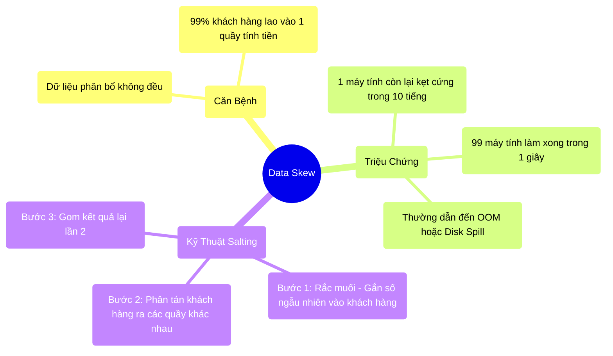

# 8.3 Kẻ Hủy Diệt OOM: Lệch Dữ Liệu (Data Skew) & Tuyệt Chiêu Rắc Muối (Salting)

## 1. Objectives
- [ ] Bắt mạch căn bệnh hiểm nghèo nhất của Big Data: Data Skew qua **Phép ẩn dụ Quầy Tính Tiền Đêm Giao Thừa**.
- [ ] Đo lường hậu quả vật lý khi Data Skew đánh sập hệ thống.
- [ ] Thực hành kỹ thuật Salting (Rắc muối) bằng mã nguồn vật lý để cứu sống hệ thống.

## 2. Mindmap


## 3. Content

### 3.1. Phép Ẩn Dụ: Quầy Tính Tiền Đêm Giao Thừa
Như Bài 5.4 đã đề cập, nguyên nhân 99% gây ra lỗi OOM Executor (Nổ máy con) là do Data Skew. Hôm nay chúng ta sẽ trị tận gốc nó.

Data Skew (Lệch dữ liệu) không phải là lỗi phần mềm, nó là đặc tính tự nhiên của thế giới thực. Dữ liệu thực tế không bao giờ phân bổ đồng đều. (Ví dụ: Dân số TP.HCM đông gấp ngàn lần một tỉnh vùng cao).

> **[Ví Dụ Trực Quan: Siêu Thị Có 10 Quầy Tính Tiền]**
> Spark là một hệ thống tính tiền tự động có 10 Quầy (10 Partitions/CPU Cores).
> Spark chia việc dựa trên **Join Key (Chìa khóa Gom nhóm)**.
> Giả sử bạn đang tính tổng doanh thu theo Tỉnh thành (`groupBy(City)`).
> 
> Dòng người xếp hàng (Luồng Shuffle):
> - Khách hàng ở Lai Châu đi vào Quầy số 1. Quầy 1 tính xong trong 1 giây, nhân viên ngồi bấm điện thoại nghỉ ngơi.
> - Khách hàng ở Cà Mau đi vào Quầy 2. Tính xong trong 1 giây.
> - **Khách hàng ở TP.HCM (Hàng triệu người) ồ ạt đổ dồn vào đúng một Quầy số 10!**
> 
> **Hậu quả Vật Lý:** Quầy số 10 kẹt cứng. Khách hàng xếp hàng dài dằng dặc tràn ra tận bãi giữ xe (Tràn RAM/Disk Spill). Nhân viên mệt mỏi gục ngã (Executor OOM).
> Đau đớn thay, Hệ thống Spark hoạt động theo nguyên tắc: **Stage chỉ kết thúc khi người cuối cùng làm xong**. Tức là 9 Quầy kia dù đã xong việc, vẫn phải ngồi chơi và đợi Quầy 10 làm xong thì cụm máy tính mới được giải phóng!

Đó là lý do bạn thường thấy Spark chạy vèo vèo lên 99%, rồi kẹt cứng ở 1% cuối cùng suốt nhiều tiếng đồng hồ.

### 3.2. Chữa Bệnh Bằng Kỹ Thuật Rắc Muối (Salting)
Làm sao để giải cứu Quầy số 10? Bạn không thể bắt khách hàng TP.HCM chuyển hộ khẩu sang Lai Châu được.
Kỹ thuật cao cấp nhất của Data Engineer thời chưa có AI là **Salting (Rắc Muối - Đánh lừa hệ thống)**.

> **[Ví Dụ Trực Quan: Rắc Muối Chống Kẹt Quầy]**
> Thay vì để tất cả những người mang bảng tên TP.HCM lao vào Quầy 10. Người quản lý (Bạn) đứng ở cửa siêu thị và Rắc muối (Gắn thêm con số ngẫu nhiên từ 1 đến 5) vào lưng khách hàng.
> - Người A trở thành: TP.HCM_1
> - Người B trở thành: TP.HCM_2
> - Người C trở thành: TP.HCM_5
> 
> Hệ thống phân loại của Spark thấy TP.HCM_1 và TP.HCM_2 là hai chìa khóa KHÁC NHAU hoàn toàn. Thế là nó ném TP.HCM_1 sang Quầy số 1, ném TP.HCM_2 sang Quầy số 2... 
> Hàng triệu khách hàng TP.HCM bị **phân tán đều ra cả 10 Quầy (Phá vỡ Data Skew)**.
> 
> Sau khi cả 10 Quầy tính tiền xong, Quản lý chỉ việc gom 10 hóa đơn nhỏ của 10 Quầy đó cộng lại lần cuối là ra tổng doanh thu TP.HCM.

### 3.3. Giải Phẫu Bằng Code (Nghệ Thuật Của Senior)

```python
# =========================================================================
# LỆNH VÔ TÌNH GÂY KẸT QUẦY SỐ 10
# =========================================================================
import pyspark.sql.functions as F

# df_sales có 1 Tỷ giao dịch ở TP.HCM, và 10 giao dịch ở các tỉnh khác.
# Lệnh này sẽ ném 1 Tỷ dòng vào 1 máy tính duy nhất. HỆ THỐNG SẬP (OOM).
bad_join = df_sales.join(df_city, "city_name")

# =========================================================================
# BÍ KÍP SALTING (Rắc muối nổ tung Data Skew)
# =========================================================================

# BƯỚC 1: Rắc Muối vào Bảng To (df_sales)
# Tạo ra một cột mới chứa số ngẫu nhiên từ 1 đến 10 (Ví dụ: "HCM_1", "HCM_5")
df_sales_salted = df_sales.withColumn(
    "salted_city_name", 
    F.concat(F.col("city_name"), F.lit("_"), F.floor(F.rand() * 10))
)

# BƯỚC 2: Rắc Muối vào Bảng Nhỏ (df_city)
# Bảng nhỏ không có dữ liệu thực tế để random, ta phải NHÂN BẢN bảng nhỏ lên 10 lần.
# Biến "HCM" thành 10 dòng: "HCM_1", "HCM_2" ... "HCM_10".
# (Dùng crossJoin với một bảng mảng [1..10]).
salt_df = spark.range(10).withColumnRenamed("id", "salt_id")
df_city_salted = df_city.crossJoin(salt_df).withColumn(
    "salted_city_name",
    F.concat(F.col("city_name"), F.lit("_"), F.col("salt_id"))
)

# BƯỚC 3: Thực hiện Join trên Chìa Khóa Đã Rắc Muối
# Lúc này, 1 Tỷ dòng "HCM_1" đến "HCM_10" sẽ được chia đều cho 10 máy tính khác nhau.
# Máy tính nào cũng phải làm việc. Không máy nào bị quá tải. KHÔNG OOM!
good_join = df_sales_salted.join(df_city_salted, "salted_city_name")

# BƯỚC 4: Vứt bỏ cột muối đi để lấy kết quả sạch sẽ.
final_df = good_join.drop("salted_city_name", "salt_id")
```

## 4. Key takeaways
- **Bản chất của Skew:** Là sự bất công trong lao động vật lý. Máy thì làm quá sức đến vỡ RAM (OOM), máy thì ngồi chơi.
- **Kẻ phá bĩnh 99%:** Spark không thể hoàn thành Job nếu cái máy 1% bị kẹt (Straggler) kia chưa làm xong. 
- **Giải pháp Salting:** Dùng một hàm Random để phá nát khối dữ liệu tụ tập, lừa Spark phân tán chúng ra nhiều máy tính (Nhiều Partitions) khác nhau. Sau khi tính toán sơ bộ (Local Aggregate) xong thì mới gom nhóm lại lần cuối.
- **Hạn chế:** Viết code Salting cực kỳ phức tạp và tốn công sức. Rất may mắn, kể từ Spark 3.0, một phép màu tự động mang tên **AQE** đã ra đời để thay con người làm việc rắc muối mệt mỏi này. (Hãy sang Bài 8.4).
