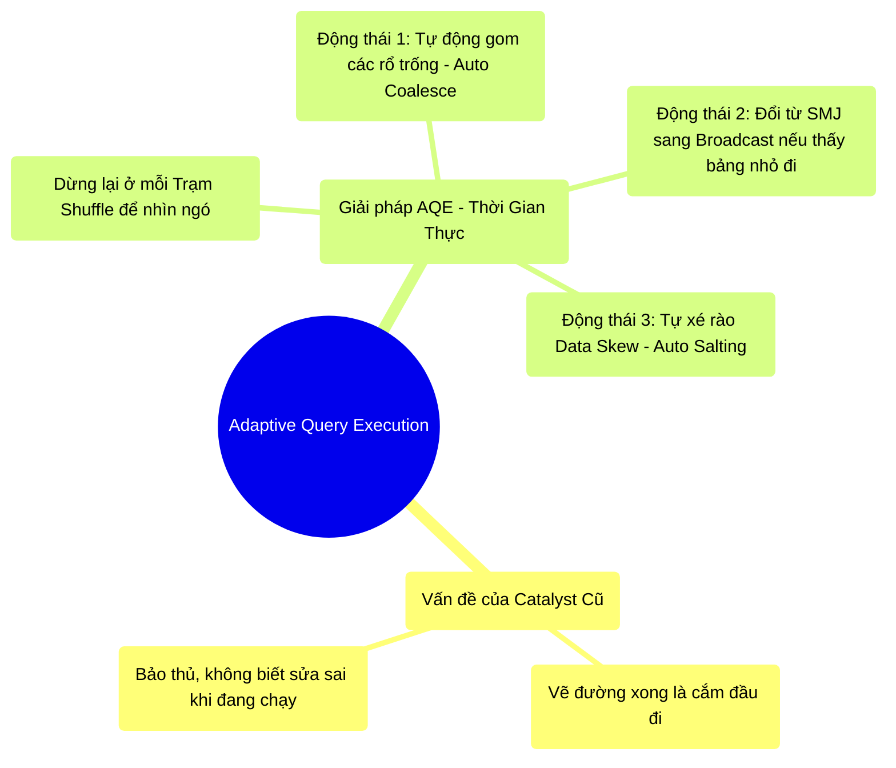

# 8.4 AQE (Adaptive Query Execution): Kẻ Thay Đổi Cuộc Chơi

## 1. Objectives
- [ ] So sánh Catalyst Optimizer cũ và AQE qua **Phép ẩn dụ Cảnh Sát Giao Thông Báo Cáo Thời Gian Thực**.
- [ ] Trình bày 3 sức mạnh thay đổi cuộc chơi của AQE: Tự sửa số lượng Partition, Tự gộp File nhỏ, và Tự chẻ Data Skew.
- [ ] Chứng minh tại sao AQE đã chấm dứt kỷ nguyên Salting thủ công.

## 2. Mindmap

## 3. Content

### 3.1. Phép Ẩn Dụ: Cảnh Sát Giao Thông Và Bộ Bộ Đàm
Ở Bài 4.2, bạn đã biết Catalyst Optimizer là Vị Kiến Trúc Sư đại tài, có thể vẽ ra bản đồ đường đi ngắn nhất (Physical Plan) để đưa bạn ra sân bay. 
Nhưng Catalyst (trước Spark 3.0) có một nhược điểm chí mạng: **Nó rất bảo thủ!**

> **[Ví Dụ Trực Quan: Chiếc GPS Mù Quáng]**
> Sáng sớm, Catalyst xem bản đồ và quyết định: Anh đi đường A là nhanh nhất. 
> Xe của bạn bắt đầu lăn bánh. Nhưng 15 phút sau, đường A xảy ra một vụ tai nạn ngẫu nhiên, kẹt xe cứng ngắc.
> Catalyst cũ làm gì? **Nó ngó lơ!** Vì bản đồ đã được chốt (Fix) từ trước khi xe chạy, Catalyst bắt bạn cứ thế đâm đầu vào chỗ kẹt xe, dù có đường hẻm B ngay bên cạnh. 
> 
> **Sự ra đời của AQE (Từ Spark 3.0):**
> AQE giống như việc Spark lắp đặt hệ thống **Cảnh sát giao thông cầm bộ đàm** ở mọi ngã tư đường. 
> Khi xe bạn đi đến giữa đường (Đang chạy giữa chừng), Cảnh sát gọi điện báo về trung tâm: Sếp ơi, đường A đang kẹt, số lượng xe đông gấp 10 lần dự báo.
> Ngay lập tức, Catalyst bẻ lái bản đồ theo thời gian thực (Runtime), chỉ định bạn rẽ sang đường hẻm B.

**Vật lý học của AQE:** AQE can thiệp vào điểm CẮT STAGE (Nơi xảy ra Shuffle). Tại trạm dừng Shuffle, khi tất cả công nhân đã lưu nháp dữ liệu xuống đĩa cứng (Bài 3.4), AQE sẽ đo lường KÍCH THƯỚC THẬT của đống dữ liệu nháp đó. Nếu nó thấy bất thường, nó Lập tức Vẽ Lại Bản Đồ (Re-optimize) cho Stage tiếp theo.

### 3.2. Ba Quyền Năng Của AQE Cứu Sống Kỹ Sư
Khi bạn bật tính năng AQE (`spark.sql.adaptive.enabled = true`), Spark tự động kích hoạt 3 phép màu sau:

#### Phép màu 1: Tự Động Gom File Nhỏ (Dynamically Coalesce Shuffle Partitions)
Bạn có nhớ con số mặc định ngớ ngẩn `spark.sql.shuffle.partitions = 200` không? Đôi khi dữ liệu của bạn quá ít, chia làm 200 cái rổ sẽ sinh ra 199 cái rổ trống rỗng. Ở Bài 7.3, bạn phải tự viết lệnh `coalesce` bằng tay.
- **Có AQE:** Nó nhìn thấy 199 cái rổ trống rỗng sau khi Shuffle, nó TỰ ĐỘNG gộp chúng lại thành 1 cái rổ lớn mà bạn không cần viết thêm dòng code nào.

#### Phép màu 2: Tự Động Biến Hình Tránh Shuffle (Dynamically Switch Join Strategies)
Ban đầu, Catalyst ước tính Bảng A và Bảng B đều rất lớn (100GB). Nó chốt bản vẽ dùng thuật toán **Sort-Merge Join (Gây tắc mạng Shuffle)**.
Nhưng sau khi chạy qua lệnh `filter`, Bảng B bị lọc mất sạch dữ liệu, từ 100GB teo lại chỉ còn 5MB! 
- **Có AQE:** Tại trạm dừng chân, AQE đo thấy Bảng B giờ chỉ còn 5MB (Nhỏ hơn hạn mức 10MB). Nó lập tức bẻ lái: **Hủy lệnh Sort-Merge, chuyển ngay sang Broadcast Join!** (Phát sổ tay). Toàn bộ thao tác Shuffle bị cắt đứt. Tốc độ tăng 100 lần!

#### Phép màu 3: Tự Động Chẻ Nhỏ Data Skew (Dynamically Optimize Skew Joins)
Đây là tác nhân diệt OOM. Ở Bài 8.3, nếu 1 triệu người TP.HCM ập vào 1 Quầy tính tiền, bạn phải hì hục ngồi viết code Rắc muối (Salting) cực kỳ khổ sở.
- **Có AQE:** Nó phát hiện ra cái Rổ TP.HCM phình to bất thường nặng tới 15GB (Gấp 5 lần các rổ khác).
AQE tự động đóng vai người quản lý, nó TỰ CHẺ khối 15GB đó làm 3 cục nhỏ (Mỗi cục 5GB), rồi ném cho 3 Máy tính khác nhau chạy. Không máy nào bị quá tải. Lỗi OOM Data Skew chính thức bị diệt trừ mà Lập trình viên không cần rắc 1 hột muối nào!

### 3.3. Khi Nào AQE Bất Lực?
Cảnh sát giao thông không thể bẻ lái nếu không có trạm dừng ngã tư.
**AQE chỉ kích hoạt được tại các mốc có SHUFFLE (Wide Dependency).**
Nếu đoạn code của bạn chỉ toàn các lệnh lọc (Filter, Map - Narrow Dependency) chạy tuột từ đầu đến cuối không có điểm dừng, AQE sẽ hoàn toàn mù mắt và không thể bẻ lái sửa sai.

## 4. Key takeaways
- **Từ Cứng nhắc sang Linh hoạt:** Trước Spark 3.0, Kế hoạch thực thi (Physical Plan) là tờ chiếu chỉ không thể cãi lại. Sau Spark 3.0, AQE biến nó thành một bản phác thảo có thể liên tục tự sửa lỗi khi dữ liệu thật (Runtime Metrics) lộ diện.
- **Thời đại Lười Biếng Của Kỹ Sư:** Nhờ AQE, bạn không còn phải đau đầu tự phỏng đoán số lượng Partitions, tự canh chỉnh lệnh Coalesce, hay tự viết code Salting khổ sở nữa.
- **Bật lên để sống sót:** Bắt đầu từ Spark 3.2, tính năng AQE được TỰ ĐỘNG BẬT (Enabled by default). Nếu bạn đang phải maintain một hệ thống Spark cũ (Phiên bản 2.x), việc thuyết phục công ty nâng cấp lên Spark 3+ và bật AQE là ưu tiên cốt lõi!
