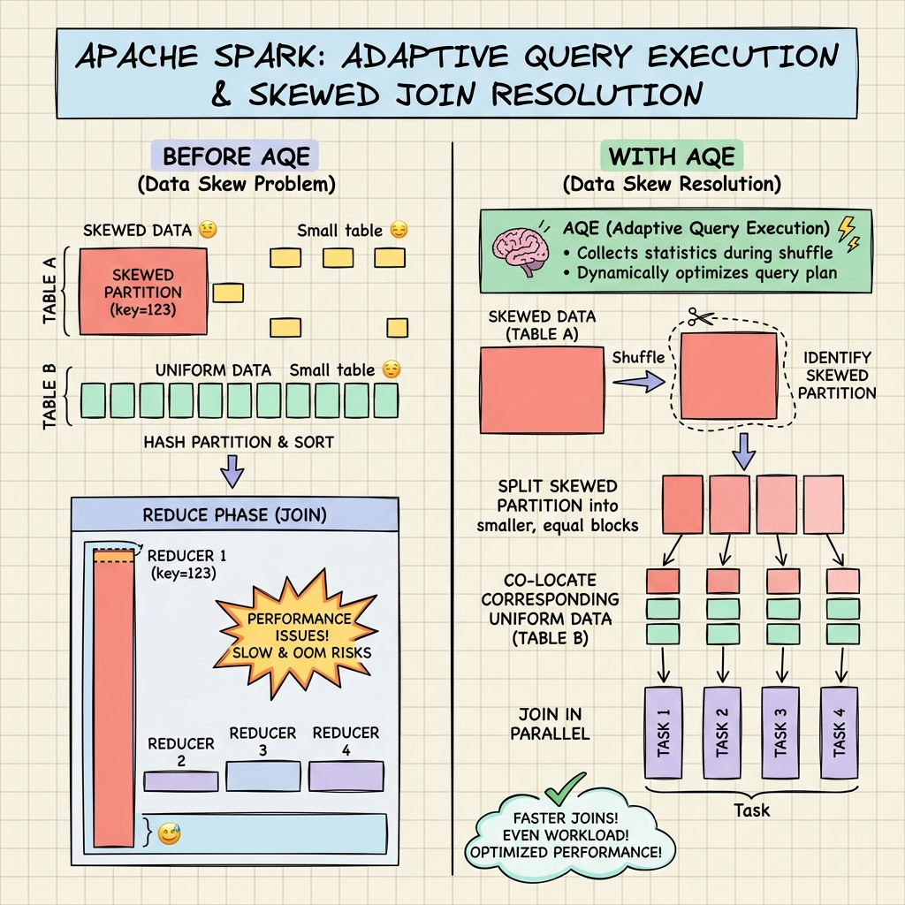
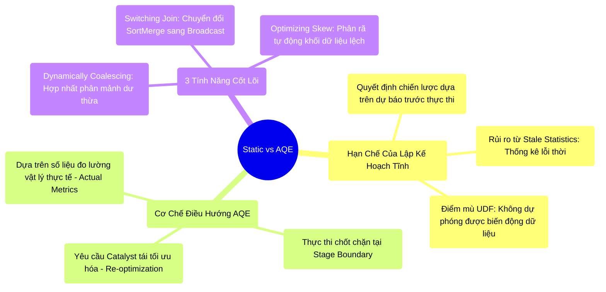

# 8.1 Giới Hạn Của Catalyst Tĩnh & Giải Pháp Adaptive Query Execution (AQE)




## 1. Objectives
- [ ] Phân tích điểm nghẽn kiến trúc của bộ tối ưu hóa tĩnh (Static Planning) trong hệ thống Catalyst.
- [ ] Mổ xẻ cơ chế điều hướng tại Runtime (Runtime Feedback) của AQE tại các ranh giới Stage.
- [ ] Giải phẫu 3 tính năng cốt lõi của AQE: Tự động gom cụm phân mảnh, Chuyển đổi chiến lược Join, và Xử lý Data Skew.

## 2. Mindmap


## 3. Content

Ở Chương 4, Catalyst Optimizer đã chứng minh năng lực tối ưu hóa Logic và Vật lý xuất sắc. Tuy nhiên, trong môi trường Production quy mô lớn, Catalyst nguyên thủy bộc lộ một điểm nghẽn kiến trúc mang tính hệ thống: **Tính chất Lập kế hoạch tĩnh (Static Planning).** Toàn bộ Kế hoạch Vật lý (Physical Plan) được chốt định *trước khi* luồng tính toán thực sự bắt đầu.

### 3.1. Rủi Ro Của Khả Năng Dự Báo Tĩnh
Bộ tối ưu hóa dựa trên chi phí (CBO) đưa ra quyết định chọn thuật toán Join dựa vào số liệu thống kê (Metadata Statistics). Hệ thống đối mặt rủi ro sụp đổ do sai số dự báo:
1. **Thống kê lỗi thời (Stale Statistics):** CBO sử dụng Metadata chưa được cập nhật (ví dụ: dự báo bảng 1MB nhưng thực tế đã phình to thành 100GB).
2. **Hộp đen UDF (Opaque Execution):** CBO có thể nắm rõ dung lượng bảng gốc. Nhưng khi truy vấn chứa mệnh đề phức tạp như `WHERE Age > 50 AND UDF_Complex(Name)`, CBO mất hoàn toàn khả năng dự phóng kích thước dữ liệu đầu ra sau lớp UDF tự định nghĩa.

> [!CAUTION] Cảnh Báo Kiến Trúc: Sự Cố Tràn Bộ Nhớ Do Chọn Sai Thuật Toán
> Do mất dấu vết dữ liệu, CBO có thể đưa ra ước tính sai lệch rằng kết quả đầu ra chỉ còn 5MB. CBO chỉ định hệ thống sử dụng **Broadcast Hash Join** (Nạp 5MB vào RAM toàn bộ máy tính). Tuy nhiên trong thực tế (Runtime), lượng dữ liệu vượt ngưỡng 50GB. Việc cưỡng ép Broadcast dẫn đến OOM hàng loạt trên các Executor. Kế hoạch tối ưu trở thành điểm đứt gãy hệ thống.

### 3.2. Đột Phá Kiến Trúc: AQE (Adaptive Query Execution)
Để giải quyết sai số dự báo, từ phiên bản 3.0, Spark tích hợp nền tảng **AQE**. Triết lý thiết kế: **Thay thế dự báo tĩnh bằng đo lường vật lý thời gian thực.**

**Cơ chế phản hồi thời gian thực (Runtime Feedback):**
AQE thiết lập các điểm kiểm soát (Checkpoints) tại ranh giới của các Stage (Stage Boundary - Thời điểm Map Task xả dữ liệu trung gian xuống đĩa và chờ Reduce Task).
Thay vì mù quáng thi hành Stage tiếp theo dựa trên kế hoạch tĩnh, AQE tạm dừng quá trình để tiến hành đo lường vật lý chính xác kích thước khối dữ liệu Shuffle vừa sinh ra. Nếu số liệu thực tế sai lệch nghiêm trọng so với dự báo tĩnh, AQE sẽ buộc Catalyst **Tái khởi động quá trình lập kế hoạch (Re-optimization)**.

### 3.3. Ba Tính Năng Cốt Lõi Của AQE

**1. Hợp Nhất Phân Mảnh Tự Động (Dynamically Coalescing Partitions)**
- *Vấn đề:* Cấu hình tĩnh `spark.sql.shuffle.partitions = 1000`. Khi khối lượng dữ liệu thực tế thấp, hệ thống sinh ra hàng ngàn tệp phân mảnh siêu nhỏ (Small Files), gây bão hòa I/O và Overhead cho CPU.
- *Giải pháp AQE:* Tại ranh giới Stage, nếu phát hiện 1000 phân mảnh có tổng dung lượng thấp (ví dụ 500MB), AQE sẽ **hợp nhất (Coalesce)** chúng thành 5 phân mảnh lớn (chuẩn ~100MB) trước khi phân phối cho Reduce Task, tối ưu hóa Disk I/O.

**2. Chuyển Đổi Thuật Toán Join Động (Switching Join Strategies)**
- *Vấn đề:* CBO tĩnh ấn định chiến lược **SortMerge Join** (đắt đỏ về CPU/Disk) do dự báo sai lệch khối lượng dữ liệu lớn.
- *Giải pháp AQE:* AQE đo lường và phát hiện dữ liệu thực tế sau Filter đã thu gọn (đáp ứng điều kiện `autoBroadcastJoinThreshold`). Nó lập tức loại bỏ kế hoạch SortMerge, bẻ lái hệ thống chuyển sang **Broadcast Hash Join**, gia tăng thông lượng thực thi theo cấp số nhân.

**3. Xử Lý Phân Bổ Lệch (Optimizing Skew Joins)**
- *Vấn đề (Data Skew):* Một cụm Task kẹt nghẽn do một Partition bất thường phải xử lý lượng dữ liệu vượt trội so với mức trung bình.
- *Giải pháp AQE:* AQE nhận diện Partition bị Skew dựa trên số đo vật lý. Nó tiến hành **phân rã tự động** khối lượng dữ liệu lớn này thành nhiều phân mảnh nhỏ, đồng thời nhân bản (Duplicate) bảng đối ứng để đảm bảo tính toàn vẹn của phép Join.
- 🚨 *Hạn Chế Cần Lưu Ý:* AQE tính năng xử lý Skew chỉ tương thích với **SortMerge Join / Shuffled Hash Join**. Nó không can thiệp vào Null Skew (Tụ huyết do dữ liệu rỗng). Việc xử lý Null Skew vẫn đòi hỏi Kỹ sư Dữ liệu phải triển khai các kỹ thuật Filter hoặc Salting Key thủ công để đảm bảo sự ổn định của cấu trúc dữ liệu đầu vào.

**[Config Snippet: Cấu Hình Kích Hoạt AQE]**
```bash
# AQE được kích hoạt mặc định từ Spark 3.2.0
--conf spark.sql.adaptive.enabled=true
--conf spark.sql.adaptive.coalescePartitions.enabled=true
--conf spark.sql.adaptive.skewJoin.enabled=true
--conf spark.sql.adaptive.localShuffleReader.enabled=true
```

## 4. Key takeaways
- **Triệt tiêu giả định**: Quá trình lập kế hoạch tĩnh của CBO bộc lộ yếu điểm trong điều kiện thực tế. AQE cung cấp cơ chế Tự hiệu chỉnh lúc đang chạy dựa trên dữ liệu vật lý thu thập được.
- **Quản lý I/O tự động**: Tính năng Coalescing giảm thiểu gánh nặng hiệu chỉnh tham số `shuffle.partitions` thủ công, bảo vệ luồng I/O đĩa.
- **Tiền đề của toán tử Join**: 2 trên 3 tính năng quan trọng nhất của AQE đều tập trung can thiệp vào quá trình Join. Phân tích chi tiết bản chất cơ học của các chiến lược Join (Hash, SortMerge, Broadcast) sẽ được giải phẫu tại Bài 8.2.
