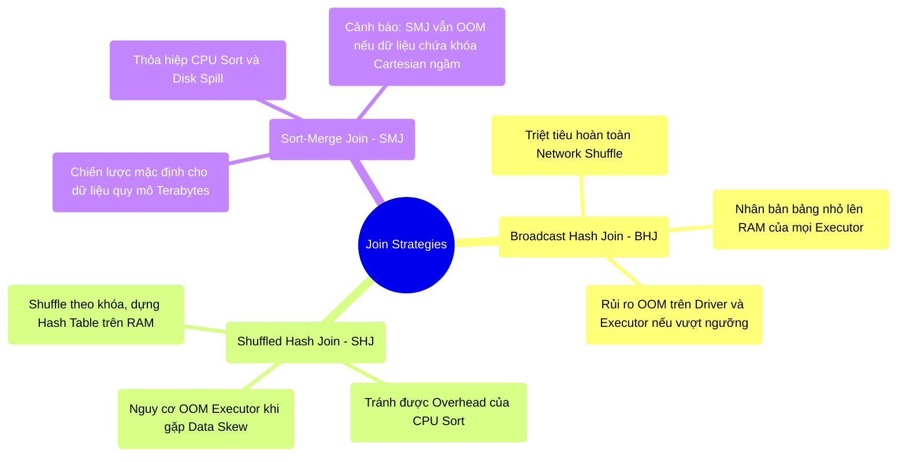

# 8.2 Chiến Lược Nối Bảng (Join Strategies): Tối Ưu CPU Và Bộ Nhớ

## 1. Objectives
- [ ] Mổ xẻ nguyên lý cơ học của 3 thuật toán Join cốt lõi: Broadcast Hash, Shuffled Hash, và Sort-Merge.
- [ ] Phân tích rủi ro quá tải bộ nhớ (OOM) tiềm ẩn khi lạm dụng tính năng Broadcast Hash Join.
- [ ] Làm rõ năng lực chịu tải của Sort-Merge Join và **đính chính sai lầm** về việc SMJ miễn nhiễm với OOM (SMJ vẫn sụp đổ do lặp khóa Iterator).

## 2. Mindmap


## 3. Content

Trong tính toán phân tán, toán tử Join (Ghép nối dữ liệu) luôn là một trong những điểm nghẽn tiêu hao tài nguyên lớn nhất (Bao gồm Network Shuffle, Disk I/O, và RAM).
Catalyst cung cấp 3 chiến lược thực thi Join chính. Việc lựa chọn chiến lược phù hợp là nhiệm vụ cốt lõi của Kỹ sư dữ liệu nhằm duy trì thông lượng hệ thống.

### 3.1. Broadcast Hash Join (BHJ): Chiến Lược Triệt Tiêu Shuffle
Khi Optimizer xác định một trong hai bảng có kích thước đủ nhỏ, hệ thống sẽ ưu tiên kích hoạt **BHJ**.
- **Cơ chế hoạt động:** Node Driver tiến hành thu thập toàn bộ bảng nhỏ. Sau đó, Driver phát sóng (Broadcast) bản sao của bảng này đến bộ nhớ RAM của **tất cả các Executor** trong cụm. Tại Executor, bảng nhỏ được khởi tạo thành Hash Table. Bảng lớn sẽ được duyệt qua (Stream) để tra cứu và ghép nối.
- **Ưu thế kiến trúc:** **Triệt tiêu hoàn toàn quá trình Shuffle mạng.** Không có dữ liệu nào của bảng lớn phải trung chuyển qua mạng, mang lại tốc độ thực thi tối đa.

> [!CAUTION] Cảnh Báo Kiến Trúc: Rủi Ro OOM Kép
> Việc lạm dụng Hint `/*+ BROADCAST(table) */` chứa đựng rủi ro hệ thống ngầm:
> 1. Nếu bảng nhỏ vượt quá dung lượng khả dụng của Node Driver (VD: 5GB) $\rightarrow$ **Driver sẽ gặp sự cố OOM và hệ thống dừng hoạt động ngay lập tức.**
> 2. Kể cả khi Driver tồn tại, việc nhồi nhét 5GB vào không gian Execution Memory của hàng trăm Executor sẽ thu hẹp không gian tính toán chung, làm toàn bộ cụm sụp đổ vì OOM.

**[Config Snippet: Rào Chắn An Toàn BHJ]**
```bash
# Ngưỡng kích hoạt mặc định của Spark được đặt ở mức an toàn: 10MB.
# Chỉ nên điều chỉnh (tối đa ~50MB - 100MB) khi tính toán kỹ lưỡng dung lượng RAM dư thừa.
--conf spark.sql.autoBroadcastJoinThreshold=10485760
```

### 3.2. Shuffled Hash Join (SHJ): Chiến Lược Cân Bằng Cục Bộ
Khi kích thước của cả hai bảng vượt quá ngưỡng Broadcast, nhưng Catalyst đánh giá bảng nhỏ (sau khi được chia mảnh qua Shuffle) vẫn có khả năng nằm trọn trong giới hạn RAM của một Task, **SHJ** sẽ được xem xét.
- **Cơ chế hoạt động:** Phân tán (Shuffle) cả hai bảng dựa trên Hash của khóa Join để đảm bảo các bản ghi có chung khóa hội tụ về cùng một Executor. Tại đây, bảng nhỏ được xây dựng thành Hash Table trên RAM, và bảng lớn sẽ thực thi thao tác đối chiếu.
- **Ưu thế:** Bỏ qua hoàn toàn chi phí CPU tốn kém của thuật toán Sắp xếp (Sort) như ở SMJ.
- **Rủi ro (Data Skew):** SHJ phụ thuộc vào giả định *Một phân mảnh của bảng nhỏ phải tương thích với giới hạn RAM của Executor*. Nếu hệ thống gặp lỗi Data Skew (Khóa phân bổ lệch), kích thước của Hash Table cục bộ sẽ bùng nổ, phá vỡ giới hạn Execution Memory và gây OOM.

### 3.3. Sort-Merge Join (SMJ): Trụ Cột Xử Lý Quy Mô Khổng Lồ
Khi khối lượng dữ liệu đạt quy mô Terabytes và vượt mọi rào cản RAM, hệ thống bắt buộc phải áp dụng chiến lược ổn định nhất: **Sort-Merge Join (SMJ)**. Đây là chiến lược mặc định của Spark SQL.
- **Quy trình cơ học:**
  1. *Shuffle:* Định tuyến hai bảng qua mạng dựa trên khóa Join.
  2. *Sort:* Bắt buộc CPU thực thi thuật toán Sắp xếp (Sort) cho cả hai tập dữ liệu. Nếu RAM bão hòa, hệ thống kích hoạt cơ chế **Spill (Xả đĩa)** để bảo vệ tiến trình.
  3. *Merge:* Duyệt tuần tự qua hai dải dữ liệu đã sắp xếp để ghép nối với độ phức tạp $O(N)$.
- **Thỏa hiệp tài nguyên:** SMJ tiêu tốn CPU cho thao tác Sort và băng thông đĩa cho thao tác Spill, làm giảm tốc độ thực thi nhưng đảm bảo độ lỳ đòn trước dữ liệu lớn.

🚨 **[ĐÍNH CHÍNH LẦM TƯỞNG: Khả Năng OOM Của SMJ]**
Nhiều kỹ sư cho rằng cơ chế Disk Spill giúp SMJ miễn nhiễm hoàn toàn với lỗi OOM. Đây là một lầm tưởng nghiêm trọng về mặt kiến trúc.
Trong giai đoạn Merge, hệ thống sử dụng một trình vòng lặp (Merge Iterator). Khi xuất hiện một Khóa Join (Join Key) duy nhất chứa quá nhiều bản ghi trùng lặp (Duplicates) ở cả hai bảng (Hình thành tích Đề-các ngầm), Iterator bắt buộc phải duy trì trạng thái của **toàn bộ các dòng thuộc khóa đó** trên không gian RAM cục bộ để xử lý phép nhân chéo. Nếu khối lượng dữ liệu sinh ra từ **một khóa lặp duy nhất** này vượt qua giới hạn RAM của Task, SMJ VẪN ĐỘT TỬ VỚI SỰ CỐ OOM. 
*Kết luận: SMJ bảo vệ hệ thống khỏi OOM do kích thước tập dữ liệu lớn, nhưng không miễn nhiễm với OOM gây ra do sự quá tải cục bộ của một Khóa duy nhất (Data Skew).*

## 4. Key takeaways
- **Nguyên lý đánh đổi**: Dư thừa RAM cho phép triển khai Hash Join để tối ưu CPU. Cạn kiệt RAM buộc hệ thống sử dụng SMJ, chấp nhận chi phí CPU và Disk I/O để duy trì sự ổn định.
- **Cảnh giác BHJ**: Tuy mang lại thông lượng cao nhất, Broadcast Join yêu cầu giám sát chặt chẽ kích thước dữ liệu để tránh hiệu ứng OOM lan truyền (Domino effect) trên cụm.
- **Hiểm họa Data Skew**: Bất kể sử dụng SHJ hay SMJ, hệ thống phân tán luôn bộc lộ tử huyệt trước hiện tượng Data Skew (Dữ liệu Lệch). Phân tích chi tiết về Data Skew sẽ được làm rõ ở Bài 8.3.
