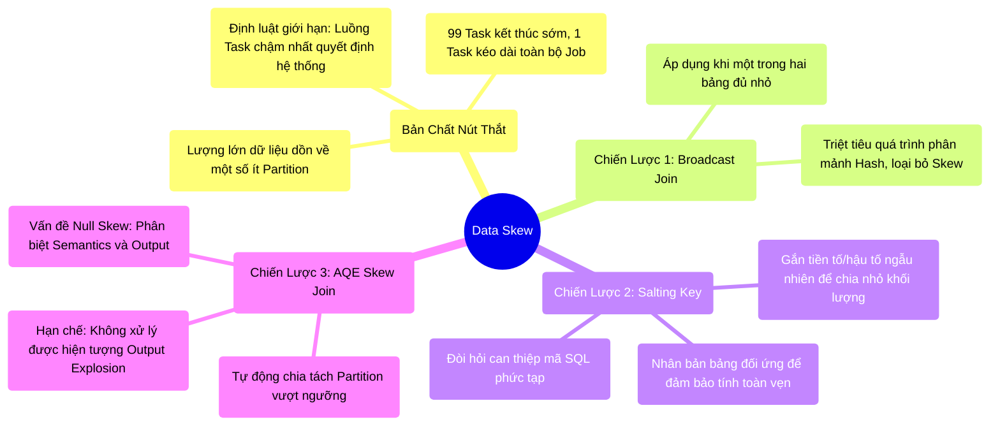

# 8.3 Data Skew: Nút Thắt Định Tuyến Phá Vỡ Cân Bằng Tải

## 1. Objectives
- [ ] Phân tích bản chất vật lý của hiện tượng phân bổ lệch (Data Skew): Nút thắt cổ chai làm sụp đổ hệ thống phân tán.
- [ ] Phản biện tư duy giải quyết Skew bằng cách gia tăng tài nguyên phần cứng (Scale-up RAM/CPU).
- [ ] Hệ thống hóa 3 kỹ thuật cân bằng tải: Ép buộc Broadcast, Salting Key thủ công, và cơ chế tự động AQE Skew Join.

## 2. Mindmap


## 3. Content

Trong vận hành hệ thống phân tán, một hiện tượng thường gặp là: 99% tiến trình xử lý kết thúc rất nhanh, nhưng 1% tiến trình cuối cùng kéo dài hàng giờ và dẫn đến sự cố tràn bộ nhớ (OOM). Hiện tượng này là chỉ báo rõ ràng nhất của **Data Skew (Phân bổ dữ liệu lệch).**

### 3.1. Phân Tích Bản Chất: Lỗ Hổng Phân Bổ Hash
Trong điều kiện lý tưởng, 100GB dữ liệu sẽ được thuật toán băm (Hash Partitioning) chia đều cho 100 phân mảnh (Mỗi phân mảnh 1GB). Tuy nhiên, phân phối dữ liệu trong thực tế hiếm khi đồng đều.
- **Căn nguyên lệch vẹo:** Khi thực thi toán tử `JOIN` dựa trên khóa `CustomerID`. Nếu hệ thống chứa 90% bản ghi có giá trị `CustomerID = NULL`. Thuật toán Hash sẽ điều hướng **toàn bộ 90GB bản ghi có giá trị NULL này vào chung một phân mảnh (Partition).**
- **Hệ quả kiến trúc:** Khi thực thi, 99 luồng Task (Task threads) nhanh chóng xử lý 10GB dữ liệu còn lại trong vài giây. Trong khi đó, Task duy nhất được giao xử lý phân mảnh 90GB sẽ làm cạn kiệt tài nguyên RAM cục bộ (Execution Memory), khiến hệ thống kích hoạt cơ chế xả đĩa (Spill) liên tục và rơi vào trạng thái treo (Hang).

> [!CAUTION] Cảnh Báo Kiến Trúc: Định Luật Của Hệ Thống Phân Tán
> Tốc độ và độ ổn định của toàn bộ Job phân tán chỉ bằng với **tốc độ của luồng Task chậm nhất (Straggler Task)**.
> Bất chấp việc nâng cấp cụm máy tính lên hàng vạn CPU Cores, phân mảnh Skew 90GB vẫn chỉ được phân bổ cho một luồng CPU Core duy nhất xử lý tuần tự. Việc mù quáng gia tăng dung lượng RAM hệ thống toàn cục không giải quyết được vấn đề mất cân bằng tải cục bộ.

### 3.2. Ba Kỹ Thuật Can Thiệp Định Tuyến
Để giải quyết Data Skew, Kỹ sư Dữ liệu không dựa vào phần cứng mà can thiệp trực tiếp vào cấu trúc phân mảnh.

**Chiến Lược 1: Ép Buộc Broadcast Join**
Nếu một trong hai bảng tham gia Join có kích thước đủ nhỏ, Kỹ sư có thể sử dụng Hint `/*+ BROADCAST(B) */`.
Quá trình Broadcast (Xem Bài 8.2) triệt tiêu hoàn toàn giao thức Shuffle. Dữ liệu không bị phân bổ qua thuật toán Hash mà được sao chép diện rộng (Broadcast) tới toàn bộ các Node. Hiện tượng Skew do phân mảnh biến mất hoàn toàn.

**Chiến Lược 2: Kỹ Thuật Salting (Rắc Muối)**
Khi cả hai bảng đều có kích thước lớn (Bắt buộc dùng Sort-Merge Join), kỹ thuật nền tảng là **Salting (Rắc muối)**.
Nguyên lý: Kỹ sư can thiệp vào Khóa bị Skew bằng cách nối thêm một giá trị số ngẫu nhiên (Ví dụ `NULL_1`, `NULL_2`...). Đối với bảng đối xứng, hệ thống phải thực hiện phép nhân bản (Cross Join) với tập hợp số ngẫu nhiên tương ứng. Phân mảnh 90GB sẽ bị băm nhỏ thành nhiều phân mảnh phụ. Thuật toán Hash lúc này sẽ đánh giá các Khóa đã được Salt là khác biệt và phân bổ đều chúng sang các luồng Task khác nhau, khôi phục trạng thái cân bằng tải.

**[Code Snippet: Kỹ Thuật Salting]**
```sql
-- Cấu trúc JOIN truyền thống gặp rủi ro Skew:
SELECT * FROM table_A a JOIN table_B b ON a.key = b.key

-- Kỹ thuật Salting can thiệp phân mảnh:
SELECT * FROM 
  (SELECT *, CONCAT(key, '_', FLOOR(RAND() * 10)) as salted_key FROM table_A) a
JOIN 
  (SELECT *, CONCAT(key, '_', id) as salted_key FROM table_B CROSS JOIN (SELECT explode(sequence(0,9)) as id)) b
ON a.salted_key = b.salted_key
```

**Chiến Lược 3: Cơ Chế Tự Động (AQE Skew Join)**
Từ phiên bản Spark 3.0, tính năng AQE đảm nhiệm việc xử lý Skew tự động.
Tại ranh giới Stage, nếu AQE phát hiện một phân mảnh có dung lượng vượt trội so với trung vị (Thông qua cấu trúc `skewedPartitionFactor` và `skewedPartitionThresholdInBytes`), nó sẽ kích hoạt thuật toán **Skew Join**.
AQE tự động phân tách (Split) khối phân mảnh quá tải đó thành nhiều mảnh phụ và tự động quản lý quá trình nhân bản dữ liệu đối xứng để xử lý song song.

> [!CAUTION] Cảnh Báo Thiết Kế: Giới Hạn Của AQE Skew Join
> Việc phụ thuộc hoàn toàn vào AQE và loại bỏ các kỹ thuật Salting thủ công có thể dẫn đến sự cố. AQE Skew Join tồn tại các giới hạn:
> 1. Nó chỉ khả dụng cho toán tử **SortMerge Join / Shuffled Hash Join** và không có tác dụng với Skew sinh ra từ cơ chế Broadcast.
> 2. **Vấn đề Null Skew**: AQE không định nghĩa được ngữ nghĩa của giá trị `NULL`. Nó chỉ nhận diện một Khối phân mảnh Shuffle dung lượng lớn. Cần phân biệt rõ:
>    - *Cơ chế lọc (SQL NULL Semantics)*: Trong phép Join tiêu chuẩn (`=`), `NULL` không đối chiếu được với `NULL`. Dữ liệu sẽ bị loại bỏ sớm và không gây OOM khi Join (Mặc dù vẫn có nguy cơ khi Shuffle Write/Sort).
>    - *Sự phân tách (Physical Skew)*: Khi dùng phép Join Null-safe (`<=>`), Null đối chiếu với Null. Lúc này, AQE **có khả năng** băm nhỏ khối Null thành các khối phụ (Nếu vượt ngưỡng kích thước).
>    - *Hiện tượng Cartesian (Output Explosion)*: Dù AQE có băm nhỏ, phép Join giữa 1 tỷ bản ghi Null của bảng A và 1 tỷ bản ghi Null của bảng B sẽ tạo ra **1 tỷ x 1 tỷ kết quả** (Tích Đề-các). AQE **không thể** ngăn chặn sự bùng nổ dữ liệu đầu ra này. Giải pháp kiên quyết là phải Lọc Null (Filter) ngay từ nguồn dữ liệu.

## 4. Key takeaways
- **Giới hạn phần cứng**: Data Skew minh chứng rằng nâng cấp RAM/CPU là vô nghĩa nếu thuật toán định tuyến phân bổ tải trọng không đồng đều.
- **Giới hạn tự động hóa**: AQE Skew Join là công cụ tự động cắt giảm phân mảnh lớn, nhưng bất lực trước hiện tượng Bùng nổ dữ liệu đầu ra (Output Explosion) hoặc Broadcast Skew. Khả năng thiết kế hệ thống và sử dụng Salting thủ công vẫn là yêu cầu bắt buộc đối với Staff Engineer.
- **Kết thúc chương**: Chúng ta đã đi qua phân tích chi tiết về AQE và các thuật toán Join cốt lõi. Hãy đóng lại toàn bộ bức tranh kiến trúc này tại Bài 8.4.
